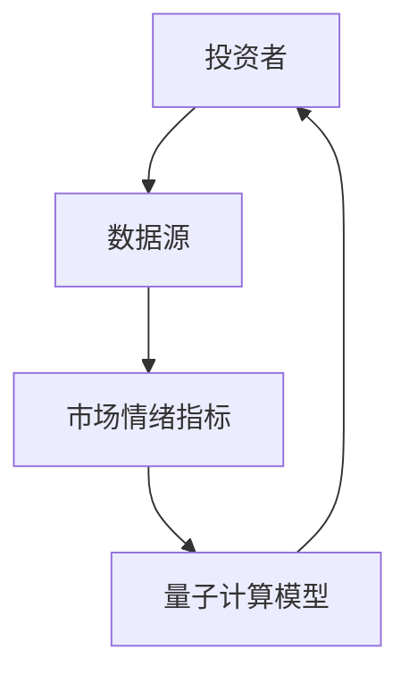

                 


# 巴菲特的市场情绪指标4.0：量子计算驱动的超级预测

> 关键词：巴菲特、市场情绪指标、量子计算、超级预测、金融建模、市场分析

> 摘要：本文探讨了如何利用量子计算提升市场情绪预测的准确性，详细介绍从经典市场情绪指标到量子计算驱动的超级预测模型的演变过程，结合实际案例和代码实现，展示量子计算在金融领域的应用前景。

---

## 目录大纲

### 第一部分：市场情绪指标的背景与发展

#### 第1章：市场情绪指标的历史与发展

##### 1.1 市场情绪指标的定义与核心概念
- 1.1.1 市场情绪指标的基本定义
- 1.1.2 市场情绪指标的核心要素
- 1.1.3 市场情绪指标的演变历程

##### 1.2 巴菲特的市场情绪指标体系
- 1.2.1 巴菲特投资理念与市场情绪的关系
- 1.2.2 巴菲特市场情绪指标的经典案例
- 1.2.3 巴菲特指标的局限性与改进方向

##### 1.3 从3.0到4.0：市场情绪指标的升级
- 1.3.1 从3.0到4.0的升级背景
- 1.3.2 量子计算在市场情绪预测中的应用
- 1.3.3 市场情绪指标4.0的核心创新

### 第二部分：量子计算与市场情绪预测的核心原理

#### 第2章：量子计算的基本原理

##### 2.1 量子计算的基本概念
- 2.1.1 量子计算的定义与特点
- 2.1.2 量子位与经典位的区别
- 2.1.3 量子计算的核心优势

##### 2.2 量子计算的核心算法
- 2.2.1 量子傅里叶变换
- 2.2.2 量子搜索算法
- 2.2.3 量子模拟算法

##### 2.3 量子计算在金融领域的应用
- 2.3.1 量子计算在金融建模中的应用
- 2.3.2 量子计算在风险管理中的应用
- 2.3.3 量子计算在市场预测中的潜力

#### 第3章：市场情绪预测的量子计算模型

##### 3.1 市场情绪预测的传统方法
- 3.1.1 基于统计学的市场情绪分析
- 3.1.2 基于机器学习的市场情绪预测
- 3.1.3 传统模型的优缺点

##### 3.2 量子计算在市场情绪预测中的应用
- 3.2.1 量子计算在情绪数据处理中的优势
- 3.2.2 量子计算在情绪预测中的数学模型
- 3.2.3 量子计算在情绪预测中的算法实现

##### 3.3 市场情绪预测的量子计算模型构建
- 3.3.1 数据预处理与特征提取
- 3.3.2 量子计算模型的设计与实现
- 3.3.3 模型的验证与优化

### 第三部分：市场情绪指标4.0的系统架构与实现

#### 第4章：系统架构设计

##### 4.1 系统功能模块划分
- 4.1.1 数据采集模块
- 4.1.2 情绪分析模块
- 4.1.3 量子计算处理模块
- 4.1.4 结果输出与可视化模块

##### 4.2 系统设计的ER实体关系图
```mermaid
erDiagram
    actor 投资者 {
        <属性> 账户ID
        <属性> 投资偏好
    }
    actor 数据源 {
        <属性> 市场数据
        <属性> 公司新闻
    }
    class 市场情绪指标 {
        <属性> 情绪指数
        <属性> 预测结果
    }
    class 量子计算模型 {
        <属性> 量子电路
        <属性> 计算结果
    }
    数据源 --> 市场情绪指标 : 提供数据输入
    投资者 --> 量子计算模型 : 提供投资需求
    市场情绪指标 --> 量子计算模型 : 提供情绪数据
    量子计算模型 --> 投资者 : 输出预测结果
```

##### 4.3 系统架构图


#### 第5章：算法实现与代码解析

##### 5.1 量子计算模型的实现
- 5.1.1 使用Qiskit框架实现量子计算
- 5.1.2 量子傅里叶变换的具体实现
- 5.1.3 情绪预测算法的量子化改进

##### 5.2 代码实现
```python
from qiskit import QuantumCircuit, Aer, execute
from qiskit.circuit import QuantumRegister, ClassicalRegister

# 定义量子电路
qr = QuantumRegister(2, 'qr')
cr = ClassicalRegister(2, 'cr')
qc = QuantumCircuit(qr, cr)

# 量子傅里叶变换
qc.h(qr[0])
qc.cu1(1.0, qr[0], qr[1])
qc.h(qr[1])
qc.measure(qr, cr)

# 执行量子计算
simulator = Aer.get_backend('qasm_simulator')
job = execute(qc, simulator)
result = job.result()
print(result.get_counts())
```

##### 5.3 算法的数学模型
- 5.3.1 量子傅里叶变换的数学表达
- 5.3.2 情绪预测算法的优化策略
- 5.3.3 算法复杂度分析

### 第四部分：项目实战与案例分析

#### 第6章：项目实战

##### 6.1 环境搭建与安装
- 6.1.1 安装Qiskit框架
- 6.1.2 配置量子计算环境
- 6.1.3 数据采集与预处理

##### 6.2 核心代码实现
```python
from qiskit import *
from qiskit.circuit import *

def quantum_emotion_prediction(circuit, backend):
    job = execute(circuit, backend)
    result = job.result()
    return result.get_counts()

# 示例电路
qc = QuantumCircuit(2, 2)
qc.h(0)
qc.cx(0, 1)
qc.measure_all()

# 执行预测
backend = Aer.get_backend('qasm_simulator')
result = quantum_emotion_prediction(qc, backend)
print("预测结果：", result)
```

##### 6.3 案例分析与解读
- 6.3.1 案例背景介绍
- 6.3.2 数据分析与处理
- 6.3.3 预测结果解读

### 第五部分：总结与展望

#### 第7章：总结与展望

##### 7.1 核心观点回顾
- 7.1.1 量子计算在市场情绪预测中的优势
- 7.1.2 市场情绪指标4.0的核心创新
- 7.1.3 量子计算与金融分析的结合前景

##### 7.2 实践中的注意事项
- 7.2.1 数据质量的重要性
- 7.2.2 模型优化的挑战
- 7.2.3 量子计算的局限性

##### 7.3 未来展望
- 7.3.1 量子计算技术的发展趋势
- 7.3.2 市场情绪指标的进一步优化
- 7.3.3 金融领域的量子计算应用前景

---

通过以上目录结构，文章将系统地探讨从传统市场情绪指标到量子计算驱动的超级预测的演变过程，结合理论分析与实际代码实现，为读者提供全面而深入的指导。

