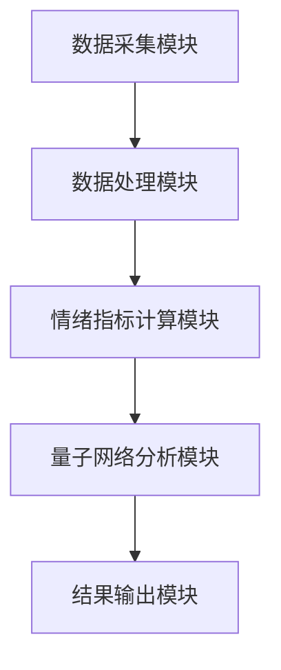

                 

# 巴菲特的市场情绪指标7.0：量子社会网络分析的金融应用

> 关键词：巴菲特，市场情绪指标，量子计算，社会网络分析，金融应用，投资策略

> 摘要：本文深入探讨了巴菲特市场情绪指标7.0版本的理论基础、量子社会网络分析的核心原理及其在金融领域的实际应用。通过结合投资心理学、量子计算和社交网络分析，本文提出了创新的市场情绪分析方法，为投资者提供了一种全新的视角来理解市场波动和投资决策。

---

## 第一部分: 巴菲特的市场情绪指标与量子社会网络分析概述

### 第1章: 巴菲特的市场情绪指标概述

#### 1.1 市场情绪指标的定义与背景

市场情绪指标是衡量投资者情绪的量化工具，用于预测市场波动和投资行为。巴菲特作为价值投资的代表，其投资理念强调长期价值而非短期情绪波动。然而，市场情绪指标为投资者提供了一种量化市场情绪的方法，帮助其做出更理性的决策。

- **投资心理学与市场情绪**：投资者情绪受心理因素影响，如贪婪、恐惧等，这些情绪会导致市场波动。情绪指标通过量化这些情绪，帮助投资者识别市场的非理性波动。
- **巴菲特投资理念的核心**：巴菲特强调基本面分析和长期投资，但市场情绪指标为他的理念提供了新的视角，帮助其在市场波动中把握长期价值。
- **市场情绪指标的演变**：从早期的简单统计方法到如今的量子社会网络分析，市场情绪指标不断进化，旨在更准确地捕捉市场情绪。

#### 1.2 量子社会网络分析的基本概念

量子社会网络分析是一种结合量子计算和社会网络分析的新兴技术，用于捕捉复杂的社会网络关系和情绪传播。

- **量子计算的简介**：量子计算利用量子叠加和纠缠效应，能够在处理复杂问题时提供指数级的计算速度。
- **社会网络分析的定义**：社会网络分析研究个体之间的关系及其对集体行为的影响，广泛应用于社交媒体、市场营销等领域。
- **量子社会网络分析的结合**：通过量子计算的强大能力，社会网络分析的深度和广度得到极大提升，能够捕捉更复杂的情绪传播模式。

---

### 第2章: 巴菲特市场情绪指标的理论基础

#### 2.1 投资情绪分析的理论框架

投资情绪分析是研究投资者情绪如何影响市场行为的学科，其理论基础包括心理学、经济学和社会学等多个领域。

- **投资者情绪周期**：投资者情绪通常呈现周期性变化，从乐观到悲观再到乐观，情绪指标能够捕捉这种周期性变化。
- **市场情绪与资产价格的关系**：市场情绪通过影响投资者行为间接影响资产价格，情绪高涨时资产价格可能被高估，情绪低落时可能被低估。
- **巴菲特情绪指标的核心假设**：巴菲特情绪指标假设市场情绪是市场波动的重要驱动因素，通过量化情绪指标，投资者可以更好地把握市场的短期波动。

#### 2.2 量子社会网络分析的数学基础

量子社会网络分析的数学基础包括图论、量子叠加和张量积等概念。

- **图论基础**：图论用于表示社会网络中的个体关系，节点代表个体，边代表关系强度。
- **量子叠加原理**：量子叠加允许量子系统同时处于多个状态，这在社会网络分析中可以表示情绪的多重传播路径。
- **量子纠缠与网络关系**：量子纠缠用于描述复杂网络中的关系，能够捕捉情绪传播中的非线性关系。

---

### 第3章: 巴菲特市场情绪指标与量子社会网络分析的结合

#### 3.1 市场情绪指标的量化方法

市场情绪指标的量化方法包括数据采集、特征提取和模型构建等步骤。

- **情绪指标的构建**：通过分析社交媒体、新闻标题等数据，提取情绪特征，构建情绪指标。
- **情绪指标的动态变化**：情绪指标随着时间变化，反映市场情绪的波动。
- **情绪指标的预测能力**：情绪指标可以通过机器学习模型预测市场波动。

#### 3.2 量子社会网络分析的金融应用

量子社会网络分析在金融领域的应用包括情绪传播分析、市场预测和风险控制等。

- **量子网络分析的优势**：量子计算的强大能力使得复杂的情绪传播模式能够被快速捕捉和分析。
- **量子网络分析的挑战**：量子计算的硬件实现和算法设计仍面临诸多挑战，需要进一步研究和优化。
- **量子网络分析的未来方向**：随着量子计算技术的发展，量子社会网络分析将在金融领域发挥更大的作用。

---

## 第二部分: 量子社会网络分析的数学模型与算法

### 第4章: 量子社会网络分析的数学模型

#### 4.1 图论模型在社会网络分析中的应用

图论模型在社会网络分析中的应用包括网络结构分析、社区发现和节点重要性评估等。

- **图的表示**：图论模型通过节点和边表示社会网络结构。
- **社交网络的特征提取**：通过图论模型提取网络中的特征，如度数、介数等。
- **社交网络的度量指标**：通过度量指标分析网络的连通性和节点的重要性。

#### 4.2 量子计算在社会网络分析中的应用

量子计算在社会网络分析中的应用包括量子图论和量子网络搜索等。

- **量子图论的基本概念**：量子图论研究量子系统中的图结构及其性质。
- **量子叠加在图遍历中的应用**：量子叠加允许同时遍历多个节点，提高图遍历效率。
- **量子纠缠在社交网络中的表现**：量子纠缠用于描述复杂网络中的关系，捕捉情绪传播中的非线性关系。

---

### 第5章: 量子社会网络分析的算法实现

#### 5.1 基于量子计算的情绪指标分析算法

基于量子计算的情绪指标分析算法包括数据预处理、特征提取、量子算法设计和结果解读等步骤。

- **算法的输入与输出**：输入为社交网络数据，输出为情绪指标。
- **算法的步骤分解**：数据预处理、特征提取、量子算法设计和结果解读。
- **算法的复杂度分析**：量子算法的时间复杂度通常优于经典算法。

#### 5.2 算法的优化与改进

算法的优化与改进包括算法的并行化、量子加速和稳定性分析等。

- **算法的并行化**：通过并行化提高算法的效率。
- **算法的量子加速**：利用量子计算的加速能力，提高算法的计算速度。
- **算法的稳定性分析**：通过稳定性分析，评估算法的鲁棒性和可靠性。

---

## 第三部分: 量子社会网络分析的系统架构与实现

### 第6章: 量子社会网络分析系统的架构设计

#### 6.1 系统功能模块划分

系统功能模块包括数据采集、数据处理、情绪指标计算和量子网络分析等模块。

- **数据采集模块**：负责采集社交网络数据，如社交媒体帖子、新闻标题等。
- **数据处理模块**：对采集到的数据进行清洗、转换和预处理。
- **情绪指标计算模块**：通过算法计算市场情绪指标。
- **量子网络分析模块**：利用量子计算技术进行网络分析和情绪传播分析。

#### 6.2 系统架构图

系统架构图展示系统的主要模块及其相互关系。

---

## 第四部分: 巴菲特市场情绪指标的金融应用

### 第7章: 巴菲特市场情绪指标的实际应用案例

#### 7.1 市场情绪指标的预测能力

市场情绪指标能够预测市场波动，帮助投资者做出更明智的投资决策。

#### 7.2 量子社会网络分析的实际应用

量子社会网络分析在金融领域的实际应用包括市场预测、风险管理和投资组合优化等。

---

## 第五部分: 结论与展望

### 第8章: 结论与展望

#### 8.1 最佳实践 tips

- 投资者应结合市场情绪指标和基本面分析，做出更理性的投资决策。
- 量子社会网络分析仍处于发展阶段，需要进一步研究和优化。

#### 8.2 小结

本文深入探讨了巴菲特市场情绪指标7.0版本的理论基础、量子社会网络分析的核心原理及其在金融领域的实际应用。通过结合投资心理学、量子计算和社会网络分析，本文提出了创新的市场情绪分析方法，为投资者提供了一种全新的视角来理解市场波动和投资决策。

#### 8.3 注意事项

- 投资者在使用市场情绪指标时，应结合市场实际情况，避免过度依赖情绪指标。
- 量子社会网络分析的实现需要专业的技术支持，投资者应谨慎选择合作伙伴。

#### 8.4 拓展阅读

- 关于量子计算的更多信息，可以参考相关文献和研究报告。
- 关于社会网络分析的更多信息，可以参考相关书籍和学术论文。

---

通过以上结构，我们可以清晰地看到巴菲特市场情绪指标7.0版本的核心内容和量子社会网络分析的金融应用。这一结合投资心理学和量子计算的创新方法，为投资者提供了更强大的工具来理解和应对市场波动。

