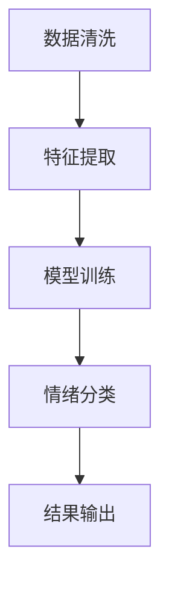
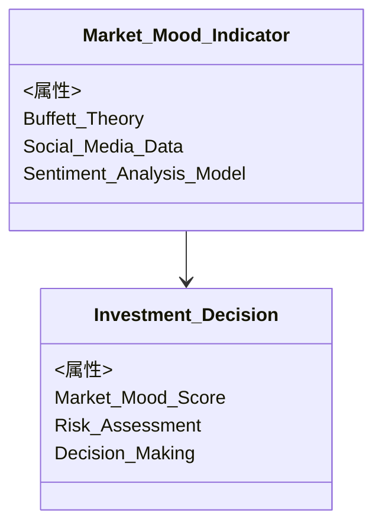

                 


# 巴菲特的市场情绪指标：社交媒体情绪分析的新维度

**关键词**：巴菲特，市场情绪，社交媒体，情绪分析，投资决策，数据挖掘，机器学习

**摘要**：本文探讨了如何利用社交媒体数据来分析市场情绪，结合巴菲特的投资理念，提出了一种新的市场情绪指标体系。通过详细分析情绪分类、数据处理和算法实现，展示了如何利用这些指标辅助投资决策，并提供了实际案例和解决方案。

---

# 目录

## 第一部分: 巴菲特的市场情绪指标与社交媒体情绪分析概述

### 第1章: 市场情绪分析的背景与重要性

#### 1.1 市场情绪分析的定义与核心概念
- 1.1.1 市场情绪分析的定义
- 1.1.2 市场情绪的核心要素
- 1.1.3 社交媒体在市场情绪分析中的作用

#### 1.2 巴菲特的市场情绪指标
- 1.2.1 巴菲特投资理念与市场情绪的关系
- 1.2.2 巴菲特市场情绪指标的定义与特点
- 1.2.3 巴菲特市场情绪指标的边界与外延

### 第2章: 社交媒体情绪分析的理论基础

#### 2.1 情绪分类与分析方法
- 2.1.1 情绪分类的定义与常见方法
- 2.1.2 基于文本的情绪分析模型
- 2.1.3 情绪强度与方向的量化方法

#### 2.2 巴菲特市场情绪指标的指标体系
- 2.2.1 市场情绪指标的构成要素
- 2.2.2 指标体系的层次结构
- 2.2.3 指标之间的关系与相互作用

#### 2.3 巴菲特理论与社交媒体数据的结合
- 2.3.1 巴菲特投资理论的核心观点
- 2.3.2 社交媒体数据在巴菲特理论中的应用
- 2.3.3 巴菲特市场情绪指标与社交媒体数据的关联

## 第二部分: 社交媒体情绪分析的技术实现

### 第3章: 社交媒体情绪分析的技术方法

#### 3.1 数据采集与预处理
- 3.1.1 数据采集方法与工具
- 3.1.2 数据清洗与去噪
- 3.1.3 文本标准化与格式统一

#### 3.2 文本特征提取与表示
- 3.2.1 基于词袋模型的特征提取
- 3.2.2 基于词嵌入的特征表示
- 3.2.3 基于情感词典的特征加权

#### 3.3 情绪分类算法的选择与优化
- 3.3.1 常见情绪分类算法对比
- 3.3.2 支持向量机（SVM）在情绪分类中的应用
- 3.3.3 长短期记忆网络（LSTM）在情绪分类中的应用

### 第4章: 巴菲特市场情绪指标的构建与实现

#### 4.1 巴菲特市场情绪指标的定义与构建
- 4.1.1 指标构建的逻辑框架
- 4.1.2 指标权重的确定方法
- 4.1.3 指标的动态调整机制

#### 4.2 指标与社交媒体数据的关联分析
- 4.2.1 数据的特征提取与选择
- 4.2.2 指标与数据的关系建模
- 4.2.3 数据驱动的指标优化

## 第三部分: 巴菲特市场情绪指标的应用与案例分析

### 第5章: 基于社交媒体情绪分析的投资决策

#### 5.1 投资决策的理论基础
- 5.1.1 投资决策的核心要素
- 5.1.2 市场情绪在投资决策中的作用
- 5.1.3 巴菲特市场情绪指标在投资决策中的应用

#### 5.2 投资决策中的情绪分析案例
- 5.2.1 案例背景与数据来源
- 5.2.2 情绪分析过程与结果
- 5.2.3 投资决策的优化与调整

### 第6章: 实际应用中的挑战与解决方案

#### 6.1 数据质量与模型优化
- 6.1.1 数据噪声的来源与影响
- 6.1.2 模型优化的方法与技巧
- 6.1.3 数据质量对投资决策的影响

#### 6.2 伦理与法律问题
- 6.2.1 数据使用的法律合规性
- 6.2.2 投资决策中的伦理问题
- 6.2.3 如何平衡数据利用与伦理约束

## 第四部分: 总结与展望

### 第7章: 总结与未来研究方向

#### 7.1 本书的核心观点与主要结论
- 7.1.1 巴菲特市场情绪指标的核心价值
- 7.1.2 社交媒体情绪分析的技术创新
- 7.1.3 投资决策中的应用效果

#### 7.2 未来研究方向
- 7.2.1 情绪分析的深度学习方法
- 7.2.2 多模态数据的融合分析
- 7.2.3 情绪指标的实时更新与动态调整

---

### 附录: 巴菲特市场情绪指标的Python实现代码

```python
import pandas as pd
from sklearn.feature_extraction.text import TfidfVectorizer
from sklearn.svm import SVC
from sklearn.metrics import accuracy_score
from nltk.sentiment import SentimentIntensityAnalyzer

# 示例数据加载
data = pd.DataFrame({
    'text': [' Buffett is very optimistic about the market future ',
             'The market is showing signs of weakness'],
    'label': [1, 0]
})

# 文本预处理
def preprocess(text):
    return text.lower().strip()

data['text_processed'] = data['text'].apply(preprocess)

# 特征提取
tfidf = TfidfVectorizer(max_features=500)
X = tfidf.fit_transform(data['text_processed'])

# 情绪分类模型训练
model = SVC()
model.fit(X, data['label'])

# 情绪指标计算
sia = SentimentIntensityAnalyzer()
compound_scores = data['text_processed'].apply(lambda x: sia.polarity_scores(x)['compound'])
data['compound_score'] = compound_scores

# 指标与标签对比
accuracy = accuracy_score(data['label'], model.predict(X))
print(f"Accuracy: {accuracy}")
```

---

### 图表与公式

#### 情绪分类算法流程图（Mermaid）



#### 巴菲特市场情绪指标体系（Mermaid）



---

### 最佳实践 Tips

1. **数据来源**：选择可靠的社交媒体数据源，确保数据的代表性和准确性。
2. **模型优化**：定期更新模型，结合最新的深度学习技术提升分类精度。
3. **伦理合规**：确保数据使用符合相关法律法规，保护用户隐私。

### 小结

通过结合巴菲特的投资理念与社交媒体情绪分析技术，我们提出了一种创新的市场情绪指标体系。这种指标体系不仅能够帮助投资者更好地理解市场情绪，还能为投资决策提供科学依据。未来，随着技术的不断进步，市场情绪分析将更加精准和智能化。

--- 

希望这篇文章能为您提供有价值的见解，并激发您在市场情绪分析和投资决策领域的深入研究。

