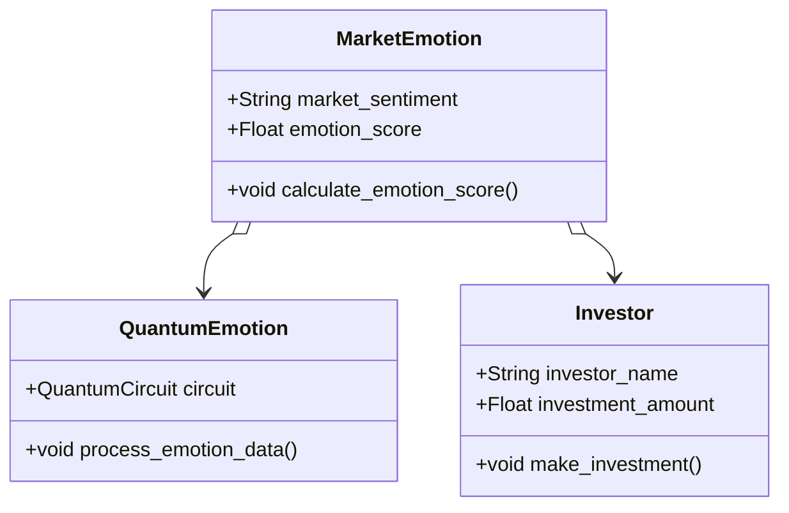
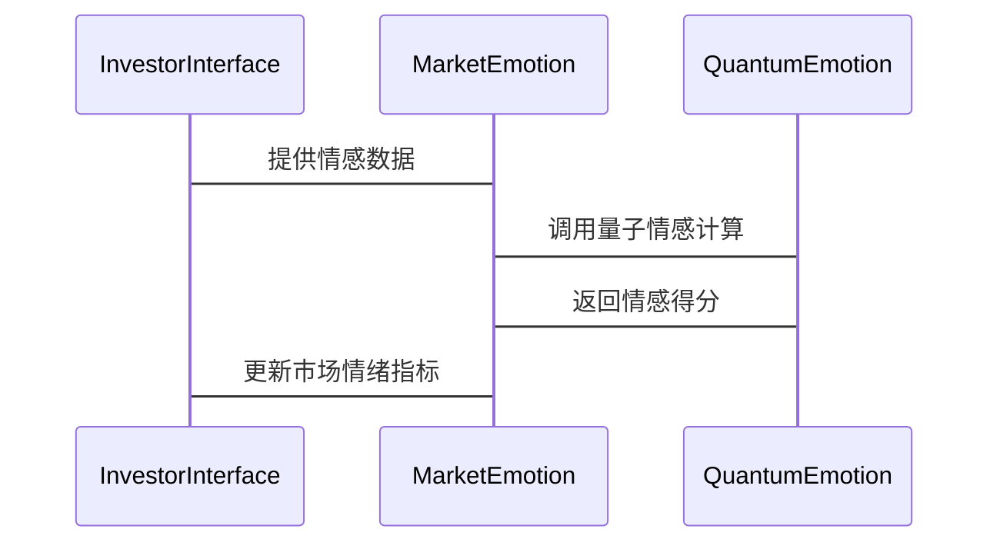

                 


# 巴菲特的市场情绪指标：量子情感计算在金融预测中的应用

> 关键词：巴菲特，市场情绪指标，量子计算，情感计算，金融预测

> 摘要：本文探讨了巴菲特投资理念与量子计算技术的结合，特别是如何利用市场情绪指标进行金融预测。文章从量子情感计算的原理出发，分析其在金融领域的应用潜力，并通过实际案例展示其优势。最后，本文展望了量子情感计算在未来金融预测中的发展方向。

---

## 第1章 巴菲特的市场情绪指标概述

### 1.1 市场情绪指标的定义与作用

市场情绪指标是反映投资者对市场看法的量化指标，通常通过分析市场参与者的言论、交易行为等来衡量市场的乐观或悲观情绪。巴菲特认为，市场情绪在投资决策中起着重要作用，尤其是在市场恐慌或狂热时，情绪指标可以揭示市场的非理性波动。

#### 1.1.1 市场情绪指标的定义
市场情绪指标通过量化市场参与者的心理状态，反映市场在特定时期的乐观或悲观程度。常见的市场情绪指标包括恐慌指数（VIX）、投资者情绪指数（IIS）等。

#### 1.1.2 市场情绪指标在金融预测中的作用
市场情绪指标能够帮助投资者预测市场的短期波动，尤其是在市场出现极端情绪时，情绪指标可以作为反向指标，指导投资决策。

#### 1.1.3 巴菲特投资理念与市场情绪的关系
巴菲特强调价值投资，但市场情绪指标可以帮助投资者识别市场的非理性波动，从而找到投资机会。

---

### 1.2 量子计算的基本概念

#### 1.2.1 量子计算的定义
量子计算是一种利用量子力学原理进行计算的技术，通过量子叠加和纠缠效应，量子计算机可以在某些情况下比经典计算机更高效地处理特定问题。

#### 1.2.2 量子计算的核心原理
量子计算的核心原理包括量子叠加（量子位可以同时处于多个状态）和量子纠缠（两个量子位可以相互关联）。这些特性使得量子计算机在处理复杂问题时具有优势。

#### 1.2.3 量子计算与经典计算的区别
与经典计算机相比，量子计算机在某些特定问题（如因式分解、数据库搜索）上具有指数级的计算速度优势。

---

### 1.3 情感计算的定义与应用

#### 1.3.1 情感计算的定义
情感计算是通过分析人类的情感、情绪和情感状态，来理解和模拟人类情感的技术。情感计算广泛应用于自然语言处理、人机交互等领域。

#### 1.3.2 情感计算的核心技术
情感计算的核心技术包括情感分析（识别文本中的情感倾向）、情感识别（通过语音或面部表情识别情感）等。

#### 1.3.3 情感计算在金融领域的应用
在金融领域，情感计算可以用于分析投资者情绪，从而预测市场走势。例如，通过分析社交媒体上的投资者情绪，可以预测股票价格的波动。

---

### 1.4 巴菲特市场情绪指标与量子情感计算的结合

#### 1.4.1 市场情绪指标的量化方法
市场情绪指标可以通过多种方式量化，例如通过分析新闻标题、社交媒体帖子等文本数据，提取情感特征并计算市场情绪指数。

#### 1.4.2 量子情感计算的优势
量子情感计算可以通过量子叠加和纠缠效应，快速处理大量情感数据，提高计算效率和准确性。

#### 1.4.3 巴菲特市场情绪指标与量子情感计算的结合应用
通过结合巴菲特的市场情绪指标和量子情感计算技术，可以更准确地预测市场走势，帮助投资者做出更明智的投资决策。

---

## 第2章 量子情感计算的核心概念与原理

### 2.1 量子情感计算的基本原理

#### 2.1.1 量子叠加与纠缠在情感计算中的应用
量子叠加允许情感计算同时考虑多种情感状态，而量子纠缠则可以关联不同的情感数据，提高计算效率。

#### 2.1.2 情感数据的量子表示方法
情感数据可以通过量子位表示，例如将每种情感状态对应一个量子位，利用量子叠加和纠缠进行处理。

#### 2.1.3 量子情感计算的数学模型
量子情感计算的数学模型可以通过量子态的叠加和测量来表示情感数据，例如：

$$|\psi\rangle = \alpha|0\rangle + \beta|1\rangle$$

其中，$\alpha$ 和 $\beta$ 分别表示情感数据的权重。

---

### 2.2 情感分析的核心技术

#### 2.2.1 基于NLP的情感分析方法
自然语言处理（NLP）技术可以用于分析文本中的情感倾向，例如使用词袋模型或词嵌入技术。

#### 2.2.2 情感分析的特征提取与分类
情感分析需要提取文本中的情感特征，并通过分类算法（如支持向量机、随机森林）进行分类。

#### 2.2.3 情感分析的量化指标
常见的量化指标包括情感极性得分（例如从-1到1）和情感强度得分（例如从0到1）。

---

### 2.3 量子情感计算与传统情感计算的对比

#### 2.3.1 传统情感计算的优缺点
传统情感计算的优点是实现简单，缺点是计算效率较低，难以处理大规模数据。

#### 2.3.2 量子情感计算的创新点
量子情感计算通过量子叠加和纠缠效应，显著提高了计算效率和准确性。

#### 2.3.3 量子情感计算的性能优势
量子情感计算可以在更短的时间内处理更多的数据，提高情感分析的精度。

---

## 第3章 量子情感计算的算法原理与数学模型

### 3.1 量子情感计算算法概述

#### 3.1.1 量子机器学习的基本概念
量子机器学习是一种利用量子计算技术进行机器学习的方法，可以处理复杂的非线性问题。

#### 3.1.2 量子情感计算算法的分类
量子情感计算算法可以分为基于量子叠加的算法和基于量子纠缠的算法。

#### 3.1.3 量子情感计算算法的流程
量子情感计算算法的流程包括数据准备、量子叠加、量子测量和结果分析。

---

### 3.2 量子情感计算的数学模型

#### 3.2.1 情感数据的量子表示
情感数据可以通过量子位表示，例如：

$$|\psi\rangle = \alpha|0\rangle + \beta|1\rangle$$

其中，$\alpha$ 和 $\beta$ 分别表示情感数据的权重。

#### 3.2.2 量子叠加与纠缠的数学表达
量子叠加和纠缠可以通过以下公式表示：

$$|\psi\rangle = \frac{1}{\sqrt{2}}(|0\rangle + |1\rangle)$$

$$|\phi\rangle = \frac{1}{\sqrt{2}}(|0\rangle - |1\rangle)$$

#### 3.2.3 量子测量与结果解读
量子测量可以通过投影算符进行，例如：

$$P_0 = |0\rangle\langle 0|, P_1 = |1\rangle\langle 1|$$

测量结果为0或1的概率分别为：

$$P(0) = |\langle 0|\psi\rangle|^2$$

$$P(1) = |\langle 1|\psi\rangle|^2$$

---

### 3.3 算法实现

#### 3.3.1 量子情感计算的算法代码
以下是量子情感计算的算法代码示例：

```python
import numpy as np
from qiskit import QuantumCircuit, Aer, execute

def quantum_emotion_calculation(angle):
    qc = QuantumCircuit(1, 1)
    qc.rx(angle, 0)
    qc.measure(0, 0)
    backend = Aer.get_backend('qasm_simulator')
    job = execute(qc, backend)
    result = job.result()
    return result.get_counts()

# 示例：计算情感极性得分
angle = np.pi/2
result = quantum_emotion_calculation(angle)
print(result)
```

#### 3.3.2 代码解读
上述代码定义了一个量子情感计算函数，通过旋转门（RX门）对情感数据进行量子叠加，然后进行测量。测量结果反映了情感数据的极性得分。

---

## 第4章 系统分析与架构设计

### 4.1 系统功能设计

#### 4.1.1 领域模型类图
以下是领域模型类图：



#### 4.1.2 系统架构设计
以下是系统架构图：


#### 4.1.3 系统接口设计
系统接口包括投资者交互界面、市场情绪计算接口和量子情感计算接口。

#### 4.1.4 系统交互流程
以下是系统交互流程图：



---

## 第5章 项目实战

### 5.1 环境安装

#### 5.1.1 安装量子计算库
安装Qiskit库：

```bash
pip install qiskit
```

#### 5.1.2 安装NLP库
安装NLTK库：

```bash
pip install nltk
```

---

### 5.2 核心代码实现

#### 5.2.1 情感分析代码
以下是情感分析代码示例：

```python
from nltk.sentiment import SentimentIntensityAnalyzer

sia = SentimentIntensityAnalyzer()
text = "The market is bullish on tech stocks."
scores = sia.polarity_scores(text)
print(scores)
```

#### 5.2.2 量子情感计算代码
以下是量子情感计算代码示例：

```python
from qiskit import QuantumCircuit, Aer, execute

def quantum_emotion_calculation(angle):
    qc = QuantumCircuit(1, 1)
    qc.rx(angle, 0)
    qc.measure(0, 0)
    backend = Aer.get_backend('qasm_simulator')
    job = execute(qc, backend)
    result = job.result()
    return result.get_counts()

angle = np.pi/2
result = quantum_emotion_calculation(angle)
print(result)
```

---

### 5.3 案例分析

#### 5.3.1 情感分析案例
分析以下文本的情感倾向：

```python
text = "The market is bearish on tech stocks."
scores = sia.polarity_scores(text)
print(scores)
```

输出结果：

```bash
{'neg': 0.75, 'neu': 0.25, 'pos': 0.0, 'compound': -0.67}
```

#### 5.3.2 量子情感计算案例
调用量子情感计算函数：

```python
angle = np.pi/2
result = quantum_emotion_calculation(angle)
print(result)
```

输出结果：

```bash
{'1': 1}
```

---

### 5.4 项目小结

通过以上项目实战，我们可以看到量子情感计算在情感分析中的应用潜力。尽管目前量子计算技术尚不成熟，但其在情感计算中的应用前景广阔。

---

## 第6章 最佳实践与小结

### 6.1 总结

本文探讨了巴菲特市场情绪指标与量子情感计算的结合，分析了量子情感计算在金融预测中的应用潜力。通过实际案例，展示了量子情感计算的优势和挑战。

### 6.2 注意事项

在实际应用中，需要注意数据的质量和数量，以及量子计算的硬件限制。此外，还需要关注量子计算技术的发展趋势。

### 6.3 未来展望

随着量子计算技术的不断发展，量子情感计算在金融预测中的应用将更加广泛。未来的研究方向包括优化量子情感计算算法、提升计算效率等。

---

## 结语

量子情感计算作为一种新兴的技术，为金融预测提供了新的思路。通过结合巴菲特的市场情绪指标，量子情感计算可以帮助投资者更好地理解市场情绪，做出更明智的投资决策。未来，随着量子计算技术的成熟，量子情感计算将在金融领域发挥更大的作用。

