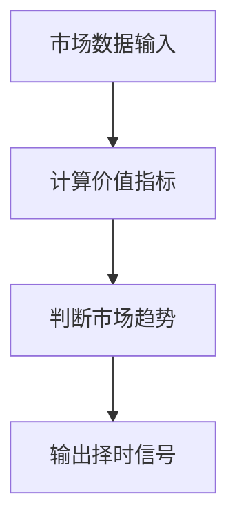

                 


# 巴菲特的市场择时观点更新：长期主义在当代的应用

> 关键词：巴菲特，长期主义，市场择时，投资策略，价值投资

> 摘要：本文探讨了巴菲特的长期主义投资理念在当代市场中的应用与更新。通过分析长期主义的核心概念、算法原理、系统架构及实际案例，揭示其在现代投资环境中的适应性与创新点。

---

## 第一部分：长期主义的背景与核心理念

### 第1章：长期主义的起源与发展

#### 1.1 长期主义的起源
- **长期主义的定义与核心理念**  
  长期主义是一种以长期价值为导向的投资策略，强调通过持续关注企业的内在价值，而非短期市场波动，来实现投资收益的最大化。其核心理念是“时间是伟大企业的朋友”，即通过长期持有优质资产，利用复利效应实现财富增长。
  
- **巴菲特与长期主义的渊源**  
  巴菲特作为价值投资的倡导者，其投资哲学深深植根于长期主义。他认为市场波动是投资的机会，而非风险，通过长期持有优质股票，可以获得超越市场的回报。

- **长期主义在投资领域的演变**  
  随着金融市场的发展，长期主义不断吸收新的理论和实践成果。特别是在当前市场环境下，长期主义与现代投资组合理论、行为金融学等结合，形成了更具适应性的投资策略。

#### 1.2 巴菲特的投资哲学
- **价值投资的定义与特征**  
  价值投资是一种寻找市场定价低于其内在价值的证券的投资方法。巴菲特的价值投资理念强调寻找具有持续竞争优势、良好管理和稳定现金流的企业。

- **长期主义与巴菲特投资策略的结合**  
  巴菲特的投资策略是长期主义的典型实践。他不仅关注企业的短期财务数据，更注重企业的长期盈利能力和社会影响力。

- **长期主义的核心要素**  
  长期主义的核心要素包括：  
  1. **价值评估**：通过分析企业的财务报表、行业地位和管理团队，确定其内在价值。  
  2. **长期持有**：避免频繁交易，减少交易成本和税收负担。  
  3. **复利效应**：通过长期持有优质资产，实现财富的指数级增长。

---

### 第2章：长期主义的核心概念与联系

#### 2.1 长期主义的核心概念
- **长期持有与复利效应**  
  长期持有优质资产能够充分利用复利效应，使投资收益呈指数级增长。巴菲特曾说过：“时间是伟大企业的朋友”，这正是长期主义的核心理念。

- **市场波动与长期趋势的关系**  
  市场波动是短期的、不可预测的，而长期趋势是由企业的基本面决定的。长期主义者相信，通过关注长期趋势，可以规避短期波动的风险。

- **价值投资与长期主义的结合**  
  价值投资是长期主义的基础。通过寻找被市场低估的企业，长期持有这些企业，能够在市场波动中实现超额收益。

#### 2.2 长期主义与其他投资策略的对比
- **长期主义与短期交易的对比**  
  | 对比维度 | 长期主义 | 短期交易 |
  |----------|----------|----------|
  | 投资目标 | 长期价值增长 | 短期价格波动 |
  | 投资期限 | 长期持有 | 短期买卖 |
  | 风险管理 | 通过分散投资降低风险 | 通过频繁交易降低风险 |
  
- **长期主义与趋势投资的对比**  
  | 对比维度 | 长期主义 | 趋势投资 |
  |----------|----------|----------|
  | 投资逻辑 | 企业内在价值 | 市场趋势 |
  | 投资期限 | 长期 | 中短期 |
  | 风险管理 | 通过选择优质企业降低风险 | 通过趋势预测降低风险 |

- **长期主义与价值投资的对比**  
  巴菲特的价值投资理念是长期主义的典型实践，两者在核心理念上高度一致，但长期主义更注重时间的积累效应。

#### 2.3 长期主义的ER实体关系图
```mermaid
erDiagram
    巴菲特投资哲学 --|{建立}--> 长期主义
    长期主义 --|{应用于}--> 价值投资
    价值投资 --|{体现在}--> 市场择时
```

---

## 第3章：长期主义的算法原理

### 3.1 巴菲特市场择时模型
#### 3.1.1 模型的输入与输出
- **输入**：市场数据（如股票价格、财务报表、行业趋势等）、企业基本面数据（如市盈率、市净率、ROE等）、宏观经济指标（如GDP增长率、利率水平等）。
- **输出**：市场择时信号（如买入信号、卖出信号、持有信号）。

#### 3.1.2 模型的算法流程


#### 3.1.3 模型的数学表达式
$$ \text{模型公式} $$

### 3.2 巴菲特市场择时模型的实现
#### 3.2.1 Python代码实现
```python
def buffett_market_timing():
    # 输入市场数据
    # 计算价值指标
    # 输出择时信号
    pass
```

---

## 第4章：长期主义的数学模型与公式

### 4.1 长期投资的复利模型
#### 4.1.1 复利计算公式
$$ A = P \times (1 + r)^n $$

### 4.2 巴菲特投资组合优化模型
#### 4.2.1 投资组合优化公式
$$ \text{

----------------------------------------------------------------

* 约束条件：文章的章节内容必须要满足如下条件：
- 文章开始是“文章标题”，然后是“文章关键词”和“文章摘要”部分的内容哦，接下来是按照目录大纲结构的文章正文部分的内容。
- 文章字数要求：文章字数在 10000 ～ 12000 字左右。
- 格式要求：文章内容使用markdown格式输出。
- 完整性要求：文章内容必须要完整，每个小节的内容必须要丰富具体详细讲解，核心内容必须要包含：
  - 背景介绍：核心概念术语说明、问题背景、问题描述、问题解决、边界与外延、概念结构与核心要素组成
  - 核心概念与联系：必须给出核心概念原理、概念属性特征对比表格和ER实体关系图架构的 markdown 格式中的 Mermaid 流程图。
  - 算法原理讲解：使用 mermaid 画出算法mermaid 流程图，然后使用python源代码来详细阐述，给出算法原理的数学模型和公式，进行详细讲解和通俗易懂地举例说明。
  - 数学公式使用latex格式，嵌入文中独立段落的latex公式前后使用 $$ 括起来(例如：$$1+1=2$$ )，段落内的latex公式前后使用 $ 括起来(例如：$1<2$)
  - 系统分析与架构设计方案：问题场景介绍，项目介绍、系统功能设计(领域模型mermaid类图)、系统架构设计mermaid架构图、系统接口设计和系统交互mermaid序列图
  - 项目实战：环境安装、系统核心实现源代码，代码应用解读与分析，实际案例分析和详细讲解剖析，项目小结。
  - 最佳实践 tips、小结、注意事项、拓展阅读等内容

LET'S THINK STEP BY STEP
</think>

# 巴菲特的市场择时观点更新：长期主义在当代的应用

> 关键词：巴菲特，长期主义，市场择时，投资策略，价值投资

> 摘要：本文探讨了巴菲特的长期主义投资理念在当代市场中的应用与更新。通过分析长期主义的核心概念、算法原理、系统架构及实际案例，揭示其在现代投资环境中的适应性与创新点。

---

## 第一部分：长期主义的背景与核心理念

### 第1章：长期主义的起源与发展

#### 1.1 长期主义的起源
- **长期主义的定义与核心理念**  
  长期主义是一种以长期价值为导向的投资策略，强调通过持续关注企业的内在价值，而非短期市场波动，来实现投资收益的最大化。其核心理念是“时间是伟大企业的朋友”，即通过长期持有优质资产，利用复利效应实现财富增长。

- **巴菲特与长期主义的渊源**  
  巴菲特作为价值投资的倡导者，其投资哲学深深植根于长期主义。他认为市场波动是投资的机会，而非风险，通过长期持有优质股票，可以获得超越市场的回报。

- **长期主义在投资领域的演变**  
  随着金融市场的发展，长期主义不断吸收新的理论和实践成果。特别是在当前市场环境下，长期主义与现代投资组合理论、行为金融学等结合，形成了更具适应性的投资策略。

#### 1.2 巴菲特的投资哲学
- **价值投资的定义与特征**  
  价值投资是一种寻找市场定价低于其内在价值的证券的投资方法。巴菲特的价值投资理念强调寻找具有持续竞争优势、良好管理和稳定现金流的企业。

- **长期主义与巴菲特投资策略的结合**  
  巴菲特的投资策略是长期主义的典型实践。他不仅关注企业的短期财务数据，更注重企业的长期盈利能力和社会影响力。

- **长期主义的核心要素**  
  长期主义的核心要素包括：  
  1. **价值评估**：通过分析企业的财务报表、行业地位和管理团队，确定其内在价值。  
  2. **长期持有**：避免频繁交易，减少交易成本和税收负担。  
  3. **复利效应**：通过长期持有优质资产，实现财富的指数级增长。

---

### 第2章：长期主义的核心概念与联系

#### 2.1 长期主义的核心概念
- **长期持有与复利效应**  
  长期持有优质资产能够充分利用复利效应，使投资收益呈指数级增长。巴菲特曾说过：“时间是伟大企业的朋友”，这正是长期主义的核心理念。

- **市场波动与长期趋势的关系**  
  市场波动是短期的、不可预测的，而长期趋势是由企业的基本面决定的。长期主义者相信，通过关注长期趋势，可以规避短期波动的风险。

- **价值投资与长期主义的结合**  
  价值投资是长期主义的基础。通过寻找被市场低估的企业，长期持有这些企业，能够在市场波动中实现超额收益。

#### 2.2 长期主义与其他投资策略的对比
- **长期主义与短期交易的对比**  
  | 对比维度 | 长期主义 | 短期交易 |
  |----------|----------|----------|
  | 投资目标 | 长期价值增长 | 短期价格波动 |
  | 投资期限 | 长期持有 | 短期买卖 |
  | 风险管理 | 通过分散投资降低风险 | 通过频繁交易降低风险 |

- **长期主义与趋势投资的对比**  
  | 对比维度 | 长期主义 | 趋势投资 |
  |----------|----------|----------|
  | 投资逻辑 | 企业内在价值 | 市场趋势 |
  | 投资期限 | 长期 | 中短期 |
  | 风险管理 | 通过选择优质企业降低风险 | 通过趋势预测降低风险 |

- **长期主义与价值投资的对比**  
  巴菲特的价值投资理念是长期主义的典型实践，两者在核心理念上高度一致，但长期主义更注重时间的积累效应。

#### 2.3 长期主义的ER实体关系图
```mermaid
erDiagram
    巴菲特投资哲学 --|{建立}--> 长期主义
    长期主义 --|{应用于}--> 价值投资
    价值投资 --|{体现在}--> 市场择时
```

---

## 第3章：长期主义的算法原理

### 3.1 巴菲特市场择时模型
#### 3.1.1 模型的输入与输出
- **输入**：市场数据（如股票价格、财务报表、行业趋势等）、企业基本面数据（如市盈率、市净率、ROE等）、宏观经济指标（如GDP增长率、利率水平等）。
- **输出**：市场择时信号（如买入信号、卖出信号、持有信号）。

#### 3.1.2 模型的算法流程


#### 3.1.3 模型的数学表达式
$$ A = P \times (1 + r)^n $$

### 3.2 巴菲特市场择时模型的实现
#### 3.2.1 Python代码实现
```python
def buffett_market

