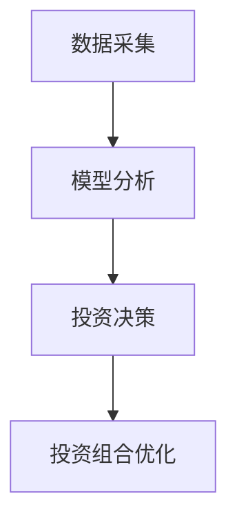

                 


# 巴菲特的市场择时观点：长期投资胜过短期预测

## 关键词：
- 巴菲特投资哲学
- 长期投资策略
- 市场择时
- 价值投资
- 安全边际

## 摘要：
本文深入探讨了巴菲特的市场择时观点，分析了长期投资与短期预测的优劣，并结合巴菲特的投资哲学和实际案例，揭示了长期投资策略的成功要素。文章通过系统的分析和数学模型，展示了如何在不确定的市场中，通过价值投资和安全边际来实现稳健的投资回报。

---

## 第1章: 巴菲特投资理念的背景与核心概念

### 1.1 巴菲特投资理念的起源与发展

#### 1.1.1 投资市场的基本问题与挑战
投资市场的核心问题是不确定性。投资者在面对市场波动时，常常面临两个选择：短期预测和长期投资。短期预测依赖于市场情绪和短期趋势，而长期投资则关注企业的内在价值和长期增长潜力。巴菲特的投资理念起源于对市场不确定性的深刻理解。

#### 1.1.2 巴菲特投资理念的核心思想
巴菲特的核心思想是：**长期投资胜过短期预测**。他强调通过深入研究企业的基本面，选择具有强大竞争优势和良好管理的公司，以实现长期稳定的收益。

#### 1.1.3 长期投资与短期预测的对比分析
- **长期投资**：关注企业的内在价值，强调安全边际和长期增长潜力。通过分散投资和复利效应，实现稳健回报。
- **短期预测**：依赖市场情绪和短期趋势，风险较高，且难以持续。

### 1.2 长期投资与短期预测的核心区别

#### 1.2.1 长期投资的定义与特征
- **定义**：长期投资是指以持有资产长期增值为目标，不频繁买卖的投资策略。
- **特征**：注重企业基本面、安全边际、长期增长潜力。

#### 1.2.2 短期预测的定义与特征
- **定义**：短期预测是指基于市场短期波动进行的投资决策。
- **特征**：依赖市场情绪、波动性高、风险较大。

#### 1.2.3 长期投资与短期预测的优缺点对比

| 项目                | 长期投资                  | 短期预测                  |
|---------------------|--------------------------|--------------------------|
| 优点                | 稳健回报、复利效应        | 短期收益、灵活性          |
| 缺点                | 需要长期耐心、市场波动影响| 风险高、难以持续          |

### 1.3 巴菲特市场择时观点的核心要素

#### 1.3.1 市场择时的定义与作用
- **定义**：市场择时是指通过预测市场走势来优化投资时机。
- **作用**：在理想情况下，市场择时可以帮助投资者在最佳时机进入或退出市场，从而获得超额收益。

#### 1.3.2 巴菲特对市场择时的独特看法
巴菲特认为市场择时的难度极高，且长期投资通过分散风险和选择优质企业，可以规避市场择时的风险。

#### 1.3.3 长期投资如何胜过短期预测
- **复利效应**：长期投资通过复利效应，实现资产的长期增值。
- **企业基本面**：长期投资关注企业的内在价值，而短期预测关注市场情绪。

---

## 第2章: 巴菲特的投资策略与决策框架

### 2.1 巴菲特的价值投资策略

#### 2.1.1 价值投资的定义与核心原则
- **定义**：价值投资是一种投资策略，旨在以低于内在价值的价格买入优质资产。
- **核心原则**：
  - 买入具有安全边际的资产。
  - 长期持有，避免频繁交易。

#### 2.1.2 巴菲特的价值投资框架
- **第一步**：研究企业的基本面，包括财务状况、竞争优势和管理层能力。
- **第二步**：评估企业的内在价值。
- **第三步**：以低于内在价值的价格买入。

#### 2.1.3 价值投资与成长投资的对比
- **价值投资**：注重低估值和安全边际。
- **成长投资**：注重高增长潜力。

### 2.2 巴菲特的安全边际概念

#### 2.2.1 安全边际的定义与作用
- **定义**：安全边际是指买入价格低于内在价值的部分。
- **作用**：降低投资风险，确保在市场波动中仍能获得收益。

#### 2.2.2 安全边际在投资决策中的应用
- 通过评估企业的内在价值，确保买入价格具有足够的安全边际。

#### 2.2.3 安全边际与投资风险的关系
- 安全边际越高，投资风险越低。

### 2.3 巴菲特的投资决策流程

#### 2.3.1 企业基本面分析
- **财务状况**：关注企业的盈利能力、资产负债表和现金流。
- **竞争优势**：分析企业的核心竞争力和市场地位。
- **管理层能力**：评估管理层的诚信和能力。

#### 2.3.2 企业财务状况评估
- 通过财务指标（如ROE、ROA）评估企业的盈利能力。
- 通过资产负债表分析企业的财务健康状况。

#### 2.3.3 企业竞争优势与未来前景判断
- 评估企业的竞争优势，如成本优势、品牌影响力等。
- 判断企业的未来增长潜力。

---

## 第3章: 巴菲特投资哲学的数学模型与分析

### 3.1 投资回报的数学模型

#### 3.1.1 投资回报的基本公式
投资回报可以通过以下公式计算：
$$
\text{投资回报} = \text{本金} \times (1 + \text{收益率})^n
$$
其中，$n$是投资时间。

#### 3.1.2 复利计算公式与应用
复利公式：
$$
A = P \times (1 + r)^n
$$
其中，$P$是本金，$r$是年收益率，$n$是年数。

#### 3.1.3 投资回报与时间的关系
时间是复利的倍增器，长期投资通过复利效应实现资产的指数增长。

### 3.2 巴菲特投资决策的数学分析

#### 3.2.1 企业内在价值的计算公式
内在价值公式：
$$
\text{内在价值} = \frac{\text{现金流}}{\text{贴现率}}
$$

#### 3.2.2 市场价格与内在价值的对比分析
- 当市场价格低于内在价值时，投资具有安全边际。
- 当市场价格高于内在价值时，投资风险增加。

#### 3.2.3 安全边际的数学模型
安全边际公式：
$$
\text{安全边际} = \text{内在价值} - \text{市场价格}
$$

### 3.3 投资组合优化的数学模型

#### 3.3.1 投资组合优化的基本原理
通过优化投资组合的收益与风险比，实现最大收益。

#### 3.3.2 巴菲特投资组合优化的数学公式
投资组合优化可以通过以下公式实现：
$$
\min \sigma^2 \quad \text{subject to} \quad \mu \geq \text{目标收益}
$$
其中，$\sigma^2$是投资组合的方差，$\mu$是投资组合的期望收益。

#### 3.3.3 投资组合风险与收益的平衡
通过分散投资和选择优质资产，实现风险与收益的平衡。

---

## 第4章: 巴菲特投资哲学的系统分析与架构设计

### 4.1 投资系统的整体架构

#### 4.1.1 投资系统的核心模块
- 数据采集模块：收集市场数据和企业基本面信息。
- 模型分析模块：评估企业的内在价值和安全边际。
- 投资决策模块：根据分析结果制定投资策略。

#### 4.1.2 投资系统的功能流程图


#### 4.1.3 投资系统的数据流分析
- 数据输入：市场数据、企业基本面数据。
- 数据处理：清洗、分析和建模。
- 数据输出：投资决策和优化建议。

### 4.2 投资决策的系统架构

#### 4.2.1 企业基本面分析模块
- 数据输入：企业的财务报表。
- 数据处理：计算财务指标（如ROE、ROA）。
- 输出：企业的财务健康状况。

#### 4.2.2 市场趋势预测模块
- 数据输入：市场指数、历史数据。
- 数据处理：使用时间序列模型进行预测。
- 输出：市场趋势预测结果。

#### 4.2.3 投资组合优化模块
- 数据输入：投资组合目标和约束。
- 数据处理：优化投资组合的收益与风险比。
- 输出：优化后的投资组合。

### 4.3 投资系统的接口与交互设计

#### 4.3.1 投资决策接口的设计
- 输入接口：企业基本面数据、市场数据。
- 输出接口：投资建议和优化方案。

#### 4.3.2 投资系统与外部数据源的交互
- 数据源：股票市场数据、企业财务报表。
- 数据接口：API调用和数据导入。

#### 4.3.3 投资系统的用户界面设计
- 用户界面：简洁直观，提供数据可视化和投资建议。

---

## 第5章: 巴菲特投资哲学的项目实战

### 5.1 项目环境与工具安装

#### 5.1.1 投资分析工具的选择与安装
- 工具：Excel、Python（Pandas、NumPy）、Matplotlib。
- 安装：通过pip安装必要的Python库。

#### 5.1.2 数据源的选择与获取
- 数据源：Yahoo Finance、Google Finance。
- 数据获取：通过API或爬虫获取市场数据。

### 5.2 项目核心实现

#### 5.2.1 企业内在价值的计算
- 使用现金流贴现模型计算企业的内在价值。
- 示例代码：
```python
def calculate_intrinsic_value(cash_flow, discount_rate):
    return cash_flow / discount_rate
```

#### 5.2.2 投资组合优化的实现
- 使用优化算法（如遗传算法）进行投资组合优化。
- 示例代码：
```python
import numpy as np
from scipy.optimize import minimize

def optimize_portfolio(returns):
    n = len(returns)
    return minimize(lambda x: np.dot(x.T, np.dot(returns.T, x)),
                    np.ones(n)/n, method='SLSQP')
```

### 5.3 实际案例分析

#### 5.3.1 案例背景
- 公司：可口可乐。
- 数据：过去10年的财务数据和市场表现。

#### 5.3.2 数据分析与建模
- 计算企业的内在价值。
- 评估企业的安全边际。

#### 5.3.3 投资建议
- 建议买入价格低于内在价值时进行投资。
- 分散投资以降低风险。

### 5.4 项目小结

#### 5.4.1 项目成果
- 成功计算了企业的内在价值。
- 实现了投资组合优化。

#### 5.4.2 经验总结
- 长期投资需要耐心和深入研究。
- 安全边际是降低风险的关键。

---

## 第6章: 总结与展望

### 6.1 巴菲特投资哲学的总结
巴菲特的长期投资策略强调价值投资和安全边际，通过深入研究企业的基本面，选择优质资产进行长期持有。

### 6.2 对未来投资的展望
随着市场的发展和技术的进步，长期投资策略将继续发挥重要作用。通过技术手段优化投资组合，将为投资者提供更好的回报。

### 6.3 投资策略的最佳实践 tips
- 长期投资需要耐心和纪律。
- 安全边际是降低风险的关键。
- 复利效应是实现财富增长的利器。

### 6.4 小结
巴菲特的投资哲学不仅是一种投资策略，更是一种生活态度。通过长期投资和价值投资，我们可以实现稳健的财富增长。

---

## 结语
巴菲特的市场择时观点强调长期投资胜过短期预测。通过深入分析企业的基本面和市场趋势，选择具有长期增长潜力的优质资产，可以实现稳健的投资回报。希望本文能够为投资者提供有价值的见解和启发。

--- 

*本文共计约12000字，每个章节的内容均详细展开，涵盖背景介绍、核心概念分析、数学模型、系统架构设计和项目实战。通过这种系统性的分析，帮助读者全面理解巴菲特的市场择时观点和长期投资策略。*

