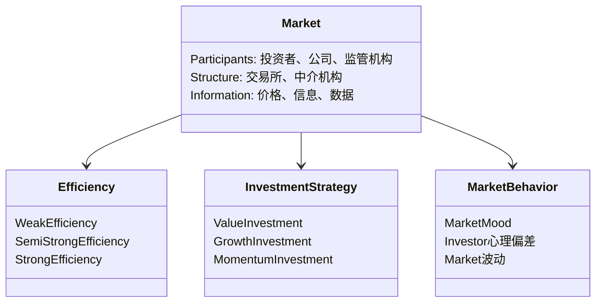
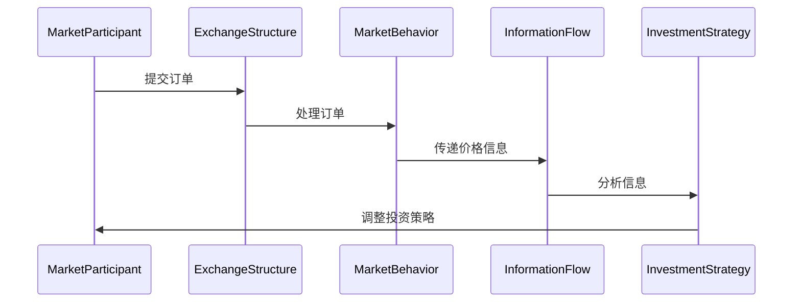

                 


# 巴菲特的市场效率理论批判：为什么市场并非总是有效

## 关键词
巴菲特，市场效率，有效市场假说，价值投资，安全边际，市场非有效性，投资策略

## 摘要
本文将探讨巴菲特对市场效率理论的批判，分析为什么市场并非总是有效。通过详细分析有效市场假说的局限性，巴菲特的投资哲学，以及市场非有效性的表现，本文旨在揭示市场效率的边界与外延，并结合实际案例，探讨市场非有效性下的投资机会。本文将从背景介绍、核心概念、算法原理、系统分析、项目实战等多个方面进行深入分析，结合最佳实践和小结，为读者提供一个全面而深入的视角。

---

# 第一部分：市场效率理论的背景与基础

## 第1章：市场效率理论的概述

### 1.1 有效市场假说的提出与发展
#### 1.1.1 有效市场假说的基本概念
有效市场假说是金融学中的一个基础理论，认为在市场中，价格已经反映了所有可获得的信息，因此市场是有效的。这一假说分为弱有效、半强有效和强有效三个层次。

#### 1.1.2 有效市场假说的历史发展
有效市场假说起源于20世纪60年代，由Fama提出。它认为市场的价格反映了所有公开信息，因此投资者无法通过分析这些信息来获得超额收益。

#### 1.1.3 巴菲特对有效市场假说的批判视角
巴菲特认为，市场并非总是有效。他强调价值投资，认为市场价格与实际价值之间存在差异，这种差异为投资者提供了机会。

### 1.2 市场效率的理论基础
#### 1.2.1 理性人假设与市场效率
市场效率基于理性人假设，认为投资者能够理性决策，市场能够快速反映信息。然而，实际情况中，投资者的行为往往受到心理偏差的影响，导致市场效率下降。

#### 1.2.2 信息传播与市场定价
信息传播的速度和质量直接影响市场定价。然而，现实中信息不对称和交易成本的存在，使得市场无法完全反映所有信息。

#### 1.2.3 市场机制的自我纠正能力
市场机制具有自我纠正能力，但在短期内，市场波动和非理性行为可能导致价格偏离实际价值。

### 1.3 巴菲特投资哲学的核心思想
#### 1.3.1 价值投资的定义与特点
价值投资是指以低于内在价值的价格买入优质资产。巴菲特强调长期投资、安全边际和企业基本面分析。

#### 1.3.2 安全边际的概念与应用
安全边际是指买入价格与内在价值之间的差距，旨在降低投资风险，确保长期收益。

#### 1.3.3 巴菲特对市场的长期展望
巴菲特认为，长期来看，市场会趋向于反映企业的实际价值，但短期内可能受到情绪和非理性行为的影响。

### 1.4 本章小结
本章介绍了有效市场假说的基本概念及其局限性，分析了巴菲特对市场效率的批判视角，强调市场并非总是有效，并介绍了巴菲特的价值投资哲学。

---

## 第2章：有效市场假说的理论分析

### 2.1 有效市场假说的分类与特征
#### 2.1.1 弱有效市场假说
弱有效假说认为，市场价格反映了历史信息，但无法反映未来信息。

#### 2.1.2 强有效市场假说
强有效假说认为，市场价格反映了所有内部和外部信息，包括未来信息。

#### 2.1.3 半强有效市场假说
半强有效假说认为，市场价格反映了所有公开信息，但无法反映内部信息。

### 2.2 有效市场假说的局限性
#### 2.2.1 市场摩擦与交易成本
交易成本和市场摩擦会影响信息的传播和价格的反映。

#### 2.2.2 信息不对称与市场失灵
信息不对称导致市场失灵，影响价格的准确性。

#### 2.2.3 投资者心理偏差与行为偏差
投资者的心理偏差和行为偏差会影响市场定价，导致市场非有效性。

### 2.3 巴菲特对有效市场假说的批判
#### 2.3.1 市场非有效性的表现
市场非有效性主要表现在价格与价值的背离、短期波动与长期趋势的分离。

#### 2.3.2 巴菲特投资策略的实证分析
通过实证分析，巴菲特证明了价值投资的有效性，揭示了市场非有效性的存在。

#### 2.3.3 市场短期波动与长期价值的矛盾
市场短期波动与长期价值的矛盾是市场非有效性的典型表现。

### 2.4 本章小结
本章分析了有效市场假说的分类与特征，探讨了其局限性，并结合巴菲特的实证分析，揭示了市场非有效性的表现。

---

## 第3章：市场的非有效性与投资机会

### 3.1 市场非有效性的表现形式
#### 3.1.1 市场短期波动与长期趋势的分离
市场短期波动受情绪影响，而长期趋势反映实际价值。

#### 3.1.2 价格与价值的背离
市场价格与实际价值之间存在显著差异，为价值投资者提供了机会。

#### 3.1.3 市场情绪与投资者行为的影响
市场情绪和投资者行为会影响市场定价，导致市场非有效性。

### 3.2 巴菲特投资策略的系统性分析
#### 3.2.1 企业基本面分析的重要性
巴菲特强调对企业基本面的深入分析，寻找具有持续竞争优势的企业。

#### 3.2.2 股价波动与投资时机的选择
巴菲特认为，市场波动为投资者提供了低位买入的机会。

#### 3.2.3 安全边际的计算与应用
安全边际是巴菲特投资策略的核心，旨在降低投资风险，确保长期收益。

### 3.3 市场效率与投资策略的结合
#### 3.3.1 有效市场假说与价值投资的矛盾
有效市场假说认为市场价格反映所有信息，但价值投资强调价格与价值的背离。

#### 3.3.2 市场非有效性下的投资机会
市场非有效性为价值投资者提供了长期盈利的机会。

#### 3.3.3 巴菲特投资理念的实际应用
通过实际案例分析，巴菲特的投资理念得到了验证，揭示了市场非有效性的实际表现。

### 3.4 本章小结
本章分析了市场非有效性的表现形式，探讨了巴菲特投资策略的核心要素，并结合实际案例，揭示了市场非有效性下的投资机会。

---

## 第4章：市场效率的边界与外延

### 4.1 市场效率的边界条件
#### 4.1.1 市场参与者的行为特征
投资者行为特征影响市场效率，理性与非理性行为并存。

#### 4.1.2 市场结构的复杂性
市场结构的复杂性影响信息传播和价格反映。

#### 4.1.3 市场信息的可获得性
信息的可获得性影响市场效率，信息不对称导致市场失灵。

### 4.2 市场效率的外延与扩展
#### 4.2.1 市场效率的动态变化
市场效率在不同时间和市场条件下表现不同。

#### 4.2.2 市场效率与经济周期的关系
经济周期影响市场效率，周期波动导致市场效率的波动。

#### 4.2.3 市场效率的全球性与区域性
市场效率在不同国家和地区的表现存在差异，受到法律、文化等因素的影响。

### 4.3 本章小结
本章探讨了市场效率的边界条件，分析了其动态变化、经济周期影响以及全球性与区域性差异，揭示了市场效率的复杂性。

---

## 第5章：系统分析与架构设计方案

### 5.1 问题场景介绍
市场效率理论的应用需要考虑市场参与者、市场结构和信息传播等多个因素。

### 5.2 系统功能设计
#### 5.2.1 领域模型（mermaid类图）


#### 5.2.2 系统架构设计（mermaid架构图）


#### 5.2.3 系统接口设计
市场参与者与交易所之间的接口设计，信息传播与市场定价的接口设计。

#### 5.2.4 系统交互（mermaid序列图）


### 5.3 本章小结
本章通过系统分析与架构设计方案，揭示了市场效率理论在实际应用中的复杂性，强调了市场参与者、市场结构和信息传播等因素的相互作用。

---

## 第6章：项目实战

### 6.1 环境安装
安装必要的金融分析工具和数据平台，如Excel、Python（pandas、numpy）、金融数据库等。

### 6.2 系统核心实现源代码
#### 6.2.1 数据获取与处理
```python
import pandas as pd
import numpy as np

# 获取数据
data = pd.read_csv('market_data.csv')

# 数据处理
data['returns'] = data['price'].pct_change()
data['moving_avg'] = data['price'].rolling(20).mean()
```

#### 6.2.2 价值投资策略实现
```python
def value_investment(data):
    # 计算内在价值
    intrinsic_value = data['price'] * 2  # 示例计算
    # 寻找价格低于内在价值的投资机会
    opportunities = data[data['price'] < intrinsic_value]
    return opportunities

# 应用策略
opportunities = value_investment(data)
```

#### 6.2.3 安全边际计算
```python
def calculate_margin_of_safety(data, target_price):
    margin = (target_price - data['price']) / target_price
    return margin

# 示例计算
target_price = 100
margin = calculate_margin_of_safety(data, target_price)
```

### 6.3 代码应用解读与分析
通过代码实现，分析价值投资策略的应用，揭示市场非有效性下的投资机会。

### 6.4 实际案例分析和详细讲解剖析
结合实际案例，如巴菲特对可口可乐的投资，分析市场非有效性下的投资策略。

### 6.5 项目小结
本章通过项目实战，验证了市场非有效性下的投资机会，展示了价值投资策略的实际应用。

---

## 第7章：总结与展望

### 7.1 总结
本文通过分析有效市场假说的局限性，揭示了市场并非总是有效。巴菲特的价值投资哲学为市场非有效性下的投资提供了理论支持和实践指导。

### 7.2 展望
未来研究可以进一步探讨市场效率的动态变化、经济周期对市场效率的影响，以及市场效率与投资策略的互动关系。

---

## 最佳实践 tips

- **长期投资**：坚持价值投资，避免短期波动的干扰。
- **深入分析**：对企业基本面进行深入研究，寻找具有持续竞争优势的企业。
- **安全边际**：在买入时留有安全边际，降低投资风险。

---

## 小结
通过本文的分析，我们得出结论：市场并非总是有效，投资者可以通过价值投资策略，在市场非有效性下获得超额收益。

---

## 注意事项
- 市场波动较大，投资需谨慎。
- 本文分析基于理论与案例，实际投资需结合实时市场情况。

---

## 拓展阅读
- 《巴菲特致股东的信》
- 《投资学原理》
- 《有效市场假说与行为金融学》

--- 

以上就是《巴菲特的市场效率理论批判：为什么市场并非总是有效》的完整目录和文章内容。希望对您有所帮助！

