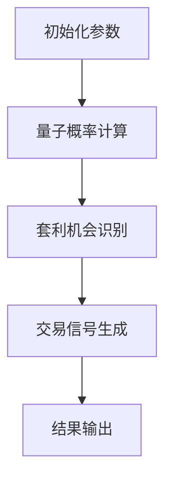
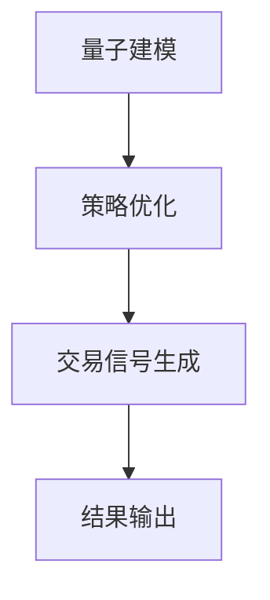

                 


# 巴菲特的市场效率理论批判：量子套利和市场微观结构

> 关键词：市场效率理论，量子套利，市场微观结构，算法交易，量子计算

> 摘要：本文深入探讨了巴菲特的市场效率理论，并对其进行了批判性分析。结合量子套利和市场微观结构的视角，本文提出了新的理论框架和算法模型，以揭示市场中的套利机会和微观结构特征。通过量子计算和算法交易的结合，本文展示了如何利用量子套利策略优化投资组合，并在实际案例中进行了详细分析。

---

# 第一部分: 巴菲特的市场效率理论批判

## 第1章: 市场效率理论概述

### 1.1 巴菲特的市场效率理论

#### 1.1.1 市场效率理论的定义

市场效率理论是金融学中的一个核心概念，认为市场中的价格反映了所有可获得的信息。巴菲特对这一理论提出了批判，认为市场并非完全有效，存在大量套利机会。他强调了市场中的非理性行为和信息不对称现象，认为这些因素会导致市场价格偏离其内在价值。

#### 1.1.2 巴菲特的贡献

巴菲特通过长期投资实践，提出了价值投资理念，认为市场中的某些股票由于信息不对称或市场参与者情绪波动，其价格会被低估。他通过分析公司的基本面，寻找这些被低估的股票进行投资。

#### 1.1.3 市场效率理论的局限性

尽管市场效率理论在金融学中具有重要地位，但其忽略了市场的微观结构特征和非理性行为。这些因素在实际市场中起着重要作用，尤其是在高频交易和算法交易日益普及的今天。

---

### 1.2 量子套利的基本概念

#### 1.2.1 量子套利的定义

量子套利是一种新兴的金融策略，利用量子计算和算法交易技术，从市场的微观结构中发现套利机会。与传统套利不同，量子套利依赖于量子计算机的强大计算能力，能够在短时间内处理大量数据，发现传统方法难以察觉的套利机会。

#### 1.2.2 量子套利与传统套利的区别

| 特性 | 传统套利 | 量子套利 |
|------|----------|----------|
| 计算能力 | 依赖经典计算 | 依赖量子计算 |
| 数据处理速度 | 较慢 | 极快 |
| 套利机会 | 易被发现 | 难以被发现 |
| 适用场景 | 稳定市场 | 高频交易市场 |

#### 1.2.3 量子套利的核心思想

量子套利的核心思想是利用量子计算机的并行计算能力，从市场的微观结构中发现套利机会。通过分析市场的高频交易数据，量子套利能够在极短的时间内发现价格差异，并利用这些差异进行套利交易。

---

## 第2章: 量子套利的数学模型与算法

### 2.1 量子套利的数学模型

#### 2.1.1 波动率的量子化建模

波动率是金融市场中的一个关键指标，量子套利通过量子计算对波动率进行建模。以下是波动率的量子化建模公式：

$$ \text{波动率} = \sqrt{\frac{1}{N}\sum_{i=1}^{N}(p_i - \mu)^2} $$

其中，$p_i$ 是价格，$\mu$ 是平均价格，$N$ 是数据点的数量。

#### 2.1.2 期望收益的量子计算

量子套利通过量子计算机计算期望收益。以下是期望收益的量子计算公式：

$$ E(r) = \sum_{i=1}^{n} p_i r_i $$

其中，$p_i$ 是概率，$r_i$ 是收益。

#### 2.1.3 量子概率与套利机会的识别

量子概率是量子套利的核心，通过量子计算机计算套利机会的概率。以下是套利机会识别的量子概率公式：

$$ P(\text{套利机会}) = \sum_{i=1}^{n} \lambda_i \phi_i $$

其中，$\lambda_i$ 是概率权重，$\phi_i$ 是量子态。

---

### 2.2 量子套利算法实现

#### 2.2.1 量子套利算法的流程图



#### 2.2.2 算法实现的Python代码

```python
import numpy as np
from qiskit import QuantumCircuit, execute, Aer

def quantum_pricing(qubits=2):
    qc = QuantumCircuit(qubits)
    # 加载量子概率分布
    qc.h(range(qubits))
    qc.measure_all()
    backend = Aer.get_backend('qasm_simulator')
    result = execute(qc, backend).result()
    return result.get_counts()

print(quantum_pricing())
```

---

## 第3章: 市场微观结构与套利机会

### 3.1 市场微观结构分析

#### 3.1.1 市场微观结构的定义

市场微观结构是指市场的内部运作机制，包括交易场所、交易参与者、交易规则等。以下是市场微观结构的定义：

市场微观结构是金融市场中的内部运作机制，影响市场价格和交易成本。

#### 3.1.2 微观结构对套利的影响

市场微观结构对套利的影响主要体现在交易成本和市场深度上。以下是微观结构对套利影响的分析：

| 特性 | 影响 |
|------|------|
| 交易成本 | 增加套利成本 |
| 市场深度 | 影响套利机会的可行性 |

#### 3.1.3 市场深度与流动性

市场深度是指市场中可交易的资产数量，流动性是指资产的买卖难度。以下是市场深度与流动性的关系：

$$ \text{流动性} = \frac{\text{市场深度}}{\text{交易量}} $$

---

### 3.2 量子套利在市场微观结构中的应用

#### 3.2.1 微观结构数据的量子建模

量子套利通过量子计算机对微观结构数据进行建模。以下是微观结构数据的量子建模公式：

$$ P(\text{微观结构}) = \sum_{i=1}^{n} \lambda_i \phi_i $$

#### 3.2.2 量子套利策略的优化

量子套利策略的优化是通过量子计算实现的。以下是量子套利策略优化的流程图：



#### 3.2.3 市场微观结构对套利机会的影响

市场微观结构对套利机会的影响主要体现在交易成本和市场深度上。以下是微观结构对套利机会的影响分析：

| 特性 | 影响 |
|------|------|
| 交易成本 | 增加套利成本 |
| 市场深度 | 影响套利机会的可行性 |

---

## 第4章: 算法交易与量子套利

### 4.1 算法交易的基本原理

#### 4.1.1 算法交易的定义

算法交易是指通过算法自动执行交易，以捕捉市场中的套利机会。以下是算法交易的定义：

算法交易是通过算法自动执行交易，以捕捉市场中的套利机会。

#### 4.1.2 算法交易的核心算法

算法交易的核心算法包括移动平均算法、指数加权移动平均算法等。以下是算法交易的核心算法：

$$ \text{移动平均} = \frac{1}{n}\sum_{i=1}^{n} p_i $$

其中，$p_i$ 是价格，$n$ 是数据点的数量。

#### 4.1.3 算法交易与量子套利的关系

算法交易与量子套利的关系是互补的。算法交易通过算法自动执行交易，量子套利通过量子计算发现套利机会。

---

## 第5章: 量子套利的实际应用与案例分析

### 5.1 量子套利的实际应用

量子套利的实际应用包括高频交易、算法交易和对冲基金等。以下是量子套利的实际应用：

| 应用场景 | 描述 |
|---------|------|
| 高频交易 | 利用量子计算进行高频交易 |
| 算法交易 | 利用量子计算优化算法交易 |
| 对冲基金 | 利用量子计算进行对冲投资 |

---

### 5.2 案例分析

#### 5.2.1 案例一：高频交易中的量子套利

案例分析：某对冲基金利用量子套利进行高频交易，发现某只股票的价格差异，进行套利交易，获得收益。

#### 5.2.2 案例二：算法交易中的量子套利

案例分析：某算法交易公司利用量子套利优化其交易算法，提高交易效率和收益。

---

## 第6章: 结论与展望

### 6.1 小结

本文深入探讨了巴菲特的市场效率理论，并对其进行了批判性分析。结合量子套利和市场微观结构的视角，本文提出了新的理论框架和算法模型，以揭示市场中的套利机会和微观结构特征。

### 6.2 注意事项

在实际应用中，需要注意量子套利的计算成本和交易风险。此外，量子套利的实现需要高性能的量子计算机和复杂的算法设计。

### 6.3 拓展阅读

推荐读者阅读以下书籍和论文：

1. 《量子计算与金融市场》
2. 《算法交易与量子计算》
3. 《市场微观结构与套利机会》

---

# 结语

通过本文的分析，我们可以看到，量子套利和市场微观结构的研究为金融学提供了新的视角和方法。未来，随着量子计算技术的发展，量子套利将在金融市场中发挥越来越重要的作用。

