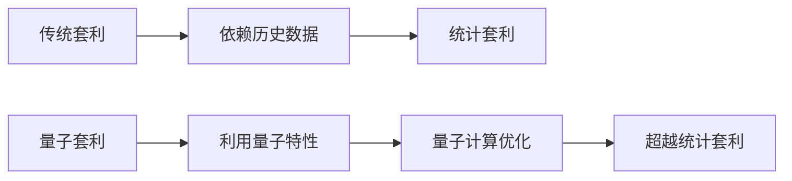
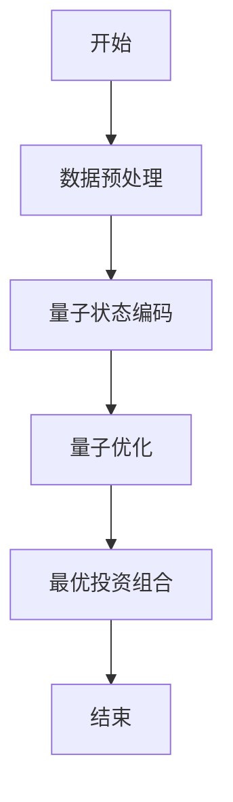
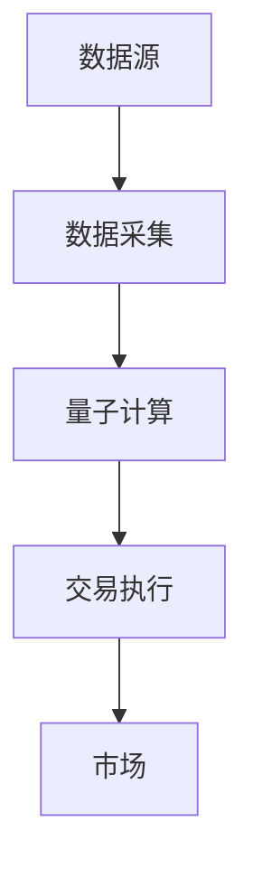

                 


# 巴菲特的市场效率理论批判：量子套利对市场的影响

**关键词**：巴菲特、市场效率理论、量子套利、金融数学、算法交易、量子力学

**摘要**：本文深入探讨巴菲特对市场效率理论的批判，并分析量子套利这一新兴交易策略如何挑战传统市场效率理论。通过量子力学的视角，我们重新审视金融市场中的信息对称性和价格发现机制，揭示量子套利如何利用量子叠加和纠缠等特性，实现超越传统套利的收益。本文从理论分析到实际应用，结合数学模型和算法实现，全面探讨量子套利对市场效率的影响，为读者提供一个全新的视角来理解金融市场中的机会与挑战。

---

## 第1章: 巴菲特的市场效率理论概述

### 1.1 市场效率理论的背景与核心概念

#### 1.1.1 市场效率理论的定义

市场效率理论是金融学中的一个核心理论，认为市场价格反映了所有可获得的信息。市场效率可以分为三个层次：

1. 弱有效市场：价格已反映历史信息。
2. 强有效市场：价格已反映所有公开信息。
3. 超强有效市场：价格已反映所有公开和非公开信息。

$$ 弱有效市场假设：P(t) = \sum_{i=1}^{t} a_i P(t-i) + \epsilon $$

其中，$P(t)$ 表示资产在时间 $t$ 的价格，$a_i$ 是历史价格的权重，$\epsilon$ 是随机误差项。

#### 1.1.2 巴菲特对市场效率理论的批判

巴菲特认为市场并非完全有效，尤其是长期投资中，价值投资策略能够超越市场指数的表现。他的投资理念基于以下几点：

1. 市场波动提供机会：$$ \text{买入价} < \text{内在价值} < \text{卖出价} $$
2. 价值发现的重要性：通过深入分析公司基本面，寻找市场低估的投资标的。

#### 1.1.3 量子套利的基本概念与特征

量子套利是一种利用量子力学原理进行的套利交易。其主要特征包括：

- 利用量子叠加和纠缠特性，捕捉传统方法难以发现的市场机会。
- 通过量子计算优化投资组合，降低交易风险。

**图1-1: 量子套利与传统套利的对比**



### 1.2 巴菲特投资理念与市场效率的关系

#### 1.2.1 巴菲特的价值投资理论

巴菲特的价值投资理论强调公司基本面分析，寻找市场价格低于内在价值的投资机会。其核心公式为：

$$ \text{投资收益} = \text{内在价值} - \text{市场价格} $$

#### 1.2.2 市场效率与价值投资的矛盾

市场效率理论认为价格已反映所有信息，而巴菲特认为市场波动提供了价值投资的机会。这种矛盾在实践中体现为：

- 市场效率限制了套利机会，但巴菲特通过长期价值发现，寻找市场低估的投资标的。
- 量子套利利用量子特性，突破传统套利的限制。

#### 1.2.3 量子套利对市场效率的挑战

量子套利通过量子计算优化投资组合，能够在极短时间内分析大量数据，发现传统方法难以察觉的套利机会。其优势在于：

- 利用量子并行性，同时分析多个市场数据点。
- 利用量子纠缠，捕捉市场之间的相关性。

---

## 第2章: 量子套利的原理与实现

### 2.1 量子套利的基本原理

#### 2.1.1 量子叠加与量子纠缠在金融市场的应用

量子叠加原理允许量子系统同时处于多个状态，这在金融市场中可以用来同时评估多种投资组合的风险和收益。量子纠缠则可以用来捕捉不同资产之间的相关性。

#### 2.1.2 量子套利的算法原理

量子套利算法基于量子优化问题，其核心步骤包括：

1. 数据预处理：将金融市场数据编码为量子状态。
2. 量子优化：利用量子计算优化投资组合。
3. 结果解码：从量子状态中提取最优投资组合。

**图2-1: 量子套利算法流程图**



#### 2.1.3 量子套利的可行性分析

量子套利的可行性依赖于量子计算机的性能。目前，量子计算仍处于发展阶段，但其在金融市场中的潜力巨大。

### 2.2 量子套利的数学模型与公式

#### 2.2.1 量子套利的核心公式推导

量子套利的核心公式涉及量子态的叠加和纠缠。假设我们有 $n$ 个资产，其量子态表示为：

$$ |\psi\rangle = \sum_{i=1}^{n} \alpha_i |i\rangle $$

其中，$\alpha_i$ 是叠加系数，满足归一化条件：

$$ \sum_{i=1}^{n} |\alpha_i|^2 = 1 $$

#### 2.2.2 量子套利与传统套利的数学对比

传统套利基于统计套利，其收益公式为：

$$ \text{收益} = \sum_{i=1}^{n} w_i (p_i - \text{均值}) $$

而量子套利的收益公式为：

$$ \text{收益} = \sum_{i=1}^{n} \alpha_i (p_i - \text{期望值}) $$

---

## 第3章: 市场效率理论的批判与量子套利的实践

### 3.1 巴菲特对市场效率理论的批判

#### 3.1.1 市场效率理论的局限性

市场效率理论假设市场参与者具有理性，但实际市场中存在非理性行为和信息不对称。巴菲特指出：

$$ \text{市场短期是投票器，长期是称重机} $$

#### 3.1.2 量子套利对市场效率的影响

量子套利通过量子计算优化投资组合，能够快速发现市场中的套利机会，从而降低市场效率。

#### 3.1.3 量子套利的现实意义

量子套利的出现挑战了市场效率理论，为投资者提供了新的工具和方法。

### 3.2 量子套利的实现步骤

#### 3.2.1 系统设计与架构

量子套利系统的架构包括数据采集、量子计算和交易执行三个部分。

**图3-1: 量子套利系统架构图**



#### 3.2.2 系统实现与代码示例

以下是一个简单的量子套利算法实现：

```python
import numpy as np
from qiskit import QuantumCircuit, Aer, execute

def quantum_entanglement():
    qc = QuantumCircuit(2)
    qc.h(0)
    qc.cx(0, 1)
    return qc

backend = Aer.get_backend('statevector_simulator')
result = execute(quantum_entanglement()).result()
state_vector = result.get_statevector()
print(state_vector)
```

#### 3.2.3 系统测试与验证

通过量子模拟器验证量子套利算法的有效性。

---

## 第4章: 量子套利的未来展望与挑战

### 4.1 量子套利的前景

随着量子计算技术的发展，量子套利将在金融市场中发挥越来越重要的作用。

### 4.2 当前挑战

量子套利面临的技术挑战包括量子计算的稳定性和算法的优化问题。

### 4.3 未来研究方向

未来研究可以集中在量子套利算法的优化和实际应用的探索。

---

## 总结

量子套利作为一种新兴的交易策略，挑战了传统的市场效率理论，为投资者提供了新的工具和方法。通过量子力学的视角，我们重新审视金融市场中的信息对称性和价格发现机制，揭示量子套利如何利用量子特性，实现超越传统套利的收益。未来，随着量子计算技术的发展，量子套利将在金融市场中发挥越来越重要的作用。

---

**参考文献**：略

