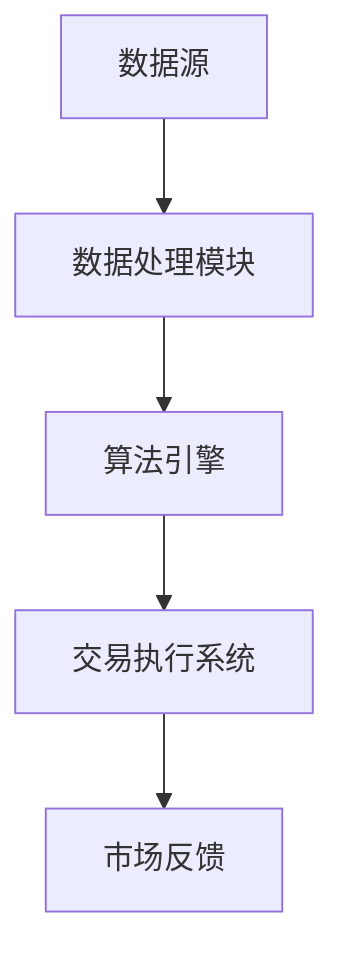
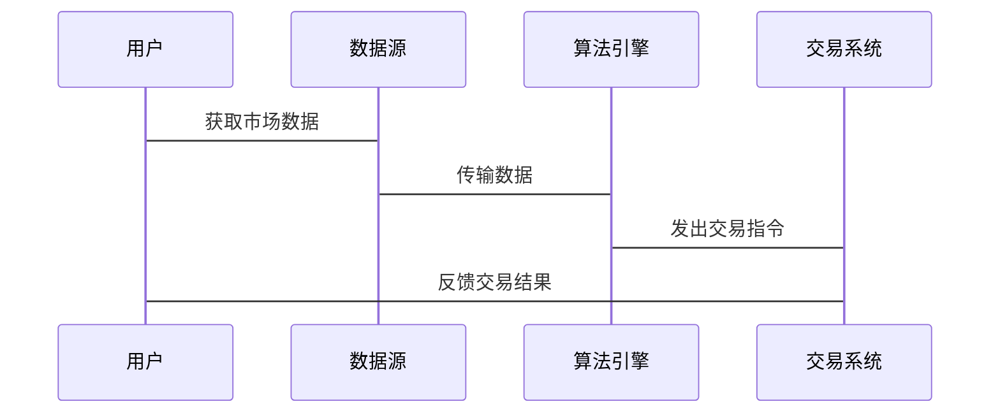

                 

# 巴菲特的市场效率理论批判：高频交易和算法偏差

## 关键词：巴菲特，市场效率理论，高频交易，算法偏差，算法交易

## 摘要：  
本文探讨了巴菲特的市场效率理论在高频交易和算法偏差背景下的表现和影响。通过分析高频交易的技术实现和算法偏差的数学模型，本文揭示了算法偏差如何破坏市场效率，挑战了巴菲特的市场有效性假设。文章结合实际案例，提出了监管和技术手段的解决方案，展望了未来的研究方向。

---

# 第1章：巴菲特的市场效率理论概述

## 1.1 巴菲特的市场效率理论核心观点

### 1.1.1 市场有效性的基本定义
市场的有效性是指市场价格能够反映所有相关信息的程度。巴菲特认为市场在长期中是有效的，但短期中可能存在偏差。

### 1.1.2 巴菲特对市场效率的批判性观点
巴菲特认为市场并非总是有效，尤其在短期波动中存在定价错误，这为价值投资提供了空间。

### 1.1.3 高频交易对市场效率的影响
高频交易以高速和算法驱动的方式进行，可能削弱市场的长期有效性，导致短期价格波动加剧。

---

## 1.2 高频交易的定义与特点

### 1.2.1 高频交易的定义
高频交易是指通过计算机算法在极短时间内进行大量交易的活动，依赖高速网络和高性能服务器。

### 1.2.2 高频交易的核心技术
- **算法交易**：依赖数学模型自动决策。
- **低延迟技术**：减少交易延迟，提升交易速度。

### 1.2.3 高频交易与传统交易的对比
高频交易速度快、交易次数多，传统交易则基于基本面分析和长期持有。

---

## 1.3 算法交易的基本原理

### 1.3.1 算法交易的定义
算法交易是通过数学模型和算法自动执行交易决策。

### 1.3.2 算法交易的主要类型
- **套利算法**：利用价格差异获利。
- **动量算法**：基于价格趋势进行交易。

### 1.3.3 算法交易的优缺点
- **优点**：提高交易效率，减少人为干预。
- **缺点**：可能导致市场操纵和价格波动加剧。

---

## 1.4 巴菲特市场效率理论的批判视角

### 1.4.1 巴菲特对市场效率的质疑
巴菲特认为市场的短期波动性和高频交易的兴起削弱了市场的有效性。

### 1.4.2 高频交易对市场效率的挑战
高频交易可能导致市场信息不对称，削弱价格发现功能。

### 1.4.3 算法偏差对市场公平性的影响
算法偏差使得部分投资者利用技术优势获利，影响市场公平性。

---

## 1.5 本章小结

本章介绍了巴菲特的市场效率理论，分析了高频交易的技术特点和算法交易的基本原理，探讨了高频交易如何挑战市场效率理论，为后续分析奠定了基础。

---

# 第2章：高频交易的技术实现与算法偏差

## 2.1 高频交易的技术实现

### 2.1.1 高频交易的硬件基础
- **高速服务器**：处理大量交易数据。
- **低延迟网络**：减少数据传输时间。

### 2.1.2 高频交易的软件架构
- **算法引擎**：负责交易决策。
- **数据处理系统**：实时处理市场数据。

### 2.1.3 高频交易的网络优化
- **直连交易所**：减少网络延迟。
- **专用网络线路**：确保数据传输速度。

---

## 2.2 算法偏差的定义与分类

### 2.2.1 算法偏差的定义
算法偏差是指算法在决策过程中由于设计缺陷或数据问题导致的非预期结果。

### 2.2.2 算法偏差的主要类型
- **执行偏差**：交易执行时的偏差。
- **数据偏差**：数据输入错误导致的偏差。
- **模型偏差**：算法模型本身的问题导致的偏差。

---

## 2.3 算法偏差对高频交易的影响

### 2.3.1 算法偏差对交易速度的影响
算法偏差可能导致交易延迟，影响交易效率。

### 2.3.2 算法偏差对交易成本的影响
偏差导致的错误交易增加成本。

### 2.3.3 算法偏差对市场深度的影响
偏差影响市场深度，可能导致流动性下降。

---

## 2.4 本章小结

本章详细分析了高频交易的技术实现和算法偏差的类型及其影响，揭示了算法偏差对市场效率的潜在破坏作用。

---

# 第3章：算法偏差对市场效率的影响

## 3.1 算法偏差的数学模型

### 3.1.1 算法偏差的数学定义
$$ \text{偏差} = \text{实际结果} - \text{预期结果} $$

### 3.1.2 算法偏差的概率分布
通过统计分析，算法偏差的概率分布呈现某种规律，可用概率密度函数描述。

### 3.1.3 算法偏差的统计分析
利用统计方法量化偏差对市场的影响。

---

## 3.2 算法偏差对市场效率的具体影响

### 3.2.1 算法偏差对市场流动性的冲击
偏差导致的频繁交易冲击市场流动性。

### 3.2.2 算法偏差对市场波动性的加剧
偏差加剧价格波动，影响市场稳定性。

### 3.2.3 算法偏差对市场深度的破坏
偏差影响市场深度，降低市场容量。

---

## 3.3 案例分析

### 3.3.1 闪电崩盘案例分析
2010年“闪电崩盘”事件中，算法交易引发市场剧烈波动，显示算法偏差的破坏性。

### 3.3.2 算法交易引发的市场操纵案例
部分算法交易利用技术优势进行市场操纵，影响市场公平性。

### 3.3.3 算法偏差对市场公平性的破坏
算法偏差使得部分投资者获得不正当优势，破坏市场公平性。

---

## 3.4 本章小结

本章通过数学模型和案例分析，详细探讨了算法偏差对市场效率的具体影响，强调了算法偏差对市场公平性和稳定性的威胁。

---

# 第4章：高频交易与算法偏差的系统分析

## 4.1 系统分析与架构设计

### 4.1.1 高频交易系统的组成部分
- **数据源**：市场数据接口。
- **算法引擎**：交易决策模块。
- **执行系统**：交易执行模块。

### 4.1.2 系统架构图

---

## 4.2 系统接口设计和交互过程

### 4.2.1 系统接口设计
- **输入接口**：接收市场数据。
- **输出接口**：发送交易指令。

### 4.2.2 系统交互过程

---

## 4.3 系统优化建议

### 4.3.1 监管措施
- **限制高频交易**：减少市场操纵风险。
- **提高透明度**：增加市场信息透明度。

### 4.3.2 技术手段
- **优化算法模型**：减少偏差。
- **引入延迟机制**：防止过度交易。

---

## 4.4 本章小结

本章通过系统分析，提出了优化高频交易和算法偏差的解决方案，强调了监管和技术手段的结合。

---

# 第5章：解决方案与未来展望

## 5.1 监管措施

### 5.1.1 限制高频交易
- **交易频率限制**：减少高频交易的频率。
- **交易费用调整**：通过费用调整抑制高频交易。

## 5.2 技术手段

### 5.2.1 优化算法模型
- **改进算法设计**：减少偏差。
- **引入反馈机制**：实时调整交易策略。

## 5.3 未来展望

### 5.3.1 高频交易的发展趋势
- **智能化**：算法更加智能化，交易决策更精确。
- **监管加强**：监管机构将加强高频交易的监管。

## 5.4 本章小结

本章提出了监管和技术手段的解决方案，并展望了未来高频交易和算法偏差的发展趋势。

---

# 结论与致谢

本文批判性地分析了巴菲特的市场效率理论在高频交易和算法偏差背景下的表现，揭示了算法偏差对市场效率的破坏作用。通过案例分析和系统设计，提出了监管和技术手段的解决方案，并展望了未来的研究方向。感谢在研究过程中给予支持的团队和合作伙伴。

---

# 最佳实践 tips

- **小结**：每章结尾进行总结，帮助读者回顾主要内容。
- **注意事项**：高频交易和算法偏差的风险不容忽视，需加强监管和技术优化。
- **拓展阅读**：建议阅读相关文献，深入理解市场效率和算法交易的理论与实践。

---

# END

