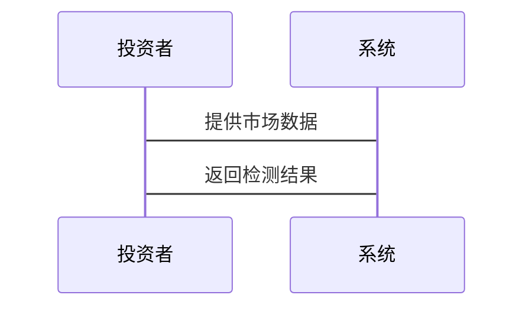

                 


# 巴菲特的市场泡沫识别：人工智能驱动的市场异常检测

## 关键词：
- 巴菲特，市场泡沫，人工智能，市场异常检测，投资策略，金融风险管理

## 摘要：
本文探讨了如何将巴菲特的价值投资理念与人工智能技术相结合，用于市场异常检测和泡沫识别。通过分析市场泡沫的定义、巴菲特投资策略的核心思想以及人工智能在金融领域的应用前景，本文提出了基于人工智能的市场异常检测算法，并详细介绍了其算法原理、系统架构设计和项目实现。最后，本文通过实际案例分析，展示了结合巴菲特策略的人工智能模型在市场异常检测中的优势和应用价值。

---

## 第一部分：背景与概述

### 第1章：巴菲特的市场泡沫识别与人工智能结合的背景

#### 1.1 市场泡沫的定义与特征
市场泡沫是指资产价格在短期内迅速上涨，远远超过其实际价值，最终导致价格虚高、市场崩盘的现象。其主要特征包括价格波动剧烈、交易量异常增加、投资者情绪化等。

#### 1.2 巴菲特投资策略的核心思想
巴菲特的价值投资理念强调长期投资、安全边际和企业基本面分析。他注重企业的内在价值，而非市场的短期波动。

#### 1.3 人工智能在金融领域的应用前景
人工智能在金融领域的应用前景广阔，尤其是在市场数据处理、模式识别和预测分析方面具有显著优势。

---

### 第2章：市场异常检测的核心概念与联系

#### 2.1 市场异常检测的定义与分类
市场异常检测是指通过分析市场数据，识别出与正常市场行为不一致的异常行为或事件。其分类包括孤立点检测、集体异常检测等。

#### 2.2 巴菲特策略与人工智能的结合点
巴菲特策略与人工智能的结合主要体现在市场数据分析和风险控制方面。人工智能可以通过大量数据分析，辅助巴菲特策略的实施。

#### 2.3 核心概念的ER实体关系图
```mermaid
er
  actor:投资者
  market_data:市场数据
  model:人工智能模型
  result:检测结果
  actor --> market_data: 提供数据
  market_data --> model: 输入数据
  model --> result: 输出结果
  actor <-- result: 获取检测结果
```

---

## 第二部分：算法原理与实现

### 第3章：基于人工智能的市场异常检测算法

#### 3.1 异常检测算法概述
常见的异常检测算法包括基于统计的方法（如Z-score）和基于机器学习的方法（如Isolation Forest）。

#### 3.2 基于深度学习的异常检测
变分解网络（AE）是一种常用的深度学习模型，通过重建误差来检测异常。

#### 3.3 巴菲特策略与AI结合的算法实现
结合巴菲特策略的市场异常检测算法流程如下：
1. 数据预处理：清洗和标准化市场数据。
2. 特征提取：提取与巴菲特策略相关的市场指标。
3. 模型训练：训练变分解网络模型。
4. 异常检测：利用模型预测异常点。

---

## 第三部分：系统分析与架构设计

### 第4章：系统功能设计与架构

#### 4.1 系统功能设计
系统功能包括数据采集、模型训练、异常检测和结果展示。

#### 4.2 系统架构设计


#### 4.3 接口设计
系统接口包括数据接口、模型接口和结果接口。

#### 4.4 交互图


---

## 第四部分：项目实战

### 第5章：项目实现与案例分析

#### 5.1 环境安装
安装Python、TensorFlow和Scikit-learn等依赖库。

#### 5.2 核心代码实现
```python
import numpy as np
from tensorflow.keras import layers

class Autoencoder:
    def __init__(self, input_dim):
        self.encoder = layers.Dense(64, activation='relu')(input_layer)
        self.decoder = layers.Dense(input_dim, activation='sigmoid')(encoder_layer)
        self.model = Model(inputs=input_layer, outputs=decoder_layer)
        self.model.compile(optimizer='adam', loss='binary_crossentropy')
```

#### 5.3 案例分析
通过具体案例分析模型的检测效果，并展示异常检测结果。

#### 5.4 项目小结
总结项目实现过程中的经验与教训。

---

## 第五部分：最佳实践与总结

### 第6章：最佳实践与总结

#### 6.1 最佳实践
- 数据预处理：确保数据质量。
- 模型选择：根据具体需求选择合适的模型。
- 结果解释：结合巴菲特策略解释模型结果。

#### 6.2 项目小结
本文通过结合巴菲特策略和人工智能技术，提出了一种有效的市场异常检测方法。

#### 6.3 注意事项
- 数据隐私：注意数据的隐私保护。
- 模型优化：不断优化模型以提高检测精度。
- 未来展望：探索更多结合巴菲特策略的人工智能应用。

---

## 结语

本文通过详细分析巴菲特的投资策略和人工智能技术，提出了一种结合两者优势的市场异常检测方法。未来，随着人工智能技术的不断发展，市场异常检测将更加精准和高效。

--- 

感谢您的阅读！如需进一步探讨或合作，请随时联系我。

