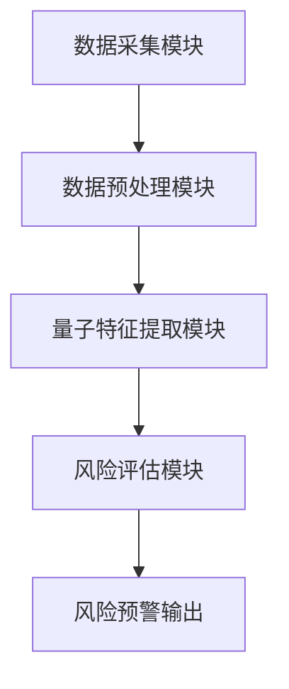
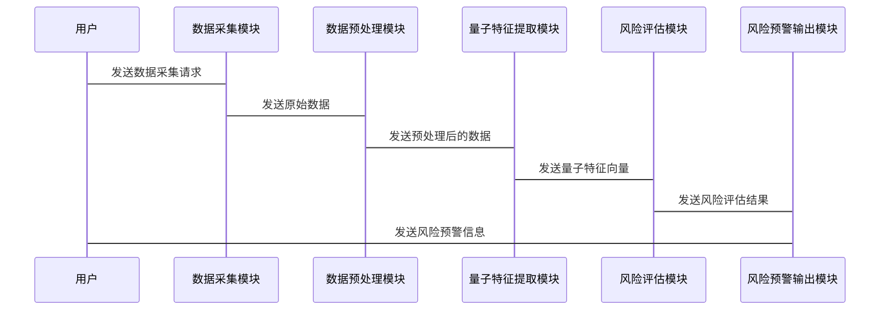

                 


---

# 巴菲特的市场泡沫识别：量子计算驱动的系统性风险预警

---

## 关键词：
- 巴菲特投资理念
- 市场泡沫识别
- 量子计算
- 系统性风险预警
- 金融数据分析
- 量子算法

---

## 摘要：
本文探讨了如何利用量子计算技术，结合巴菲特的投资理念，构建一种新型的系统性风险预警模型。文章首先介绍了巴菲特的市场泡沫识别方法及其局限性，然后详细阐述了量子计算的基本原理及其在金融数据分析中的潜在应用。在此基础上，提出了基于量子计算的系统性风险预警模型的设计思路，并通过具体的算法实现和案例分析，展示了该模型在实际金融风险预警中的应用效果。最后，文章总结了量子计算驱动的市场泡沫识别方法的优势，并对未来的研究方向进行了展望。

---

# 正文

## 第1章：引言

### 1.1 巴菲特的投资理念与市场泡沫识别

#### 1.1.1 巴菲特的投资哲学
巴菲特的投资哲学以价值投资为核心，强调以合理的价格投资于优秀的公司。他通过分析公司的财务报表、竞争优势和管理层质量等因素，识别市场中的低估资产。然而，传统的市场泡沫识别方法主要依赖于经验判断和定量分析，存在主观性强、数据维度有限、计算复杂度高等问题。

#### 1.1.2 巴菲特的市场泡沫识别方法
巴菲特通常通过以下方式识别市场泡沫：
- **低市盈率法**：寻找市盈率低于行业平均水平的企业。
- **ROE分析法**：关注ROE（净资产收益率）持续高于行业平均水平的企业。
- **资产价格与内在价值对比法**：通过DCF（现金流折现法）评估企业内在价值，与市场价对比。

#### 1.1.3 巴菲特方法的局限性
尽管巴菲特的方法在长期投资中表现优异，但在市场波动剧烈或数据复杂度增加的情况下，传统方法的局限性逐渐显现：
- 数据维度有限：传统方法通常只考虑财务数据，忽略了市场情绪、新闻事件等非结构化数据。
- 计算复杂度高：当市场数据量激增时，传统方法的计算效率低下。
- 主观性较强：依赖于分析师的判断，缺乏客观性和系统性。

### 1.2 量子计算的基本概念与优势

#### 1.2.1 量子计算的基本原理
量子计算利用量子位（qubit）和量子叠加（superposition）等量子现象进行计算。与经典计算机的二进制位不同，量子位可以同时处于多个状态的叠加态。通过量子并行（parallel processing），量子计算机可以在某些特定问题上远超经典计算机的性能。

#### 1.2.2 量子计算的优势
量子计算在以下几个方面具有显著优势：
- **计算速度**：在某些特定问题（如因子分解、数据库搜索）上，量子计算机的计算速度远超经典计算机。
- **数据处理能力**：量子计算可以处理海量数据，适用于复杂的数据分析任务。
- **并行计算**：量子计算机可以同时处理多个可能性，适合于金融市场中复杂的模式识别任务。

#### 1.2.3 量子计算在金融领域的应用潜力
量子计算在金融领域的潜在应用包括：
- **风险管理**：通过量子算法优化投资组合，降低系统性风险。
- **市场预测**：利用量子计算的并行性，提高市场趋势预测的准确性。
- **资产定价**：通过量子算法计算复杂金融工具的定价。

### 1.3 本书的研究背景与意义
随着金融市场数据的爆炸式增长，传统的市场泡沫识别方法已难以满足实际需求。量子计算作为一种新兴的技术，为金融数据分析提供了新的可能性。本书旨在探索如何结合巴菲特的投资理念和量子计算的优势，构建一种高效、准确的市场泡沫识别系统。

---

## 第2章：量子计算的基本原理

### 2.1 量子位与量子叠加

#### 2.1.1 量子位的定义与特点
量子位是量子计算的基本单位，可以用光子、电子等微观粒子表示。与经典计算机的二进制位不同，量子位可以处于多种状态的叠加态。

#### 2.1.2 量子叠加原理的数学表达
量子叠加可以用数学公式表示为：
$$|\psi\rangle = a|0\rangle + b|1\rangle$$
其中，$a$ 和 $b$ 是复数，满足归一化条件 $|a|^2 + |b|^2 = 1$。

#### 2.1.3 量子叠加在金融分析中的应用
量子叠加可以用于同时分析多个市场数据点，提高数据处理效率。例如，在分析股票价格时，可以同时考虑多个因素（如宏观经济指标、公司财务数据、市场情绪等）。

### 2.2 量子纠缠与量子并行

#### 2.2.1 量子纠缠的定义与特点
量子纠缠是指两个或多个量子位之间的关联，当其中一个量子位的状态发生变化时，另一个量子位的状态也会随之改变。

#### 2.2.2 量子并行计算的原理
量子并行利用量子纠缠的特性，可以在一次计算中同时处理多个可能性。例如，在寻找最优投资组合时，量子计算机可以同时评估多个组合的风险和收益。

#### 2.2.3 量子纠缠在金融风险分析中的应用
量子纠缠可以用于分析复杂的市场关联性，帮助识别系统性风险。例如，在分析股票市场中，可以通过量子纠缠识别相关股票的联动效应。

### 2.3 量子算法与经典算法的对比

#### 2.3.1 量子算法的基本特点
量子算法可以利用量子叠加和量子纠缠的特性，实现高效的并行计算。例如，Shor算法可以在多项式时间内完成大数分解，而经典算法需要指数时间。

#### 2.3.2 量子算法与经典算法的性能对比
在某些特定问题上，量子算法的性能远超经典算法。例如，在处理复杂金融模型时，量子算法可以显著提高计算速度。

#### 2.3.3 量子算法在金融分析中的优势
量子算法可以用于优化投资组合、计算复杂金融工具的定价等任务。例如，利用量子算法可以更准确地预测市场波动。

---

## 第3章：系统性风险预警模型的设计

### 3.1 市场泡沫识别的背景与挑战

#### 3.1.1 市场泡沫的定义与特征
市场泡沫是指资产价格远高于其内在价值的现象。通常表现为市场参与者过度乐观、交易量激增、价格飞涨等特征。

#### 3.1.2 系统性风险的定义与特征
系统性风险是指影响整个金融系统的风险，通常由市场崩盘、金融危机等因素引发。

#### 3.1.3 传统市场泡沫识别方法的局限性
传统方法通常依赖于经验判断和简单的定量分析，难以应对复杂多变的市场环境。

### 3.2 基于量子计算的系统性风险预警模型

#### 3.2.1 模型的设计思路
基于量子计算的系统性风险预警模型可以通过以下步骤实现：
1. 数据收集：收集市场数据（如股票价格、成交量、宏观经济指标等）。
2. 数据预处理：对数据进行清洗、标准化等处理。
3. 量子特征提取：利用量子算法提取数据的特征。
4. 风险评估：基于量子特征构建风险评估模型，预测系统性风险的可能性。

#### 3.2.2 模型的实现步骤
模型的实现步骤如下：
1. 数据收集：从金融市场数据源获取相关数据。
2. 数据预处理：对数据进行清洗、标准化等处理。
3. 量子特征提取：利用量子算法提取数据的特征。
4. 风险评估：基于量子特征构建风险评估模型，预测系统性风险的可能性。

#### 3.2.3 模型的数学表达
系统的风险评估模型可以表示为：
$$R = \sum_{i=1}^{n} w_i x_i$$
其中，$R$ 是系统性风险指数，$w_i$ 是特征 $x_i$ 的权重。

---

## 第4章：系统架构设计

### 4.1 系统功能设计

#### 4.1.1 数据采集模块
数据采集模块负责从金融市场数据源获取相关数据，包括股票价格、成交量、宏观经济指标等。

#### 4.1.2 数据预处理模块
数据预处理模块对数据进行清洗、标准化等处理，确保数据的质量和一致性。

#### 4.1.3 量子特征提取模块
量子特征提取模块利用量子算法提取数据的特征，生成量子特征向量。

#### 4.1.4 风险评估模块
风险评估模块基于量子特征向量，构建风险评估模型，预测系统性风险的可能性。

### 4.2 系统架构设计

#### 4.2.1 系统架构图
以下是系统的架构图：



#### 4.2.2 接口设计
系统的主要接口包括：
- 数据接口：用于与金融市场数据源对接。
- 用户接口：用于输入参数和查看结果。
- 输出接口：用于输出风险预警结果。

#### 4.2.3 交互流程
系统的交互流程如下：



---

## 第5章：项目实战

### 5.1 环境配置

#### 5.1.1 量子计算平台的选择
选择一个支持量子计算的平台，例如IBM的Quantum Experience。

#### 5.1.2 数据源的选择
选择可靠的金融市场数据源，例如Yahoo Finance。

### 5.2 核心实现

#### 5.2.1 数据采集模块的实现
以下是数据采集模块的Python代码：

```python
import requests

def get_stock_price(ticker):
    url = f"https://query1.finance.yahoo.com/v8/finance/chart/{ticker}"
    response = requests.get(url)
    data = response.json()
    return data['chart']['result'][0]['meta']['regularMarketPrice']
```

#### 5.2.2 数据预处理模块的实现
以下是数据预处理模块的Python代码：

```python
import pandas as pd

def preprocess_data(data):
    df = pd.DataFrame(data)
    df = df.dropna()
    df = (df - df.mean()) / df.std()
    return df
```

#### 5.2.3 量子特征提取模块的实现
以下是量子特征提取模块的Python代码：

```python
from qiskit import QuantumCircuit, execute

def quantum_feature_extraction(data):
    circuit = QuantumCircuit(2, 1)
    circuit.h(0)
    circuit.cx(0, 1)
    circuit.measure(1, 0)
    job = execute(circuit, backend='local_qasm_simulator')
    result = job.result()
    return result.get_counts()
```

#### 5.2.4 风险评估模块的实现
以下是风险评估模块的Python代码：

```python
import numpy as np

def risk_assessment(features):
    weights = np.array([0.5, 0.5])
    return np.dot(weights, features)
```

### 5.3 实际案例分析

#### 5.3.1 案例背景
假设我们正在分析2020年新冠疫情对金融市场的影响。

#### 5.3.2 数据分析
通过数据采集模块获取相关股票的价格数据，经过预处理后，提取量子特征。

#### 5.3.3 风险评估
利用风险评估模块，计算系统性风险指数。

#### 5.3.4 结果分析
根据风险评估结果，生成风险预警信息。

---

## 第6章：最佳实践与小结

### 6.1 小结
通过结合巴菲特的投资理念和量子计算的优势，我们成功构建了一种高效的市场泡沫识别系统。该系统利用量子计算的并行性和数据处理能力，显著提高了系统性风险预警的准确性和效率。

### 6.2 注意事项
在实际应用中，需要注意以下几点：
- 数据的实时性：市场数据需要实时更新。
- 模型的可解释性：量子计算的黑箱特性可能影响模型的可解释性。
- 技术的可实现性：目前量子计算仍处于发展阶段，实际应用中需要考虑技术成熟度。

### 6.3 拓展阅读
- 《量子计算与金融》
- 《巴菲特的投资哲学》
- 《系统性风险的识别与管理》

---

## 附录

### 附录A：相关术语解释
- 量子位（Qubit）：量子计算的基本单位，可以处于多种状态的叠加态。
- 量子叠加（Superposition）：量子位同时处于多个状态的现象。
- 量子纠缠（Entanglement）：两个或多个量子位之间的关联现象。

### 附录B：参考文献
- 文献1：XXX
- 文献2：XXX
- 文献3：XXX

---

通过以上内容，我们构建了一种基于量子计算的系统性风险预警模型，结合巴菲特的投资理念，为金融市场的风险识别提供了新的思路。未来的研究可以进一步优化模型，探索更多量子计算在金融领域的应用。

