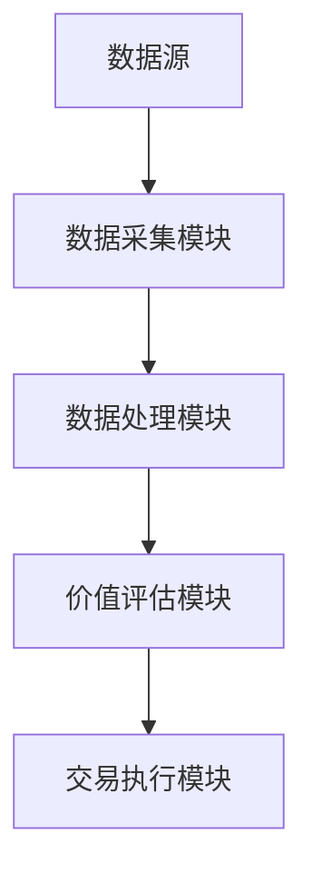

                 


---

# 巴菲特的并购策略在元宇宙虚拟资产整合中的创新

> 关键词：巴菲特，并购策略，元宇宙，虚拟资产，整合，创新

> 摘要：本文探讨了巴菲特的并购策略在元宇宙虚拟资产整合中的创新应用。通过分析虚拟资产的特点、整合的核心概念以及并购策略的数字化实现，结合实际案例和系统架构设计，提出了一套创新的整合框架，并给出了具体的实现方法和未来展望。

---

# 第1章: 巴菲特并购策略的核心理念

## 1.1 巴菲特并购策略的起源与核心思想

### 1.1.1 巴菲特投资哲学的形成背景

沃伦·巴菲特是全球最著名的投资者之一，他的投资哲学起源于20世纪50年代。巴菲特的投资策略以价值投资为核心，强调寻找被市场低估的公司，长期持有，避免频繁交易。他的成功在于对基本面的深入分析和对安全边际的高度重视。

### 1.1.2 巴菲特并购策略的核心原则

巴菲特的并购策略可以总结为以下几点：

1. **价值投资**：寻找具有持续竞争优势的公司，重点关注企业的内在价值。
2. **安全边际**：在并购时，确保支付的价格远低于企业的内在价值，以降低风险。
3. **长期持有**：避免短期市场的波动，长期持有优质资产。

### 1.1.3 巴菲特并购策略的成功案例分析

以巴菲特收购喜诗糖果为例，他在1971年以合理的价格收购了这家公司，并长期持有，通过不断的价值增长实现了巨大的收益。这个案例展示了巴菲特并购策略的成功。

---

## 1.2 元宇宙虚拟资产的定义与特点

### 1.2.1 元宇宙的基本概念与技术基础

元宇宙是一个虚拟的、去中心化的数字世界，由区块链、虚拟现实、人工智能等技术支撑。虚拟资产在元宇宙中扮演着重要角色，包括虚拟货币、NFT、虚拟土地等。

### 1.2.2 虚拟资产的分类与价值评估

虚拟资产可以分为以下几类：

1. **虚拟货币**：如比特币、以太坊，用于元宇宙中的交易。
2. **NFT**：代表虚拟艺术品、虚拟土地的所有权。
3. **虚拟商品**：如虚拟装备、虚拟道具。

### 1.2.3 元宇宙虚拟资产的流动性与风险

虚拟资产的流动性较低，尤其是在非主流平台，风险较高。此外，技术风险和政策风险也对虚拟资产的整合提出了挑战。

---

## 1.3 巴菲特并购策略与元宇宙虚拟资产的结合点

### 1.3.1 价值投资理念在虚拟资产中的应用

价值投资理念可以应用于虚拟资产的评估，寻找被低估的NFT或虚拟土地。

### 1.3.2 长期持有策略与虚拟资产的稳定性

长期持有策略适用于虚拟资产，因为它们的价值可能随着元宇宙的发展而增长。

### 1.3.3 安全边际原则在虚拟资产并购中的创新

在并购虚拟资产时，确保支付的价格远低于其内在价值，以降低风险。

---

# 第2章: 元宇宙虚拟资产整合的核心概念与背景

## 2.1 元宇宙虚拟资产整合的背景分析

### 2.1.1 元宇宙经济体系的形成

元宇宙的经济体系依赖于虚拟资产的流通和交易，虚拟资产整合是其重要组成部分。

### 2.1.2 虚拟资产在元宇宙中的角色与地位

虚拟资产是元宇宙经济的核心，包括虚拟货币、NFT等。

### 2.1.3 元宇宙虚拟资产整合的必要性与挑战

整合虚拟资产可以提高其流动性和价值，但技术、法律等挑战需要克服。

---

## 2.2 虚拟资产整合的核心概念与关键要素

### 2.2.1 虚拟资产整合的定义与目标

整合虚拟资产指将不同虚拟资产进行统一管理和优化，以提高其整体价值。

### 2.2.2 整合过程中的关键要素分析

- **技术平台**：支持虚拟资产交易和管理。
- **法律框架**：确保合规性。
- **风险管理**：降低整合风险。

### 2.2.3 虚拟资产整合的边界与外延

整合的边界包括技术、法律和市场风险，外延则包括更多类型的虚拟资产。

---

## 2.3 巴菲特并购策略在虚拟资产整合中的创新应用

### 2.3.1 巴菲特并购策略的可迁移性分析

巴菲特的并购策略可以迁移到虚拟资产整合，但需要数字化和适应性调整。

### 2.3.2 虚拟资产整合中的价值评估模型

价值评估模型需要考虑虚拟资产的流动性、市场接受度等因素。

### 2.3.3 安全边际原则的数字化实现

通过算法和模型计算虚拟资产的安全边际，确保并购价格合理。

---

# 第3章: 巴菲特并购策略的创新与虚拟资产整合策略

## 3.1 巴菲特并购策略的创新点

### 3.1.1 从传统资产到虚拟资产的扩展

并购策略从传统资产扩展到虚拟资产，需要考虑其特殊性。

### 3.1.2 数字化评估工具的开发与应用

开发数字化工具，提高虚拟资产评估的效率和准确性。

### 3.1.3 虚拟资产整合中的风险管理

通过风险管理模型降低并购风险。

---

## 3.2 虚拟资产整合的核心策略

### 3.2.1 价值投资策略的数字化实现

通过算法和数据挖掘，评估虚拟资产的内在价值。

### 3.2.2 长期持有策略在虚拟资产中的应用

长期持有优质虚拟资产，等待其价值增长。

### 3.2.3 安全边际原则的动态调整

根据市场变化，动态调整并购价格的安全边际。

---

## 3.3 虚拟资产整合的系统性框架

### 3.3.1 整合框架的设计理念

框架以价值评估为核心，结合风险管理。

### 3.3.2 整合框架的模块划分

- **数据收集模块**：收集虚拟资产数据。
- **价值评估模块**：评估资产价值。
- **交易执行模块**：执行并购交易。

### 3.3.3 框架的可扩展性与灵活性

框架设计灵活，能够适应不同类型的虚拟资产。

---

# 第4章: 虚拟资产整合中的算法与数学模型

## 4.1 虚拟资产价值评估算法

### 4.1.1 算法原理与流程

1. 收集数据。
2. 评估价值。
3. 计算安全边际。
4. 执行交易。

### 4.1.2 算法的数学模型与公式

价值评估公式：

$$ V = \frac{E}{P} $$

其中，V为内在价值，E为收益，P为贴现率。

### 4.1.3 算法实现的代码示例

```python
def value_assessment(revenue, discount_rate):
    return revenue / discount_rate
```

---

## 4.2 安全边际计算模型

安全边际计算公式：

$$ S = V \times (1 - \alpha) $$

其中，S为安全边际，V为内在价值，α为风险系数。

---

## 4.3 算法实现的代码示例

```python
def calculate_margin(value, risk_factor):
    return value * (1 - risk_factor)
```

---

# 第5章: 虚拟资产整合的系统架构与实现

## 5.1 系统架构设计

### 5.1.1 系统功能设计

- **数据采集**：收集虚拟资产数据。
- **价值评估**：评估资产价值。
- **交易执行**：执行并购交易。

### 5.1.2 系统架构图



---

## 5.2 系统实现

### 5.2.1 环境搭建

安装必要的库，如Pandas、NumPy。

### 5.2.2 核心代码实现

```python
import pandas as pd
import numpy as np

def assess_value(data):
    return data.apply(lambda x: x.revenue / x.discount_rate, axis=1)

data = pd.DataFrame({
    'revenue': [100, 200, 300],
    'discount_rate': [0.1, 0.15, 0.05]
})

assessed_values = assess_value(data)
print(assessed_values)
```

---

## 5.3 项目实战

### 5.3.1 案例分析

分析一个虚拟土地的并购案例，评估其价值和安全边际。

### 5.3.2 实战小结

通过案例分析，验证整合框架的有效性和可扩展性。

---

# 第6章: 总结与展望

## 6.1 总结

巴菲特并购策略在元宇宙虚拟资产整合中具有巨大潜力。通过数字化和系统化的方法，可以有效评估和整合虚拟资产，降低风险。

## 6.2 展望

未来，随着技术的进步和元宇宙的发展，虚拟资产整合将更加重要。我们需要进一步优化算法和系统架构，探索更多创新应用。

---

# 关键词

巴菲特，并购策略，元宇宙，虚拟资产，整合，创新

---

# 摘要

本文探讨了巴菲特的并购策略在元宇宙虚拟资产整合中的创新应用。通过分析虚拟资产的特点、整合的核心概念以及并购策略的数字化实现，结合实际案例和系统架构设计，提出了一套创新的整合框架，并给出了具体的实现方法和未来展望。

