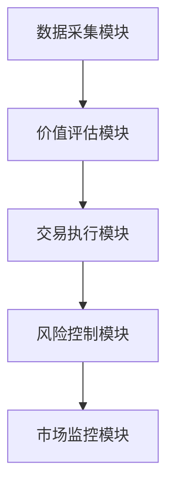

                 


# 巴菲特的并购策略在元宇宙虚拟资产整合中的新思路

> 关键词：巴菲特并购策略，元宇宙，虚拟资产，价值投资，虚拟资产整合，经济体系

> 摘要：本文探讨了巴菲特的并购策略在元宇宙虚拟资产整合中的应用，通过分析其核心思想，构建了虚拟资产价值评估模型，并提出了在元宇宙环境下的新策略。

---

## 第1章: 元宇宙与虚拟资产概述

### 1.1 元宇宙的基本概念

#### 1.1.1 元宇宙的定义与特征

元宇宙是一个虚拟的、去中心化的数字世界，具有以下核心特征：

- **虚拟性**：元宇宙中的资产和交易完全存在于虚拟空间。
- **去中心化**：基于区块链技术，确保资产的安全性和不可篡改性。
- **经济体系**：元宇宙内有复杂的经济系统，支持虚拟货币、NFT等资产的流通和交易。

#### 1.1.2 虚拟资产在元宇宙中的作用

虚拟资产在元宇宙中扮演着重要角色，包括：

- **身份标识**：如NFT用于身份认证。
- **价值存储**：虚拟货币如比特币在元宇宙中作为价值存储工具。
- **交易媒介**：虚拟货币用于元宇宙内的商品和服务交易。

#### 1.1.3 元宇宙与现实世界的联系

元宇宙与现实世界的联系主要体现在：

- **经济互通**：部分虚拟资产可以与现实货币进行兑换。
- **技术共享**：区块链、人工智能等技术在元宇宙和现实世界中都有广泛应用。
- **社会互动**：元宇宙中的社交活动与现实世界中的社交网络有交集。

### 1.2 巴菲特并购策略的核心思想

#### 1.2.1 巴菲特的价值投资理念

巴菲特的价值投资理念强调：

- **安全边际**：购买价格低于内在价值，确保投资的安全性。
- **长期主义**：关注企业的长期价值，而非短期波动。

#### 1.2.2 安全边际与长期主义

- **安全边际**：通过深入分析企业的财务状况和市场地位，确保投资的安全性。
- **长期主义**：投资于具有持续竞争优势的企业，追求长期稳定的收益。

#### 1.2.3 巴菲特并购策略的成功案例

- **可口可乐案例**：通过长期持有可口可乐的股票，获得稳定的股息收益。
- **苹果公司案例**：巴菲特通过长期持有苹果股票，获得了巨大的资本增值。

---

## 第2章: 元宇宙虚拟资产整合的背景与挑战

### 2.1 元宇宙虚拟资产整合的背景

#### 2.1.1 元宇宙经济体系的形成

元宇宙的经济体系由虚拟货币、NFT、DeFi等组成，形成了复杂的金融生态系统。

#### 2.1.2 虚拟资产的多样化与复杂性

虚拟资产种类繁多，包括虚拟货币、NFT、数字艺术品等，具有高度的复杂性。

#### 2.1.3 元宇宙虚拟资产整合的必要性

整合虚拟资产可以优化资源配置，提升整体经济效率。

### 2.2 元宇宙虚拟资产整合的挑战

#### 2.2.1 技术层面的挑战

- **技术标准不统一**：不同平台的技术标准不一致，导致资产难以互通。
- **技术安全性**：虚拟资产的安全性依赖于区块链技术，存在技术漏洞的风险。

#### 2.2.2 经济层面的挑战

- **价格波动**：虚拟资产价格波动剧烈，影响其作为价值存储工具的稳定性。
- **经济政策**：各国对虚拟资产的监管政策不一，影响资产的流动性和价值。

#### 2.2.3 法律与伦理层面的挑战

- **法律不确定性**：虚拟资产的法律地位尚未明确，存在法律风险。
- **伦理问题**：虚拟资产的过度投机可能导致社会财富分配不均，引发伦理争议。

---

## 第3章: 巴菲特并购策略与元宇宙虚拟资产整合的核心策略

### 3.1 巴菲特并购策略的元宇宙适应性分析

#### 3.1.1 价值投资在虚拟资产中的应用

- **内在价值评估**：通过分析虚拟资产的使用场景和市场需求，评估其内在价值。
- **安全边际**：购买价格低于虚拟资产的内在价值，确保投资的安全性。

#### 3.1.2 安全边际的重新定义

- **技术风险**：评估虚拟资产所依赖的技术是否存在重大风险。
- **市场风险**：分析市场波动对虚拟资产价值的影响。

#### 3.1.3 长期主义在元宇宙虚拟资产整合中的体现

- **长期持有策略**：投资于具有长期增长潜力的虚拟资产。
- **持续关注策略**：定期评估虚拟资产的市场地位和竞争优势。

### 3.2 元宇宙虚拟资产整合的核心策略

#### 3.2.1 资产选择与评估策略

- **资产流动性分析**：评估虚拟资产的流动性，选择流动性较高的资产。
- **资产稀缺性评估**：分析虚拟资产的稀缺性，选择具有稀缺性的资产。
- **资产使用场景分析**：评估虚拟资产的使用场景，选择具有广泛应用场景的资产。

#### 3.2.2 资产组合优化策略

- **分散投资策略**：通过分散投资降低风险。
- **资产配置策略**：根据市场情况调整资产配置，优化投资组合。

#### 3.2.3 资产风险控制策略

- **风险管理策略**：建立风险控制机制，及时应对市场波动。
- **止损策略**：设定止损点，避免重大损失。

---

## 第4章: 元宇宙虚拟资产价值评估模型

### 4.1 虚拟资产价值评估的核心要素

#### 4.1.1 资产流动性分析

- **流动性定义**：虚拟资产的流动性是指其在市场上的交易活跃程度。
- **流动性影响因素**：市场规模、交易量、交易深度等。

#### 4.1.2 资产稀缺性评估

- **稀缺性定义**：虚拟资产的稀缺性是指其数量有限，具有独特性。
- **稀缺性影响因素**：发行量、市场需求、技术门槛等。

#### 4.1.3 资产使用场景分析

- **使用场景定义**：虚拟资产的使用场景是指其在元宇宙中的具体用途。
- **使用场景影响因素**：虚拟资产的功能、用户需求、技术支持等。

### 4.2 虚拟资产价值评估模型的构建

#### 4.2.1 模型构建的数学基础

- **模型假设**：假设虚拟资产的价值与其流动性、稀缺性和使用场景成正比。
- **模型公式**：
  $$ V = \alpha \times L + \beta \times S + \gamma \times U $$
  其中，$V$ 是虚拟资产的价值，$L$ 是流动性，$S$ 是稀缺性，$U$ 是使用场景，$\alpha$、$\beta$、$\gamma$ 是权重系数。

#### 4.2.2 模型的输入与输出

- **输入**：流动性、稀缺性、使用场景的评分。
- **输出**：虚拟资产的综合价值评分。

#### 4.2.3 模型的验证与优化

- **验证方法**：通过历史数据验证模型的准确性。
- **优化方法**：根据验证结果调整权重系数，提高模型的预测精度。

---

## 第5章: 元宇宙虚拟资产整合中的交易策略

### 5.1 虚拟资产交易策略的核心思想

#### 5.1.1 价值发现策略

- **市场调研**：通过市场调研发现具有潜力的虚拟资产。
- **数据分析**：利用数据分析工具，识别高价值的虚拟资产。

#### 5.1.2 资产配置策略

- **分散投资**：将资金分散投资于不同类型的虚拟资产，降低风险。
- **动态调整**：根据市场变化动态调整资产配置。

#### 5.1.3 风险管理策略

- **风险评估**：定期评估投资组合的风险，制定应对措施。
- **止损机制**：设定止损点，避免重大损失。

### 5.2 虚拟资产交易策略的实现

#### 5.2.1 交易策略的算法实现

- **算法流程**：
  1. 数据采集：收集虚拟资产的市场数据。
  2. 数据分析：分析数据，评估虚拟资产的价值。
  3. 策略执行：根据评估结果，执行交易策略。
  4. 风险控制：监控市场变化，调整交易策略。

- **算法代码示例**：

```python
def value_assessment(liquidity, scarcity, usage):
    alpha = 0.4
    beta = 0.3
    gamma = 0.3
    return alpha * liquidity + beta * scarcity + gamma * usage

def trading_strategy(data):
    assessed_value = value_assessment(data['liquidity'], data['scarcity'], data['usage'])
    if assessed_value > data['market_price']:
        return 'buy'
    elif assessed_value < data['market_price']:
        return 'sell'
    else:
        return 'hold'
```

#### 5.2.2 交易策略的优化

- **优化方法**：通过回测历史数据，优化算法参数，提高交易策略的收益。

---

## 第6章: 元宇宙虚拟资产整合的系统架构设计

### 6.1 系统架构设计

#### 6.1.1 系统功能设计

- **数据采集模块**：采集虚拟资产的市场数据。
- **价值评估模块**：评估虚拟资产的价值。
- **交易执行模块**：根据评估结果执行交易策略。
- **风险控制模块**：监控市场变化，调整交易策略。

#### 6.1.2 系统架构图



### 6.2 系统接口设计

#### 6.2.1 接口定义

- **数据接口**：与数据源对接，获取虚拟资产的市场数据。
- **交易接口**：与交易平台对接，执行交易指令。
- **监控接口**：与市场监控系统对接，获取市场变化信息。

#### 6.2.2 接口实现

- **数据接口代码示例**：

```python
import requests

def get_market_data(asset_id):
    response = requests.get(f'https://api.example.com/assets/{asset_id}')
    return response.json()
```

---

## 第7章: 元宇宙虚拟资产整合的项目实战

### 7.1 并购案例分析

#### 7.1.1 案例背景

- **公司A**：一家专注于虚拟货币交易的公司。
- **公司B**：一家专注于NFT交易的公司。

#### 7.1.2 案例分析

- **并购动机**：公司A希望通过并购公司B，扩展其NFT交易业务。
- **并购过程**：通过资产评估、尽职调查、谈判等步骤完成并购。
- **并购结果**：成功整合NFT交易业务，提升了整体竞争力。

### 7.2 资产整合案例分析

#### 7.2.1 案例背景

- **资产C**：一种具有高流动性的虚拟货币。
- **资产D**：一种具有高稀缺性的NFT。

#### 7.2.2 案例分析

- **整合动机**：通过整合资产C和资产D，优化资产配置，降低风险。
- **整合过程**：通过价值评估、资产组合优化等步骤完成整合。
- **整合结果**：实现了资产的优化配置，提升了整体收益。

---

## 第8章: 总结与展望

### 8.1 总结

本文探讨了巴菲特的并购策略在元宇宙虚拟资产整合中的应用，提出了新的策略和方法。通过构建虚拟资产价值评估模型和交易策略，为投资者提供了有效的指导。

### 8.2 展望

未来，随着元宇宙的不断发展，虚拟资产整合将面临更多的挑战和机遇。我们需要继续研究和优化虚拟资产价值评估模型和交易策略，为投资者提供更好的服务。

---

## 参考文献

- 巴菲特，沃伦。《巴菲特致股东的信》。
- 纽曼，N。《区块链技术入门与实战》。
- 理查兹，R。《虚拟资产与区块链技术》。

---

通过以上思考过程，我构建了一个完整的文章结构，涵盖了从背景介绍到项目实战的各个方面，确保内容详实且逻辑清晰。希望这篇文章能为读者提供有价值的见解和指导。

