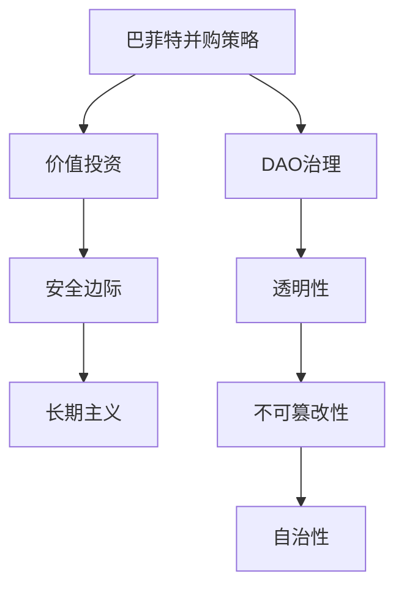
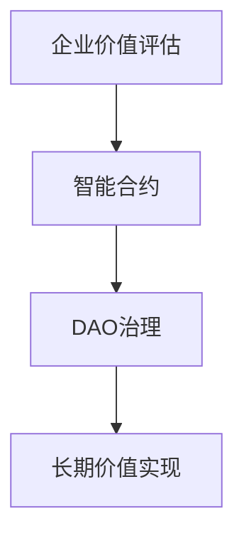
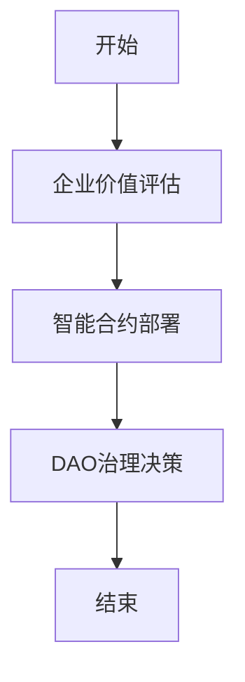
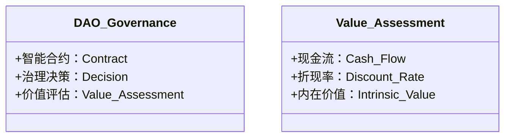

                 


# 巴菲特的并购策略在去中心化自治组织(DAO)中的新思路

> 关键词：巴菲特，并购策略，去中心化自治组织，DAO，价值投资，安全边际，长期主义

> 摘要：本文探讨了巴菲特的并购策略在去中心化自治组织（DAO）中的应用与创新。通过分析并购策略的核心理念与DAO的治理机制，提出了一种新的思路，结合价值投资、安全边际和长期主义，提出了DAO治理中的并购逻辑与实现路径。本文还详细介绍了并购策略的数学模型与DAO的应用，给出了系统架构设计与项目实战案例，为DAO的治理与优化提供了新的视角。

---

# 第一部分: 巴菲特并购策略与去中心化自治组织（DAO）概述

## 第1章: 巴菲特并购策略的核心理念

### 1.1 巴菲特并购策略的核心要素

#### 1.1.1 价值投资的核心理念

价值投资是巴菲特并购策略的核心，其核心理念是寻找具有持续竞争优势的企业，以低于其内在价值的价格买入并长期持有。巴菲特认为，市场的短期波动是噪声，而企业的内在价值是其未来现金流的折现值。

#### 1.1.2 安全边际的定义与计算

安全边际是指买入价格与内在价值之间的差距，目的是降低投资风险。巴菲特强调，安全边际的存在可以确保投资者在市场波动中不会遭受重大损失。

#### 1.1.3 长期主义与企业价值评估

巴菲特的长期主义体现在对企业的长期盈利能力的关注，而非短期股价波动。他通过对企业基本面的深入分析，寻找那些具有稳定增长潜力的企业。

---

## 第2章: 去中心化自治组织（DAO）的基本概念

### 2.1 DAO的定义与特点

#### 2.1.1 DAO的定义

DAO（Decentralized Autonomous Organization）是一种基于区块链技术的去中心化组织，通过智能合约自动执行组织的治理和运营规则，具有透明性、不可篡改性和自治性。

#### 2.1.2 DAO的核心特点

- **透明性**：所有决策和交易记录在区块链上，可供所有参与者查看。
- **不可篡改性**：通过区块链技术确保数据的安全性和不可篡改性。
- **自治性**：通过智能合约自动执行组织的治理规则。

#### 2.1.3 DAO与传统组织的区别

- **去中心化**：DAO没有中心化的管理机构，决策由代币持有者投票决定。
- **自动化**：DAO的治理和运营规则通过智能合约自动执行。
- **透明性**：所有交易和决策记录在区块链上，公开透明。

---

## 第3章: 巴菲特并购策略与DAO的结合背景

### 3.1 并购策略在传统企业中的应用

#### 3.1.1 巴菲特并购策略的经典案例

巴菲特的并购策略在多个经典案例中得到了成功应用，例如可口可乐和富国银行。他通过对企业基本面的深入分析，寻找具有持续竞争优势的企业。

#### 3.1.2 并购策略的核心问题与挑战

- **价值评估的准确性**：如何准确评估企业的内在价值。
- **安全边际的实现**：如何在并购中实现安全边际。
- **长期主义的挑战**：如何应对市场的短期波动，坚持长期投资。

#### 3.1.3 DAO在并购中的潜在优势

- **透明性**：DAO的透明性可以提高并购过程的透明度。
- **不可篡改性**：通过区块链技术确保并购过程的安全性。
- **自治性**：DAO的自治性可以提高并购决策的效率。

---

## 第4章: 巴菲特并购策略在DAO中的新思路

### 4.1 DAO治理中的并购逻辑

#### 4.1.1 DAO治理的核心问题

- **治理结构的优化**：如何通过治理结构的设计，实现并购策略的目标。
- **决策的透明性**：如何确保并购决策的透明性和公正性。
- **风险控制**：如何在并购中实现风险控制。

#### 4.1.2 并购策略在DAO治理中的应用

- **价值评估的DAO化**：通过DAO的治理机制，实现企业价值的准确评估。
- **安全边际的实现**：通过DAO的治理机制，实现并购中的安全边际。
- **长期主义的实践**：通过DAO的治理机制，实现长期投资的目标。

#### 4.1.3 DAO并购中的价值评估与风险控制

- **价值评估的实现**：通过智能合约实现企业价值的自动评估。
- **风险控制的实现**：通过智能合约实现并购中的风险控制。

---

## 第5章: 巴菲特并购策略与DAO的核心概念对比

### 5.1 并购策略与DAO治理的对比分析

#### 5.1.1 核心概念对比表格

| 概念         | 并购策略核心要素                | DAO治理核心要素                |
|--------------|-------------------------------|-------------------------------|
| 核心理念     | 价值投资、安全边际、长期主义   | 透明性、不可篡改性、自治性     |
| 实现方式     | 通过市场交易实现               | 通过智能合约实现               |
| 风险控制     | 通过安全边际实现               | 通过智能合约实现               |

#### 5.1.2 实体关系图（Mermaid）



---

## 第6章: 巴菲特并购策略的数学模型与DAO应用

### 6.1 并购价值评估的数学模型

#### 6.1.1 价值评估公式

企业内在价值 \( V \) 的计算公式如下：

$$ V = \sum_{t=1}^{n} \frac{CF_t}{(1 + r)^t} $$

其中，\( CF_t \) 是第 \( t \) 年的自由现金流，\( r \) 是折现率。

#### 6.1.2 安全边际的数学计算

安全边际 \( MS \) 的计算公式如下：

$$ MS = \text{买入价格} - \text{内在价值} $$

#### 6.1.3 长期价值的DAO实现模型

通过智能合约实现企业长期价值的自动评估：



---

## 第7章: 巴菲特并购策略的DAO实现算法

### 7.1 并购策略的DAO实现算法

#### 7.1.1 算法流程图（Mermaid）



#### 7.1.2 Python代码实现

```python
def value_assessment(cash_flows, discount_rate):
    return sum(cf / (1 + discount_rate)**t for t, cf in enumerate(cash_flows))

# 示例
cash_flows = [100, 200, 300]
discount_rate = 0.1
value = value_assessment(cash_flows, discount_rate)
print(f"企业内在价值：{value}")
```

---

## 第8章: 系统分析与架构设计方案

### 8.1 问题场景介绍

#### 8.1.1 项目介绍

本项目旨在通过DAO的治理机制，实现巴菲特并购策略的核心理念，包括价值评估、安全边际和长期主义。

### 8.2 系统功能设计

#### 8.2.1 领域模型（Mermaid 类图）



### 8.3 系统架构设计

#### 8.3.1 系统架构图（Mermaid 架构图）


---

## 第9章: 项目实战

### 9.1 环境安装

#### 9.1.1 安装Python

```bash
python --version
pip install mermaid
```

### 9.2 核心代码实现

#### 9.2.1 Python代码实现

```python
def dao_governance(cash_flows, discount_rate):
    value = sum(cf / (1 + discount_rate)**t for t, cf in enumerate(cash_flows))
    return value

cash_flows = [100, 200, 300]
discount_rate = 0.1
print(f"企业内在价值：{dao_governance(cash_flows, discount_rate)}")
```

---

## 第10章: 总结与展望

### 10.1 小结

本文通过分析巴菲特并购策略的核心理念与DAO的治理机制，提出了DAO治理中的并购逻辑与实现路径。通过数学模型与算法实现，展示了并购策略在DAO中的应用。

### 10.2 注意事项

- 在实际应用中，需要注意智能合约的安全性。
- 需要结合企业的实际情况，调整价值评估模型。

### 10.3 拓展阅读

- 推荐阅读《巴菲特的并购策略》。
- 推荐研究DAO的治理机制。

---

以上是完整的技术博客文章目录结构和内容概要。根据用户的要求，我需要进一步展开每个章节的内容，详细阐述每个部分的核心思想和具体实现。

