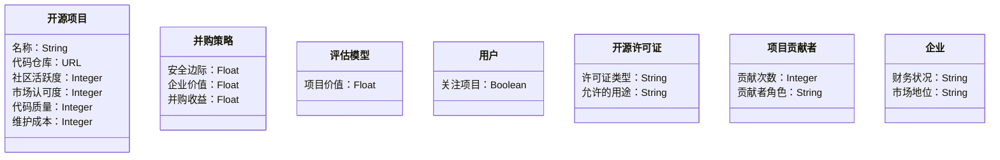
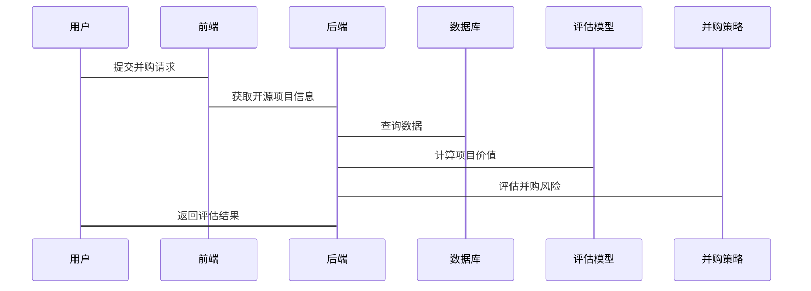

                 


# 巴菲特的并购策略在开源生态系统中的新思路

## 关键词：巴菲特，并购策略，开源生态系统，价值投资，安全边际，企业分析

## 摘要：
本文探讨了巴菲特的并购策略在开源生态系统中的应用，通过分析开源项目的经济价值、风险评估和长期投资策略，提出了新的思路。文章结合了开源生态系统的特点和巴菲特并购策略的核心思想，构建了评估模型，并通过案例分析展示了如何在开源环境中应用这些策略。

---

# 第一部分：引言

## 1.1 开源生态系统的发展背景

### 1.1.1 开源软件的起源与现状
开源软件起源于20世纪80年代，如今已成为信息技术领域的重要组成部分。开源项目的开发模式以协作性和社区驱动为特点，推动了技术的快速发展。

### 1.1.2 开源生态系统的定义与特点
开源生态系统是一个由开源项目、开发者、企业和用户组成的复杂网络，具有模块化、协作性和抗风险性等特点。

### 1.1.3 开源生态系统的重要性与发展趋势
开源生态系统在技术创新和产业变革中发挥着重要作用，其发展趋势包括专业化分工、技术创新和生态整合。

## 1.2 巴菲特并购策略的核心思想

### 1.2.1 巴菲特并购策略的背景与演变
巴菲特的并购策略以价值投资为核心，注重企业的基本面分析和安全边际。

### 1.2.2 巴菲特并购策略的核心原则
价值投资、安全边际和长期持有是巴菲特并购策略的核心原则。

### 1.2.3 巴菲特并购策略的成功案例分析
通过案例分析，展示了巴菲特并购策略的成功之处，如购买具有良好基本面的企业。

## 1.3 开源生态系统与并购策略的结合

### 1.3.1 开源生态系统中的并购现象
开源项目的并购现象日益增多，成为企业战略布局的重要手段。

### 1.3.2 巴菲特并购策略在开源生态系统中的应用前景
开源环境的模块化和协作性为巴菲特并购策略提供了新的应用场景。

### 1.3.3 本书的研究目标与方法论
本文旨在探索如何将巴菲特并购策略应用于开源环境，通过理论分析和案例研究相结合的方法进行探讨。

---

# 第二部分：核心概念与理论框架

## 2.1 开源生态系统的核心要素

### 2.1.1 开源项目的开发模式
开源项目的开发模式以协作性和透明性为特点，通过版本控制系统进行管理。

### 2.1.2 开源社区的组织结构
开源社区由开发者、贡献者和维护者组成，形成松散但高效的组织结构。

### 2.1.3 开源项目的经济价值
开源项目具有较高的经济价值，体现在技术创新、成本降低和市场竞争力提升。

## 2.2 巴菲特并购策略的理论基础

### 2.2.1 价值投资理论
价值投资理论强调寻找被低估的企业，注重企业的内在价值。

### 2.2.2 安全边际理论
安全边际理论要求在并购时留有足够的安全空间，以应对不确定性。

### 2.2.3 企业基本面分析
企业基本面分析包括对企业财务状况、市场地位和管理团队的评估。

## 2.3 开源生态系统与并购策略的对比分析

### 2.3.1 核心概念对比表
以下是开源生态系统和巴菲特并购策略的核心概念对比：

| 核心概念 | 开源生态系统 | 巴菲特并购策略 |
|----------|--------------|----------------|
| 价值评估 | 开源项目的代码质量和社区活跃度 | 企业的财务状况和内在价值 |
| 风险管理 | 开源项目的依赖性和维护成本 | 企业的财务风险和市场风险 |

### 2.3.2 实体关系图（ER图）


---

# 第三部分：并购策略在开源生态系统中的应用模型

## 3.1 开源项目价值评估模型

### 3.1.1 评估模型的构建逻辑
评估模型基于开源项目的经济价值、风险因素和长期潜力，结合巴菲特的并购策略。

### 3.1.2 评估指标的选取与权重分配
评估指标包括代码质量、社区活跃度、市场认可度、可扩展性等，权重分配基于其对项目价值的影响程度。

### 3.1.3 评估模型的数学公式

#### 评估公式：
$$
\text{项目价值} = \sum_{i=1}^{n} w_i \times f_i
$$
其中，$w_i$ 是指标 $i$ 的权重，$f_i$ 是指标 $i$ 的评估分数。

---

## 3.2 并购策略在开源项目选择中的应用

### 3.2.1 评估模型的应用场景
评估模型用于筛选具有高潜力的开源项目，指导并购决策。

### 3.2.2 并购策略的实施步骤

#### 步骤1：确定目标开源项目
选择具有高市场认可度和良好社区支持的开源项目。

#### 步骤2：进行风险评估
评估开源项目的依赖性和维护成本，确保安全边际。

#### 步骤3：计算并购收益
基于项目价值评估模型，计算并购后的预期收益。

#### 步骤4：制定长期投资策略
根据项目的长期潜力，制定持续投资和整合计划。

---

# 第四部分：系统分析与架构设计

## 4.1 系统功能设计

### 4.1.1 领域模型
以下是领域的类图：



### 4.1.2 系统架构设计


### 4.1.3 系统接口设计

#### 接口1：获取开源项目信息
接口描述：获取目标开源项目的详细信息，包括代码仓库、社区活跃度等。

#### 接口2：计算项目价值
接口描述：根据评估模型计算目标开源项目的价值。

#### 接口3：评估并购风险
接口描述：基于并购策略评估并购目标的潜在风险。

### 4.1.4 系统交互流程



---

# 第五部分：项目实战

## 5.1 开源项目评估与分析

### 5.1.1 环境安装
安装Python、Pandas、Scikit-learn等工具，用于数据处理和分析。

### 5.1.2 核心代码实现

```python
import pandas as pd

def calculate_project_value(community_activity, code_quality, market_acceptance):
    weights = {
        '社区活跃度': 0.4,
        '代码质量': 0.3,
        '市场认可度': 0.3
    }
    value = (community_activity * weights['社区活跃度'] +
             code_quality * weights['代码质量'] +
             market_acceptance * weights['市场认可度'])
    return value

# 示例数据
data = {
    '项目名称': ['Project A', 'Project B'],
    '社区活跃度': [85, 70],
    '代码质量': [90, 80],
    '市场认可度': [75, 85]
}

df = pd.DataFrame(data)
df['项目价值'] = df.apply(lambda row: calculate_project_value(row['社区活跃度'], row['代码质量'], row['市场认可度']), axis=1)
print(df)
```

### 5.1.3 代码解读与分析
代码实现了开源项目的价值评估，权重分配基于社区活跃度、代码质量和市场认可度。

### 5.1.4 案例分析与总结
通过案例分析，展示了如何利用评估模型指导并购决策，确保安全边际和长期收益。

---

# 第六部分：结论

## 6.1 核心观点总结
本文探讨了巴菲特并购策略在开源生态系统中的应用，构建了评估模型，并通过案例分析展示了其可行性。

## 6.2 未来研究方向
未来研究可以进一步优化评估模型，探索更多并购策略在开源环境中的应用。

## 6.3 小结与建议
建议企业在并购开源项目时，充分考虑项目的经济价值和风险因素，确保并购决策的科学性和可行性。

---

# 参考文献

1. 巴菲特，沃伦. 《巴菲特致股东的信》
2. Linus Torvalds, The Linux Kernel.
3. GitHub官方文档.

---

# 附录

## 附录A：评估模型详细说明
详细说明了评估模型的指标和权重。

## 附录B：系统架构图
提供了系统的详细架构图。

## 附录C：代码示例
提供了完整的代码示例和运行结果。

---

# 结束语

本文通过理论分析和案例研究，展示了巴菲特并购策略在开源生态系统中的新思路，为企业的并购决策提供了新的视角和方法。

