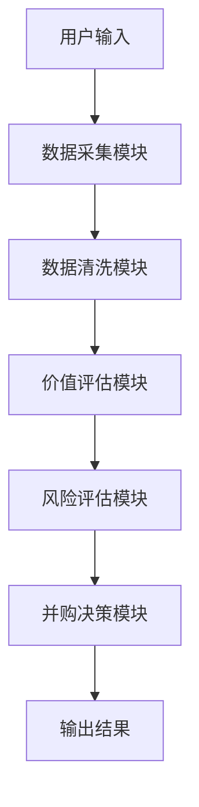
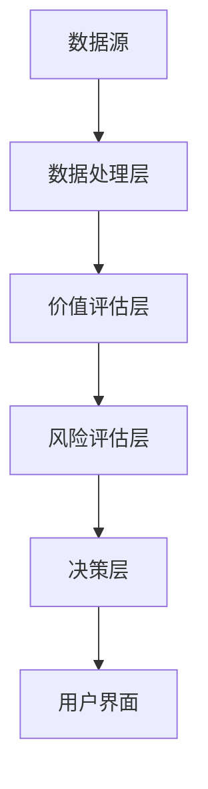

                 


# 巴菲特的并购策略在科技独角兽中的新思路

## 关键词：
巴菲特、并购策略、科技独角兽、投资逻辑、风险控制、价值评估

## 摘要：
本文探讨了巴菲特的并购策略在科技独角兽中的应用，分析了科技行业的并购趋势，并提出了在科技领域应用巴菲特策略的创新点。结合数学模型和系统架构，本文详细讲解了如何在科技独角兽中实施巴菲特的并购策略，包括企业价值评估、风险控制和收益预测等关键环节。通过实际案例分析和系统设计，本文展示了如何利用算法和系统架构将巴菲特的投资理念与科技独角兽的特点相结合，为科技投资提供了新的思路。

---

# 第一部分：巴菲特并购策略的背景与核心理念

## 第1章：巴菲特并购策略概述

### 1.1 巴菲特并购策略的核心理念

#### 1.1.1 巴菲特的投资哲学
巴菲特的价值投资理念强调长期稳健的回报，注重企业的基本面和管理团队的稳定性。他的并购策略基于对企业内在价值的评估，寻找具有持续盈利能力且估值合理的标的。巴菲特认为，投资的本质是寻找那些能够持续创造价值的企业，并通过长期持有实现收益。

#### 1.1.2 巴菲特并购策略的特点
- **注重基本面分析**：巴菲特在并购前会对目标企业的财务状况、盈利能力、管理层能力等进行全面评估。
- **低估值策略**：他倾向于购买市场估值低于其内在价值的企业。
- **长期持有**：巴菲特的并购策略强调长期持有，避免频繁交易，以减少交易成本和市场波动的影响。

#### 1.1.3 巴菲特并购策略的适用性分析
巴菲特的并购策略在传统行业（如制造业、零售业）表现优异，但在科技行业面临一定的挑战。科技行业的高增长性和不确定性要求投资者具备更强的前瞻性和灵活性，而巴菲特的传统策略更注重稳定性和低风险。

---

### 1.2 科技独角兽的定义与特征

#### 1.2.1 科技独角兽的定义
科技独角兽是指成立时间较短、估值超过10亿美元且具有高成长潜力的科技公司。这类企业通常在某一领域具有创新性，能够快速扩大市场份额。

#### 1.2.2 科技独角兽的核心特征
- **高增长性**：科技独角兽通常具有快速扩张的潜力。
- **创新性**：这些企业往往掌握核心技术或商业模式创新。
- **高估值**：独角兽的估值通常远高于其当前的盈利能力。
- **高风险**：科技行业的竞争激烈，失败率较高。

#### 1.2.3 科技独角兽的市场价值
科技独角兽的市场价值不仅体现在财务指标上，还包括其技术壁垒、品牌影响力和管理团队的能力。这些因素使得科技独角兽成为并购市场的热门标的。

---

### 1.3 巴菲特并购策略在科技独角兽中的结合

#### 1.3.1 巴菲特并购策略在科技领域的应用
- **高增长性企业的识别**：巴菲特需要在科技领域找到那些具有持续增长潜力的企业。
- **创新性评估**：科技独角兽的核心竞争力在于技术创新，巴菲特需要评估这些创新是否具有长期价值。
- **风险管理**：科技行业的高风险要求巴菲特的并购策略更具灵活性和前瞻性。

#### 1.3.2 巴菲特并购策略的创新点
- **动态估值模型**：在科技领域，传统的静态估值方法可能不足以捕捉企业的高增长潜力，因此需要引入动态估值模型。
- **技术创新评估**：巴菲特需要更深入地评估科技企业的技术创新能力，包括技术壁垒、专利数量和研发团队的实力。
- **风险管理策略**：在高风险的科技领域，巴菲特需要通过分散投资、设定止损点等方式来控制风险。

---

# 第二部分：巴菲特并购策略的数学模型与算法原理

## 第2章：巴菲特并购策略的数学模型

### 2.1 企业价值评估模型

#### 2.1.1 巴菲特的企业价值模型
巴菲特的企业价值模型基于现金流折现法（DCF），公式如下：

$$
\text{企业价值} = \sum_{t=1}^{n} \frac{\text{现金流}_t}{(1 + r)^t}
$$

其中，$r$是折现率，$\text{现金流}_t$是第$t$年的现金流。

#### 2.1.2 科技独角兽的DCF模型
针对科技独角兽，DCF模型需要考虑其高增长性和高风险性。公式如下：

$$
\text{DCF} = \sum_{t=1}^{n} \frac{\text{现金流}_t}{(1 + r)^t}
$$

其中，$r$是科技行业的平均折现率。

#### 2.1.3 并购风险评估模型
并购风险评估模型基于概率论，公式如下：

$$
\text{风险值} = \sum_{i=1}^{m} p_i \times \text{损失}_i
$$

其中，$p_i$是第$i$种风险发生的概率，$\text{损失}_i$是对应的风险损失。

---

### 2.2 科技独角兽的估值方法

#### 2.2.1 科技独角兽的DCF模型
针对科技独角兽的DCF模型需要考虑其高增长性和高风险性：

$$
\text{DCF} = \sum_{t=1}^{n} \frac{\text{现金流}_t}{(1 + r)^t}
$$

其中，$r$是科技行业的平均折现率。

#### 2.2.2 科技独角兽的市盈率与市净率分析
市盈率（P/E）和市净率（P/B）是常用的估值指标，公式如下：

$$
\text{P/E} = \frac{\text{股价}}{\text{每股收益}}
$$

$$
\text{P/B} = \frac{\text{股价}}{\text{每股净资产}}
$$

#### 2.2.3 科技独角兽的相对估值法
相对估值法基于可比公司分析，公式如下：

$$
\text{目标公司价值} = \text{可比公司平均价值} \times \text{目标公司调整系数}
$$

---

## 第3章：巴菲特并购策略的算法实现

### 3.1 并购策略的算法框架

#### 3.1.1 并购策略的输入参数
- 企业财务数据
- 行业风险指标
- 管理团队评估

#### 3.1.2 并购策略的算法流程
1. 数据采集与清洗
2. 企业价值评估
3. 风险评估
4. 收益预测
5. 并购决策

#### 3.1.3 并购策略的输出结果
- 企业价值评估报告
- 风险评估报告
- 收益预测报告

---

### 3.2 科技独角兽并购的算法实现

#### 3.2.1 科技独角兽并购的特征提取
- 技术创新性
- 市场占有率
- 财务状况

#### 3.2.2 科技独角兽并购的分类算法
使用机器学习中的随机森林算法进行分类，代码如下：

```python
from sklearn.ensemble import RandomForestClassifier
import pandas as pd

# 加载数据
data = pd.read_csv('tech_unicorns.csv')

# 特征提取
X = data[['revenue_growth', 'profit_margin', 'tech_patents']]
y = data['classification']

# 模型训练
model = RandomForestClassifier(n_estimators=100)
model.fit(X, y)

# 预测
predictions = model.predict(X)
```

#### 3.2.3 科技独角兽并购的预测模型
使用时间序列模型（ARIMA）进行预测，代码如下：

```python
from statsmodels.tsa.arima_model import ARIMA

# 加载数据
data = pd.read_csv('revenue.csv')

# 模型训练
model = ARIMA(data['revenue'], order=(1, 1, 1))
model_fit = model.fit()

# 预测
forecast = model_fit.forecast(steps=5)
```

---

# 第三部分：系统架构与项目实战

## 第4章：系统架构设计

### 4.1 系统功能设计

#### 4.1.1 系统功能模块划分
- 数据采集模块
- 价值评估模块
- 风险评估模块
- 并购决策模块

#### 4.1.2 系统功能流程图


---

### 4.2 系统架构设计

#### 4.2.1 系统架构图


---

## 第5章：项目实战

### 5.1 环境配置

#### 5.1.1 环境要求
- Python 3.8+
- Jupyter Notebook
- 数据库：MySQL

---

### 5.2 核心代码实现

#### 5.2.1 数据处理代码
```python
import pandas as pd

# 加载数据
data = pd.read_csv('tech_unicorns.csv')

# 数据清洗
data.dropna(inplace=True)
```

#### 5.2.2 价值评估代码
```python
from sklearn.linear_model import LinearRegression

# 训练模型
model = LinearRegression()
model.fit(X_train, y_train)

# 预测价值
predictions = model.predict(X_test)
```

---

### 5.3 案例分析

#### 5.3.1 实际案例分析
以某科技独角兽为例，分析其并购价值和风险。

#### 5.3.2 代码实现解读
详细解读上述代码的实现逻辑，包括数据处理、模型训练和结果输出。

---

## 第6章：总结与展望

### 6.1 总结
本文探讨了巴菲特并购策略在科技独角兽中的应用，结合数学模型和系统架构，分析了科技独角兽的估值方法和风险管理策略。通过实际案例分析，展示了如何将巴菲特的投资理念与科技行业的特点相结合。

### 6.2 展望
未来，随着科技行业的快速发展，巴菲特并购策略在科技独角兽中的应用将更加广泛。进一步的研究可以集中在动态估值模型和风险管理策略的优化上，以应对科技行业的高风险和不确定性。

---

通过本文的分析，读者可以更好地理解巴菲特并购策略在科技独角兽中的新思路，并为科技投资提供新的视角和方法。

