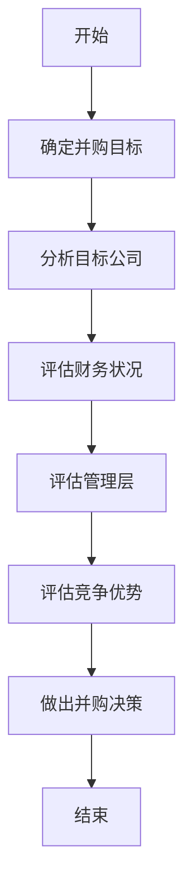
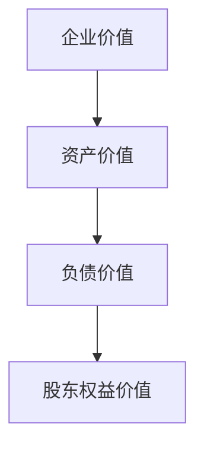

                 

# 巴菲特的并购策略：如何评估收购目标

## 关键词：
- 巴菲特
- 并购策略
- 投资哲学
- 价值评估
- 财务指标

## 摘要：
本文将深入探讨巴菲特的并购策略，分析其独特的价值投资理念，详细解读其评估收购目标的核心方法，包括财务指标分析、管理层评估和竞争优势分析。通过实际案例分析，揭示巴菲特成功背后的数学模型和决策逻辑，为读者提供系统化的并购评估框架。

---

## 第1章: 巴菲特的投资哲学

### 1.1 巴菲特的投资理念

#### 1.1.1 价值投资的定义
价值投资是一种投资策略，强调以低于内在价值的价格购买优质资产。巴菲特是这一策略的代表人物，他相信市场短期波动但长期趋向于反映资产的真实价值。

#### 1.1.2 巴菲特的价值投资原则
- **安全边际**：购买价格低于内在价值，以降低风险。
- **长期视角**：关注企业的长期盈利能力，而非短期市场波动。
- **集中投资**：精选少数优质企业，集中投资以提高收益。

#### 1.1.3 巴菲特并购决策的特点
- **注重企业基本面**：关注ROE、ROA等财务指标。
- **管理层信任**：倾向于投资管理能力强者的企业。
- **长期持有**：追求长期稳定的收益，而非短期交易。

---

## 第2章: 巴菲特的并购策略

### 2.1 巴菲特并购的核心思想

#### 2.1.1 并购的定义与分类
并购是企业通过购买其他企业股权或资产以实现扩张的策略。巴菲特主要关注控股型并购，确保对目标公司的控制权。

#### 2.1.2 巴菲特并购的三大原则
1. **只投资熟悉的行业**：巴菲特倾向于投资自己熟悉的企业，如保险、银行和消费品行业。
2. **只与可信赖的管理层合作**：信任管理层是成功并购的关键。
3. **只在合理估值时行动**：确保收购价格低于企业内在价值。

#### 2.1.3 巴菲特并购的长期主义
巴菲特注重企业的持续盈利能力，而非短期收益。他通过长期持有优质资产，实现财富的稳步增长。

---

### 2.2 巴菲特并购的选股标准

#### 2.2.1 财务指标分析
- **净资产收益率（ROE）**：衡量企业运用股东资产创造利润的能力。
$$ROE = \frac{\text{净利润}}{\text{净资产}}$$
- **资产回报率（ROA）**：衡量每单位资产创造的净利润。
$$ROA = \frac{\text{净利润}}{\text{总资产}}$$
- **每股收益（EPS）**：衡量企业盈利能力。
$$EPS = \frac{\text{净利润}}{\text{流通股数}}$$

#### 2.2.2 管理层评估
- 管理层的能力和诚信是巴菲特评估的重要标准。
- 他倾向于投资由有能力且值得信赖的管理层领导的企业。

#### 2.2.3 企业竞争优势分析
- **护城河**：企业竞争优势的来源，如品牌、专利、成本优势等。
- **可持续性**：竞争优势是否能够长期持续。

---

## 第3章: 巴菲特并购的数学模型与公式

### 3.1 财务指标分析

#### 3.1.1 净资产收益率（ROE）公式
$$ROE = \frac{\text{净利润}}{\text{净资产}}$$
例如，净利润为1000万元，净资产为5000万元，则ROE为20%。

#### 3.1.2 资产回报率（ROA）公式
$$ROA = \frac{\text{净利润}}{\text{总资产}}$$
例如，净利润为1000万元，总资产为10000万元，则ROA为10%。

#### 3.1.3 每股收益（EPS）公式
$$EPS = \frac{\text{净利润}}{\text{流通股数}}$$
例如，净利润为1000万元，流通股数为1000万股，则EPS为1元。

### 3.2 企业价值评估公式

#### 3.2.1 企业价值公式
$$EV = EBIT \times (1 + \frac{D}{L})$$
其中，$D$为债务，$L$为杠杆率。

---

## 第4章: 巴菲特并购的系统分析与架构设计

### 4.1 并购决策的系统分析

#### 4.1.1 并购决策的流程图

### 4.2 并购架构设计

#### 4.2.1 企业价值评估的架构图

---

## 第5章: 巴菲特并购的项目实战

### 5.1 并购案例分析

#### 5.1.1 巴菲特收购可口可乐的案例

- **背景**：1985年，巴菲特通过可可可乐公司收购可口可乐的部分股权。
- **分析**：
  - **财务状况**：可口可乐的ROE和ROA均高于行业平均水平。
  - **管理层**：管理层表现出色，能够持续创造价值。
  - **竞争优势**：可口可乐拥有强大的品牌和全球分销网络。
- **结果**：投资取得了丰厚的回报，证明了巴菲特选股标准的有效性。

#### 5.1.2 巴菲特收购吉列的案例

- **背景**：1989年，巴菲特通过旗下公司收购吉列公司。
- **分析**：
  - **财务状况**：吉列的ROE和ROA均表现优异。
  - **管理层**：管理层具备卓越的管理能力。
  - **竞争优势**：吉列在剃须刀市场拥有强大的竞争优势。
- **结果**：投资成功，进一步巩固了巴菲特在并购领域的地位。

#### 5.1.3 巴菲特收购美国运通的案例

- **背景**：1994年，巴菲特收购美国运通公司。
- **分析**：
  - **财务状况**：美国运通的ROE和ROA均表现优异。
  - **管理层**：管理层表现出色。
  - **竞争优势**：美国运通在信用卡市场具有强大的竞争优势。
- **结果**：投资成功，进一步验证了巴菲特的选股标准。

---

## 第6章: 巴菲特并购的总结与最佳实践

### 6.1 本章小结

#### 6.1.1 巴菲特并购的核心思想
- 价值投资是巴菲特并购的核心思想，强调以低于内在价值的价格收购优质资产。
- 他注重企业的基本面、管理层能力和竞争优势。

#### 6.1.2 巴菲特并购的选股标准
- 财务指标分析：ROE、ROA、EPS等。
- 管理层评估：能力与诚信。
- 企业竞争优势：护城河与可持续性。

#### 6.1.3 巴菲特并购的长期主义
- 长期持有优质资产，追求稳定的长期收益。

### 6.2 并购策略的最佳实践

#### 6.2.1 投资者的注意事项
- **避免情绪化决策**：市场波动会影响情绪，但长期价值更重要。
- **注重基本面分析**：财务指标和管理层能力是关键。
- **分散投资风险**：集中投资优质资产，但也要分散以降低风险。

#### 6.2.2 未来趋势
- **技术驱动的并购**：未来并购可能更多涉及技术创新型企业。
- **可持续投资**：关注ESG因素，投资可持续发展的企业。

#### 6.2.3 拓展阅读
- 《巴菲特传》：了解巴菲特的投资哲学。
- 《价值投资实战策略》：学习如何应用巴菲特的方法。

---

## 结语

巴菲特的并购策略为投资者提供了宝贵的启示：价值投资、长期主义和注重基本面。通过本文的分析，您可以更好地理解如何评估收购目标，做出明智的投资决策。

