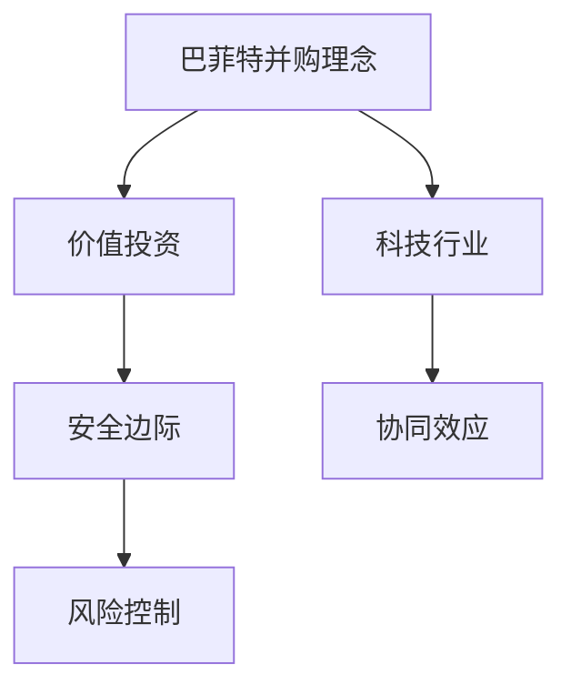
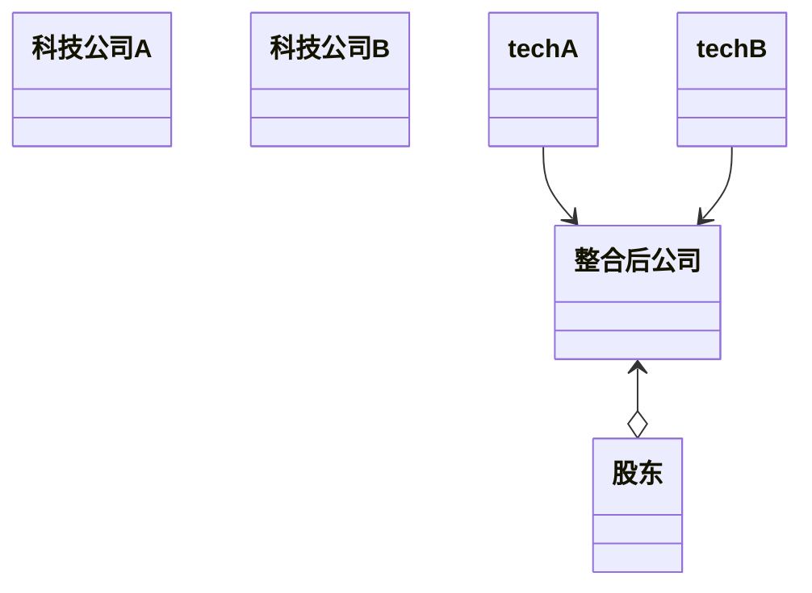
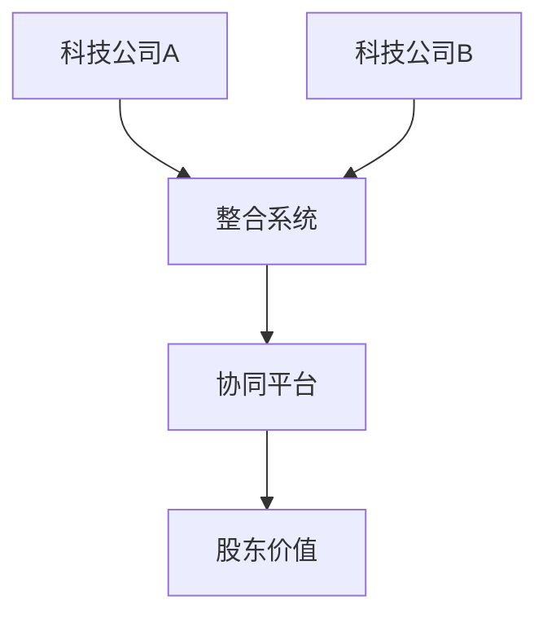

                 


# 巴菲特的并购艺术在科技行业的应用：整合与协同

**关键词**：巴菲特，并购艺术，科技行业，整合，协同效应，价值投资，安全边际

**摘要**：本文探讨了巴菲特并购理念在科技行业中的应用，重点分析了整合与协同效应。通过核心概念、数学模型、系统架构和案例分析，揭示了科技并购中的价值投资策略和整合方法。

---

## 第一部分: 巴菲特并购艺术与科技行业的结合

### 第1章: 巴菲特并购艺术概述

#### 1.1 巴菲特并购理念的核心要素

##### 1.1.1 价值投资的定义与核心原则
价值投资是一种长期投资策略，注重内在价值，寻找市场低估的公司。巴菲特强调安全边际，即买入价格低于内在价值，以确保投资的安全性。

##### 1.1.2 巴菲特并购中的安全边际概念
安全边际通过低估价格降低投资风险，确保即使出现偏差，投资仍能产生正收益。这在并购中尤为重要，需综合评估目标公司的财务状况和市场前景。

##### 1.1.3 购物者心态与长期投资策略
巴菲以购物者心态看待并购，注重企业长期价值和竞争优势，而非短期市场波动。这种心态帮助他识别和收购具有持续盈利能力的公司。

#### 1.2 科技行业的特点与并购趋势

##### 1.2.1 科技行业的周期性与成长性
科技行业波动性高，成长性强。并购需关注技术迭代和市场变化，寻找高成长潜力的标的。

##### 1.2.2 科技公司并购的主要驱动因素
技术获取、市场扩展和成本优化是主要驱动力。企业通过并购快速获取新技术或进入新市场。

##### 1.2.3 科技并购中的协同效应与整合挑战
协同效应是关键，但整合面临文化差异和技术整合的挑战。成功整合需精心规划和执行。

### 第2章: 巴菲特并购艺术的核心概念与联系

#### 2.1 核心概念原理

##### 2.1.1 价值投资与科技行业估值的结合
价值投资在科技行业的应用需考虑技术创新和市场前景，寻找被低估的科技公司。

##### 2.1.2 股东价值最大化与科技并购的协同效应
并购应创造协同效应，提升整体价值，而非简单资产累积。

##### 2.1.3 并购中的风险控制与安全边际
通过安全边际和尽职调查降低并购风险，确保投资稳健。

#### 2.2 概念属性特征对比表格

| 概念       | 特征1         | 特征2         | 特征3         |
|------------|---------------|---------------|---------------|
| 价值投资   | 长期视角       | 安全边际       | 股东价值最大化 |
| 科技并购   | 高成长性       | 协同效应       | 技术整合难度   |

#### 2.3 ER实体关系图（Mermaid流程图）



### 第3章: 科技行业并购中的整合策略

#### 3.1 并购后的整合计划

##### 3.1.1 组织架构的优化与整合
优化组织架构，明确职责，确保高效运作。文化整合需尊重双方文化，促进团队融合。

##### 3.1.2 文化整合与团队融合
文化整合是并购成功的关键，需建立共同价值观，促进团队合作。

##### 3.1.3 技术平台的整合与优化
技术整合需评估现有系统，制定整合计划，确保技术兼容和优化。

#### 3.2 协同效应的实现路径

##### 3.2.1 业务协同：产品线整合与市场扩展
整合产品线，优化资源分配，扩大市场覆盖。

##### 3.2.2 资源协同：成本优化与资源共享
资源共享降低成本，提升效率，创造协同价值。

##### 3.2.3 技术协同：技术创新与研发投入
整合研发资源，促进技术创新，提升整体技术水平。

### 第4章: 科技并购中的数学模型与估值方法

#### 4.1 估值模型

##### 4.1.1 市盈率法（P/E）

$$ P/E = \frac{Market\ Price}{Earnings\ Per\ Share} $$

##### 4.1.2 市净率法（P/B）

$$ P/B = \frac{Market\ Price}{Book\ Value\ Per\ Share} $$

##### 4.1.3 现金流折现模型（DCF）

$$ V = \sum_{t=1}^{n} \frac{CF_t}{(1+r)^t} + \frac{TV}{(1+r)^n} $$

#### 4.2 并购协同效应的量化

##### 4.2.1 协同效应的计算公式

$$ Synergy = V1 + V2 - V_{total} $$

### 第5章: 科技并购中的系统架构与整合方案

#### 5.1 系统分析与架构设计

##### 5.1.1 并购后的组织架构设计（Mermaid类图）



#### 5.2 系统架构设计（Mermaid架构图）



### 第6章: 项目实战

#### 6.1 环境安装与核心实现源代码

##### 6.1.1 案例分析：苹果收购Shazam

##### 6.1.2 代码实现

```python
def calculate_synergy(value1, value2):
    return value1 + value2 - min(value1, value2)
```

### 第7章: 总结与展望

#### 7.1 小结

##### 7.1.1 核心要点回顾
巴菲特并购理念强调价值投资和安全边际，科技并购注重协同效应和整合。

##### 7.1.2 实战案例分析
通过案例分析，验证理论在实际中的应用，揭示整合中的关键步骤和挑战。

#### 7.2 注意事项

##### 7.2.1 并购前的尽职调查
详细调查目标公司，评估潜在风险，确保安全边际。

##### 7.2.2 并购后的整合计划
制定详细的整合计划，包括组织、文化和技术整合，确保协同效应。

#### 7.3 未来展望

##### 7.3.1 人工智能与大数据的应用
未来并购可能更多依赖AI和大数据分析，提升估值准确性和整合效率。

##### 7.3.2 科技并购的趋势
随着技术进步，科技并购将继续增长，协同效应成为核心竞争力。

---

**TIPS：**

- **小结**：科技并购的成功在于战略规划和整合执行，需综合考虑技术、市场和文化因素。
- **注意事项**：并购前做好尽职调查，制定详细整合计划，重视文化融合和技术整合。
- **未来展望**：AI和大数据将推动科技并购的发展，协同效应将成为核心竞争力。

通过以上分析，科技并购的应用价值在于整合资源，创造协同效应，实现股东价值最大化。

