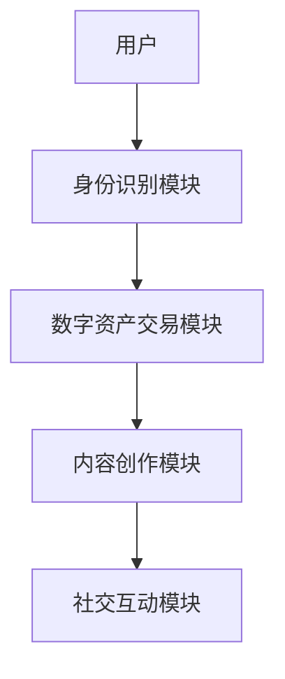

                 


# 巴菲特的并购艺术：元宇宙生态系统整合的新策略

## 关键词：巴菲特，并购艺术，元宇宙，生态系统，整合策略，价值投资

## 摘要：
本文深入探讨了巴菲特的并购艺术与元宇宙生态系统整合的结合，分析了传统并购策略在新兴数字环境中的应用潜力。通过详细分析元宇宙生态系统的架构与价值整合机制，本文提出了一种将巴菲特的核心理念与现代技术相结合的新策略，为投资者和科技企业提供了新的视角。

---

# 第一部分：背景介绍

## 第1章：巴菲特的并购艺术概述

### 1.1 巴菲特并购理念的核心要素

#### 1.1.1 投资者心态与并购哲学
巴菲特的并购哲学建立在长期价值投资的基础上，强调对标的企业的深入了解和对内在价值的评估。他倾向于寻找具有持续竞争优势和强大管理团队的企业，并通过并购实现规模效应和协同效应。

#### 1.1.2 巴菲特并购的三大核心原则
1. **安全边际**：通过低估价格买入，确保投资的本金安全。
2. **竞争优势**：选择具有独特护城河的企业，确保长期收益。
3. **管理层能力**：重视管理层的诚信和能力，确保企业战略的有效执行。

#### 1.1.3 并购中的价值评估与安全边际
巴菲特的并购策略强调对企业内在价值的评估，而非市场的短期波动。他倾向于寻找那些被市场低估的企业，并通过长期持有实现收益。

---

### 1.2 巴菲特并购的经典案例分析

#### 1.2.1 可口可乐案例：品牌价值的长期投资
巴菲特对可口可乐的投资展现了他对品牌价值和长期竞争优势的重视。他通过长期持有可口可乐的股票，获得了稳定的股息收益和品牌增值。

#### 1.2.2 柯达案例：技术驱动的并购教训
柯达的并购案例则提醒我们，技术优势并不总是转化为商业成功。巴菲特从中吸取了教训，强调了管理层能力的重要性。

#### 1.2.3 永恒力公司案例：杠杆收购的利与弊
永恒力公司的收购案例展示了杠杆收购的双刃剑效应。虽然高杠杆可以带来短期收益，但也增加了企业的财务风险。

---

### 1.3 巴菲特并购策略的现代启示

#### 1.3.1 从传统制造业到新兴科技领域的扩展
巴菲特的并购理念正在从传统制造业扩展到新兴科技领域。他开始关注那些具有长期增长潜力的科技企业，尤其是那些能够与数字生态系统相结合的企业。

#### 1.3.2 并购中的风险管理与价值创造
在并购过程中，巴菲特强调风险管理的重要性。他通过分散投资和严格的价值评估，降低了并购失败的风险。

#### 1.3.3 巴菲特并购理念的未来演变
随着科技的进步和市场的变化，巴菲特的并购理念也在不断演变。他开始关注那些能够适应未来数字化趋势的企业，并通过并购实现生态系统的整合。

---

## 第2章：元宇宙生态系统的核心特征

### 2.1 元宇宙的定义与技术基础

#### 2.1.1 元宇宙的定义与关键特征
元宇宙是一个虚拟的、去中心化的数字生态系统，用户可以通过AR/VR技术实现沉浸式的体验。元宇宙的核心特征包括：

1. **去中心化**：基于区块链技术，确保数据的安全性和透明性。
2. **沉浸式体验**：通过AR/VR技术，用户可以身临其境地参与虚拟世界。
3. **跨平台性**：元宇宙是一个开放的平台，支持多种设备和平台的接入。

#### 2.1.2 区块链、AR/VR与AI在元宇宙中的作用
- **区块链**：确保元宇宙的去中心化和数据的安全性。
- **AR/VR**：提供沉浸式的用户体验。
- **AI**：通过智能合约和数据分析，优化元宇宙的运行效率。

#### 2.1.3 元宇宙生态系统的多维结构
元宇宙生态系统由多个模块组成，包括：

1. **用户身份识别**：通过区块链技术实现用户身份的唯一性和安全性。
2. **数字资产交易**：支持虚拟货币和数字资产的交易。
3. **内容创作与共享**：用户可以创建和分享虚拟内容。
4. **社交互动**：用户可以通过虚拟化身进行社交互动。

---

### 2.2 元宇宙生态系统中的价值整合

#### 2.2.1 数字资产与虚拟货币的经济体系
元宇宙的经济体系基于虚拟货币和数字资产。用户可以通过购买和交易数字资产，实现财富的积累和增值。

#### 2.2.2 用户参与度与社区治理机制
元宇宙的用户参与度和社区治理机制是其成功的关键。通过激励机制和社区治理，可以提高用户的参与度和忠诚度。

#### 2.2.3 元宇宙中的商业模式创新
元宇宙的商业模式包括：

1. **虚拟商品销售**：用户可以购买虚拟商品和服务。
2. **广告与品牌推广**：企业可以通过虚拟广告实现品牌推广。
3. **虚拟土地租赁**：用户可以租赁虚拟土地进行商业活动。

---

### 2.3 元宇宙生态系统中的挑战与机遇

#### 2.3.1 技术实现的复杂性
元宇宙的实现需要多种先进技术的结合，包括区块链、AR/VR和AI等。技术实现的复杂性是元宇宙发展的主要挑战。

#### 2.3.2 用户隐私与数据安全问题
元宇宙的用户隐私和数据安全问题不容忽视。如何保护用户的隐私和数据安全，是元宇宙发展的重要课题。

#### 2.3.3 法律与监管框架的不确定性
元宇宙的法律与监管框架尚不完善，这给企业的运营和用户的权益保护带来了不确定性。

---

## 第3章：巴菲特并购艺术与元宇宙生态系统整合的核心概念

### 3.1 巴菲特并购理念与元宇宙生态系统的契合点

#### 3.1.1 价值创造与长期投资的共同目标
巴菲特的并购理念与元宇宙生态系统的整合目标都是通过价值创造实现长期投资回报。

#### 3.1.2 系统整合与协同效应的实现路径
通过并购实现系统的整合和协同效应，是巴菲特并购艺术的重要特征，也是元宇宙生态系统整合的核心策略。

#### 3.1.3 风险控制与价值评估的结合
巴菲特的风险控制理念与元宇宙生态系统的价值评估密不可分。通过严格的风险评估和价值评估，可以降低并购失败的风险。

---

### 3.2 元宇宙生态系统中的并购策略创新

#### 3.2.1 虚拟资产并购的特殊性
虚拟资产的并购需要考虑其虚拟性和去中心化的特性，这与传统资产的并购有显著不同。

#### 3.2.2 数字化平台整合的挑战与机遇
通过并购实现数字化平台的整合，可以快速构建元宇宙生态系统的核心竞争力。

#### 3.2.3 元宇宙中的跨领域并购策略
跨领域并购是元宇宙生态系统整合的重要策略。通过并购不同领域的企业，可以实现技术、资源和市场的协同。

---

### 3.3 巴菲特并购艺术在元宇宙生态系统中的应用前景

#### 3.3.1 元宇宙中的长期价值投资
巴菲特的长期价值投资理念在元宇宙生态系统中具有重要的应用前景。通过长期投资，可以实现虚拟资产的增值和生态系统的优化。

#### 3.3.2 跨平台协同效应的实现
通过并购实现跨平台的协同效应，是元宇宙生态系统整合的重要策略。这可以提高生态系统的整体效率和用户体验。

#### 3.3.3 数字资产价值评估的新方法
元宇宙生态系统中的数字资产价值评估需要新的方法和工具。巴菲特的价值评估理念可以为数字资产的评估提供重要的参考。

---

## 第4章：元宇宙生态系统整合的系统分析与架构设计

### 4.1 元宇宙生态系统整合的系统功能设计

#### 4.1.1 用户身份识别
用户身份识别是元宇宙生态系统整合的基础。通过区块链技术，可以实现用户身份的唯一性和安全性。

#### 4.1.2 数字资产交易
数字资产交易是元宇宙经济体系的核心功能。通过智能合约，可以实现数字资产的交易和结算。

#### 4.1.3 内容创作与共享
内容创作与共享是元宇宙生态系统的重要功能。用户可以创建和分享虚拟内容，实现创意的变现和传播。

---

### 4.2 元宇宙生态系统整合的系统架构设计

#### 4.2.1 系统架构图
以下是元宇宙生态系统整合的系统架构图：



---

### 4.3 系统交互设计

#### 4.3.1 用户注册与身份验证
用户首先需要注册并进行身份验证。通过区块链技术，确保用户身份的唯一性和安全性。

#### 4.3.2 数字资产交易流程
1. 用户登录系统。
2. 用户选择需要购买的数字资产。
3. 用户确认交易并支付虚拟货币。
4. 智能合约自动完成交易。

#### 4.3.3 内容创作与共享流程
1. 用户登录系统。
2. 用户创建虚拟内容。
3. 用户选择内容的发布方式。
4. 内容通过区块链技术进行存储和分发。

---

## 第5章：项目实战

### 5.1 环境配置

#### 5.1.1 安装必要的工具
需要安装以下工具：

1. **区块链开发框架**：如Ethereum、Solidity等。
2. **AR/VR开发工具**：如Unity、Unreal Engine等。
3. **AI开发框架**：如TensorFlow、PyTorch等。

#### 5.1.2 安装Python环境
建议使用Anaconda作为Python环境管理工具。

#### 5.1.3 安装必要的Python库
安装以下Python库：

```bash
pip install ethereum
pip install web3
pip install matplotlib
pip install numpy
```

---

### 5.2 系统核心实现

#### 5.2.1 数字资产交易模块

##### 5.2.1.1 智能合约开发
以下是智能合约的Solidity代码：

```solidity
// SPDX-License-Identifier: MIT
pragma solidity ^0.8.0;

contract Asset {
    mapping(address => uint) public balances;

    function transfer(address recipient, uint amount) external {
        require(balances[msg.sender] >= amount, "Insufficient balance");
        balances[recipient] += amount;
        balances[msg.sender] -= amount;
    }
}
```

##### 5.2.1.2 智能合约部署
使用Web3.js部署智能合约：

```javascript
const Web3 = require('web3');
const web3 = new Web3(new Web3.providers.HttpProvider('http://localhost:8545'));

const Asset = require('./Asset.json');
const assetContract = new web3.eth.Contract(Asset.abi, '0x...'); // 替换为实际地址
```

#### 5.2.2 用户身份识别模块

##### 5.2.2.1 区块链身份识别
通过区块链技术实现用户身份识别：

```javascript
async function registerUser(address, name) {
    // 在区块链上记录用户信息
    const tx = await assetContract.methods.register(address, name).send();
    return tx.receipt;
}
```

##### 5.2.2.2 用户登录验证
验证用户身份：

```javascript
async function loginUser(address, name) {
    const isRegistered = await assetContract.methods.isRegistered(address).call();
    if (!isRegistered) {
        throw new Error('User not registered');
    }
    return true;
}
```

---

### 5.3 实际案例分析

#### 5.3.1 案例背景
假设我们开发一个元宇宙平台，用户可以在该平台上购买虚拟商品和服务。

#### 5.3.2 代码实现
以下是平台的核心代码：

```python
from web3 import Web3
import json

# 初始化区块链连接
w3 = Web3(Web3.HTTPProvider('http://localhost:8545'))

# 加载智能合约ABI
with open('Asset.json') as f:
    asset_abi = json.load(f)
asset_contract = w3.eth.contract('0x...', abi=asset_abi)

# 用户注册与登录
def register_user(address, name):
    tx = asset_contract.functions.register(address, name).transact()
    return w3.eth.waitForTransactionReceipt(tx)

def login_user(address, name):
    is_registered = asset_contract.functions.isRegistered(address).call()
    if not is_registered:
        raise ValueError('User not registered')
    return True

# 数字资产交易
def transfer_assets(sender, recipient, amount):
    tx = asset_contract.functions.transfer(recipient, amount).transact({'from': sender})
    return w3.eth.waitForTransactionReceipt(tx)
```

---

## 第6章：总结与展望

### 6.1 总结

通过本文的分析，我们可以看到，巴菲特的并购艺术与元宇宙生态系统整合具有重要的契合点。通过并购实现系统的整合和协同效应，是元宇宙生态系统整合的重要策略。同时，元宇宙生态系统中的数字资产价值评估需要新的方法和工具，这为巴菲特的价值评估理念提供了新的应用场景。

---

### 6.2 展望

未来，随着科技的不断进步和市场的变化，巴菲特的并购理念将在元宇宙生态系统整合中发挥越来越重要的作用。通过并购实现跨平台的协同效应，将是元宇宙生态系统整合的重要方向。同时，数字资产价值评估的新方法和工具的开发，将为巴菲特的价值评估理念提供更广阔的应用空间。

---

### 6.3 最佳实践 Tips

- **长期价值投资**：在元宇宙生态系统中，长期价值投资是并购成功的关键。
- **风险管理**：在并购过程中，必须重视风险管理，确保投资的安全性。
- **技术创新**：通过技术创新，实现元宇宙生态系统的高效整合和优化。

---

通过本文的分析，我们为读者提供了一种将巴菲特的并购艺术与元宇宙生态系统整合的新策略。希望本文能够为投资者和科技企业在元宇宙生态系统整合中提供有价值的参考和指导。

