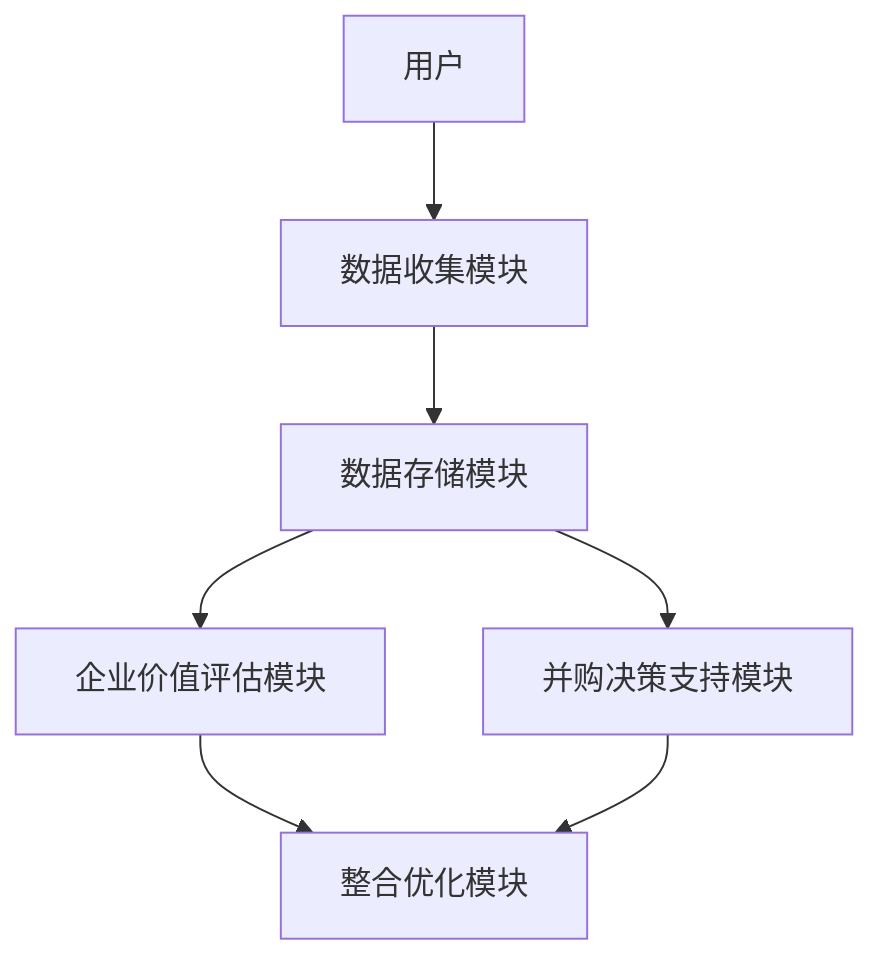
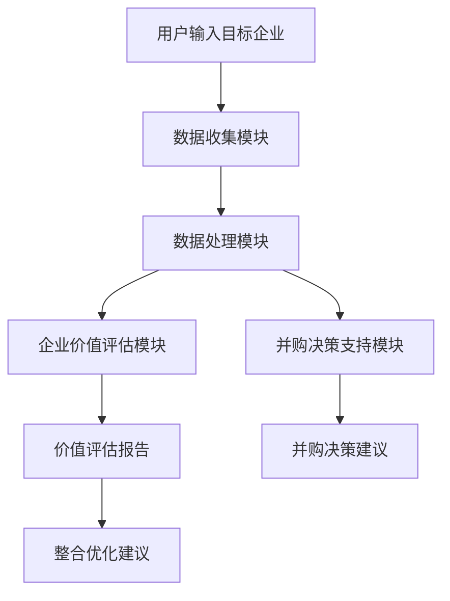
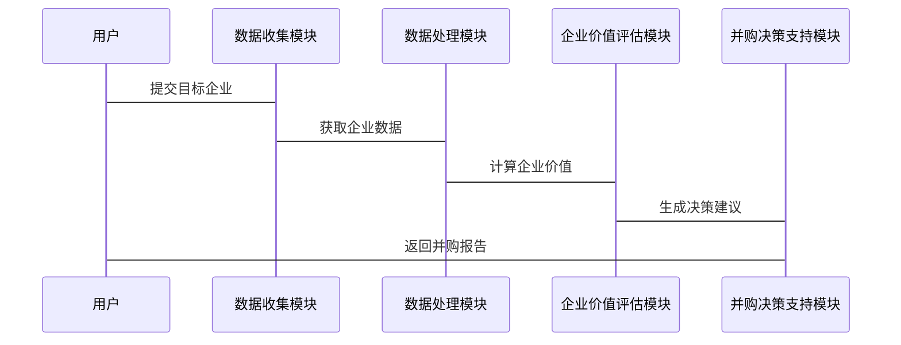

                 

# 巴菲特的并购艺术：科技巨头垄断环境下的策略

## 关键词：巴菲特，并购艺术，科技垄断，投资策略，价值评估

## 摘要：本文探讨了巴菲特的并购策略在科技垄断环境下的应用，分析了其成功的关键因素，包括企业价值评估、竞争优势分析和财务健康状况评估。通过实际案例分析和数学模型的构建，揭示了巴菲特并购策略的精髓及其在科技领域的独特性。

---

## 第一部分: 巴菲特并购艺术的背景与核心理念

### 第1章: 巴菲特并购艺术概述

#### 1.1 巴菲特并购艺术的核心理念

##### 1.1.1 巴菲特的价值投资哲学

巴菲特的价值投资哲学强调企业内在价值的重要性，主张以低于内在价值的价格购买优质企业。这种哲学基于基本面分析，注重企业的长期盈利能力、财务健康状况和竞争优势。例如，巴菲特的“护城河”理论认为，企业必须有独特的竞争优势，才能长期保持高回报。

##### 1.1.2 并购在巴菲特投资组合中的地位

并购是巴菲特投资的重要手段之一，尤其是在寻找具有强大竞争优势和低估价值的企业时。与股票投资相比，并购允许巴菲特以更优惠的价格获得控制权，直接影响企业的战略和运营。

##### 1.1.3 巴菲特并购策略的特点

巴菲特的并购策略强调长期价值，注重企业的财务健康和管理团队的稳定性。他倾向于选择具有稳定现金流和强大护城河的企业，避免高风险和高杠杆的交易。

#### 1.2 科技巨头垄断环境下的并购挑战

##### 1.2.1 科技行业的垄断现状

科技行业近年来出现了严重的垄断趋势，少数巨头占据了市场的主要份额。这种垄断不仅影响了行业竞争格局，也对并购策略提出了新的挑战。例如，谷歌收购YouTube，苹果收购Shazam等案例，都反映了科技巨头通过并购巩固市场地位的趋势。

##### 1.2.2 并购在科技领域的独特性

科技领域的并购与传统行业不同，更加注重技术和创新能力。企业并购往往是为了获取关键技术和专利，或者整合互补的资源和能力。例如，微软收购GitHub，不仅获得了代码库，还整合了开发者社区，增强了其在云服务领域的竞争力。

##### 1.2.3 垄断对并购策略的影响

垄断环境下，并购难度增加，因为目标企业的估值通常较高，且可能存在反垄断监管的风险。此外，科技巨头的垄断地位可能限制了并购后的整合和协同效应的实现。

---

### 第2章: 巴菲特并购的核心标准与分析工具

#### 2.1 巴菲特并购的核心标准

##### 2.1.1 企业护城河的定义与分类

护城河是企业抵御竞争的核心能力，巴菲特将其分为五种类型：成本优势、差异化优势、网络效应、技术壁垒和品牌优势。例如，可口可乐的全球品牌影响力和销售网络就是其强大的护城河。

##### 2.1.2 企业竞争优势的评估维度

竞争优势包括市场地位、盈利能力、管理团队、财务状况和创新能力。巴菲特特别关注企业的ROE（股东权益收益率）和现金流情况，认为这些指标更能反映企业的经营效率和财务健康。

##### 2.1.3 财务健康状况的评估标准

巴菲特的财务评估标准包括低债务、稳定的现金流、合理的利润率和健康的资产负债表。他倾向于投资那些能够持续产生现金流的企业，而非依赖于债务融资的企业。

#### 2.2 巴菲特并购分析工具

##### 2.2.1 股东权益收益率（ROE）的计算与应用

ROE = 网络收益 / 股东权益

ROE是衡量企业盈利能力的重要指标，巴菲特认为ROE持续高于行业平均水平的企业具有投资价值。例如，ROE长期高于15%的企业通常具备强大的竞争优势。

##### 2.2.2 市盈率与市净率的比较分析

市盈率（P/E）= 股价 / 每股收益

市净率（P/B）= 股价 / 每股净资产

市盈率适用于成长型企业，而市净率适用于资产密集型企业。巴菲特更倾向于使用市盈率评估科技企业，因为它们通常具有较高的研发投入和较低的资产周转率。

##### 2.2.3 现金流分析与企业价值评估

现金流分析是巴菲特评估企业价值的核心工具，他更关注自由现金流而非会计利润。例如，使用DCF模型评估目标企业的未来现金流，确定其内在价值。

---

### 第3章: 巴菲特并购策略在科技领域的应用

#### 3.1 科技行业并购的特点

##### 3.1.1 技术驱动型并购的定义

技术驱动型并购是指以获取新技术、专利或研发团队为目的的并购。这种并购通常发生在科技初创企业和科技巨头之间，目标是通过技术整合提升企业竞争力。

##### 3.1.2 科技企业并购的动机与目标

科技企业的并购动机包括技术获取、市场扩展、成本节约和竞争优势。例如，谷歌收购DeepMind主要是为了增强其在人工智能领域的研发能力。

##### 3.1.3 技术创新对企业价值的影响

技术创新是科技企业价值增长的核心驱动力。具有独特技术和创新能力的企业往往能够获得更高的估值。例如，特斯拉的电动汽车技术和专利组合使其成为高估值的目标。

#### 3.2 巴菲特并购策略的科技行业调整

##### 3.2.1 技术风险的评估与管理

技术风险是科技并购的主要挑战之一，包括技术过时、研发失败和市场竞争风险。巴菲特通过评估企业的技术护城河和管理团队的创新能力来降低技术风险。

##### 3.2.2 科技企业护城河的识别与分析

科技企业的护城河通常包括技术专利、网络效应和品牌影响力。例如，苹果的iOS生态系统和应用商店形成了强大的网络效应，增强了其护城河。

##### 3.2.3 技术驱动型并购的估值方法

技术驱动型并购的估值需要考虑研发能力、技术寿命和市场前景。巴菲特倾向于使用DCF模型评估目标企业的未来现金流，同时关注技术的商业化潜力和市场接受度。

---

### 第4章: 巴菲特并购策略的数学模型与算法原理

#### 4.1 企业价值评估的数学模型

##### 4.1.1 股权自由现金流模型（DCF）

DCF模型基于未来现金流的现值计算企业价值。公式如下：

$$企业价值 = \sum_{t=1}^{n} \frac{CF_t}{(1 + r)^t} + \frac{残值}{(1 + r)^n}$$

其中，CF_t是第t年的自由现金流，r是折现率，n是预计的持有年数。

##### 4.1.2 加权平均资本成本（WACC）的计算

WACC是企业加权平均的资本成本，用于折现现金流。公式如下：

$$WACC = \left( \frac{D}{D + E} \times R_d \right) + \left( \frac{E}{D + E} \times R_e \right)$$

其中，D是债务，E是股权，R_d是债务成本，R_e是股权成本。

##### 4.1.3 企业价值与股东权益的关系

企业价值（EV）与股东权益（Equity）的关系可以通过以下公式表示：

$$EV = 债务 + 股东权益 + 其他负债$$

巴菲特通常关注EV/EBITDA倍数，认为该指标更能反映企业的实际价值。

#### 4.2 并购决策的算法流程

##### 4.2.1 并购前的初步筛选

1. 评估企业的财务健康状况，包括ROE、现金流和债务水平。
2. 分析企业的竞争优势，识别其护城河。
3. 评估目标企业的市场地位和增长潜力。

##### 4.2.2 目标企业分析与估值

1. 收集目标企业的财务数据，包括收入、利润和现金流。
2. 使用DCF模型或WACC方法进行企业价值评估。
3. 对比市场价格与内在价值，确定并购的可行性。

##### 4.2.3 并购后的整合与优化

1. 制定整合计划，包括管理、文化和资源的整合。
2. 优化企业运营，降低成本，提高效率。
3. 监测整合效果，确保协同效应的实现。

---

### 第5章: 巴菲特并购策略的系统架构与实现

#### 5.1 并购评估系统的功能设计

##### 5.1.1 数据收集模块

数据收集模块负责收集目标企业的财务数据、市场数据和技术数据。例如，使用API从财经网站获取实时数据。

##### 5.1.2 企业价值评估模块

企业价值评估模块基于DCF模型和WACC方法，计算目标企业的内在价值。模块输出包括企业价值、EV/EBITDA倍数和ROE等指标。

##### 5.1.3 并购决策支持模块

决策支持模块提供并购决策建议，包括并购的可行性和整合策略。模块还生成风险评估报告，帮助用户识别潜在风险。

#### 5.2 并购评估系统的架构设计

##### 5.2.1 系统整体架构图

以下是系统整体架构的Mermaid图：

##### 5.2.2 数据流与模块交互图

以下是数据流与模块交互的Mermaid图：

#### 5.3 系统接口设计

系统接口采用RESTful API设计，提供以下功能：

1. 数据接口：获取目标企业的财务数据和市场数据。
2. 评估接口：计算企业价值和并购可行性。
3. 决策接口：生成并购决策建议和风险报告。

#### 5.4 系统交互图

以下是系统交互的Mermaid图：

---

## 第二部分: 巴菲特并购策略的科技应用与挑战

### 第6章: 科技垄断环境下的并购策略调整

#### 6.1 科技巨头的并购动机

科技巨头的并购动机包括技术获取、市场扩展和竞争优势。例如，亚马逊收购全食超市是为了扩展其零售业务，增强其在电子商务领域的市场地位。

#### 6.2 巴菲特并购策略的科技应用

##### 6.2.1 网络效应的利用

网络效应是科技企业的核心竞争优势之一。例如，Facebook通过收购 WhatsApp 和 Instagram，增强了其社交网络的粘性和影响力。

##### 6.2.2 技术创新的管理

巴菲特在并购科技企业时，注重企业的研发能力和技术商业化能力。例如，伯克希尔 Hathaway投资苹果公司，主要是因为其强大的品牌影响力和技术创新能力。

#### 6.3 科技垄断对并购策略的影响

##### 6.3.1 垄断对并购估值的影响

垄断环境下，目标企业的估值通常较高，因为其市场地位和技术优势难以被替代。例如，谷歌收购YouTube的估值远高于其账面价值。

##### 6.3.2 垄断对并购整合的影响

并购后的整合难度增加，因为科技巨头通常具有复杂的组织结构和文化差异。例如，微软收购GitHub后，整合过程面临了文化和管理上的挑战。

---

### 第7章: 巴菲特并购策略在科技领域的实际案例分析

#### 7.1 苹果公司的并购策略

##### 7.1.1 苹果并购的动机与目标

苹果的并购策略以技术获取和市场扩展为主。例如，收购NeXT和Pixar帮助苹果建立了强大的技术基础和创意产业的影响力。

##### 7.1.2 苹果并购的整合与优化

苹果并购后通常采取深度整合策略，确保技术和管理的协同。例如，收购NeXT后，苹果整合了其操作系统和技术团队，推动了Mac和iOS的开发。

#### 7.2 亚马逊的并购策略

##### 7.2.1 亚马逊并购的动机与目标

亚马逊的并购主要为了扩展业务和获取技术。例如，收购全食超市是为了增强其在实体零售领域的布局，收购AWS是为了巩固其云服务的领先地位。

##### 7.2.2 亚马逊并购的整合与优化

亚马逊并购后通常采取快速整合策略，确保协同效应的实现。例如，收购AWS后，亚马逊整合了其技术和服务，推动了云计算业务的快速发展。

---

## 第三部分: 巴菲特并购策略的系统实现与最佳实践

### 第8章: 并购评估系统的实现与应用

#### 8.1 系统实现的关键步骤

##### 8.1.1 数据采集与处理

使用API和爬虫技术获取目标企业的财务数据、市场数据和技术数据。数据处理包括清洗、转换和存储。

##### 8.1.2 企业价值评估

基于DCF模型和WACC方法，计算目标企业的内在价值。模型输入包括财务数据、行业平均WACC和未来现金流预测。

##### 8.1.3 并购决策支持

系统根据评估结果提供并购建议，包括并购可行性、估值建议和整合策略。同时，生成风险评估报告，帮助用户识别潜在风险。

#### 8.2 系统应用的实际案例

##### 8.2.1 案例一：亚马逊收购全食超市

使用并购评估系统评估亚马逊收购全食超市的可行性。系统计算出目标企业的内在价值高于市场价格，建议亚马逊进行并购。

##### 8.2.2 案例二：苹果收购NeXT

系统评估苹果收购NeXT的可行性，计算出收购后的协同效应和整合风险，建议苹果采取深度整合策略。

---

### 第9章: 巴菲特并购策略的最佳实践与未来展望

#### 9.1 最佳实践

##### 9.1.1 企业价值评估的关键点

- 确保数据的准确性和完整性。
- 合理选择折现率，避免低估或高估企业价值。
- 考虑技术风险和市场风险，调整评估模型。

##### 9.1.2 并购整合的注意事项

- 制定详细的整合计划，包括管理、文化和资源的整合。
- 确保并购后的协同效应，优化企业运营。
- 监测整合效果，及时调整策略。

#### 9.2 未来展望

随着科技的不断发展，科技巨头的并购策略将更加注重技术创新和全球化布局。未来，并购评估系统将更加智能化，利用大数据和人工智能技术提高评估的准确性和效率。

---

## 结语

巴菲特的并购艺术在科技垄断环境下依然具有重要的指导意义。通过调整策略，注重技术创新和竞争优势，并购仍然是科技企业获取增长和竞争优势的重要手段。未来，随着科技的发展，并购策略和评估系统将更加智能化和精准化，为科技企业带来更多的机遇和挑战。

