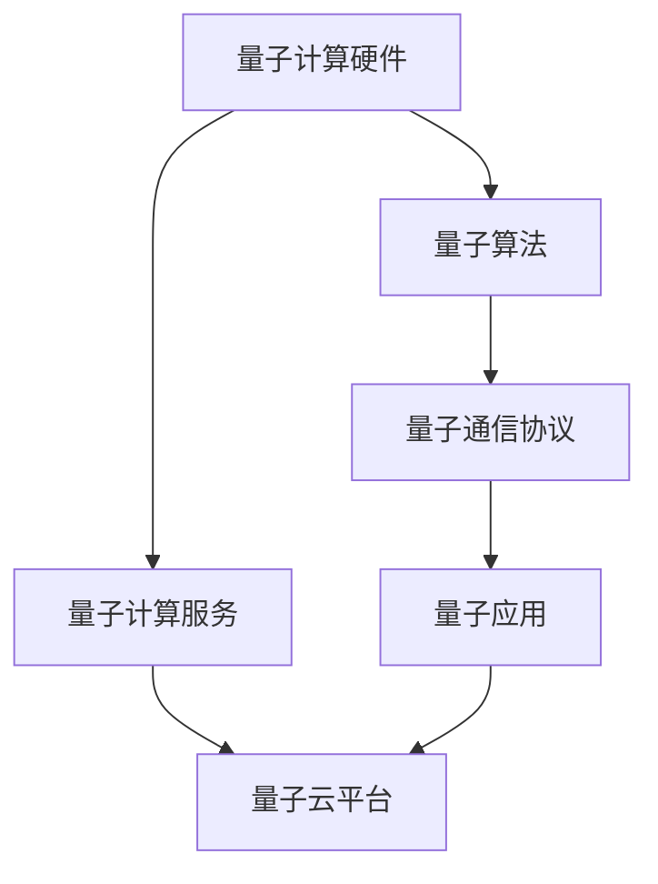
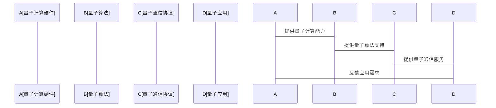

                 


# 巴菲特的并购艺术：量子科技生态系统的整合策略

> **关键词**：巴菲特，并购艺术，量子科技，生态系统，整合策略，系统架构，算法原理  
>
> **摘要**：本文深入分析巴菲特的并购艺术，并探讨其在量子科技生态系统中的整合策略。通过系统分析和架构设计，结合数学模型和算法原理，提出量子科技生态系统中的并购决策优化方法。文章以实际案例为背景，展示如何在量子科技生态系统中应用巴菲特的并购策略，实现生态系统的动态平衡与协同优化。

---

## 第1章: 巴菲特并购艺术概述

### 1.1 并购的基本概念与核心要素

#### 1.1.1 并购的定义与分类

- **并购的定义**：并购（Mergers and Acquisitions，M&A）是指一家企业通过购买其他企业的股权或资产，以实现资源优化配置和战略目标的过程。
- **并购的类型**：
  - 横向并购：同一行业内的并购，旨在扩大市场份额。
  - 纵向并购：上下游产业的并购，以控制供应链。
  - 混合并购：跨行业并购，寻求协同效应。
- **并购的核心要素**：
  - 战略目标：明确并购的目的，如市场扩展、技术获取等。
  - 价值评估：准确评估目标企业的价值，避免支付过高溢价。
  - 整合策略：制定并购后的整合计划，确保协同效应。

#### 1.1.2 巴菲特并购策略的特点

- **巴菲特的投资哲学**：
  - 价值投资：寻找被低估的企业，长期持有。
  - 安全边际：确保投资的安全性，避免高风险。
  - 简化决策：注重企业基本面，避免复杂分析。
- **巴菲特并购的三大核心原则**：
  - 质量第一：选择具有持续竞争优势的企业。
  - 价格合理：确保并购价格低于内在价值。
  - 长期主义：注重长期收益，而非短期利润。
- **量子科技生态系统的概念与特点**：
  - **量子科技的定义**：研究量子力学在信息处理、计算等领域的应用，涵盖量子计算、量子通信、量子传感等。
  - **量子科技生态系统的构成**：包括量子计算硬件、软件、算法、应用开发、人才培养等。
  - **量子科技生态系统的整合策略**：通过并购整合资源，构建完整的量子科技产业链。

---

### 1.2 巴菲特并购与量子科技的结合

- **并购理念与量子科技的契合点**：
  - 量子科技的复杂性和高风险需要巴菲特的长期主义和安全边际理念。
  - 量子科技的生态系统特性与巴菲特的多元化投资策略相符。
- **量子科技在并购中的潜在价值**：
  - 提供新的经济增长点，推动技术进步。
  - 通过并购整合资源，加速量子科技的商业化。
- **量子科技生态系统对并购整合的影响**：
  - 并购成为构建量子科技生态的重要手段。
  - 并购整合优化了资源分配，提升了整体效率。

---

## 第2章: 量子科技生态系统的整合策略

### 2.1 量子科技生态系统的构建逻辑

#### 2.1.1 量子科技生态系统的构成模块

- **硬件模块**：量子计算设备、量子通信设备。
- **软件模块**：量子算法、量子编程框架。
- **应用模块**：金融、物流、医疗等领域的量子应用。
- **人才模块**：量子科技的研发和应用人才。
- **政策模块**：政府政策、行业标准。

#### 2.1.2 量子科技生态系统的协同效应

- **技术协同**：硬件、软件和应用的协同优化。
- **资源协同**：人才、资金和政策的协同作用。
- **市场协同**：企业间的协同合作，推动市场发展。

#### 2.1.3 量子科技生态系统的动态平衡

- **动态平衡的定义**：系统各部分的协调与适应。
- **动态平衡的实现**：通过并购整合资源，优化系统结构。

---

### 2.2 并购在量子科技生态系统中的作用

#### 2.2.1 并购在量子科技生态系统中的战略地位

- **并购作为生态构建的核心工具**：通过并购整合资源，构建完整的生态系统。
- **并购推动技术创新**：通过并购获取关键技术，提升企业竞争力。

#### 2.2.2 并购对量子科技生态系统整合的具体影响

- **优化资源分配**：通过并购整合冗余资源，提升效率。
- **加速技术商业化**：通过并购获取成熟技术，缩短研发周期。

#### 2.2.3 并购在量子科技生态系统中的风险与挑战

- **技术风险**：并购的技术可能不成熟或难以整合。
- **管理风险**：并购后的整合可能面临文化冲突和管理难题。
- **市场风险**：量子科技市场尚未成熟，存在不确定性。

---

### 2.3 巴菲特并购策略在量子科技生态系统中的应用

#### 2.3.1 巴菲特并购策略的核心要素在量子科技生态系统中的体现

- **长期主义**：选择具有长期竞争优势的量子科技企业。
- **安全边际**：确保并购价格低于目标企业的内在价值。
- **多元化投资**：通过并购布局量子科技的多个领域。

#### 2.3.2 巴菲特并购策略在量子科技生态系统中的具体应用案例

- **案例分析**：假设有A、B、C三家量子科技公司，分别专注于硬件、软件和应用开发。
  - 并购硬件公司A，获取核心量子计算设备。
  - 并购软件公司B，获得量子算法和编程框架。
  - 并购应用公司C，推动量子科技的商业化。

#### 2.3.3 巴菲特并购策略对量子科技生态系统整合的启示

- **并购策略应与生态系统目标相结合**：并购不应仅追求短期收益，而应服务于生态系统的整体优化。
- **注重长期价值**：选择具有长期竞争优势的企业，避免短期波动。

---

## 第3章: 量子科技生态系统的数学模型与算法原理

### 3.1 量子科技生态系统的数学模型

#### 3.1.1 量子科技生态系统的核心变量

- 量子计算能力（QC）
- 量子通信安全性（QS）
- 量子应用的广度（QA）
- 并购整合的效果（ME）

#### 3.1.2 量子科技生态系统的主要方程

- **整体价值评估方程**：
  $$ V = a \cdot QC + b \cdot QS + c \cdot QA + d \cdot ME $$
  其中，a、b、c、d为权重系数，QC、QS、QA、ME为各变量的度量值。

#### 3.1.3 量子科技生态系统模型的验证与优化

- **模型验证**：通过实际数据验证模型的准确性。
- **模型优化**：调整权重系数，提升模型的预测能力。

---

### 3.2 并购评估的算法原理

#### 3.2.1 并购价值评估的数学模型

- **净现值法（NPV）**：
  $$ NPV = \sum_{t=0}^{n} \frac{CF_t}{(1 + r)^t} $$
  其中，CF_t为第t年的现金流，r为折现率。

#### 3.2.2 并购风险评估的算法原理

- **风险评估矩阵**：
  - 风险因素包括技术风险、管理风险、市场风险。
  - 风险等级分为低、中、高。

#### 3.2.3 并购整合效果的预测模型

- **整合效果预测方程**：
  $$ IE = \alpha \cdot V + \beta \cdot R $$
  其中，V为并购价值，R为整合资源的协同效应。

---

### 3.3 量子科技生态系统中的并购决策优化

#### 3.3.1 量子科技生态系统中的并购决策变量

- 并购目标的选择
- 并购价格的确定
- 并购后的整合策略

#### 3.3.2 量子科技生态系统中的并购决策优化算法

- **决策树分析**：通过构建决策树，分析不同并购决策的优劣。
- **动态规划法**：通过动态规划优化并购决策。

#### 3.3.3 量子科技生态系统中的并购决策优化案例分析

- **案例分析**：假设D公司是一家量子通信技术公司，通过分析其并购价值和整合难度，决定是否并购。

---

## 第4章: 量子科技生态系统中的系统分析与架构设计

### 4.1 量子科技生态系统的系统分析

#### 4.1.1 问题场景介绍

- **问题背景**：量子科技生态系统复杂，需要系统化的方法进行整合。
- **问题描述**：如何通过并购整合资源，构建高效的量子科技生态系统。

#### 4.1.2 系统功能设计

- **功能需求分析**：包括资源分配、协同优化、风险控制。
- **性能需求分析**：包括系统响应时间、处理能力。
- **约束条件分析**：包括预算限制、时间限制、政策限制。

---

### 4.2 量子科技生态系统的架构设计

#### 4.2.1 系统架构图



#### 4.2.2 系统交互序列图



---

### 4.3 系统接口设计

#### 4.3.1 系统接口设计

- **硬件接口**：量子计算设备的接口标准。
- **软件接口**：量子算法和编程框架的接口设计。
- **应用接口**：量子应用的接口规范。

#### 4.3.2 系统交互流程图

```mermaid
graph TD
    A[用户] --> B[量子应用]
    B --> C[量子算法]
    C --> D[量子计算硬件]
    D --> B: 返回结果
```

---

## 第5章: 项目实战

### 5.1 环境安装与配置

- **环境要求**：安装量子计算模拟器、量子算法开发工具、量子通信协议测试工具。
- **工具安装**：安装必要的开发环境和依赖库。

### 5.2 系统核心实现源代码

```python
def quantum_merger_strategy():
    # 计算并购价值
    value = calculate_value()
    # 评估整合风险
    risk = assess_risk()
    # 决策是否并购
    if value > risk:
        return "并购"
    else:
        return "不并购"

def calculate_value():
    # 计算净现值
    npv = calculate_net_present_value()
    return npv

def assess_risk():
    # 评估风险等级
    risk_factors = ["技术风险", "管理风险", "市场风险"]
    risk_score = calculate_risk_score(risk_factors)
    return risk_score

def calculate_net_present_value():
    # 简化的NPV计算
    cash_flows = [100, 200, 300]
    discount_rate = 0.1
    npv = sum([cf / (1 + discount_rate)**i for i, cf in enumerate(cash_flows)])
    return npv

def calculate_risk_score(risk_factors):
    # 简化的风险评分
    score = len([f for f in risk_factors if f in ["技术风险", "管理风险"]])
    return score
```

---

### 5.3 代码实现与解读

- **代码解读**：上述代码展示了如何通过Python实现量子科技生态系统的并购决策优化。
  - `quantum_merger_strategy`函数：综合评估并购价值和风险，决定是否并购。
  - `calculate_value`函数：计算并购的价值，包括净现值计算。
  - `assess_risk`函数：评估并购的风险，包括技术、管理和市场风险。

---

### 5.4 案例分析与详细讲解

- **案例分析**：假设一家量子计算公司E，通过上述算法评估其并购价值和风险。
  - 计算净现值：假设现金流为[100, 200, 300]，折现率为10%，NPV = 100/(1.1)^0 + 200/(1.1)^1 + 300/(1.1)^2 ≈ 100 + 181.82 + 247.93 ≈ 529.75。
  - 评估风险：假设存在技术风险和技术管理风险，风险评分为2。
  - 决策：529.75 > 2，建议并购。

---

### 5.5 项目小结

- **项目总结**：通过案例分析，展示了如何将巴菲特的并购策略应用于量子科技生态系统。
- **项目意义**：通过并购优化资源配置，推动量子科技的商业化进程。

---

## 第6章: 最佳实践、小结与注意事项

### 6.1 最佳实践

- **并购策略**：
  - 选择具有长期竞争优势的企业。
  - 确保并购价格合理，避免高溢价。
  - 制定详细的整合计划，确保协同效应。
- **风险管理**：
  - 识别并评估并购中的各种风险。
  - 制定应对措施，降低风险影响。

---

### 6.2 小结

- **核心总结**：巴菲特的并购艺术为量子科技生态系统的整合提供了宝贵的启示。通过系统化的分析和优化，可以实现资源的最优配置，推动量子科技的快速发展。

---

### 6.3 注意事项

- **风险提示**：
  - 并购可能存在技术风险、管理风险和市场风险。
  - 量子科技市场尚不成熟，存在不确定性。
- **注意事项**：
  - 并购前充分评估目标企业的价值和风险。
  - 并购后制定详细的整合计划，确保协同效应。

---

### 6.4 拓展阅读

- **推荐书籍**：
  - 《巴菲特传： investor to the world》
  - 《量子计算：算法与应用》
- **推荐文章**：
  - 《并购的数学模型与算法原理》
  - 《量子科技生态系统的构建与优化》

---

## 结语

通过本文的分析，我们可以看到，巴菲特的并购艺术为量子科技生态系统的整合提供了重要的策略指导。通过系统化的分析和优化，可以实现资源的最优配置，推动量子科技的快速发展。未来，随着量子科技的进一步发展，并购将在其中发挥越来越重要的作用。

---

