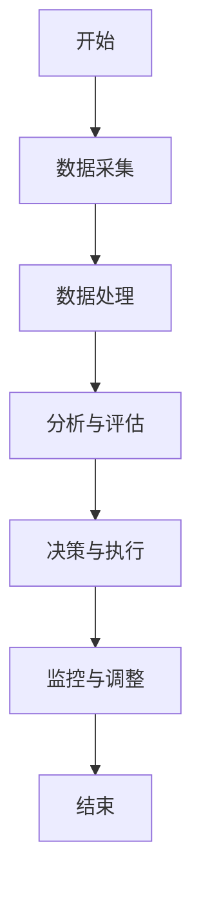

                 


# 巴菲特的投资原则：永远不要亏损

## 关键词：巴菲特、投资原则、价值投资、风险管理、内在价值、安全边际、投资组合优化

## 摘要：
本文深入探讨了巴菲特的投资原则，从其核心理念、价值投资的数学模型，到投资组合的构建与风险管理，结合实际案例进行详细分析。文章内容涵盖了巴菲特的投资哲学、价值投资的核心要素、企业基本面分析的数学模型、投资组合优化的策略，以及风险管理的实战应用。通过系统化的分析和具体的案例研究，帮助读者理解巴菲特的投资原则，并将其应用于实际投资中，以实现长期稳定的收益。

---

# 第1章 巴菲特投资理念的核心思想

## 1.1 巴菲特投资理念的背景与起源

### 1.1.1 价值投资的起源与发展
价值投资是一种基于对企业内在价值评估的投资策略，起源于20世纪初。本杰明·格雷厄姆和戴维·多德是价值投资的奠基人，他们强调以低于内在价值的价格买入优质股票。巴菲特早期的投资理念深受这两位大师的影响，逐步形成了自己的价值投资体系。

### 1.1.2 巴菲特的投资哲学与思想体系
巴菲特的投资哲学可以总结为“以合理的价格买入优秀的公司”。他强调长期投资、价值发现、安全边际和风险控制。他的投资理念不仅仅是对市场的理解，更是对人性的理解，注重情绪管理、耐心和纪律。

### 1.1.3 巴菲特投资理念的核心要素
1. **长期投资**：巴菲特认为市场短期是投票机，长期才是称重机，投资需要耐心。
2. **价值发现**：寻找具有持续竞争优势、良好管理团队和稳定财务表现的企业。
3. **安全边际**：买入价格低于内在价值，确保投资的安全性。
4. **分散投资**：通过分散投资降低风险，避免过度集中。
5. **风险管理**：通过严格筛选和持续监控，避免重大损失。

## 1.2 巴菲特投资理念的五大核心原则

### 1.2.1 长期投资与价值发现
巴菲特认为市场波动是投资的敌人，长期投资能够穿越市场的短期波动，最终获得企业成长的收益。他强调关注企业的内在价值，而不是市场的短期波动。

### 1.2.2 安全边际的概念与应用
安全边际是指买入价格与内在价值之间的差距。通过安全边际，投资者可以在市场波动中避免损失，并确保投资的稳健性。

### 1.2.3 企业基本面分析的重要性
巴菲特非常注重对企业基本面的分析，包括财务报表、盈利能力、竞争优势、管理层素质等方面。他认为只有深入了解企业，才能做出正确的投资决策。

### 1.2.4 分散投资与风险控制
虽然巴菲特的投资组合相对集中，但他仍然强调分散投资的重要性。通过分散投资，可以降低单一投资的风险，提高整体投资组合的稳定性。

### 1.2.5 股东权益最大化的原则
巴菲特认为企业的目标是为股东创造最大化的价值，因此他在选择投资标的时，特别关注企业的股东权益回报率和分红政策。

## 1.3 巴菲特投资理念的实践与案例

### 1.3.1 巴菲特的经典投资案例分析
1. **可口可乐案例**：巴菲特长期持有可口可乐，因为其具有强大的品牌优势和稳定的现金流。
2. **苹果公司案例**：巴菲特在苹果股价低谷时买入，长期持有，享受其成长带来的收益。
3. **富国银行案例**：巴菲特通过对其业务模式和管理层的深入分析，选择了具有长期竞争优势的银行股。

### 1.3.2 巴菲特投资理念的实际应用
巴菲特的投资理念不仅适用于股票投资，也可以应用到其他资产类别。他强调对投资标的深入研究，避免盲目跟风。

### 1.3.3 巴菲特投资理念的演变与调整
随着市场环境的变化，巴菲特的投资策略也在不断调整。他更加注重企业现金流的稳定性，以及全球经济趋势对投资的影响。

## 1.4 本章小结
本章通过对巴菲特投资理念的背景、核心要素和实际应用的分析，揭示了其投资成功的秘密：长期投资、价值发现、安全边际和风险管理。

---

# 第2章 价值投资理论的数学模型与分析

## 2.1 价值投资的核心数学模型

### 2.1.1 内在价值的计算公式
巴菲特的价值投资理论中，内在价值是企业未来现金流的现值。计算公式如下：
$$ \text{内在价值} = \sum_{t=1}^{\infty} \frac{\text{现金流}_t}{(1 + r)^t} $$
其中，$r$是折现率，$\text{现金流}_t$是第$t$年的现金流。

### 2.1.2 安全边际的计算方法
安全边际是买入价格与内在价值之间的差距：
$$ \text{安全边际} = \text{内在价值} - \text{市场价格} $$

### 2.1.3 现金流折现模型（DCF模型）
DCF模型是计算企业内在价值的核心工具，公式如下：
$$ V = \frac{CF_1}{(1 + r)} + \frac{CF_2}{(1 + r)^2} + \cdots + \frac{CF_n}{(1 + r)^n} $$
其中，$V$是企业价值，$CF_t$是第$t$年的现金流，$r$是折现率。

## 2.2 企业基本面分析的数学模型

### 2.2.1 资产负债表分析模型
资产负债表分析模型用于评估企业的财务健康状况，包括资产、负债和所有者权益的构成。

### 2.2.2 利润表分析模型
利润表分析模型用于评估企业的盈利能力，包括收入、成本、利润和每股收益（EPS）。

### 2.2.3 现金流量表分析模型
现金流量表分析模型用于评估企业的现金流情况，包括经营活动、投资活动和筹资活动的现金流。

## 2.3 投资组合优化的数学模型

### 2.3.1 马科维茨投资组合理论
马科维茨的投资组合理论为投资组合优化提供了理论基础：
$$ \text{风险} = \sqrt{w^T \Sigma w} $$
其中，$w$是投资权重向量，$\Sigma$是资产间的协方差矩阵。

### 2.3.2 巴菲特投资组合优化策略
巴菲特的投资组合优化策略注重长期投资和分散投资，通过选择具有长期竞争优势的企业，降低投资风险。

## 2.4 本章小结
本章通过数学模型的分析，揭示了价值投资的内在逻辑。内在价值的计算、安全边际的应用以及投资组合优化的策略，都是巴菲特投资成功的重要因素。

---

# 第3章 投资组合构建与风险管理

## 3.1 投资组合构建的原则与步骤

### 3.1.1 确定投资目标与风险承受能力
投资者需要明确自己的投资目标和风险承受能力，这是构建投资组合的第一步。

### 3.1.2 选择优质企业进行投资
通过对企业基本面的深入分析，选择具有长期竞争优势和良好财务表现的企业。

### 3.1.3 分散投资以降低风险
通过分散投资，降低单一投资的风险，提高整体投资组合的稳定性。

## 3.2 风险管理的数学模型与策略

### 3.2.1 风险价值（VaR）模型
VaR模型用于衡量投资组合的潜在损失：
$$ \text{VaR} = \text{损失} \text{在一定置信水平下的最大可能损失} $$

### 3.2.2 风险控制策略
1. **止损策略**：设定止损点，避免亏损扩大。
2. **动态调整策略**：定期评估投资组合，及时调整以应对市场变化。
3. **分散化策略**：通过多样化投资降低特定风险。

## 3.3 投资组合优化的实战案例

### 3.3.1 投资组合构建案例
假设投资者选择投资五家具有长期竞争优势的企业，每家企业分配20%的资金，构建一个分散的投资组合。

### 3.3.2 风险管理案例
通过设定止损点和定期评估，确保投资组合的风险在可控范围内。

## 3.4 本章小结
本章通过构建投资组合和风险管理的策略，展示了如何在实际投资中应用巴菲特的投资理念，实现稳健的投资回报。

---

# 第4章 投资决策的系统化流程

## 4.1 投资决策的系统化流程

### 4.1.1 投资决策的背景与目标
投资决策是投资者在不确定性和复杂性环境下做出的选择，目标是实现长期稳定的收益。

### 4.1.2 投资决策的系统架构
投资决策系统包括以下几个部分：
1. **数据采集与处理**：收集企业财务数据、市场信息等。
2. **分析与评估**：对企业基本面和市场环境进行分析。
3. **决策与执行**：根据分析结果做出投资决策并执行。
4. **监控与调整**：实时监控投资组合，及时调整策略。

### 4.1.3 投资决策的流程图


## 4.2 投资决策的数学模型与算法

### 4.2.1 投资决策的数学模型
投资决策的数学模型包括现金流折现模型（DCF）、风险价值模型（VaR）等。

### 4.2.2 投资决策的算法实现
```python
def calculate_intrinsic_value(cash_flows, discount_rate):
    return sum(cash_flow / (1 + discount_rate)**t for t, cash_flow in enumerate(cash_flows))
```

## 4.3 本章小结
本章通过系统化的流程和数学模型，展示了投资决策的科学性和严谨性，为投资者提供了实际操作的指导。

---

# 第5章 投资组合的风险管理与优化

## 5.1 投资组合的风险管理

### 5.1.1 风险管理的背景与目标
风险管理是投资组合优化的重要环节，目标是降低投资组合的潜在损失。

### 5.1.2 风险管理的策略与方法
1. **分散化策略**：通过多样化投资降低特定风险。
2. **止损策略**：设定止损点，避免亏损扩大。
3. **动态调整策略**：定期评估投资组合，及时调整以应对市场变化。

## 5.2 投资组合的优化策略

### 5.2.1 投资组合优化的背景与目标
投资组合优化的目标是实现收益与风险的最佳匹配。

### 5.2.2 投资组合优化的数学模型
$$ \text{最大化收益} = \sum w_i r_i $$
$$ \text{最小化风险} = \sum w_i^2 \sigma_i^2 $$
其中，$w_i$是投资权重，$r_i$是预期收益，$\sigma_i$是风险。

## 5.3 实战案例分析

### 5.3.1 投资组合优化案例
假设投资者有100万元资金，选择五家具有长期竞争优势的企业进行投资，每家企业分配20%的资金，构建一个分散的投资组合。

### 5.3.2 风险管理案例
通过设定止损点和定期评估，确保投资组合的风险在可控范围内。

## 5.4 本章小结
本章通过风险管理与投资组合优化的策略，展示了如何在实际投资中实现稳健的投资回报。

---

# 第6章 巴菲特投资理念的实战应用

## 6.1 实战案例分析

### 6.1.1 投资标的选择
选择具有长期竞争优势、良好财务表现和优秀管理层的企业。

### 6.1.2 投资策略的制定
根据市场环境和企业基本面，制定长期投资和分散投资策略。

### 6.1.3 投资过程的监控
定期评估投资组合，及时调整以应对市场变化。

## 6.2 投资理念的实际应用

### 6.2.1 长期投资的应用
通过长期投资，避免市场波动的影响，获得企业成长的收益。

### 6.2.2 价值投资的应用
通过深入分析企业内在价值，选择具有安全边际的投资标的。

### 6.2.3 风险管理的应用
通过分散投资和止损策略，降低投资组合的风险。

## 6.3 实战案例总结

### 6.3.1 成功案例分析
分析巴菲特的经典投资案例，总结其成功的经验和教训。

### 6.3.2 案例分析的启示
通过案例分析，揭示巴菲特投资理念的实践价值和实际应用。

## 6.4 本章小结
本章通过实战案例的分析，展示了巴菲特投资理念的实际应用，为投资者提供了宝贵的经验和启示。

---

# 第7章 总结与展望

## 7.1 全文总结
本文系统地分析了巴菲特的投资原则，从其核心理念、价值投资的数学模型，到投资组合的构建与风险管理，结合实际案例进行了详细分析。通过本文的学习，读者可以深入了解巴菲特的投资哲学和实践方法。

## 7.2 未来展望
随着市场环境的变化和金融创新的推进，巴菲特的投资理念将面临新的挑战和机遇。未来的研究可以进一步探索其投资原则在新兴资产类别中的应用，以及在复杂市场环境下的适应性。

## 7.3 最佳实践 tips
1. **长期投资**：避免短期波动的影响，耐心持有优质企业。
2. **价值发现**：深入分析企业内在价值，选择具有安全边际的投资标的。
3. **风险管理**：通过分散投资和止损策略，降低投资组合的风险。

## 7.4 本章小结
通过本文的学习，读者可以掌握巴菲特的投资原则，并将其应用于实际投资中，实现长期稳定的收益。

---

# 附录

## 附录A 巴菲特的经典语录

## 附录B 投资相关工具与资源

## 附录C 参考文献与拓展阅读

---

# 结束语

通过本文的系统分析和深入探讨，读者可以全面了解巴菲特的投资原则，并将其应用于实际投资中。希望本文能为投资者提供有价值的参考和启发，帮助他们在投资道路上走得更稳、更远。

