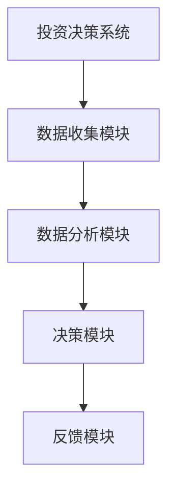
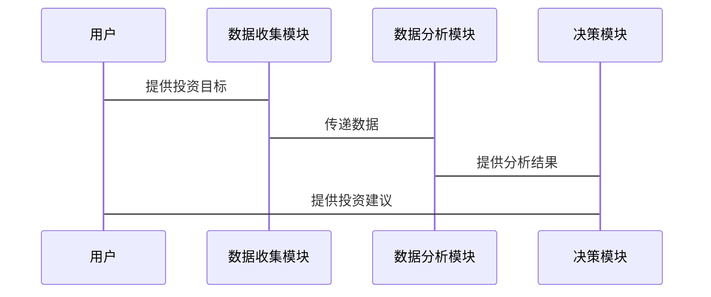

                 


# 巴菲特的投资哲学：在市场恐慌时贪婪

> 关键词：巴菲特，价值投资，市场恐慌，逆向思维，长期投资，投资策略  
> 摘要：本文深入探讨巴菲特的投资哲学，特别是他在市场恐慌时的逆向投资策略。通过分析他的投资理念、价值投资的核心原则以及实际案例，揭示如何在市场低迷时发现投资机会，实现长期收益。

---

# 目录

1. 巴菲特的投资哲学概述  
   1.1 巴菲特的生平简介  
   1.2 巴菲特的投资理念  
2. 价值投资的核心概念  
   2.1 价值投资的定义与特征  
   2.2 巴菲特的价值投资原则  
   2.3 巴菲特投资哲学与其他投资方法的对比  
3. 投资决策的系统分析  
   3.1 投资决策的系统功能设计  
   3.2 投资决策的系统架构设计  
   3.3 投资决策的接口与交互设计  
4. 投资决策的算法原理  
   4.1 投资决策的核心算法  
   4.2 投资决策的数学模型  
5. 投资决策的项目实战  
   5.1 项目环境与工具安装  
   5.2 项目核心实现  
   5.3 项目案例分析  
6. 总结与扩展  
   6.1 项目小结  
   6.2 注意事项  
   6.3 拓展阅读  

---

# 第一部分：巴菲特投资哲学概述

## 第1章：巴菲特的生平简介

### 1.1 早年经历与投资起步

沃伦·巴菲特（Warren Buffett）于1934年8月30日出生于美国内布拉斯州的奥马哈市。他从小就展现出了对数字和投资的极大兴趣。在高中时期，巴菲特就开始尝试通过购买和出售可口可乐瓶盖来赚取零花钱。这为他后来的投资生涯打下了基础。

巴菲特在哥伦比亚大学学习期间，师从本杰明·格雷厄姆（Benjamin Graham），格雷厄姆的价值投资理念对巴菲特影响深远。巴菲特在格雷厄姆的指导下，学会了如何通过分析企业的基本面来寻找低估的股票。

### 1.2 巴菲特的合伙公司时期

1956年，巴菲特创立了巴菲特合伙公司（Buffett Partnership），开始以专业的投资者身份运作。在合伙公司的早期阶段，巴菲特主要投资于低估的股票，通过长期持有来实现收益。他的投资策略逐渐成型，即买入优质企业的股票并长期持有。

### 1.3 巴菲特的伯克希尔哈撒韦时代

1965年，巴菲特收购了伯克希尔哈撒韦公司（Berkshire Hathaway），这是一家濒临破产的纺织公司。通过对其股票的长期持有和对其旗下其他子公司的投资，巴菲特将伯克希尔哈撒韦打造成了一家多元化的企业集团。这一时期，巴菲特的投资哲学逐渐成熟，并形成了他独特的价值投资风格。

---

## 第2章：巴菲特的投资理念

### 2.1 价值投资的定义与特征

价值投资是一种基于对企业内在价值评估的投资方法。巴菲特的价值投资理念强调买入低于其内在价值的股票，并长期持有。其核心在于寻找那些具有强大护城河（competitive moat）和优秀管理团队的企业。

### 2.2 巴菲特的价值投资原则

1. **买入优质企业**：巴菲特强调投资于那些具有强大竞争优势的企业。他关注企业的盈利能力、财务健康状况以及管理团队的诚信。
2. **长期持有**：巴菲而不频繁交易，认为短期市场的波动不应影响长期投资决策。
3. **市场的先生是愚蠢的**：巴菲特认为市场短期可能会因为情绪波动而低估或高估股票价格，但长期来看，股票价格会回归其内在价值。

### 2.3 巴菲特投资哲学与其他投资方法的对比

| 投资方法 | 核心理念 | 适用场景 | 优点 | 缺点 |
|----------|----------|----------|------|------|
| 价值投资 | 寻找低于内在价值的股票 | 市场恐慌或低估时期 | 稳定收益，风险较低 | 需要深入的基本面分析，周期长 |
| 趋势投资 | 追踪价格趋势 | 上涨趋势 | 短期收益高 | 风险高，需要精准判断趋势 |
| 技术分析 | 基于价格和成交量 | 适用于高频交易 | 短期信号明确 | 易受市场情绪影响 |

---

# 第二部分：投资决策的系统分析

## 第3章：投资决策的系统功能设计

### 3.1 投资决策的系统功能设计

在设计投资决策系统时，我们需要考虑以下几个关键功能模块：

1. **数据收集模块**：收集企业的财务数据、行业信息、市场数据等。
2. **数据分析模块**：对收集到的数据进行清洗、分析和建模。
3. **决策模块**：基于分析结果，生成投资建议。
4. **反馈模块**：根据市场反馈调整投资策略。

### 3.2 投资决策的系统架构设计

以下是投资决策系统的架构图：



### 3.3 投资决策的接口与交互设计

以下是系统交互的序列图：



---

## 第4章：投资决策的算法原理

### 4.1 投资决策的核心算法

以下是基于基本面分析的股票筛选算法：

```python
def 筛选低估股票(股票列表):
    低估股票 = []
    for 股票 in 股票列表:
        计算股票的内在价值
        if 股票价格 < 内在价值:
            低估股票.append(股票)
    return 低估股票
```

### 4.2 投资决策的数学模型

以下是计算市盈率（P/E）的公式：

$$ P/E = \frac{股票价格}{每股收益} $$

---

## 第5章：投资决策的项目实战

### 5.1 项目环境与工具安装

建议使用Python和Pandas库进行数据处理，使用Matplotlib进行数据可视化。

### 5.2 项目核心实现

以下是Python代码示例：

```python
import pandas as pd

# 加载数据
data = pd.read_csv('股票数据.csv')

# 计算市盈率
data['P/E'] = data['股价'] / data['每股收益']

# 筛选低估股票
低估股票 = data[data['P/E'] < data['P/E'].mean()]

print(低估股票)
```

### 5.3 项目案例分析

以2022年市场恐慌时为例，我们可以筛选出一些低估的股票。例如，假设某公司的股价为30元，每股收益为5元，市盈率为6，低于市场平均值，可以考虑买入。

---

## 第6章：总结与扩展

### 6.1 项目小结

通过本文的分析，我们了解了巴菲特的投资哲学，特别是他在市场恐慌时的逆向投资策略。价值投资的核心在于寻找低估的股票并长期持有。

### 6.2 注意事项

1. 投资需谨慎，市场波动较大，需做好风险控制。
2. 价值投资需要深入的基本面分析，建议投资者具备相关知识或咨询专业人士。
3. 长期投资需耐心，市场短期波动不影响长期价值。

### 6.3 拓展阅读

1. 《巴菲特传： investor's mind》
2. 《价值投资入门：如何找到低估的股票》
3. 《投资的逻辑：从巴菲特到彼得·林奇》

---

通过本文的学习，读者可以更好地理解巴菲特的投资哲学，并将其应用于实际投资中。希望本文能为投资者提供有价值的见解和指导。

