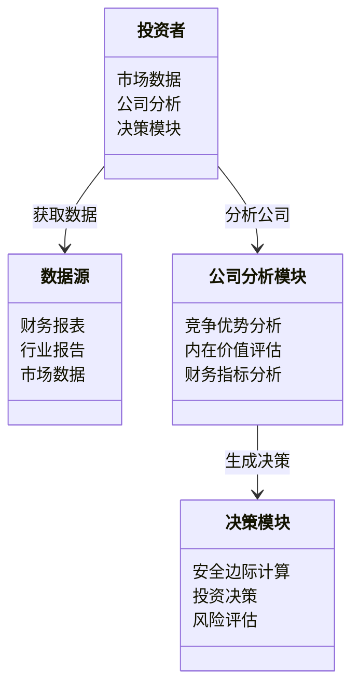
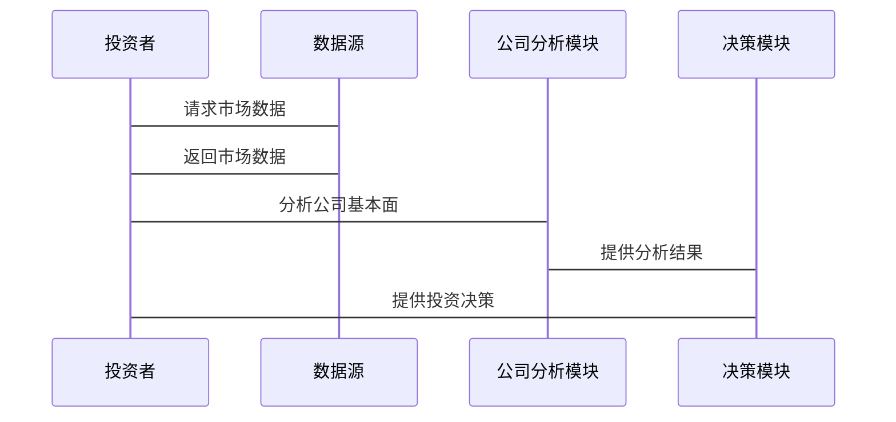

                 


# 巴菲特的投资哲学：简单但不容易

## 关键词：巴菲特，投资哲学，价值投资，安全边际，内在价值，长期投资，股票分析

## 摘要：本文深入探讨了巴菲特的投资哲学，从其核心理念到实际应用，详细分析了安全边际、内在价值和竞争优势的重要性，并结合实际案例，展示了如何将这些理论应用于投资决策。

---

## 第一部分：投资的基础与巴菲特的哲学

### 第1章：投资的基本概念

#### 1.1 投资的基本定义

##### 1.1.1 投资的定义与分类
投资是指将资金投入到某个项目或资产中，以期在未来获得收益或资本增值。投资可以分为不同的类别，如股票、债券、房地产和货币市场工具等。股票投资是最常见的形式之一，它代表了对一家公司的所有权。

##### 1.1.2 投资的目的与风险
投资的主要目的是为了获得收益，包括资本增值和分红收入。然而，投资也伴随着风险，包括市场风险、流动性风险和信用风险等。投资者需要在收益和风险之间找到平衡。

##### 1.1.3 投资与投机的区别
投资强调长期性和基本面分析，而投机则更关注短期价格波动，通常基于市场情绪和趋势。巴菲特倡导的是投资，而非投机，他强调通过深入分析企业的基本面来做出投资决策。

#### 1.2 股票市场的基本运作

##### 1.2.1 股票市场的定义
股票市场是投资者交易公司股票的场所，提供了资金流动和价格发现的功能。股票价格反映了市场的供需关系和对公司未来表现的预期。

##### 1.2.2 股票市场的参与者
主要参与者包括投资者、上市公司、经纪商、交易所和监管机构。投资者通过经纪商在交易所买卖股票，而监管机构确保市场的公平和透明。

##### 1.2.3 股票市场的波动性
股票价格受多种因素影响，如经济数据、公司业绩、行业趋势和全球事件等。市场的波动性为投资者提供了获利的机会，但也带来了风险。

### 第2章：巴菲特的投资哲学概述

#### 2.1 价值投资的定义

##### 2.1.1 价值投资的核心理念
价值投资是一种投资策略，强调以低于内在价值的价格购买优质资产。巴菲特认为，市场波动不应影响公司的内在价值，投资者应关注公司的基本面，而非短期价格波动。

##### 2.1.2 价值投资与成长投资的区别
价值投资注重安全边际和内在价值，适合于寻找被市场低估的公司。成长投资则关注公司的成长潜力和未来收益，适合于高增长的公司。巴菲特更倾向于价值投资，但也会考虑公司的成长性。

##### 2.1.3 价值投资的长期性
价值投资强调长期持有优质资产，避免频繁交易。通过长期持有，投资者可以分享公司成长的成果，并减少交易成本和税收的影响。

#### 2.2 巴菲特的投资策略

##### 2.2.1 长期持有优质股票
巴菲特认为，长期持有优质股票可以避免短期市场的波动，获得公司的长期成长收益。优质股票通常具有强大的竞争优势和稳定的盈利能力。

##### 2.2.2 安全边际的概念
安全边际是指股票的市场价格低于其内在价值的部分。通过购买具有足够安全边际的股票，投资者可以降低投资风险，并在市场波动时保护资本。

##### 2.2.3 内在价值的评估
内在价值是公司未来现金流的现值，反映了公司的实际价值。准确评估内在价值是价值投资的关键，需要对公司财务状况、行业地位和竞争优势进行深入分析。

---

## 第二部分：巴菲特的核心投资理念

### 第3章：安全边际的重要性

#### 3.1 安全边际的定义

##### 3.1.1 安全边际的计算方法
安全边际可以通过市场价格与内在价值的差异来衡量。计算公式为：安全边际 = 内在价值 - 市场价格。如果安全边际为正，说明股票被低估，具有投资价值。

##### 3.1.2 安全边际在投资中的作用
安全边际提供了风险缓冲，确保在市场波动或公司表现不佳时，投资者仍能获得正收益。它也反映了市场的非理性，为长期投资者提供了机会。

##### 3.1.3 安全边际与风险控制的关系
通过保持足够的安全边际，投资者可以降低投资风险，避免在市场下跌时承受重大损失。安全边际是价值投资中的重要组成部分，帮助投资者在不确定的市场中做出决策。

#### 3.2 安全边际的实践应用

##### 3.2.1 如何选择具有安全边际的股票
投资者需要分析公司的财务状况，评估其内在价值，并比较市场价格。选择那些市场价格显著低于内在价值的公司，可以确保足够的安全边际。

##### 3.2.2 安全边际与市场波动的关系
市场波动会影响安全边际的大小。在市场低迷时，许多股票可能被低估，提供了较大的安全边际。而在市场上涨时，安全边际可能减少，甚至消失。

##### 3.2.3 安全边际在不同市场环境下的应用
在牛市中，投资者需要更加谨慎，寻找具有稳定内在价值的公司。在熊市中，安全边际通常较大，提供了买入的机会。无论市场环境如何，保持安全边际是投资成功的关键。

### 第4章：内在价值的评估

#### 4.1 内在价值的定义

##### 4.1.1 内在价值的计算公式
内在价值的计算通常基于公司未来现金流的折现值。公式为：内在价值 = Σ(FCFt / (1 + r)^t)，其中 FCFt 是第 t 年的自由现金流，r 是折现率。

##### 4.1.2 内在价值与市场价格的关系
内在价值是股票的理论价值，而市场价格受市场情绪和供需关系影响。当市场价格低于内在价值时，股票具有投资价值。

##### 4.1.3 内在价值评估的步骤
评估内在价值需要收集公司的财务数据，分析行业前景，评估竞争优势，并选择合适的折现率。这些步骤需要投资者具备深入的分析能力和耐心。

#### 4.2 内在价值的计算方法

##### 4.2.1 现金流折现法
现金流折现法（DCF）是最常用的内在价值评估方法。它包括预测公司的未来现金流，并将其折现到现值。这种方法需要对公司的财务状况和行业前景有深入了解。

##### 4.2.2 市盈率法
市盈率法通过比较公司的市盈率与行业平均水平，评估其估值是否合理。市盈率 = 市场价格 / 每股收益。较低的市盈率可能意味着公司被低估。

##### 4.2.3 市净率法
市净率法通过比较公司的市净率与行业平均水平，评估其估值是否合理。市净率 = 市场价格 / 每股净资产。较低的市净率可能意味着公司被低估。

---

## 第三部分：巴菲特的投资策略与实践

### 第5章：竞争优势分析

#### 5.1 企业的竞争优势

##### 5.1.1 什么是竞争优势
竞争优势是指公司在行业中相对于竞争对手的独特优势，包括成本优势、品牌优势、技术优势和市场地位等。这些优势使公司在市场上更具竞争力。

##### 5.1.2 竞争优势的类型
竞争优势可以分为成本优势、差异化优势和目标聚焦优势。成本优势使公司能够以更低的价格提供产品或服务；差异化优势通过提供独特的产品或服务吸引顾客；目标聚焦优势通过专注于特定市场或客户群体，提高效率和效果。

##### 5.1.3 竞争优势与投资决策
竞争优势是评估公司投资价值的重要因素。具有强大竞争优势的公司通常能够保持较高的利润率和市场份额，从而为投资者带来长期收益。

#### 5.2 企业的财务状况

##### 5.2.1 财务健康状况的评估
财务健康状况包括公司的盈利能力、资产负债情况和现金流状况。健康的财务状况是公司长期稳定发展的基础。

##### 5.2.2 财务指标分析
常见的财务指标包括市盈率、市净率、股息率和杠杆率等。这些指标可以帮助投资者评估公司的财务状况和投资价值。

##### 5.2.3 财务指标与投资决策
财务指标是评估公司投资价值的重要工具。通过分析财务指标，投资者可以识别具有强大财务健康状况的公司，从而做出更明智的投资决策。

---

## 第四部分：系统分析与架构设计

### 第6章：投资决策系统的架构设计

#### 6.1 问题场景介绍
投资者需要在复杂多变的市场环境中做出决策，因此需要一个系统化的投资决策系统。该系统可以帮助投资者分析公司的基本面，评估内在价值，并识别具有竞争优势的公司。

#### 6.2 系统功能设计

##### 6.2.1 领域模型（mermaid 类图）


#### 6.3 系统架构设计（mermaid 架构图）


#### 6.4 系统接口设计
系统接口包括数据获取接口、分析模块接口和决策模块接口。数据获取接口用于从数据源获取市场数据和财务报表；分析模块接口用于进行公司分析和内在价值评估；决策模块接口用于生成投资决策和风险评估。

#### 6.5 系统交互设计（mermaid 序列图）


---

## 第五部分：项目实战

### 第7章：投资实战案例

#### 7.1 环境配置
需要安装Python和相关的数据分析库，如Pandas、NumPy和Matplotlib。还需要获取目标公司的财务数据和行业报告。

#### 7.2 核心实现

##### 7.2.1 内在价值计算
使用现金流折现法计算目标公司的内在价值。以下是一个Python代码示例：

```python
def calculate_intrinsic_value(free_cash_flows, discount_rate):
    intrinsic_value = 0
    for t, fcf in enumerate(free_cash_flows):
        if t == 0:
            continue
        intrinsic_value += fcf / (1 + discount_rate) ** t
    return intrinsic_value
```

##### 7.2.2 竞争优势分析
通过分析公司的财务指标和市场地位，评估其竞争优势。可以使用行业报告和财务报表中的数据进行对比分析。

##### 7.2.3 安全边际计算
计算目标公司的安全边际，确保投资的可靠性。公式为：安全边际 = 内在价值 - 市场价格。

#### 7.3 案例分析
以一家具体公司为例，分析其投资价值。例如，选择苹果公司，分析其财务状况、竞争优势和内在价值，计算安全边际，并做出投资决策。

#### 7.4 实战小结
通过实际案例分析，投资者可以更好地理解巴菲特的投资哲学，并将其应用于实际投资决策中。

---

## 第六部分：最佳实践

### 第8章：投资哲学的实践应用

#### 8.1 小结
巴菲特的投资哲学强调长期投资、安全边际和内在价值。通过深入分析公司的基本面，投资者可以做出更明智的投资决策。

#### 8.2 注意事项
投资者在应用巴菲特的投资哲学时，需要注意以下几点：
1. **深入分析**：准确评估公司的内在价值和竞争优势。
2. **长期持有**：避免短期市场波动的影响。
3. **分散投资**：降低投资风险，避免过度集中。
4. **持续学习**：市场环境不断变化，投资者需要持续学习和适应。

#### 8.3 拓展阅读
推荐阅读巴菲特的著作和相关投资书籍，如《巴菲特致股东的信》和《价值》。这些书籍提供了更深入的理论和实践指导。

---

## 结语

巴菲特的投资哲学简单但不容易，它需要投资者具备深入的分析能力、耐心和纪律性。通过长期持有优质资产和注重安全边际，投资者可以在复杂多变的市场中获得稳定的收益。希望本文能够帮助读者更好地理解和应用巴菲特的投资哲学，实现长期的投资成功。

---

