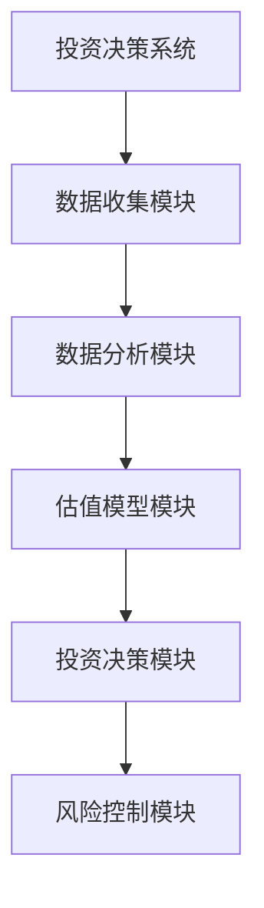

                 

# 巴菲特的投资失误：从错误中学习

## 关键词：巴菲特，投资失误，价值投资，风险管理，投资策略

## 摘要： 巴菲特作为全球最著名的投资者之一，他的投资理念和策略被广泛研究和学习。然而，即使是巴菲特也难免会犯错。本文将分析巴菲特的主要投资失误，探讨他从这些错误中吸取的教训，并总结这些教训对现代投资者的启示。通过深入分析巴菲特的投资决策过程，我们可以更好地理解如何在投资中避免类似的错误，并制定更有效的投资策略。

## 引言

沃伦·巴菲特，作为全球最成功的投资者之一，他的投资理念和策略被广泛学习和借鉴。然而，即使是巴菲特，也会犯错。本文将探讨巴菲特的主要投资失误，分析这些错误的原因，并从中学到的经验教训，为现代投资者提供宝贵的启示。

## 第一部分：巴菲特的投资理念与策略

### 第1章：巴菲特的投资理念概述

#### 1.1 价值投资的核心思想

##### 1.1.1 价值投资的定义与特点

价值投资是一种投资策略，强调购买被市场低估的股票，并长期持有，直到其价值被市场发现。巴菲特的价值投资理念强调寻找具有强大护城河、良好管理团队和持续盈利能力的公司。

##### 1.1.2 巴菲特的投资哲学与原则

巴菲特的投资哲学的核心是寻找那些具有持续竞争优势、良好治理结构和优秀管理团队的公司。他还强调安全边际的重要性，即以低于内在价值的价格买入优质资产。

##### 1.1.3 巴菲特的投资策略与选股标准

巴菲特的投资策略包括以下几点：
1. 寻找具有强大竞争优势的公司。
2. 选择具有良好治理结构和优秀管理团队的公司。
3. 考虑公司的财务状况，包括盈利能力、现金流和负债水平。
4. 考虑公司的估值，寻找被市场低估的股票。

#### 1.2 巴菲特的投资组合管理

##### 1.2.1 投资组合的构建与优化

巴菲特的投资组合构建基于长期投资和分散投资的原则。他倾向于集中投资于少数具有强大竞争优势的公司，同时保持适当的分散以降低风险。

##### 1.2.2 巴菲特的分散投资策略

虽然巴菲特强调集中投资，但他也会在不同的行业和公司中分散投资，以降低单一投资的风险。

##### 1.2.3 巴菲特对长期投资的坚持

巴菲特始终坚持长期投资的理念，认为短期市场波动不应该影响长期投资决策。

### 第2章：巴菲特的主要投资失误

#### 2.1 巴菲特早期的投资错误

##### 2.1.1 购买美国运通的教训

在20世纪70年代，巴菲特购买了美国运通的股票，但后来发现该公司存在严重的财务问题。这次错误让他意识到在投资决策中忽视了管理层诚信的重要性。

##### 2.1.2 高价买入可口可乐的反思

在20世纪80年代，巴菲特高价买入可口可乐的股票，但由于市场波动和估值过高，最终导致了损失。这次错误让他意识到估值的重要性。

##### 2.1.3 对管理层信任的过度依赖

巴菲特曾经因为信任管理层而投资于一些公司，但这些公司后来出现了问题。这次错误让他意识到，即使管理层优秀，也需要对公司的财务状况和市场环境进行深入分析。

#### 2.2 巴菲特的其他投资失误

##### 2.2.1 对市场的误判与周期性风险

在某些情况下，巴菲特对市场周期的判断失误，导致了投资损失。例如，他在2008年金融危机期间的投资决策。

##### 2.2.2 对某些行业的误判

巴菲特在某些行业上的投资决策失误，例如对某些科技公司的投资。这些错误让他意识到，即使是优秀的企业，也需要对其行业前景和竞争优势进行深入分析。

##### 2.2.3 对估值模型的过度依赖

巴菲特曾经过度依赖DCF模型进行估值，但后来发现这种方法在某些情况下并不适用。这次错误让他意识到，估值模型只是一个工具，需要结合实际情况进行调整。

### 第3章：从错误中学习的教训

#### 3.1 风险管理的重要性

##### 3.1.1 巴菲特对风险的重新认识

巴菲特意识到，风险管理是投资过程中至关重要的一环。他开始更加注重投资组合的风险控制，以避免重大损失。

##### 3.1.2 如何避免重复犯错

通过回顾过去的错误，巴菲特总结了避免重复犯错的方法，包括对管理层诚信的更严格审查和对市场周期的更深入分析。

##### 3.1.3 风险控制的具体措施

巴菲特采取了以下风险控制措施：
1. 分散投资：通过投资于不同的行业和公司来降低风险。
2. 安全边际：以低于内在价值的价格买入股票，以应对市场波动。
3. 长期持有：避免频繁交易，减少短期波动的影响。

#### 3.2 估值方法的改进

##### 3.2.1 巴菲特对DCF模型的反思

尽管DCF模型是一个有效的估值工具，但巴菲特意识到，它需要结合实际情况进行调整。他开始更加注重对公司基本面的分析，以避免对模型的过度依赖。

##### 3.2.2 如何更准确地评估企业价值

为了更准确地评估企业价值，巴菲特采取了以下措施：
1. 结合财务指标和非财务指标进行综合分析。
2. 对管理层诚信和公司治理结构进行深入调查。
3. 结合市场环境和行业趋势进行综合判断。

##### 3.2.3 估值中的常见误区

巴菲特总结了估值中的常见误区，包括：
1. 过度依赖模型：忽视了对公司基本面的分析。
2. 忽视市场环境：没有考虑到市场波动和周期性因素。
3. 低估风险管理：没有充分考虑投资组合的风险。

#### 3.3 对市场周期的再认识

##### 3.3.1 市场波动对企业估值的影响

市场波动对企业的估值有重要影响。巴菲特意识到，即使公司的基本面良好，市场波动也可能导致股价的短期下跌。

##### 3.3.2 如何在市场低谷中找到机会

在市场低谷中，巴菲特开始更加注重寻找被低估的股票，并利用市场波动进行投资布局。

##### 3.3.3 市场周期与投资策略的调整

巴菲特根据市场周期的变化，调整了他的投资策略。例如，在市场低迷时，他更加注重价值投资；在市场繁荣时，他更加注重风险控制。

### 第4章：巴菲特投资理念的现代应用

#### 4.1 价值投资与现代投资策略

##### 4.1.1 如何将巴菲特的理念与现代投资工具结合

现代投资者可以通过多种工具和策略来应用巴菲特的价值投资理念，例如利用大数据分析和人工智能技术进行投资决策。

##### 4.1.2 巴菲特理念在量化投资中的应用

量化投资者可以利用巴菲特的价值投资理念，结合量化模型进行投资决策。例如，通过量化模型筛选具有强大竞争优势和良好财务状况的公司。

##### 4.1.3 巴菲特理念与ESG投资的结合

巴菲特的价值投资理念与ESG投资理念有相似之处。现代投资者可以通过结合ESG因素，进一步优化投资决策。

#### 4.2 巴菲特投资策略的优化

##### 4.2.1 如何利用大数据分析优化投资决策

通过大数据分析，投资者可以更全面地了解公司的基本面和行业趋势，从而优化投资决策。

##### 4.2.2 巴菲特理念与人工智能的结合

人工智能技术可以帮助投资者更快速地筛选和分析数据，从而更好地应用巴菲特的价值投资理念。

##### 4.2.3 巴菲特理念在新兴行业的应用

尽管巴菲特的投资理念主要应用于传统行业，但现代投资者可以将其扩展到新兴行业，例如科技和医疗行业。

### 第5章：巴菲特投资失误的系统分析

#### 5.1 投资决策的逻辑框架

##### 5.1.1 投资决策的背景介绍

投资决策是一个复杂的过程，涉及多个因素，包括公司基本面、市场环境、管理层诚信等。

##### 5.1.2 投资决策的核心概念与联系

投资决策的核心概念包括：
1. 公司基本面：包括财务状况、盈利能力、现金流等。
2. 市场环境：包括市场趋势、行业前景等。
3. 管理层诚信：包括管理层的道德和管理能力。

##### 5.1.3 投资决策的算法原理

以下是一个简化的投资决策算法：

1. **数据收集**：收集目标公司的财务数据、市场数据和管理层信息。
2. **数据分析**：分析公司的财务状况、市场环境和管理层诚信。
3. **估值模型**：使用DCF模型或其他估值模型评估公司的内在价值。
4. **投资决策**：根据估值结果和风险偏好，决定是否投资。
5. **风险控制**：通过分散投资和安全边际控制风险。

##### 5.1.4 投资决策的数学模型

以下是一个简化的DCF模型：

$$
\text{企业价值} = \text{自由现金流的现值} + \text{终值}
$$

##### 5.1.5 投资决策的系统架构

以下是投资决策系统的架构图：

## 结论

通过对巴菲特投资失误的分析，我们可以看到，即使是经验丰富的投资者也难免会犯错。关键在于从错误中学习，优化投资策略。现代投资者可以借鉴巴菲特的经验和教训，结合现代投资工具和策略，制定更有效的投资计划。

通过本文的分析，我们总结出以下几点：
1. **风险管理**：投资过程中必须重视风险控制，通过分散投资和安全边际来降低风险。
2. **估值方法**：结合多种因素进行综合分析，避免对单一模型的过度依赖。
3. **市场周期**：根据市场环境调整投资策略，避免因市场波动而做出错误决策。
4. **持续学习**：从错误中学习，不断优化投资理念和策略。

希望本文的分析能够为现代投资者提供有价值的启示，帮助他们在投资过程中避免类似的错误，并取得更好的投资效果。

## 附录

### 附录1：巴菲特的经典言论

1. “价格是会波动的，但价值不会。”
2. “我最喜欢被别人误解的投资理念是，我只投资那些我看得懂的公司。”
3. “投资的秘诀是：在别人贪婪时恐惧，在别人恐惧时贪婪。”

### 附录2：投资案例分析

#### 案例1：可口可乐的投资教训

在20世纪80年代，巴菲特高价买入可口可乐的股票，但由于市场波动和估值过高，最终导致了损失。这次错误让他意识到，即使公司基本面良好，也需要对估值进行严格的控制。

#### 案例2：美国运通的教训

巴菲特在购买美国运通股票时，忽视了公司财务问题和管理层诚信，导致了投资损失。这次错误让他意识到，在投资决策中必须对管理层诚信进行深入调查。

### 附录3：进一步阅读

1. 《巴菲特致股东的信》
2. 《价值投资实战策略》
3. 《投资的智慧》

---

以上是本文的完整内容，希望对您有所帮助！

