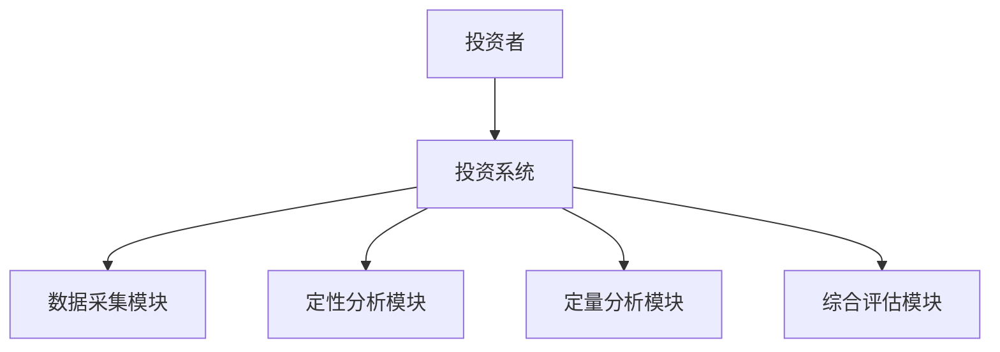
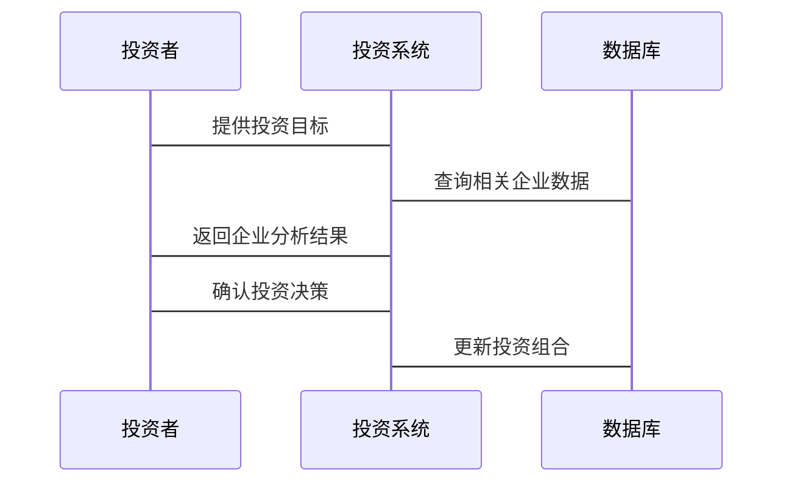

                 


# 巴菲特的投资方法论：定性分析与定量分析的结合

> 关键词：巴菲特，投资方法论，定性分析，定量分析，价值投资，安全边际

> 摘要：本文详细探讨了巴菲特的投资方法论，重点分析了其定性分析与定量分析相结合的策略。通过背景介绍、核心概念、算法原理、数学模型、系统分析、项目实战及最佳实践等多个方面，深入剖析了巴菲特的投资哲学与实践方法，为读者提供了清晰的理论框架与实用的分析工具。

---

# 第一部分：巴菲特的投资方法论概述

## 第1章：投资概述与巴菲特的生平

### 1.1 投资的基本概念

#### 1.1.1 投资的定义与分类
- **投资的定义**：投资是指将资金投入到某一领域或资产中，以期在未来获得收益或资本增值的过程。
- **投资的分类**：
  - **金融投资**：包括股票、债券、基金等。
  - **实物投资**：包括房地产、企业股权等。
  - **风险投资**：高风险高回报的投资形式。
  - **长期投资**与**短期投资**。

#### 1.1.2 投资的基本原则
- **分散投资**：降低风险。
- **长期持有**：避免频繁交易。
- **价值投资**：寻找被市场低估的资产。

#### 1.1.3 投资与投机的区别
- **投资**：基于基本面分析，追求长期稳定收益。
- **投机**：基于市场波动，追求短期价格变化。

### 1.2 巴菲特的生平简介

#### 1.2.1 巴菲特的成长经历
- **早年经历**：巴菲特从小就展现出对数字和投资的兴趣。
- **伯克希尔 Hathaway**：1965年，巴菲特收购了伯克希尔，开始他的投资生涯。
- **导师影响**：受本杰明·格雷厄姆的影响，形成了价值投资的理念。

#### 1.2.2 巴菲特的投资理念形成
- **格雷厄姆的价值投资理论**：寻找具有安全边际的股票。
- **彼得·林奇的成长投资理论**：关注企业的成长性。

#### 1.2.3 巴菲特的影响力与地位
- **财富榜单**：巴菲特长期位居富豪榜前列。
- **投资哲学**：巴菲特的投资理念被广泛学习和应用。

### 1.3 巴菲特投资方法论的核心思想

#### 1.3.1 长期投资与价值投资
- **长期投资**：巴菲特性反对频繁交易，主张长期持有优质资产。
- **价值投资**：寻找市场价格低于内在价值的股票。

#### 1.3.2 安全边际的概念
- **安全边际**：巴菲特认为，安全边际是市场价格与内在价值之间的差距，确保投资的安全性。

#### 1.3.3 投资的三大要素：价格、价值与市场先生
- **价格**：市场的报价。
- **价值**：资产的内在价值。
- **市场先生**：市场的波动性。

---

## 第2章：定性分析与定量分析的结合

### 2.1 定性分析的核心要素

#### 2.1.1 企业的商业模式
- **商业模式的定义**：企业如何创造价值并获取收益的方式。
- **巴菲特的偏好**：选择具有稳定现金流和持续竞争优势的企业。

#### 2.1.2 管理层的品质与能力
- **管理层的诚信**：巴菲特性强调管理层的诚信和责任感。
- **管理层的能力**：包括战略制定和执行能力。

#### 2.1.3 行业的竞争格局
- **行业的生命周期**：选择处于成熟期或成长期的行业。
- **竞争优势**：选择具有护城河的企业。

### 2.2 定量分析的关键指标

#### 2.2.1 财务报表分析
- **资产负债表**：分析企业的资产、负债和所有者权益。
- **利润表**：分析企业的收入、成本和利润。
- **现金流量表**：分析企业的现金流情况。

#### 2.2.2 市盈率与市净率
- **市盈率（P/E）**：股价与每股收益的比值。
- **市净率（P/B）**：股价与每股净资产的比值。

#### 2.2.3 股息率与股息支付率
- **股息率**：股息与股价的比值。
- **股息支付率**：股息与净利润的比值。

#### 2.2.4 净资产收益率（ROE）
- **ROE的计算公式**：ROE = 净利润 / 净资产。
- **ROE的意义**：反映企业的盈利能力。

#### 2.2.5 资产负债率与流动性
- **资产负债率**：负债与资产的比值。
- **流动性**：企业偿还短期债务的能力。

### 2.3 定性与定量分析的结合

#### 2.3.1 定性分析的局限性
- **难以量化**：定性分析主观性强，难以量化。

#### 2.3.2 定量分析的局限性
- **忽略非财务因素**：定量分析难以捕捉企业竞争优势等非财务因素。

#### 2.3.3 结合定性与定量分析的优势
- **全面性**：结合两者可以更全面地评估企业。

#### 2.3.4 巴菲特如何在实践中平衡定性与定量
- **优先定性**：巴菲特性强调定性分析的重要性，但也会结合定量指标。

---

## 第3章：巴菲特的选股标准与投资策略

### 3.1 巴菲特的选股标准

#### 3.1.1 寻找具有持续竞争优势的企业
- **护城河**：企业的竞争优势。

#### 3.1.2 企业具有稳定的盈利能力和现金流
- **稳定的盈利能力**：选择净利润率高的企业。
- **现金流**：选择现金流充裕的企业。

#### 3.1.3 企业管理层的诚信与能力
- **诚信**：管理层的道德水平。
- **能力**：管理层的决策能力。

#### 3.1.4 企业的估值与市场价格的匹配
- **内在价值**：企业的实际价值。
- **市场价格**：市场的报价。

### 3.2 巴菲特的投资策略

#### 3.2.1 集中投资策略
- **集中投资**：将资金集中在少数优质资产上。

#### 3.2.2 价值投资策略
- **价值投资**：寻找市场价格低于内在价值的股票。

#### 3.2.3 安全边际策略
- **安全边际**：市场价格与内在价值之间的差距。

#### 3.2.4 股票与市场的逆向投资
- **逆向投资**：在市场恐慌时买入，在市场狂热时卖出。

### 3.3 巴菲特的买入与卖出决策

#### 3.3.1 买入决策的定性与定量标准
- **定性标准**：企业的商业模式、管理层、竞争优势。
- **定量标准**：市盈率、市净率、ROE等指标。

#### 3.3.2 卖出决策的触发条件
- **价格超过内在价值**。
- **竞争优势消失**。
- **管理层出现问题**。

#### 3.3.3 长期持有与动态调整
- **长期持有**：巴菲特性主张长期持有优质资产。
- **动态调整**：定期评估投资组合，进行必要的调整。

---

## 第4章：巴菲特的定性分析框架

### 4.1 企业商业模式的分析

#### 4.1.1 商业模式的定义与分类
- **商业模式的定义**：企业如何创造价值并获取收益的方式。
- **商业模式的分类**：包括产品型、服务型、平台型等。

#### 4.1.2 巴菲特对企业商业模式的偏好
- **稳定的商业模式**：选择具有稳定现金流的企业。

#### 4.1.3 商业模式的可持续性分析
- **市场地位**：企业是否具有竞争优势。
- **盈利能力**：企业是否能持续盈利。

### 4.2 管理层的品质与能力

#### 4.2.1 管理层的诚信与道德
- **诚信的重要性**：诚信的管理层更值得信赖。

#### 4.2.2 管理层的能力与决策水平
- **决策能力**：管理层是否具备正确的决策能力。

#### 4.2.3 管理层的战略规划与执行
- **战略规划**：企业是否有明确的发展战略。
- **执行力**：管理层是否能够有效执行战略。

### 4.3 行业的竞争格局

#### 4.3.1 行业的生命周期分析
- **行业生命周期**：分为幼稚期、成长期、成熟期和衰退期。

#### 4.3.2 行业的竞争优势与劣势
- **竞争优势**：行业是否具有竞争优势。
- **劣势**：行业是否面临激烈竞争。

#### 4.3.3 行业政策与法规的影响
- **政策影响**：行业是否受到政策支持或限制。

### 4.4 企业的竞争优势

#### 4.4.1 竞争优势的定义与分类
- **竞争优势的定义**：企业在市场上独有的优势。
- **竞争优势的分类**：包括成本优势、品牌优势、技术优势等。

#### 4.4.2 巴菲特对企业竞争优势的判断
- **竞争优势的可持续性**：竞争优势是否能够长期保持。

#### 4.4.3 竞争优势的可持续性分析
- **行业地位**：企业在行业中的地位。
- **竞争对手分析**：竞争对手的优劣势。

---

## 第5章：巴菲特的定量分析方法

### 5.1 财务报表分析

#### 5.1.1 资产负债表分析
- **资产结构**：分析企业的资产构成。
- **负债情况**：分析企业的债务水平。

#### 5.1.2 利润表分析
- **收入与成本**：分析企业的收入和成本结构。
- **盈利能力**：分析企业的净利润率。

#### 5.1.3 现金流量表分析
- **现金流状况**：分析企业的现金流健康状况。

#### 5.1.4 财务指标的计算与解读
- **财务指标的计算**：如ROE、毛利率等。
- **财务指标的解读**：分析指标背后的意义。

### 5.2 市场估值指标

#### 5.2.1 市盈率（P/E）分析
- **P/E的计算公式**：P/E = 股价 / 每股收益。
- **P/E的意义**：反映市场的估值水平。

#### 5.2.2 市净率（P/B）分析
- **P/B的计算公式**：P/B = 股价 / 每股净资产。
- **P/B的意义**：反映市场的估值水平。

#### 5.2.3 股息率与股息支付率
- **股息率的计算公式**：股息率 = 股息 / 股价。
- **股息支付率的计算公式**：股息支付率 = 股息 / 净利润。

#### 5.2.4 净资产收益率（ROE）
- **ROE的计算公式**：ROE = 净利润 / 净资产。
- **ROE的意义**：反映企业的盈利能力。

### 5.3 股票与市场的逆向投资

#### 5.3.1 逆向投资的策略
- **逆向投资的定义**：在市场恐慌时买入，在市场狂热时卖出。
- **逆向投资的实施**：根据市场情绪调整投资策略。

### 5.4 安全边际策略

#### 5.4.1 安全边际的计算
- **安全边际的定义**：市场价格与内在价值之间的差距。
- **安全边际的计算**：安全边际 = 内在价值 - 市场价格。

#### 5.4.2 安全边际的意义
- **安全性**：安全边际越大，投资风险越小。

---

## 第6章：巴菲特投资方法论的系统分析

### 6.1 系统功能设计

#### 6.1.1 问题场景介绍
- **问题场景**：投资者如何选择优质股票。

#### 6.1.2 系统功能设计
- **功能模块**：
  - 数据采集：收集企业财务数据。
  - 定性分析：分析企业的商业模式、管理层、竞争优势。
  - 定量分析：计算市盈率、ROE等指标。
  - 综合评估：结合定性和定量分析，评估企业的投资价值。

#### 6.1.3 系统功能的实现步骤
- **数据采集**：收集企业的财务报表。
- **定性分析**：分析企业的商业模式、管理层、竞争优势。
- **定量分析**：计算市盈率、ROE等指标。
- **综合评估**：结合定性和定量分析，评估企业的投资价值。

### 6.2 系统架构设计

#### 6.2.1 系统架构图


#### 6.2.2 系统接口设计
- **输入接口**：投资者提供投资目标和预算。
- **输出接口**：系统输出投资建议和投资组合。

### 6.3 系统交互设计

#### 6.3.1 系统交互序列图


---

## 第7章：项目实战

### 7.1 环境安装

#### 7.1.1 投资分析工具
- **工具选择**：使用Excel或Python进行数据分析。

#### 7.1.2 数据获取
- **数据来源**：从金融数据库获取企业财务数据。

### 7.2 核心实现源代码

#### 7.2.1 数据采集代码
```python
import pandas as pd
import requests

url = "https://www.example.com/financial_data"
response = requests.get(url)
data = response.json()
df = pd.DataFrame(data)
print(df)
```

#### 7.2.2 定量分析代码
```python
def calculate_roe(net_profit, net_asset):
    return net_profit / net_asset

roe = calculate_roe(1000000, 5000000)
print(f"ROE: {roe}")
```

### 7.3 代码应用解读与分析

#### 7.3.1 数据采集的实现
- **数据采集**：从数据库中获取企业的财务数据。
- **数据清洗**：处理缺失值和异常值。

#### 7.3.2 定量分析的实现
- **计算ROE**：使用Python代码计算企业的净资产收益率。
- **计算市盈率**：使用公式：市盈率 = 股价 / 每股收益。

### 7.4 实际案例分析

#### 7.4.1 案例介绍
- **案例选择**：选择苹果公司作为分析对象。

#### 7.4.2 分析过程
- **定性分析**：分析苹果的商业模式、管理层和竞争优势。
- **定量分析**：计算苹果的ROE、市盈率等指标。

### 7.5 项目小结

#### 7.5.1 项目总结
- **项目成果**：通过定性与定量分析，评估苹果的投资价值。

#### 7.5.2 经验与教训
- **经验**：定性分析的重要性。
- **教训**：定量分析的局限性。

---

## 第8章：最佳实践、小结与注意事项

### 8.1 最佳实践

#### 8.1.1 投资策略
- **长期持有**：巴菲特性主张长期持有优质资产。
- **分散投资**：降低投资风险。

#### 8.1.2 定性与定量分析的结合
- **定性优先**：巴菲特性强调定性分析的重要性。

### 8.2 小结

#### 8.2.1 巴菲特投资方法论的核心
- **长期投资**：巴菲特性主张长期投资。
- **价值投资**：寻找市场价格低于内在价值的股票。
- **安全边际**：确保投资的安全性。

### 8.3 注意事项

#### 8.3.1 投资风险
- **市场风险**：市场波动可能影响投资收益。
- **企业风险**：企业自身经营可能影响投资价值。

#### 8.3.2 定性与定量分析的局限性
- **定性分析的主观性**：定性分析受到主观因素的影响。
- **定量分析的片面性**：定量分析难以捕捉企业竞争优势等非财务因素。

### 8.4 拓展阅读

#### 8.4.1 推荐书籍
- 《巴菲特致股东的信》
- 《价值投资实战》

#### 8.4.2 在线资源
- 巴菲特股东大会的演讲视频。
- 投资分析工具的使用教程。

---

## 总结

通过本文的详细分析，我们可以看到，巴菲特的投资方法论是定性分析与定量分析的完美结合。他不仅关注企业的内在价值，还注重企业的商业模式、管理层和竞争优势。同时，他也会利用市盈率、ROE等指标来评估企业的投资价值。投资者在实践中，应该结合定性和定量分析，制定适合自己的投资策略。

