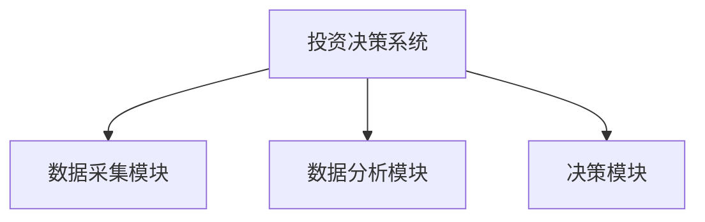

                 


# 巴菲特的投资智慧：市场先生的比喻

## 关键词：巴菲特，价值投资，市场先生，内在价值，投资决策，安全边际

## 摘要：本文深入探讨了巴菲特的投资智慧，特别是其著名的“市场先生”比喻。通过分析市场波动、内在价值、安全边际等核心概念，结合技术方法和实际案例，帮助读者理解如何在投资中应用这些理念。文章从理论到实践，详细阐述了如何利用市场先生的比喻进行投资决策，并提供了数学模型和代码实现。

---

# 第1章: 巴菲特投资智慧的概述

## 1.1 巴菲特投资理念的核心

### 1.1.1 巴菲特的投资哲学
巴菲特的投资哲学基于“价值投资”，即寻找那些被市场低估的公司，长期持有，等待其价值回归。他强调安全边际和长期投资。

### 1.1.2 巴菲特的价值投资理论
价值投资的核心是购买低于内在价值的资产，避免短期市场波动的影响。

### 1.1.3 巴菲特投资智慧的现代意义
在现代市场中，巴菲特的智慧依然适用，尤其是在应对市场波动和选择优质资产方面。

---

## 1.2 市场先生的比喻

### 1.2.1 市场先生的定义
市场先生是巴菲特用来描述市场的比喻，代表市场的非理性波动。

### 1.2.2 市场先生的特征
- 短期波动性
- 非理性
- 市场情绪化

### 1.2.3 市场先生与其他投资理论的对比
| 投资理论 | 特点 | 对比 |
|----------|------|------|
| 有效市场假说 | 市场反映所有信息 | 市场先生的比喻强调市场波动的非理性 |

---

## 1.3 本章小结
本章介绍了巴菲特的投资哲学和市场先生的比喻，为后续分析奠定了基础。

---

# 第2章: 价值投资的背景与基础

## 2.1 价值投资的起源

### 2.1.1 价值投资的起源与发展
价值投资起源于20世纪，由本杰明·格雷厄姆和戴维·多德提出，巴菲特继承并发扬了这一理论。

### 2.1.2 巴菲特对价值投资的贡献
巴菲特将价值投资应用于股票市场，强调寻找具有持续竞争优势的企业。

### 2.1.3 价值投资的核心原则
- 购买低于内在价值的资产
- 长期持有
- 强调安全边际

---

## 2.2 市场波动与投资者心理

### 2.2.1 市场波动的定义与特征
市场波动是价格与价值的偏离，反映了市场的非理性。

### 2.2.2 投资者心理与市场波动的关系
投资者心理（贪婪和恐惧）驱动市场波动，市场先生的比喻强调了这一点。

### 2.2.3 市场先生的比喻与投资者心理的联系
市场先生的比喻提醒投资者不要被短期波动影响，而应关注长期价值。

---

## 2.3 安全边际的概念

### 2.3.1 安全边际的定义
安全边际是内在价值与市场价格之间的差异，提供了投资的安全空间。

### 2.3.2 安全边际的重要性
安全边际降低了投资的风险，确保了投资的稳健性。

### 2.3.3 如何计算安全边际
$$ 安全边际 = 内在价值 - 市场价格 $$

---

## 2.4 本章小结
本章介绍了价值投资的背景、市场波动与投资者心理的关系，以及安全边际的概念。

---

# 第3章: 市场先生的比喻与投资决策

## 3.1 市场先生的比喻分析

### 3.1.1 市场先生的理性与非理性
市场先生是非理性的，价格经常偏离内在价值。

### 3.1.2 市场先生的短期波动与长期趋势
短期波动是市场先生的非理性表现，长期趋势反映了企业的实际价值。

### 3.1.3 市场先生的比喻对投资者的启示
投资者应忽略短期波动，专注于长期价值。

---

## 3.2 市场先生的特征与投资策略

### 3.2.1 市场先生的短期波动对投资者的影响
短期波动可能导致投资者恐慌或贪婪，影响投资决策。

### 3.2.2 市场先生的长期趋势与投资机会
长期趋势反映了企业的实际价值，投资者应抓住低估的机会。

### 3.2.3 市场先生的比喻对投资策略的指导意义
投资者应基于内在价值进行投资，而非关注短期波动。

---

## 3.3 本章小结
本章分析了市场先生的比喻，强调了长期投资的重要性。

---

# 第4章: 价值评估与内在价值

## 4.1 内在价值的定义与计算

### 4.1.1 内在价值的定义
内在价值是企业未来现金流的现值。

### 4.1.2 内在价值的计算方法
$$ 内在价值 = \sum_{t=1}^{n} \frac{CF_t}{(1+r)^t} $$

### 4.1.3 内在价值与市场价值的对比
内在价值是客观的，市场价值是波动的。

---

## 4.2 市场先生的比喻与内在价值

### 4.2.1 市场先生的比喻对内在价值的影响
市场先生的比喻提醒投资者关注内在价值，而非市场波动。

### 4.2.2 内在价值的稳定性与市场波动的关系
内在价值相对稳定，市场波动是短期的。

### 4.2.3 内在价值在投资决策中的作用
内在价值是投资决策的核心。

---

## 4.3 本章小结
本章详细介绍了内在价值的计算与应用。

---

# 第5章: 市场先生的比喻与投资策略

## 5.1 市场先生的比喻与投资策略

### 5.1.1 市场先生的比喻对投资策略的指导意义
投资者应基于内在价值制定投资策略。

### 5.1.2 市场先生的比喻与逆向投资
逆向投资是指在市场恐慌时买入，在市场狂热时卖出。

### 5.1.3 市场先生的比喻与长期投资
长期投资是抵御市场波动的有效策略。

---

## 5.2 安全边际与投资策略

### 5.2.1 安全边际在投资策略中的应用
安全边际提供了投资的安全空间，降低了风险。

### 5.2.2 安全边际的动态调整
随着市场变化，安全边际需要动态调整。

---

## 5.3 本章小结
本章结合市场先生的比喻，分析了安全边际与投资策略的关系。

---

# 第6章: 心理因素与市场波动

## 6.1 心理因素对市场波动的影响

### 6.1.1 心理因素的定义与分类
心理因素包括贪婪、恐惧等情绪，影响市场波动。

### 6.1.2 心理因素对市场波动的具体影响
贪婪导致市场上涨，恐惧导致市场下跌。

### 6.1.3 心理因素与市场先生的比喻
市场先生的比喻反映了心理因素对市场波动的影响。

---

## 6.2 行为偏差与投资决策

### 6.2.1 行为偏差的定义与分类
行为偏差包括确认偏差、过度自信等。

### 6.2.2 行为偏差对投资决策的影响
行为偏差可能导致投资者做出错误决策。

### 6.2.3 如何克服行为偏差
通过理性分析和长期投资，克服行为偏差。

---

## 6.3 本章小结
本章分析了心理因素和行为偏差对市场波动的影响。

---

# 第7章: 系统分析与架构设计

## 7.1 投资决策系统的构建

### 7.1.1 投资决策系统的功能模块
- 数据采集模块
- 数据分析模块
- 决策模块

### 7.1.2 数据采集模块的设计
负责采集市场数据，如股价、财务数据等。

### 7.1.3 数据分析模块的设计
负责计算内在价值、安全边际等指标。

### 7.1.4 决策模块的设计
基于分析结果，制定投资策略。

---

## 7.2 系统架构设计

### 7.2.1 系统架构图


### 7.2.2 系统接口设计
- 数据接口：与数据源对接
- 决策接口：输出投资策略

---

## 7.3 本章小结
本章设计了一个投资决策系统，用于辅助投资者做出决策。

---

# 第8章: 项目实战

## 8.1 环境安装

### 8.1.1 环境要求
- Python 3.8+
- 数据分析库（Pandas、NumPy）
- 可视化库（Matplotlib）

### 8.1.2 安装步骤
```bash
pip install pandas numpy matplotlib
```

---

## 8.2 核心代码实现

### 8.2.1 内在价值计算
```python
def calculate_intrinsic_value(cash_flow, discount_rate):
    return sum(cash_flow / (1 + discount_rate)**t for t in range(len(cash_flow)))
```

### 8.2.2 安全边际计算
```python
def calculate_margin_of_safety(intrinsic_value, market_price):
    return intrinsic_value - market_price
```

---

## 8.3 案例分析

### 8.3.1 实际案例分析
以苹果公司为例，计算其内在价值和安全边际。

### 8.3.2 投资决策
基于计算结果，制定投资策略。

---

## 8.4 本章小结
本章通过项目实战，展示了如何将市场先生的比喻应用于实际投资。

---

# 第9章: 最佳实践与小结

## 9.1 小结

### 9.1.1 核心观点回顾
- 市场先生的比喻提醒投资者关注长期价值
- 安全边际提供了投资的安全空间
- 价值投资是长期有效的策略

### 9.1.2 投资中的注意事项
- 避免情绪化决策
- 长期投资
- 选择优质资产

---

## 9.2 拓展阅读

### 9.2.1 推荐书籍
- 《巴菲特传》
- 《价值投资实战》

### 9.2.2 推荐博客
- 巴菲特股东大会实录
- 价值投资论坛

---

## 9.3 本章小结
本章总结了全文，并给出了投资中的注意事项和拓展阅读建议。

---

# 结语

通过本文的分析，我们可以看到，市场先生的比喻不仅是巴菲特投资智慧的核心，也是价值投资的重要工具。投资者应基于内在价值和安全边际，制定长期投资策略，避免情绪化决策。

