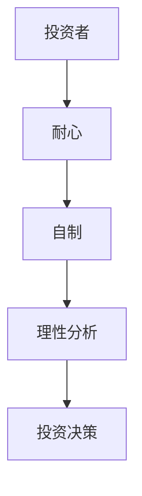

                 

# 巴菲特的投资纪律：耐心和自制的重要性

> 关键词：巴菲特、投资纪律、耐心、自制、价值投资、风险管理、长期投资

> 摘要：本文深入探讨了巴菲特的投资纪律，特别是耐心和自制的重要性。通过分析其投资策略、心态和实际案例，文章揭示了这些纪律如何帮助巴菲特实现长期投资成功，并为读者提供了实用的建议。

---

## 第一部分: 巴菲特的投资纪律概述

### 第1章: 巴菲特投资理念的背景与核心

#### 1.1 巴菲特投资理念的起源与发展

巴菲特的投资理念植根于价值投资，这种投资方法强调以低于内在价值的价格购买优质的公司股票。价值投资的起源可以追溯到本杰明·格雷厄姆，他教导巴菲特如何通过分析公司的基本面来寻找被市场低估的投资机会。巴菲特将这一理念发扬光大，强调长期持有优质股票，并在市场恐慌时寻找机会。

#### 1.2 巴菲特投资理念的核心概念

巴菲特的投资理念可以用几个核心概念来概括：

- **长期投资**：巴菲特认为市场短期波动不可预测，但长期趋势可以通过分析公司基本面来把握。
- **安全边际**：买入价格低于内在价值，以降低风险并确保有足够的安全空间。
- **企业基本面**：关注公司的财务状况、盈利能力、竞争优势和管理团队。

### 第2章: 巴菲特的投资纪律与行为准则

#### 2.1 投资纪律的核心要素

巴菲特的成功离不开他严格的纪律。以下是其投资纪律的核心要素：

- **耐心**：等待合适的机会，避免在市场波动中做出冲动决策。
- **自制**：抵制市场的短期诱惑，坚持长期投资策略。
- **理性分析**：基于事实和数据进行决策，避免情绪干扰。

#### 2.2 巴菲特投资纪律的数学模型

巴菲特的纪律可以用数学模型来描述。以下是两个关键公式：

1. 投资决策的数学公式：
   $$ \text{投资决策} = \text{耐心} \times \text{自制} \times \text{理性分析} $$

2. 耐心与自制的量化关系：
   $$ \text{耐心} + \text{自制} \geq \text{投资成功} $$

#### 2.3 投资纪律的系统架构

以下是一个系统架构的示意图：

---

## 第二部分: 巴菲特的投资策略与风险管理

### 第3章: 巴菲特的投资策略

#### 3.1 巴菲特的投资策略

- **长期投资策略**：巴菲信用长期视角看待市场，认为短期波动最终会被市场修正。
- **价值投资策略**：寻找被市场低估的公司，关注其内在价值。
- **安全边际策略**：确保买入价格远低于公司的内在价值。

#### 3.2 风险管理的核心原则

- **风险的定义与分类**：风险包括市场风险、流动性风险和公司特有风险。
- **巴菲特的风险管理方法**：通过安全边际和长期持有优质股来降低风险。
- **风险与收益的平衡**：巴菲特强调，高收益往往伴随着高风险，但通过纪律和分析可以找到高收益低风险的投资机会。

---

## 第三部分: 巴菲特的投资心态与心理因素

### 第4章: 巴菲特的投资心态与心理因素

#### 4.1 投资心态的核心要素

- **理性思维的重要性**：避免情绪化决策，坚持基于事实的分析。
- **情绪控制的关键作用**：在市场恐慌或兴奋时保持冷静。
- **长期视角的心理影响**：将短期波动视为长期趋势中的小波折。

#### 4.2 心理因素对投资决策的影响

- **情绪波动的负面影响**：贪婪和恐惧会导致错误决策。
- **理性分析的积极作用**：基于逻辑和数据做出决策，提高成功率。
- **心理定锚效应的克服**：避免被市场情绪左右，坚持自己的分析和判断。

---

## 第四部分: 巴菲特投资纪律的实际案例分析

### 第5章: 巴菲特投资纪律的实际案例分析

#### 5.1 巴菲特的经典投资案例

- **可口可乐的投资分析**：巴菲特长期持有可口可乐，因为其强大的品牌和持续的盈利能力。
- **伯克希尔 Hathaway 的投资策略**：伯克希尔作为巴菲特的投资旗舰公司，始终坚持价值投资原则。
- **避免短期波动的决策过程**：在市场恐慌时，巴菲特选择增持优质股，而不是随波逐流。

#### 5.2 投资纪律在实际中的应用

- **耐心与自制的实际体现**：巴菲Reusable在市场高估时保持耐心，等待更好的机会。
- **风险管理的案例分析**：通过安全边际和长期持有优质股来规避风险。
- **长期投资的成功经验**：巴菲Reusable的长期投资策略帮助他在市场波动中保持稳定收益。

---

## 第五部分: 巴菲特投资纪律的总结与实践

### 第6章: 巴菲特投资纪律的总结与实践

#### 6.1 巴菲特投资理念的总结

- **耐心与自制的总结**：耐心等待机会，自制避免冲动。
- **长期投资的总结**：市场短期波动不影响长期趋势。
- **价值投资的总结**：寻找被低估的优质股，长期持有。

#### 6.2 投资纪律的实践建议

- **如何培养耐心与自制**：制定明确的投资计划，避免情绪干扰。
- **如何避免情绪化决策**：基于事实和数据进行分析，坚持纪律。
- **如何制定长期投资计划**：选择优质股，定期复检投资组合。

#### 6.3 投资纪律的注意事项

- **避免过度分散投资**：集中投资于少数优质股，提高收益。
- **定期复检投资组合**：确保投资组合与长期目标一致。
- **保持学习和更新**：市场变化快，需不断学习新知识。

---

## 结语

巴菲特的投资纪律是其长期成功的基石。通过耐心、自制和理性分析，他能够在市场波动中保持冷静，抓住优质投资机会。对于投资者来说，学习巴菲特的投资纪律不仅能提高投资成功率，还能帮助我们在面对市场波动时保持冷静和理性。希望本文能为读者提供有价值的见解和启发。

