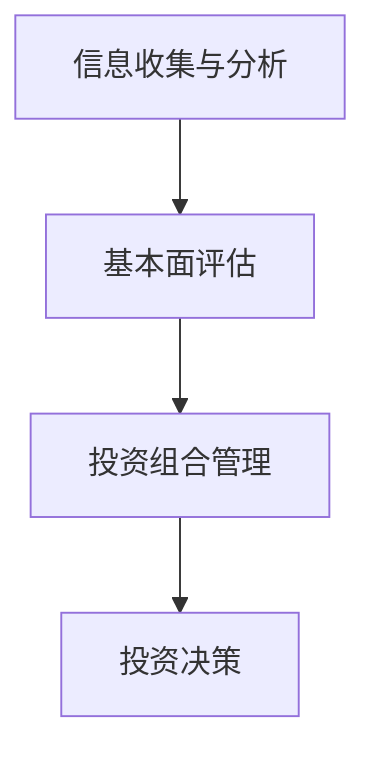

                 


# 巴菲特的投资错误：从失败中吸取教训

## 关键词：巴菲特，投资错误，价值投资，安全边际，内在价值

## 摘要：本文分析了巴菲特在投资过程中的一些失误，深入探讨了这些错误的原因，并从中学到了宝贵的经验。通过对这些错误的反思，我们可以更好地理解价值投资的真谛，优化自己的投资策略，避免类似的错误。

---

## 第1章 巴菲特的投资理念概述

### 1.1 价值投资的核心原则

#### 1.1.1 价值投资的定义与核心要素

价值投资是一种基于公司基本面分析的投资策略，其核心在于寻找市场价格低于其内在价值的股票。巴菲特的价值投资理念强调以下几点：

- **长期投资**：巴菲特认为投资是长期的事业，短期波动不应影响投资决策。
- **安全边际**：在购买股票时，应确保价格远低于其内在价值，以降低风险。
- **公司质量**：投资于具有强大护城河、良好管理团队和稳定盈利能力的公司。

#### 1.1.2 巴菲特的价值投资体系

巴菲特的价值投资体系可以总结为以下几点：

- **寻找具有持续竞争优势的公司**：这些公司能够在长期内保持较高的盈利能力。
- **关注公司的财务状况**：健康的财务状况是公司长期发展的基础。
- **关注管理层**：管理层的诚信和能力对公司的成功至关重要。

#### 1.1.3 投资中的安全边际

安全边际是价值投资中的一个重要概念，指的是市场价格低于内在价值的部分。巴菲特认为，安全边际的存在可以降低投资的风险，并为投资者提供一定的缓冲空间。

### 1.2 巴菲特的投资哲学

#### 1.2.1 长期投资与复利效应

巴菲特强调长期投资的重要性，认为复利效应是投资成功的关键。通过长期持有优质股票，投资者可以最大化复利效应，实现财富的稳步增长。

#### 1.2.2 股市的短期波动与长期趋势

尽管股市存在短期波动，但长期趋势是由公司基本面决定的。巴菲特认为，投资者应关注长期趋势，而不是短期波动。

#### 1.2.3 投资中的风险控制

巴菲特非常重视风险控制，认为降低风险是投资成功的重要因素。他通过分散投资、选择具有强大护城河的公司来降低投资风险。

---

## 第2章 巴菲特的投资成功与失败案例

### 2.1 巴菲特的经典投资成功案例

#### 2.1.1 可口可乐的投资

巴菲特在1988年买入可口可乐的股票，并长期持有。可口可乐的持续盈利能力、强大的品牌和全球市场布局使其成为巴菲特的理想投资目标。

#### 2.1.2 伯克希尔哈撒韦的收购策略

伯克希尔哈撒韦通过收购具有强大护城河的公司，实现了持续的利润增长。巴菲特的收购策略注重公司质量、管理团队和财务状况。

#### 2.1.3 避免科技股投资的原因

巴菲特认为科技股具有较高的不确定性和波动性，因此选择避免投资科技股。然而，这一决策在一定程度上限制了他对科技公司增长的参与。

### 2.2 巴菲特的投资失误分析

#### 2.2.1 对比亚迪的投资

巴菲特在2008年投资比亚迪，但后来因比亚迪的股价表现不佳而退出。这一错误可能源于对比亚迪管理层和行业前景的误判。

#### 2.2.2 对某些银行股的误判

在2008年金融危机期间，巴菲特投资了一些银行股，但这些投资表现不佳。这一错误可能源于对银行股风险的低估。

#### 2.2.3 对市场的过度乐观或悲观

巴菲特有时也会受到市场情绪的影响，导致投资决策的失误。例如，他在2007年对市场过于乐观，导致一些投资决策失误。

---

## 第3章 从失败中吸取教训

### 3.1 巴菲特的投资错误总结

#### 3.1.1 对市场情绪的过度依赖

巴菲特有时会受到市场情绪的影响，导致投资决策失误。例如，他在2007年对市场过于乐观，导致一些投资决策失误。

#### 3.1.2 对管理层信任的过度

巴菲特非常重视管理层的诚信和能力，但在某些情况下，他对管理层的信任可能过于盲目，导致投资失误。

#### 3.1.3 对行业变化的适应不足

随着市场的变化，某些行业的前景可能会发生变化。巴菲特有时未能及时调整投资策略，导致投资失误。

### 3.2 从错误中学习的经验

#### 3.2.1 坚持基本面分析的重要性

尽管市场波动会影响股价，但基本面分析是投资决策的基础。巴菲特从错误中认识到，必须始终坚持基本面分析，避免被市场情绪左右。

#### 3.2.2 灵活性与原则的平衡

巴菲特的投资原则是成功的基石，但在实际操作中，必须保持灵活性，根据市场变化和公司情况调整投资策略。

#### 3.2.3 风险管理的强化

通过投资失误，巴菲特认识到风险管理的重要性。他开始更加注重分散投资、降低风险，并在投资决策中加入更多的风险控制措施。

---

## 第4章 巴菲特投资策略的演变

### 4.1 巴菲特早期的投资策略

#### 4.1.1 集中投资理念的形成

早期，巴菲特的投资策略较为集中，注重选择具有强大护城河的公司，并长期持有。这一策略在早期取得了巨大成功。

#### 4.1.2 对保险业的早期布局

伯克希尔哈撒韦最初是一家保险公司，巴菲特通过收购保险公司，为其提供了稳定的现金流和收购其他公司的机会。

#### 4.1.3 初期对科技股的规避

早期，巴菲特对科技股持谨慎态度，认为科技股具有较高的不确定性和波动性。这种态度在一定程度上限制了他对科技公司增长的参与。

### 4.2 巴菲特投资策略的调整

#### 4.2.1 对铁路行业的投资

在2007年，巴菲特投资于铁路公司北伯林顿铁路公司（Burlington Northern Railway），这是他对运输行业的首次大规模投资。这一投资反映了他对行业变化的适应和对运输行业前景的看好。

#### 4.2.2 对苹果公司的投资

在2016年，巴菲特通过伯克希尔哈撒韦公司投资了苹果公司。这一决策表明，巴菲特开始更加关注科技行业，并愿意投资于具有强大护城河的科技公司。

#### 4.2.3 对能源行业的布局

近年来，巴菲特对能源行业进行了布局，投资于一些具有稳定收益和较强竞争优势的能源公司。这一布局反映了他对能源行业前景的看好。

---

## 第5章 巴菲特投资模型的数学分析

### 5.1 内在价值计算模型

#### 5.1.1 内在价值的定义

内在价值是指一家公司未来现金流的现值。巴菲特认为，内在价值是决定股票价格是否合理的重要依据。

#### 5.1.2 内在价值的计算公式

内在价值的计算公式如下：

$$
\text{内在价值} = \sum_{t=1}^{\infty} \frac{\text{现金流}_t}{(1 + r)^t}
$$

其中，$r$ 是折现率，$\text{现金流}_t$ 是第 $t$ 年的现金流。

#### 5.1.3 内在价值计算的注意事项

- **现金流预测**：现金流预测需要基于对公司未来盈利能力的分析。
- **折现率的选择**：折现率的选择会影响内在价值的计算结果，通常使用公司的资本成本作为折现率。
- **风险因素**：内在价值计算需要考虑公司的风险因素，包括行业风险、财务风险等。

### 5.2 市场先生的波动模型

#### 5.2.1 市场先生的定义

市场先生是指市场情绪的化身，市场情绪的变化会影响股票价格的波动。巴菲特将市场先生视为一个“情绪化”的存在，认为投资者应理性应对市场的波动。

#### 5.2.2 波动对投资决策的影响

市场波动对投资决策有重要影响。巴菲特认为，投资者应避免被市场波动左右，而是应关注公司的基本面。

#### 5.2.3 投资者如何应对市场波动

- **保持冷静**：投资者应保持冷静，避免被市场波动影响。
- **关注基本面**：投资者应关注公司的基本面，而不是市场的短期波动。
- **长期投资**：通过长期投资，投资者可以规避市场的短期波动风险。

---

## 第6章 巴菲特投资决策的系统分析

### 6.1 投资决策流程

#### 6.1.1 信息收集与分析

巴菲特的投资决策流程始于信息收集与分析。他通过阅读公司财报、行业报告等资料，深入了解公司的经营状况和行业前景。

#### 6.1.2 基本面评估

在信息收集与分析的基础上，巴菲特会对公司的基本面进行评估，包括公司的盈利能力、财务状况、管理层能力等。

#### 6.1.3 投资组合管理

在基本面评估的基础上，巴菲特会根据公司的内在价值和市场估值，决定是否投资以及投资的比例。

### 6.2 系统架构图

以下是一个简化的系统架构图，展示了巴菲特的投资决策流程：



### 6.3 系统功能设计

#### 6.3.1 信息收集与分析

投资者需要收集与分析公司的财务报表、行业报告等信息，以评估公司的经营状况和行业前景。

#### 6.3.2 基本面评估

通过对公司财务状况、管理层能力和行业前景的评估，投资者可以判断公司的内在价值和投资风险。

#### 6.3.3 投资组合管理

根据评估结果，投资者可以调整投资组合，优化资产配置，降低投资风险。

---

## 第7章 项目实战

### 7.1 环境安装

要进行巴菲特投资模型的数学分析，需要安装以下环境：

- **Python**：用于数学计算和数据分析。
- **Matplotlib**：用于绘制图表。
- **Pandas**：用于数据处理。

### 7.2 核心实现源代码

以下是一个简单的内在价值计算的Python代码示例：

```python
import numpy as np

def calculate_intrinsic_value(cash_flows, discount_rate):
    present_value = 0
    for t in range(len(cash_flows)):
        cash_flow = cash_flows[t]
        present_value += cash_flow / (1 + discount_rate) ** t
    return present_value

# 示例数据
cash_flows = [100, 200, 300, 400, 500]
discount_rate = 0.1

# 计算内在价值
intrinsic_value = calculate_intrinsic_value(cash_flows, discount_rate)
print("内在价值：", intrinsic_value)
```

### 7.3 实际案例分析

以可口可乐为例，假设未来五年的现金流分别为100、150、200、250、300（单位：百万美元），折现率为10%。计算其内在价值：

$$
\text{内在价值} = \frac{100}{1.1^1} + \frac{150}{1.1^2} + \frac{200}{1.1^3} + \frac{250}{1.1^4} + \frac{300}{1.1^5}
$$

计算结果：

$$
\text{内在价值} ≈ 445.33 \text{百万美元}
$$

---

## 第8章 最佳实践

### 8.1 小结

通过对巴菲特投资错误的分析，我们可以看到，投资决策中需要综合考虑多种因素，包括市场情绪、公司基本面、行业变化等。投资者应从巴菲特的错误中吸取教训，优化自己的投资策略。

### 8.2 注意事项

- **避免盲目模仿**：投资者应根据自己的情况调整投资策略。
- **注重风险管理**：投资者应注重分散投资，降低风险。
- **持续学习**：投资是一个不断学习和调整的过程。

### 8.3 拓展阅读

- **《巴菲特致股东的信》**：巴菲特的投资理念和决策过程。
- **《价值投资入门》**：学习价值投资的基本原理和方法。

---

通过本文的分析，我们可以看到，巴菲特的投资错误为我们提供了宝贵的经验和教训。投资者应从这些错误中吸取教训，优化自己的投资策略，避免类似的错误。同时，投资者应注重风险管理，保持冷静，避免被市场情绪左右。只有这样，才能在投资领域取得长期的成功。

