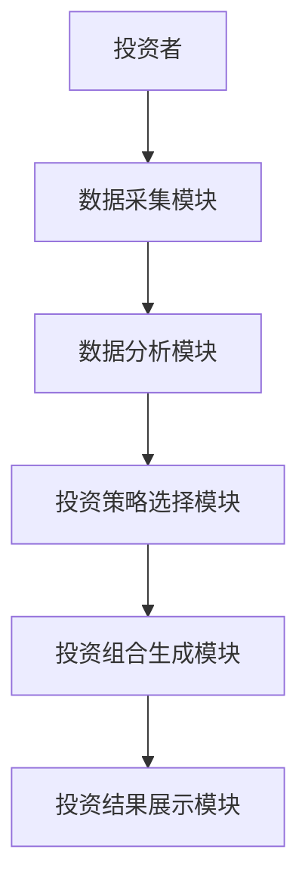

                 


# 巴菲特的投资风格：价值投资vs指数投资

## 关键词：价值投资，指数投资，巴菲特，投资策略，投资分析

## 摘要：本文详细分析了巴菲特的投资风格，对比了价值投资和指数投资的核心理念、优劣势及应用场景。通过系统化的分析和实例，帮助读者理解两种投资策略的特点，并结合数学模型和系统架构，探讨如何在实际投资中应用这些策略。

---

## 第一章：投资的基础概念

### 1.1 投资的定义与分类

#### 1.1.1 投资的定义
投资是将资金投入某个项目或资产，以期在未来获得收益或资本增值的行为。投资可以分为金融投资和实体投资，金融投资包括股票、债券、基金等，实体投资则涉及房地产、制造业等领域。

#### 1.1.2 投资的主要分类
- **股票投资**：购买公司股份，成为股东，分享公司收益。
- **债券投资**：购买政府或企业发行的债券，定期获得利息收益。
- **基金投资**：通过购买基金间接投资于多种资产。
- **指数投资**：通过跟踪指数（如标普500）进行分散化投资。

#### 1.1.3 投资的目标与风险
- **目标**：实现财富增值，分散风险，保值增值。
- **风险**：市场波动、流动性风险、通货膨胀风险等。

### 1.2 巴菲特的投资理念

#### 1.2.1 巴菲特的生平简介
沃伦·巴菲特（Warren Buffett）是世界著名投资家，1934年生于美国 Omaha。他通过长期的价值投资，积累了巨额财富，并成为伯克希尔哈撒韦公司的董事长兼首席执行官。

#### 1.2.2 巴菲特的价值投资理念
- **长期持有**：巴菲特强调长期投资，避免频繁交易。
- **安全边际**：买入价格低于内在价值，确保安全空间。
- **企业基本面分析**：注重企业的盈利能力、财务状况和竞争优势。

---

## 第二章：价值投资的核心要素

### 2.1 价值投资的定义与原理

#### 2.1.1 价值投资的定义
价值投资是一种投资策略，通过分析企业的内在价值，寻找市场价格低于内在价值的投资机会。

#### 2.1.2 价值投资的核心原则
- **市场先生理论**：市场情绪波动，提供买入机会。
- **Margin of Safety（安全边际）**：买入价格低于内在价值，降低风险。
- **长期视角**：关注企业的长期盈利能力。

### 2.2 巴菲特的选股标准

#### 2.2.1 企业基本面分析
- **盈利能力**：ROE（净资产收益率）高且稳定。
- **财务状况**：低负债，现金流健康。
- **竞争优势**：企业具备护城河，如品牌、技术、成本优势。

#### 2.2.2 投资心态
- **耐心**：长期持有优质资产。
- **理性**：避免情绪化决策，注重逻辑分析。

#### 2.2.3 风险管理
- **分散投资**：通过投资不同类型资产降低风险。
- **止损机制**：设定止损点，避免重大损失。

---

## 第三章：指数投资的原理与策略

### 3.1 指数投资的定义与特点

#### 3.1.1 指数投资的定义
指数投资是通过复制某个市场指数的表现，进行被动投资。常见指数包括标普500、道琼斯指数等。

#### 3.1.2 指数投资的特点
- **分散化**：投资多个资产，降低风险。
- **低成本**：指数基金费用低，适合长期投资。
- **被动管理**：无需频繁交易，减少摩擦成本。

### 3.2 指数投资的优势

#### 3.2.1 分散化优势
通过投资指数基金，投资者可以同时持有多个资产，降低单一资产的风险。

#### 3.2.2 成本优势
指数基金的管理费用低于主动管理型基金，长期累积收益更高。

#### 3.2.3 简单易行
无需选股和市场预测，适合普通投资者。

---

## 第四章：价值投资与指数投资的对比分析

### 4.1 价值投资的核心要素

#### 4.1.1 投资目标
- 长期资本增值，寻找低估资产。

#### 4.1.2 投资策略
- 选择优质企业，长期持有。

### 4.2 指数投资的核心要素

#### 4.2.1 投资目标
- 模拟市场表现，获得平均收益。

#### 4.2.2 投资策略
- 分散化投资，降低风险。

### 4.3 对比分析

#### 4.3.1 投资目标对比
| 投资策略 | 投资目标 |
|----------|----------|
| 价值投资 | 高于市场的超额收益 |
| 指数投资 | 获得市场平均收益 |

#### 4.3.2 投资风险对比
| 投资策略 | 风险特点 |
|----------|----------|
| 价值投资 | 高风险（集中投资） |
| 指数投资 | 低风险（分散投资） |

#### 4.3.3 投资结果对比
| 投资策略 | 投资结果 |
|----------|----------|
| 价值投资 | 有可能获得超额收益，但需要精准选股和长期持有 |
| 指数投资 | 稳定获得市场平均收益，适合长期投资 |

---

## 第五章：价值投资与指数投资的优劣势分析

### 5.1 价值投资的优势

#### 5.1.1 长期收益潜力
通过选择优质企业，长期持有，可能获得超额收益。

#### 5.1.2 深度分析
深入研究企业基本面，避免短期市场波动影响决策。

### 5.2 指数投资的优势

#### 5.2.1 分散化优势
降低单一资产风险，适合风险承受能力较低的投资者。

#### 5.2.2 低成本
管理费用低，适合长期投资。

---

## 第六章：系统分析与架构设计

### 6.1 系统功能设计

#### 6.1.1 领域模型


#### 6.1.2 系统架构


### 6.2 系统接口设计

#### 6.2.1 数据接口
- **输入**：市场数据、企业基本面数据。
- **输出**：投资建议、组合配置。

#### 6.2.2 用户接口
- **输入**：用户风险偏好、资金规模。
- **输出**：推荐的投资策略、组合表现。

---

## 第七章：项目实战

### 7.1 环境安装

#### 7.1.1 安装Python
```bash
python --version
pip install numpy pandas matplotlib
```

### 7.2 核心代码实现

#### 7.2.1 价值投资模拟
```python
import pandas as pd
import numpy as np

# 模拟数据
np.random.seed(42)
returns = np.random.normal(0.07, 0.15, 100)
cumulative_returns = np.cumsum(returns + 1) - 1

# 价值投资策略
def value_investment_strategy(prices, criteria):
    pass

# 指数投资模拟
def index_fund_simulation(prices):
    pass

# 可视化
import matplotlib.pyplot as plt
plt.plot(cumulative_returns)
plt.title('投资组合表现')
plt.xlabel('时间')
plt.ylabel('累积收益')
plt.show()
```

### 7.3 案例分析

#### 7.3.1 价值投资案例
- 选择具备强大竞争优势的企业，长期持有，获得超额收益。

#### 7.3.2 指数投资案例
- 投资标普500指数基金，获得市场平均收益。

---

## 第八章：最佳实践与小结

### 8.1 最佳实践

#### 8.1.1 投资心态
- 避免贪婪和恐惧，保持理性。

#### 8.1.2 风险管理
- 设定止损点，控制仓位。

#### 8.1.3 持续学习
- 关注经济动态，提升投资知识。

### 8.2 小结

价值投资和指数投资各有优劣，投资者应根据自身情况选择合适策略。价值投资适合具备选股能力的投资者，指数投资适合追求稳定收益的投资者。

### 8.3 注意事项

- 投资需谨慎，建议在专业人士指导下进行。
- 长期投资需考虑通货膨胀和经济周期的影响。

### 8.4 拓展阅读

- 《巴菲特致股东的信》
- 《指数投资策略》

---

通过以上步骤，您可以系统地理解和应用价值投资和指数投资的策略，结合实际案例和系统设计，做出更明智的投资决策。

