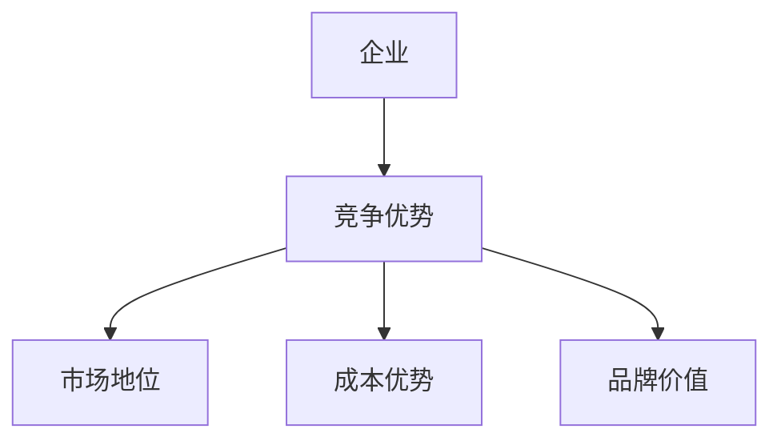
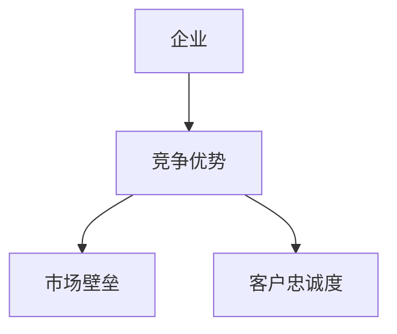
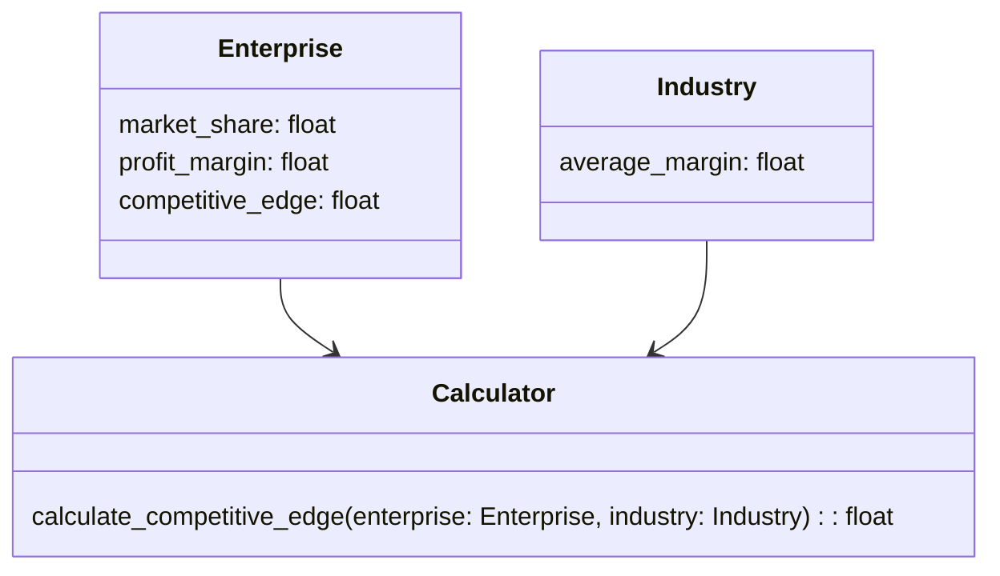
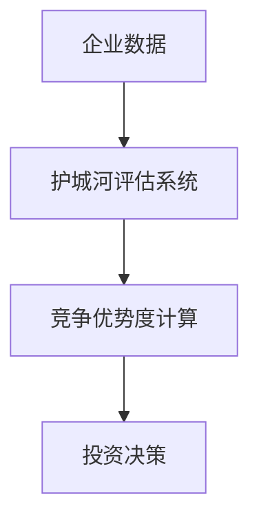
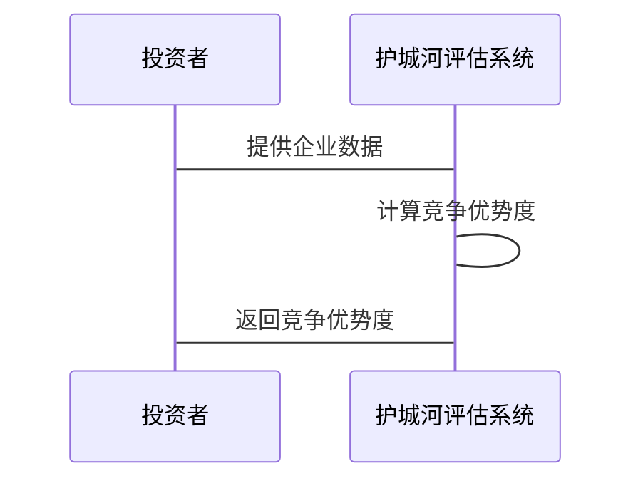

                 


# 巴菲特的护城河理论

## 关键词
- 巴菲特投资理论
- 护城河战略
- 企业竞争优势
- 投资决策模型
- 投资风险管理

## 摘要
本文深入探讨了巴菲特的护城河理论，从其背景、核心概念到数学模型、系统架构，再到项目实战和最佳实践，全面解析了该理论在投资决策中的应用。通过详细的技术分析和实际案例，本文揭示了如何利用护城河理论识别具有持续竞争优势的企业，从而制定有效的投资策略。

---

# 巴菲特的护城河理论

## 第1章: 巴菲特的护城河理论背景

### 1.1 巴菲特的生平与投资理念

#### 1.1.1 巴菲特的早年经历与投资起步
沃伦·巴菲特，1934年出生于美国奥马哈市，是一位传奇的投资家和慈善家。他在童年时期展现出对数字和投资的浓厚兴趣。15岁时，巴菲特开始研究价值投资理论，并在19岁写下《聪明的投资者》一书，奠定了他投资理念的基础。

#### 1.1.2 巴菲特的价值投资哲学
巴菲特的价值投资哲学强调长期持有优质资产，寻找那些具有持续竞争优势和合理估值的企业。他认为市场的短期波动是噪声，而企业的内在价值才是决定投资回报的关键。

#### 1.1.3 巴菲特投资理念的核心思想
巴菲特的投资理念的核心是寻找具有强大护城河的企业，这些企业能够在长期内保持竞争优势，从而为股东创造稳定的收益。

### 1.2 护城河理论的起源与演变

#### 1.2.1 护城河理论的提出背景
护城河理论由巴菲特提出，旨在帮助企业识别和评估其竞争优势。在20世纪90年代，随着企业竞争的加剧，护城河理论逐渐成为投资分析中的重要工具。

#### 1.2.2 护城河理论的核心思想
护城河理论认为，企业的竞争优势可以分为四种类型：成本优势、品牌优势、网络效应和知识产权。这些优势能够帮助企业抵御竞争对手，保持市场份额。

#### 1.2.3 护城河理论的现代发展
随着商业环境的变化，护城河理论也在不断发展。现代护城河理论更加注重企业的创新能力、数字化转型和全球化的布局。

### 1.3 护城河理论在企业投资中的应用价值

#### 1.3.1 护城河理论对企业竞争优势的分析
护城河理论帮助企业识别其核心竞争优势，从而制定更有针对性的发展战略。

#### 1.3.2 护城河理论在投资决策中的作用
投资者可以通过分析企业的护城河，判断其长期盈利能力，从而做出更明智的投资决策。

#### 1.3.3 护城河理论的局限性与适用场景
护城河理论在分析企业时可能忽略外部环境的不确定性，因此在实际应用中需要结合其他因素进行综合评估。

---

## 第2章: 护城河理论的核心概念与分析框架

### 2.1 护城河的定义与核心要素

#### 2.1.1 护城河的定义
护城河是指企业所拥有的竞争优势，这些优势能够帮助企业在长期内抵御竞争对手，保持市场份额和盈利能力。

#### 2.1.2 护城河的核心要素分析
护城河的核心要素包括：
1. 成本优势：企业能够以更低的成本生产产品或服务。
2. 品牌优势：强大的品牌能够吸引更多的客户。
3. 网络效应：用户数量的增加会增强产品的价值。
4. 知识产权：专利、商标等知识产权保护企业的竞争优势。

#### 2.1.3 护城河的分类与特点
护城河可以分为结构性护城河和动态性护城河。结构性护城河是基于企业的地理位置、资源等静态因素，而动态性护城河则是基于企业的创新能力、管理能力等动态因素。

### 2.2 护城河的数学模型与分析方法

#### 2.2.1 护城河的数学模型构建
护城河的数学模型可以通过企业竞争优势的评估指标来构建。例如，可以使用市场份额、利润率、成本控制等指标来量化企业的竞争优势。

#### 2.2.2 护城河的量化分析方法
以下是护城河的量化分析方法的公式：
$$
\text{竞争优势度} = \frac{\text{市场份额} \times \text{利润率}}{\text{行业平均利润率}}
$$
该公式可以用来衡量企业在行业中的竞争优势程度。

#### 2.2.3 护城河的评估指标与公式
护城河的评估指标包括市场份额、客户忠诚度、品牌影响力等。以下是客户忠诚度的计算公式：
$$
\text{客户忠诚度} = \frac{\text{重复购买率}}{\text{总客户数}}
$$

### 2.3 护城河的系统架构与实体关系

#### 2.3.1 护城河的系统架构图
以下是护城河的系统架构图：


#### 2.3.2 护城河的实体关系图
以下是护城河的实体关系图：


---

## 第3章: 护城河理论的算法原理与实现

### 3.1 护城河的算法原理

#### 3.1.1 护城河的识别算法
护城河的识别算法主要用于识别企业是否具有护城河。以下是识别算法的步骤：
1. 收集企业的市场份额、利润率等数据。
2. 分析企业的竞争优势类型。
3. 判断企业是否具备持续竞争优势。

#### 3.1.2 护城河的评估算法
护城河的评估算法用于评估企业护城河的强弱。以下是评估算法的步骤：
1. 计算企业的竞争优势度。
2. 比较企业竞争优势度与行业平均水平。
3. 给出护城河的评估结果。

#### 3.1.3 护城河的优化算法
护城河的优化算法用于帮助企业优化其竞争优势。以下是优化算法的步骤：
1. 识别企业的竞争优势类型。
2. 分析竞争对手的护城河。
3. 制定优化策略。

### 3.2 护城河算法的Python实现

#### 3.2.1 环境安装与依赖管理
以下是安装Python环境和依赖的代码：
```bash
pip install numpy pandas matplotlib
```

#### 3.2.2 核心算法实现代码
以下是护城河评估算法的Python代码：
```python
import numpy as np
import pandas as pd

def calculate_competitive_edge(enterprise_data):
    market_share = enterprise_data['market_share']
    profit_margin = enterprise_data['profit_margin']
    industry_average_margin = enterprise_data['industry_average_margin']
    
    competitive_edge = (market_share * profit_margin) / industry_average_margin
    return competitive_edge

enterprise_data = {
    'market_share': 0.3,
    'profit_margin': 0.25,
    'industry_average_margin': 0.15
}

result = calculate_competitive_edge(enterprise_data)
print(f"竞争优势度: {result}")
```

#### 3.2.3 算法原理的数学模型和公式
以下是护城河评估算法的数学模型：
$$
\text{竞争优势度} = \frac{\text{市场份额} \times \text{利润率}}{\text{行业平均利润率}}
$$

---

## 第4章: 护城河理论的系统分析与架构设计

### 4.1 问题场景介绍
护城河理论可以帮助投资者识别具有持续竞争优势的企业。本文将通过一个案例分析，展示如何利用护城河理论进行投资决策。

### 4.2 项目介绍
本文将通过Python代码实现护城河评估算法，并结合实际案例进行分析。

### 4.3 系统功能设计

#### 4.3.1 领域模型设计
以下是领域模型设计的Mermaid类图：


### 4.4 系统架构设计

#### 4.4.1 系统架构图
以下是系统架构图：


### 4.5 系统交互设计

#### 4.5.1 系统交互图
以下是系统交互图：


---

## 第5章: 项目实战

### 5.1 环境安装与系统核心实现

#### 5.1.1 环境安装
以下是安装Python环境和依赖的代码：
```bash
pip install numpy pandas matplotlib
```

#### 5.1.2 核心算法实现
以下是护城河评估算法的Python代码：
```python
import numpy as np
import pandas as pd

def calculate_competitive_edge(enterprise_data):
    market_share = enterprise_data['market_share']
    profit_margin = enterprise_data['profit_margin']
    industry_average_margin = enterprise_data['industry_average_margin']
    
    competitive_edge = (market_share * profit_margin) / industry_average_margin
    return competitive_edge

enterprise_data = {
    'market_share': 0.3,
    'profit_margin': 0.25,
    'industry_average_margin': 0.15
}

result = calculate_competitive_edge(enterprise_data)
print(f"竞争优势度: {result}")
```

### 5.2 代码应用解读与分析
以下是代码应用解读与分析：
1. 首先，我们导入了必要的库：numpy 和 pandas。
2. 然后，我们定义了计算竞争优势度的函数 `calculate_competitive_edge`。
3. 接着，我们提供了企业数据，包括市场份额、利润率和行业平均利润率。
4. 最后，我们调用函数并输出结果。

### 5.3 实际案例分析
以下是护城河理论的实际案例分析：
1. 案例背景：假设我们正在分析一家科技公司，其市场份额为30%，利润率25%，行业平均利润率为15%。
2. 计算竞争优势度：$$0.3 \times 0.25 / 0.15 = 0.5$$
3. 结论：竞争优势度为0.5，表明该企业具有较强的护城河。

### 5.4 项目小结
通过本项目，我们展示了如何利用护城河理论进行投资决策，并提供了实际案例分析。

---

## 第6章: 最佳实践 tips、小结、注意事项、拓展阅读

### 6.1 最佳实践 tips
1. 在使用护城河理论进行投资决策时，应结合其他因素进行综合评估。
2. 定期更新企业数据，以确保评估结果的准确性。

### 6.2 小结
本文深入探讨了巴菲特的护城河理论，从其背景、核心概念到数学模型、系统架构，再到项目实战和最佳实践，全面解析了该理论在投资决策中的应用。

### 6.3 注意事项
1. 护城河理论在实际应用中可能受到外部环境变化的影响，因此需要动态调整。
2. 在使用护城河理论进行投资决策时，应避免仅依赖单一指标。

### 6.4 拓展阅读
1. 巴菲特的《聪明的投资者》
2. 《竞争优势：如何识别具有持续竞争优势的企业》

---

# 关键词
- 巴菲特投资理论
- 护城河战略
- 企业竞争优势
- 投资决策模型
- 投资风险管理

---

# 摘要
本文深入探讨了巴菲特的护城河理论，从其背景、核心概念到数学模型、系统架构，再到项目实战和最佳实践，全面解析了该理论在投资决策中的应用。通过详细的技术分析和实际案例，本文揭示了如何利用护城河理论识别具有持续竞争优势的企业，从而制定有效的投资策略。

