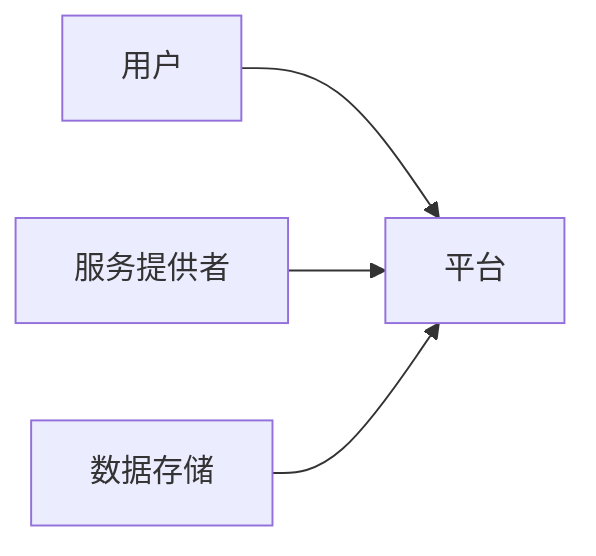
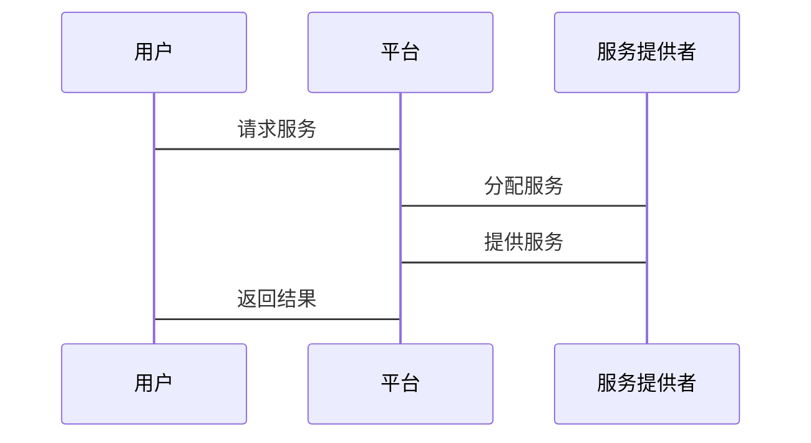

                 


# 巴菲特的护城河理论3.0：平台经济和网络效应

## 关键词

- 巴菲特
- 护城河理论
- 平台经济
- 网络效应
- 商业模式

## 摘要

本文探讨巴菲特护城河理论的最新发展，特别是其在平台经济和网络效应中的应用。通过分析平台经济的运作机制、网络效应的数学模型以及系统架构设计，本文为现代企业构建竞争优势提供了新的视角和策略。

---

## 目录

1. [背景介绍](#背景介绍)
2. [核心概念与联系](#核心概念与联系)
3. [算法原理讲解](#算法原理讲解)
4. [系统分析与架构设计方案](#系统分析与架构设计方案)
5. [项目实战](#项目实战)
6. [最佳实践](#最佳实践)

---

## 背景介绍

### 1.1 护城河理论的起源与演变

护城河理论由巴菲特提出，旨在帮助企业建立竞争优势。随着商业环境的变化，理论不断演变：

- **1.0版本**：基于传统行业，通过成本优势、品牌效应等构建护城河。
- **2.0版本**：引入互联网和数字化技术，关注数据和技术驱动的竞争优势。
- **3.0版本**：结合平台经济和网络效应，强调生态系统的构建和多边市场的价值。

### 1.2 平台经济的基本构成

平台经济通过中介作用连接多方参与者，创造新的价值：

- **用户角色**：消费者、服务提供者、内容创作者等。
- **平台价值**：通过撮合交易或提供服务，创造双边网络效应。
- **网络效应**：用户数量增加时，平台价值呈指数级增长。

---

## 核心概念与联系

### 2.1 平台经济的商业模式

平台经济通过多边市场和网络效应实现价值：

- **免费模式**：吸引用户免费使用，通过增值服务或广告盈利。
- **盈利模式**：通过交易佣金、订阅服务或数据变现。

### 2.2 网络效应的数学模型

网络效应的强度可以用公式表示：

$$ \text{平台价值} = f(u, e) $$

其中，u为用户数量，e为网络效应强度。

网络效应的分类：

- **直接网络效应**：用户数量增加，单边用户价值提升。
- **间接网络效应**：用户数量增加，多边用户价值提升。

---

## 算法原理讲解

### 3.1 网络效应的强度评估

通过算法评估网络效应的强度：

1. 采集用户数据。
2. 计算用户间交互频率。
3. 评估网络效应强度。

公式：

$$ e = \frac{\sum_{i=1}^{u} \text{交互频率}_i}{u} $$

### 3.2 平台价值计算

平台价值公式：

$$ V = k \cdot e \cdot u $$

其中，k为平台效率系数。

---

## 系统分析与架构设计方案

### 4.1 系统功能设计

- **用户管理**：注册、登录、权限管理。
- **服务匹配**：基于用户需求推荐服务提供者。
- **数据处理**：实时处理用户和交易数据。

### 4.2 系统架构设计

使用Mermaid绘制系统架构图：



### 4.3 系统接口设计

- 用户接口：API用于用户注册、登录。
- 服务接口：API用于服务提供者接入和数据同步。

### 4.4 系统交互设计

使用Mermaid绘制交互流程图：



---

## 项目实战

### 5.1 案例分析

以社交平台为例：

- **用户数量**：u = 1000
- **网络效应强度**：e = 0.8
- **平台价值**：V = 0.8 * 1000 = 800

### 5.2 实际应用

- **环境安装**：安装必要的开发工具和数据库。
- **代码实现**：实现用户注册、登录和数据处理功能。

示例代码：

```python
# 用户注册
def register(user):
    # 数据库操作
    pass

# 用户登录
def login(user):
    # 验证用户
    pass
```

---

## 最佳实践

### 6.1 注意事项

- 定期评估网络效应强度。
- 优化平台效率系数k。

### 6.2 项目小结

通过平台经济和网络效应，企业可以构建强大的护城河，增强竞争力。

