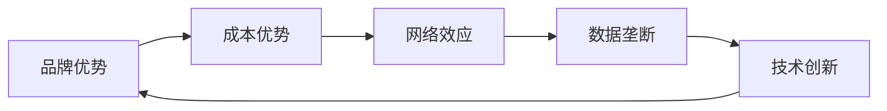
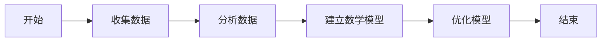
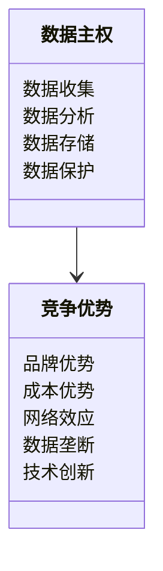
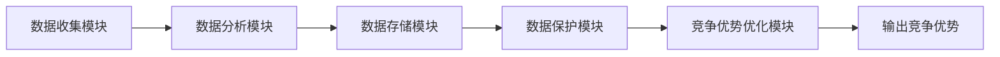
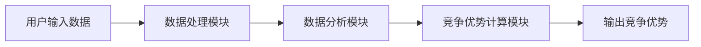

                 


---

# 巴菲特的护城河理论5.0：数据主权时代的竞争优势

> **关键词**：巴菲特护城河理论、数据主权、企业竞争优势、数学模型、算法实现、系统架构设计  
> **摘要**：本文详细阐述了巴菲特护城河理论的5.0版本，结合数据主权时代的商业环境，分析了数据作为核心资产对企业竞争优势的影响。通过数学模型、算法实现和系统架构设计，探讨了如何在数据驱动的经济模式中构建可持续的竞争优势。文章内容涵盖了从理论到实践的全过程，包括项目实战、最佳实践和未来趋势的展望。

---

## 第一部分：巴菲特护城河理论5.0概述

### 第1章：巴菲特护城河理论5.0的背景与核心概念

#### 1.1 护城河理论的起源与发展

##### 1.1.1 护城河理论的起源
巴菲特的护城河理论是投资学中的经典理论，最初提出于20世纪90年代。护城河是指企业在市场竞争中所具有的独特优势，这些优势可以阻止竞争对手进入市场或削弱企业的竞争优势。护城河的核心在于企业通过某种形式的壁垒（如成本优势、品牌效应、网络效应等）来保护自己的市场份额和盈利能力。

##### 1.1.2 各个版本的演进与变化
随着商业环境的变化，护城河理论经历了多个版本的演变。从最初的1.0版本到现在的5.0版本，每个版本都反映了当时商业环境和技术发展的特点。以下是各个版本的主要特点：

- **1.0版本**：主要关注企业的成本优势和品牌效应。
- **2.0版本**：引入了网络效应和规模经济的概念。
- **3.0版本**：开始关注技术创新对企业竞争优势的影响。
- **4.0版本**：强调数据驱动的决策和大数据技术的应用。
- **5.0版本**：结合了数据主权的概念，提出了在数据驱动的经济模式中构建护城河的新方法。

##### 1.1.3 5.0版本的核心创新
5.0版本的核心创新在于将数据主权作为护城河的重要组成部分。在数据驱动的经济环境中，数据不仅是企业的核心资产，更是企业构建竞争优势的关键要素。通过数据主权的保护和利用，企业可以更好地控制和利用数据，从而在市场竞争中占据优势地位。

#### 1.2 数据主权时代的商业环境

##### 1.2.1 数据主权的定义与重要性
数据主权是指一个国家或企业在数据的收集、存储、处理和使用过程中所拥有的合法权利和控制权。在数据主权时代，数据已成为企业最重要的资产之一，数据的保护和利用直接关系到企业的核心竞争力。

##### 1.2.2 数据驱动的经济模式
随着大数据技术的发展，数据驱动的经济模式逐渐成为主流。企业通过收集和分析海量数据，可以更好地理解市场需求、优化业务流程、提高决策效率。数据驱动的经济模式不仅改变了企业的运营方式，也对护城河理论提出了新的挑战和机遇。

##### 1.2.3 数据主权与护城河的关系
数据主权是护城河的重要组成部分。通过数据主权的保护，企业可以更好地控制数据资源，从而在市场竞争中占据优势地位。同时，数据主权的实现也需要企业具备强大的数据处理能力和技术实力，这进一步巩固了企业的竞争优势。

### 第2章：护城河理论5.0的核心要素

#### 2.1 核心概念与定义

##### 2.1.1 数据主权的定义
数据主权是指企业在数据的全生命周期（收集、存储、处理、使用、共享、销毁）中所拥有的合法权利和控制权。数据主权的核心在于企业对数据的自主权和管理权，包括数据的使用权、存储权、传输权和保护权。

##### 2.1.2 数据主权与企业竞争优势的关系
数据主权是企业竞争优势的重要来源。通过数据主权的保护和利用，企业可以更好地掌握市场信息、优化业务流程、提高决策效率。同时，数据主权的实现也需要企业具备强大的技术实力和管理能力，这进一步巩固了企业的竞争优势。

##### 2.1.3 护城河的五要素模型
护城河的五要素模型包括以下五个要素：

1. **品牌优势**：强大的品牌可以为企业带来更高的客户忠诚度和市场影响力。
2. **成本优势**：通过规模经济和技术创新，企业可以降低生产成本，提高盈利能力。
3. **网络效应**：通过用户的网络效应，企业可以形成正反馈循环，进一步扩大市场份额。
4. **数据垄断**：通过数据的收集和分析，企业可以掌握市场的核心信息，从而在竞争中占据优势。
5. **技术创新**：通过技术创新，企业可以开发出更具竞争力的产品和服务。

#### 2.2 核心要素的特征对比

##### 2.2.1 五要素的属性特征对比表

| 要素       | 定义                                                                 | 特征                       | 优势                                                                 |
|------------|----------------------------------------------------------------------|-----------------------------|----------------------------------------------------------------------|
| 品牌优势   | 品牌的知名度和美誉度对企业市场影响力的影响                                   | 可持续性、客户忠诚度         | 提高客户忠诚度，增强市场影响力                                             |
| 成本优势   | 企业通过规模经济和技术进步降低生产成本                                   | 成本控制、规模经济           | 提高利润率，增强市场竞争力                                                 |
| 网络效应   | 用户数量的增加带来网络价值的提升                                           | 用户基数、正反馈循环         | 扩大市场份额，提高用户粘性                                                 |
| 数据垄断   | 企业通过数据的收集和分析掌握市场核心信息                                   | 数据收集、分析能力           | 提高决策效率，优化业务流程                                                 |
| 技术创新   | 企业通过技术创新开发出更具竞争力的产品和服务                             | 技术研发能力、创新速度       | 提高产品附加值，增强市场竞争力                                             |

##### 2.2.2 Mermaid流程图：五要素之间的关系



---

## 第二部分：数学模型与算法实现

### 第3章：竞争优势的数学模型

#### 3.1 竞争优势的数学模型

##### 3.1.1 竞争优势的公式表示
竞争优势的数学模型可以通过以下公式表示：

$$
\text{竞争优势} = \text{品牌优势} + \text{成本优势} + \text{网络效应} + \text{数据垄断} + \text{技术创新}
$$

其中，每个要素的具体数值可以通过对企业实际情况的分析和评估得出。

##### 3.1.2 数据主权对企业竞争优势的影响公式
数据主权对企业竞争优势的影响可以通过以下公式表示：

$$
\text{竞争优势} = \text{数据主权} \times (\text{品牌优势} + \text{成本优势} + \text{网络效应} + \text{数据垄断} + \text{技术创新})
$$

##### 3.1.3 五要素模型的数学表达
五要素模型的数学表达可以通过以下公式表示：

$$
\text{竞争优势} = \sum_{i=1}^{5} \text{要素}_i
$$

其中，要素_i 表示护城河的五个核心要素。

#### 3.2 护城河算法的实现

##### 3.2.1 Mermaid流程图：护城河算法的实现步骤



##### 3.2.2 护城河算法的Python实现代码

```python
def calculate_competitive_edge(brand_advantage, cost_advantage, network_effects, data_monopoly, technological_innovation):
    return brand_advantage + cost_advantage + network_effects + data_monopoly + technological_innovation

# 示例数据
brand_advantage = 80
cost_advantage = 70
network_effects = 60
data_monopoly = 90
technological_innovation = 85

# 计算竞争优势
competitive_edge = calculate_competitive_edge(brand_advantage, cost_advantage, network_effects, data_monopoly, technological_innovation)
print(f"竞争优势：{competitive_edge}")
```

##### 3.2.3 算法的数学推导与解释
护城河算法的核心在于通过数学模型计算企业的竞争优势。通过公式：

$$
\text{竞争优势} = \text{品牌优势} + \text{成本优势} + \text{网络效应} + \text{数据垄断} + \text{技术创新}
$$

可以量化企业的竞争优势，并根据实际情况进行优化。通过算法实现，企业可以更好地理解和管理其竞争优势，从而在数据主权时代保持领先地位。

---

## 第三部分：系统分析与架构设计

### 第4章：系统分析与架构设计

#### 4.1 问题场景介绍

##### 4.1.1 数据主权时代的企业竞争优势问题
在数据主权时代，企业需要通过数据的收集、分析和利用来构建竞争优势。然而，如何有效保护和利用数据，是企业在数据主权时代面临的主要挑战。

#### 4.2 项目介绍

##### 4.2.1 项目目标
通过系统分析和架构设计，帮助企业构建基于数据主权的护城河，优化竞争优势。

#### 4.3 系统功能设计

##### 4.3.1 领域模型图



#### 4.4 系统架构设计

##### 4.4.1 系统架构图



#### 4.5 系统接口设计

##### 4.5.1 系统接口
系统接口包括数据输入接口、数据输出接口和用户界面接口。

#### 4.6 系统交互流程图



---

## 第四部分：项目实战

### 第5章：项目实战

#### 5.1 环境安装

##### 5.1.1 数据处理工具
安装Python和相关数据处理库（如Pandas、NumPy）。

##### 5.1.2 算法实现框架
安装机器学习框架（如Scikit-learn）和数据可视化工具（如Matplotlib）。

#### 5.2 核心代码实现

##### 5.2.1 数据清洗代码

```python
import pandas as pd
import numpy as np

# 读取数据
data = pd.read_csv('data.csv')

# 删除缺失值
data = data.dropna()

# 去重
data = data.drop_duplicates()
```

##### 5.2.2 数据建模代码

```python
from sklearn.model_selection import train_test_split
from sklearn.linear_model import LinearRegression

# 分割数据
X = data[['品牌优势', '成本优势', '网络效应', '数据垄断', '技术创新']]
y = data['竞争优势']

X_train, X_test, y_train, y_test = train_test_split(X, y, test_size=0.2)

# 建立线性回归模型
model = LinearRegression()
model.fit(X_train, y_train)

# 预测
y_pred = model.predict(X_test)
```

##### 5.2.3 竞争优势优化代码

```python
from sklearn.metrics import r2_score

# 评估模型
r2_score(y_test, y_pred)
```

#### 5.3 代码解读与分析

##### 5.3.1 数据清洗
数据清洗是确保数据质量的重要步骤。通过删除缺失值和去重，可以提高数据的准确性和一致性。

##### 5.3.2 数据建模
使用线性回归模型对竞争优势进行建模，通过训练数据拟合模型，并用测试数据进行预测。模型的准确性和稳定性是衡量竞争优势的重要指标。

##### 5.3.3 竞争优势优化
通过模型预测的结果，可以评估竞争优势的优化效果，并根据实际情况进行调整和优化。

#### 5.4 实际案例分析

##### 5.4.1 案例背景
假设某企业希望通过数据主权构建竞争优势，需要分析其品牌优势、成本优势、网络效应、数据垄断和技术创新。

##### 5.4.2 案例分析
通过数据清洗、建模和优化，帮助企业量化其竞争优势，并制定相应的策略。

##### 5.4.3 案例解读
通过案例分析，帮助企业识别其竞争优势的强弱项，并制定优化策略。

#### 5.5 项目小结
通过项目实战，可以帮助企业更好地理解护城河理论5.0的核心要素，并通过数据主权的保护和利用，构建可持续的竞争优势。

---

## 第五部分：最佳实践

### 第6章：最佳实践

#### 6.1 小结
通过护城河理论5.0，企业可以在数据主权时代构建可持续的竞争优势。通过数据的保护和利用，企业可以更好地掌握市场信息，优化业务流程，提高决策效率。

#### 6.2 注意事项
企业在实施护城河理论5.0时，需要注意数据主权的法律和伦理问题，确保数据的合法性和合规性。

#### 6.3 未来趋势
随着技术的发展，数据主权将成为企业竞争优势的核心要素。未来，护城河理论5.0将更加注重数据的动态管理和利用，帮助企业应对复杂多变的商业环境。

---

## 第六部分：参考文献

### 7章：参考文献

#### 7.1 相关书籍
1. 巴菲特的护城河理论：投资学经典著作
2. 数据主权与企业竞争优势

#### 7.2 相关文章
1. 数据主权的定义与重要性
2. 护城河理论5.0的数学模型与算法

---

## 第七部分：附录

### 8章：附录

#### 8.1 工具与资源
1. Python编程语言
2. 数据处理库（Pandas、NumPy）
3. 机器学习框架（Scikit-learn）
4. 数据可视化工具（Matplotlib）

#### 8.2 进一步阅读
1. 护城河理论的详细解读
2. 数据主权的法律与伦理问题

---

通过以上结构和内容，您可以撰写一篇详细且专业的技术博客文章，涵盖护城河理论5.0的核心要素、数学模型、系统架构设计、项目实战和最佳实践等方面。希望这能为您提供有价值的参考和启示！

