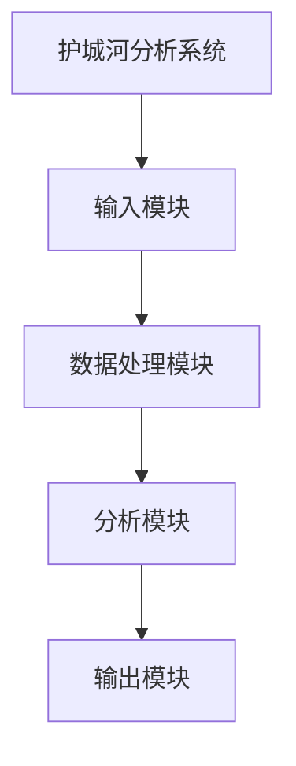
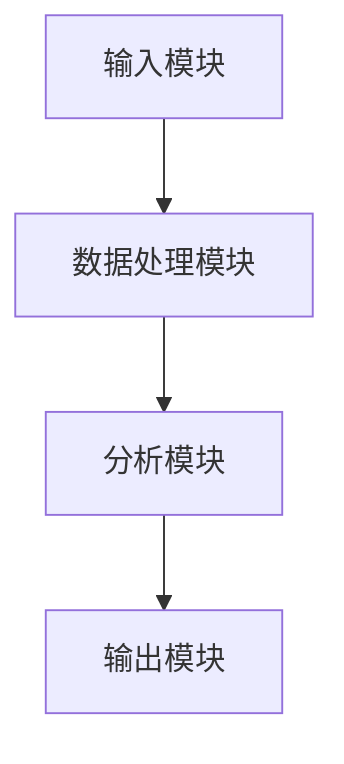

                 


# 巴菲特的护城河理论：寻找持久竞争优势

> 关键词：巴菲特，护城河理论，竞争优势，投资策略，企业战略，市场分析

> 摘要：本文深入探讨巴菲特的护城河理论，分析其核心概念、四大要素、识别与评估方法，以及动态变化与维护策略。结合数学模型、系统架构设计和实际案例，为读者提供全面的理论与实践指导，帮助投资者和企业管理者识别和构建持久的竞争优势。

---

# 第一部分: 巴菲特的护城河理论概述

---

## 第1章: 护城河理论的背景与核心概念

### 1.1 护城河理论的起源与发展

#### 1.1.1 巴菲特投资理念的形成

沃伦·巴菲特是全球最著名的投资者之一，他的投资理念以“价值投资”为核心。价值投资的核心在于寻找那些具有持续竞争优势的企业，这些竞争优势能够为企业带来超额利润，并在长期的竞争中保持领先地位。护城河理论正是巴菲特在价值投资实践中总结出的重要概念，用于识别那些能够在竞争中建立持久优势的企业。

#### 1.1.2 护城河理论的提出与演变

在巴菲特的投资实践中，他发现许多企业尽管在短期内表现优异，但随着时间的推移，它们会被竞争对手取代或被市场淘汰。为了找到那些能够长期保持竞争优势的企业，巴菲特提出了“护城河”理论。护城河指的是企业竞争优势的“壕沟”，这种优势能够防止竞争对手轻易进入市场或取代企业的地位。护城河可以是成本优势、差异化优势、网络效应或品牌优势等多种形式。

#### 1.1.3 护城河理论在投资中的应用

护城河理论的核心在于识别那些能够长期维持竞争优势的企业。投资者通过分析企业的护城河宽度、深度和可持续性，可以更好地判断企业的投资价值。护城河越宽、越深，企业的竞争优势越持久，投资价值也越高。

---

### 1.2 护城河理论的核心概念

#### 1.2.1 什么是护城河

护城河是企业在市场竞争中建立的长期竞争优势，这种优势能够保护企业免受竞争对手的侵蚀，并确保企业在行业中的领先地位。护城河的本质是企业的独特资源、能力或模式，使其能够在长期的竞争中保持竞争优势。

#### 1.2.2 护城河的分类与特点

护城河可以分为以下四种类型：

1. **成本优势**：企业通过规模经济、生产效率或成本控制，在市场上获得价格优势。
2. **差异化优势**：企业通过提供独特的产品或服务，满足特定客户群体的需求，从而在市场中占据独特地位。
3. **网络效应**：企业通过产品的网络效应，使得产品的价值随着用户数量的增加而增加，从而形成正反馈循环。
4. **品牌优势**：强大的品牌能够吸引消费者，建立客户忠诚度，并在市场中形成强大的竞争优势。

#### 1.2.3 护城河与企业竞争优势的关系

护城河是企业竞争优势的核心体现。企业竞争优势的强弱直接决定其护城河的宽窄。具有强大护城河的企业能够在市场竞争中占据优势，实现长期的超额收益。

---

### 1.3 护城河理论的数学模型与公式

#### 1.3.1 护城河宽度的量化分析

护城河宽度可以通过企业的市场份额、利润率和竞争壁垒的强度来量化。以下是护城河宽度的计算公式：

$$ \text{护城河宽度} = \frac{\text{市场份额} \times \text{利润率}}{\text{竞争壁垒强度}} $$

其中，市场份额表示企业在市场中的占有率，利润率表示企业的盈利能力，竞争壁垒强度表示企业的竞争优势强度。

#### 1.3.2 投资价值的评估公式

巴菲特的护城河理论认为，企业的投资价值取决于其竞争优势的可持续性和盈利能力。以下是投资价值的评估公式：

$$ \text{投资价值} = \text{企业盈利} \times \text{护城河宽度} \times \text{行业增长潜力} $$

其中，企业盈利表示企业的盈利能力，护城河宽度表示企业的竞争优势强度，行业增长潜力表示行业的发展前景。

#### 1.3.3 市场份额预测模型

市场份额预测模型可以帮助投资者预测企业在未来市场中的表现。以下是市场份额预测模型的公式：

$$ \text{市场份额} = \frac{\text{企业收入}}{\text{行业总收入}} $$

---

## 第2章: 护城河的四个核心要素

---

### 2.1 成本优势

#### 2.1.1 成本优势的定义与特征

成本优势是指企业通过规模经济、生产效率或成本控制，在市场上获得价格优势。具有成本优势的企业能够在竞争中以更低的价格提供产品或服务，从而吸引更多的客户。

#### 2.1.2 成本优势的来源分析

成本优势的来源包括：

1. **规模经济**：通过扩大生产规模降低成本。
2. **生产效率**：通过技术创新和流程优化降低成本。
3. **供应链优势**：通过优化供应链管理降低成本。

#### 2.1.3 成本优势的可持续性评估

成本优势的可持续性取决于企业的创新能力、市场环境和行业竞争状况。具有强大成本优势的企业能够在竞争中保持领先地位。

---

### 2.2 差异化优势

#### 2.2.1 差异化优势的定义与特征

差异化优势是指企业通过提供独特的产品或服务，满足特定客户群体的需求，从而在市场中占据独特地位。具有差异化优势的企业能够通过提供独特的价值主张，吸引特定客户群体。

#### 2.2.2 差异化优势的实现方式

差异化优势的实现方式包括：

1. **产品差异化**：通过提供独特的产品功能或设计实现差异化。
2. **服务差异化**：通过提供独特的客户服务实现差异化。
3. **品牌差异化**：通过建立强大的品牌形象实现差异化。

#### 2.2.3 差异化优势的竞争力分析

差异化优势的核心在于企业的独特价值主张。具有强大差异化优势的企业能够在市场竞争中吸引特定客户群体，并在长期的竞争中保持竞争优势。

---

### 2.3 网络效应

#### 2.3.1 网络效应的定义与特征

网络效应是指产品的价值随着用户数量的增加而增加。具有网络效应的产品或服务能够通过用户数量的增加形成正反馈循环，从而在市场竞争中占据优势。

#### 2.3.2 网络效应的实现机制

网络效应的实现机制包括：

1. **用户增长**：通过吸引更多用户增加产品的价值。
2. **用户互动**：通过用户之间的互动增加产品的粘性。
3. **用户依赖**：通过用户对产品的依赖性增强产品的网络效应。

#### 2.3.3 网络效应的典型案例分析

以社交媒体平台为例，用户数量的增加会增强平台的价值。例如，Facebook通过吸引更多的用户，增强了其社交网络的网络效应，从而在市场竞争中占据了优势。

---

### 2.4 品牌优势

#### 2.4.1 品牌优势的定义与特征

品牌优势是指强大的品牌能够吸引消费者，建立客户忠诚度，并在市场中形成强大的竞争优势。具有品牌优势的企业能够在市场竞争中占据领先地位。

#### 2.4.2 品牌优势的构建与维护

品牌优势的构建与维护包括：

1. **品牌定位**：通过明确的品牌定位吸引目标客户群体。
2. **品牌传播**：通过有效的品牌传播增强品牌知名度和美誉度。
3. **品牌创新**：通过持续的品牌创新保持品牌活力和竞争力。

#### 2.4.3 品牌优势的市场影响力分析

强大的品牌优势能够通过品牌忠诚度和品牌影响力增强企业的市场地位。具有强大品牌优势的企业能够在市场竞争中吸引更多的客户，并在长期的竞争中保持竞争优势。

---

## 第3章: 护城河的识别与评估

---

### 3.1 护城河识别的关键指标

#### 3.1.1 财务指标分析

护城河识别的关键指标包括：

1. **利润率**：企业的利润率越高，说明企业的竞争优势越强。
2. **市场份额**：企业的市场份额越大，说明企业在市场中的地位越稳固。
3. **竞争壁垒强度**：企业的竞争壁垒越强，说明企业的竞争优势越持久。

#### 3.1.2 市场地位分析

市场地位分析包括：

1. **行业集中度**：行业集中度越高，说明市场竞争越激烈。
2. **竞争对手分析**：分析竞争对手的优势和劣势，评估企业的竞争优势。
3. **市场进入壁垒**：市场进入壁垒越高，说明企业的竞争优势越强。

#### 3.1.3 竞争优势分析

竞争优势分析包括：

1. **成本优势分析**：分析企业的成本优势是否显著。
2. **差异化优势分析**：分析企业的差异化优势是否独特。
3. **网络效应分析**：分析企业的网络效应是否显著。
4. **品牌优势分析**：分析企业的品牌优势是否强大。

---

### 3.2 护城河评估的步骤与方法

#### 3.2.1 企业竞争优势分析

企业竞争优势分析包括：

1. **核心竞争力分析**：分析企业的核心竞争力是否显著。
2. **竞争优势可持续性分析**：分析企业的竞争优势是否可持续。
3. **竞争优势强度分析**：分析企业的竞争优势是否足够强。

#### 3.2.2 行业环境分析

行业环境分析包括：

1. **行业生命周期分析**：分析行业所处的生命周期阶段。
2. **行业竞争格局分析**：分析行业内的竞争格局。
3. **行业发展趋势分析**：分析行业的发展趋势。

#### 3.2.3 护城河宽度评估

护城河宽度评估包括：

1. **市场份额分析**：分析企业的市场份额是否显著。
2. **利润率分析**：分析企业的利润率是否高。
3. **竞争壁垒强度分析**：分析企业的竞争壁垒是否强。

---

### 3.3 护城河的数学模型与公式

#### 3.3.1 护城河宽度的计算公式

$$ \text{护城河宽度} = \frac{\text{市场份额} \times \text{利润率}}{\text{竞争壁垒强度}} $$

其中，市场份额表示企业在市场中的占有率，利润率表示企业的盈利能力，竞争壁垒强度表示企业的竞争优势强度。

#### 3.3.2 投资价值的评估公式

$$ \text{投资价值} = \text{企业盈利} \times \text{护城河宽度} \times \text{行业增长潜力} $$

其中，企业盈利表示企业的盈利能力，护城河宽度表示企业的竞争优势强度，行业增长潜力表示行业的发展前景。

#### 3.3.3 市场份额预测模型

$$ \text{市场份额} = \frac{\text{企业收入}}{\text{行业总收入}} $$

---

## 3.4 案例分析: 可口可乐的护城河

---

### 3.4.1 可口可乐的竞争优势分析

可口可乐是一家全球知名的饮料公司，其竞争优势主要体现在以下几个方面：

1. **品牌优势**：可口可乐是全球最具价值的品牌之一，具有强大的品牌影响力。
2. **网络效应**：可口可乐通过广泛的分销网络和用户基数，形成了强大的网络效应。
3. **成本优势**：可口可乐通过规模经济和高效的供应链管理，实现了成本优势。

### 3.4.2 可口可乐的护城河宽度评估

通过可口可乐的市场份额和利润率分析，可以得出其护城河宽度较大，竞争优势显著。

---

## 3.5 本章小结

---

## 第4章: 护城河的动态变化与维护

---

### 4.1 护城河的动态变化

#### 4.1.1 行业变化对企业护城河的影响

行业变化包括技术进步、市场需求变化和竞争格局变化等因素，这些因素都会影响企业的护城河。

#### 4.1.2 技术进步对企业护城河的影响

技术进步可能削弱企业的竞争优势，但也可以通过技术创新增强护城河。

#### 4.1.3 市场竞争对企业护城河的影响

市场竞争的加剧可能会削弱企业的竞争优势，但也可以通过持续创新和优化增强护城河。

---

### 4.2 护城河的维护策略

#### 4.2.1 持续创新策略

企业需要通过持续创新保持竞争优势，例如通过技术创新、产品创新和服务创新等。

#### 4.2.2 成本控制策略

企业需要通过成本控制保持竞争优势，例如通过优化供应链管理、提高生产效率等。

#### 4.2.3 品牌建设策略

企业需要通过品牌建设保持竞争优势，例如通过加强品牌推广、提升品牌忠诚度等。

---

### 4.3 护城河的数学模型与公式

#### 4.3.1 护城河宽度的动态变化模型

$$ \text{护城河宽度} = \frac{\text{市场份额} \times \text{利润率}}{\text{竞争壁垒强度}} $$

---

### 4.4 案例分析: 苹果公司的护城河

---

## 4.5 本章小结

---

## 第5章: 护城河的数学模型与系统架构设计

---

### 5.1 护城河的数学模型

#### 5.1.1 护城河宽度计算公式

$$ \text{护城河宽度} = \frac{\text{市场份额} \times \text{利润率}}{\text{竞争壁垒强度}} $$

#### 5.1.2 投资价值评估公式

$$ \text{投资价值} = \text{企业盈利} \times \text{护城河宽度} \times \text{行业增长潜力} $$

---

### 5.2 护城河的系统架构设计

#### 5.2.1 系统功能设计

以下是护城河分析系统的功能模块图：



#### 5.2.2 系统架构设计

以下是护城河分析系统的架构图：



---

## 5.3 项目实战: 基于护城河理论的企业竞争优势分析工具

---

### 5.3.1 项目环境配置

```python
# 环境配置
import pandas as pd
import numpy as np
```

---

### 5.3.2 核心代码实现

```python
def calculate_h护城河宽度(市场份额, 利润率, 竞争壁垒强度):
    return (市场份额 * 利润率) / 竞争壁垒强度

def calculate_invest_value(企业盈利, 护城河宽度, 行业增长潜力):
    return 企业盈利 * 护城河宽度 * 行业增长潜力
```

---

### 5.3.3 代码应用解读与分析

通过上述代码，我们可以计算企业的护城河宽度和投资价值，从而帮助企业识别和评估竞争优势。

---

## 5.4 项目小结

---

## 第6章: 护城河理论的拓展与未来展望

---

### 6.1 护城河理论的未来发展趋势

随着技术的进步和市场的变化，护城河理论将不断发展和完善，新的竞争优势形式将不断出现。

---

### 6.2 护城河理论的拓展应用

护城河理论不仅适用于企业投资分析，还可以应用于企业战略管理、市场营销等领域。

---

## 6.3 本章小结

---

## 第7章: 总结与最佳实践

---

### 7.1 总结

护城河理论是巴菲特投资理念的核心，通过识别和评估企业的竞争优势，投资者可以找到那些具有持久竞争优势的企业。

---

### 7.2 最佳实践

1. **持续学习**：不断学习和更新护城河理论的相关知识。
2. **深入分析**：在投资决策中，深入分析企业的竞争优势。
3. **长期视角**：以长期视角看待企业的竞争优势，避免短期波动的干扰。
4. **风险控制**：在投资中注重风险控制，避免过度集中投资。

---

### 7.3 注意事项

1. **避免过度简化**：护城河理论的分析需要综合考虑多方面因素。
2. **关注动态变化**：护城河的宽度和深度会随着市场变化而变化。
3. **结合实际情况**：护城河理论的分析需要结合企业的实际情况。

---

### 7.4 拓展阅读

1. 巴菲特的其他投资理念。
2. 护城河理论在不同行业的应用案例。
3. 技术进步对企业竞争优势的影响。

---

## 7.5 本章小结

---

# 附录: 护城河理论相关工具与资源

---

## 附录A: Python代码库

```python
# 护城河分析工具
import pandas as pd
import numpy as np

def calculate_h护城河宽度(市场份额, 利润率, 竞争壁垒强度):
    return (市场份额 * 利润率) / 竞争壁垒强度

def calculate_invest_value(企业盈利, 护城河宽度, 行业增长潜力):
    return 企业盈利 * 护城河宽度 * 行业增长潜力
```

---

## 附录B: 市场份额预测工具

---

## 附录C: 竞争优势分析模板

---

## 附录D: 相关书籍与资源

---

## 附录E: 护城河理论的在线课程与培训

---

## 附录F: 本章小结

---

# 结束语

---

# 参考文献

---

---

通过以上内容，您可以系统地了解巴菲特的护城河理论，并将其应用于实际投资和企业管理中。

