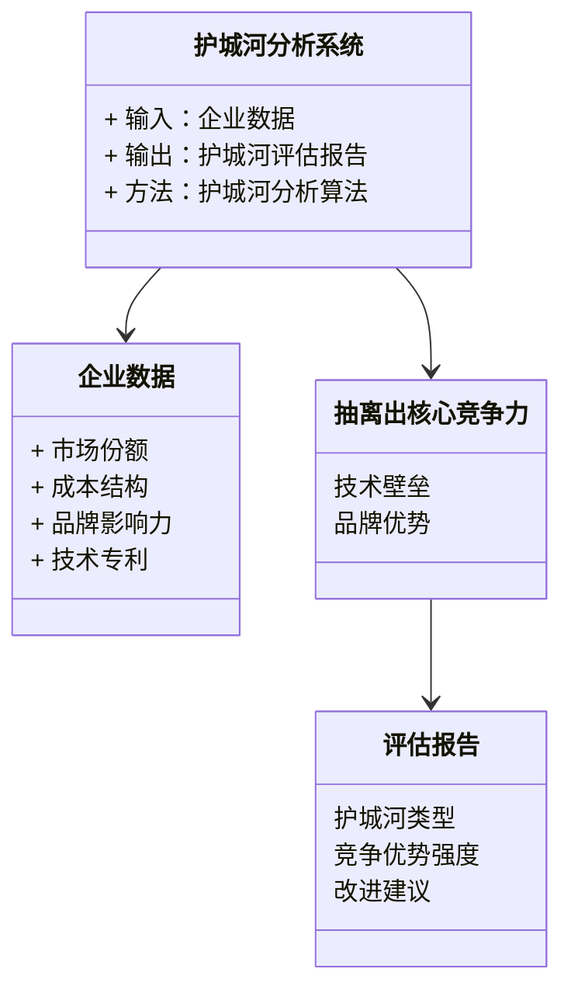
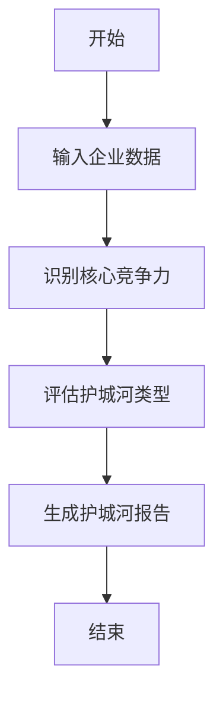

                 


# 巴菲特的护城河理论：寻找持久竞争优势

## 关键词：护城河理论, 投资策略, 企业竞争优势, 投资分析, 长期价值

## 摘要：  
巴菲特的护城河理论是投资和商业策略中的经典概念，强调企业通过建立持久的竞争优势来抵御竞争对手和市场变化。本文深入分析护城河的类型、特征、构建方法及其在实际中的应用，帮助读者理解如何识别和培养企业的护城河，从而实现长期价值增长。

---

# 第1章: 背景介绍：巴菲特护城河理论的核心概念

## 1.1 护城河理论的定义与背景

### 1.1.1 什么是护城河  
护城河是指企业在市场竞争中所建立的独特优势，使其能够抵御竞争对手的侵蚀并长期保持领先地位。这种优势可以是成本优势、品牌影响力、技术壁垒或网络效应等。

### 1.1.2 护城河理论的演变  
护城河理论源于巴菲特的投资哲学，他认为企业只有具备持久的竞争优势，才能为股东创造长期价值。随着时间推移，护城河的概念逐渐扩展到商业战略领域，成为企业制定长期发展计划的重要工具。

### 1.1.3 护城河在商业中的重要性  
在现代商业环境中，护城河不仅是投资的筛选标准，更是企业战略的核心。通过建立护城河，企业可以有效应对竞争压力，提升市场地位，并在不确定的环境中保持稳定性。

---

## 1.2 护城河的分类与特征

### 1.2.1 成本优势型护城河  
成本优势型护城河是指企业通过高效的生产流程、规模经济或成本控制，使得竞争对手难以在价格上与其竞争。例如，沃尔玛通过其强大的供应链和采购能力，实现了成本的显著降低。

### 1.2.2 网络效应型护城河  
网络效应型护城河依赖于用户之间的相互依赖性。随着用户数量的增加，平台的价值也随之增长。例如，Facebook通过社交网络的扩展，形成了强大的用户粘性和网络效应。

### 1.2.3 品牌优势型护城河  
品牌优势型护城河依赖于强大的品牌影响力和客户忠诚度。例如，可口可乐通过长期的品牌建设和市场推广，建立了强大的品牌认知度和客户忠诚度。

### 1.2.4 技术壁垒型护城河  
技术壁垒型护城河依赖于企业拥有的独特技术和专利，使得竞争对手难以复制。例如，苹果通过其创新的iPhone设计和专利技术，形成了强大的技术壁垒。

---

## 1.3 护城河的边界与外延

### 1.3.1 护城河的边界条件  
护城河并非无限制的。企业的护城河受到市场环境、行业特点和技术发展等因素的限制。例如，在快速变化的技术行业中，技术壁垒可能很快被新技术取代。

### 1.3.2 护城河的外延扩展  
护城河的外延包括企业如何通过创新、收购或合作等方式扩展其竞争优势。例如，微软通过收购GitHub，进一步巩固了其在软件开发领域的网络效应。

### 1.3.3 护城河与竞争优势的关系  
护城河是竞争优势的核心，但竞争优势还包括短期因素如价格促销、地理位置等。护城河关注的是长期可持续的竞争优势。

---

## 1.4 护城河的核心要素组成

### 1.4.1 核心竞争力  
核心竞争力是护城河的基础，指的是企业独特的技能或资源。例如，特斯拉的核心竞争力在于其在电动汽车领域的技术创新和生产能力。

### 1.4.2 可持续性  
护城河必须具备可持续性，即能够长期抵御竞争对手的侵蚀。例如，强生公司的品牌和医疗技术使其在医疗行业长期保持优势。

### 1.4.3 难以复制性  
难以复制性是护城河的重要特征。例如，麦当劳的运营模式和品牌价值难以被竞争对手快速复制。

### 1.4.4 护城河的动态性  
护城河并非一成不变。企业需要不断投资和创新，以维持或增强其护城河。例如，谷歌通过持续改进搜索引擎算法，保持其在互联网搜索领域的领先地位。

---

# 第2章: 护城河理论的核心概念与联系

## 2.1 护城河的核心概念原理

### 2.1.1 护城河的经济学原理  
护城河的经济学原理基于比较优势和规模经济。企业通过专注于其核心竞争力，降低成本并提高效率，从而建立竞争优势。

### 2.1.2 护城河的市场结构分析  
在不同的市场结构下，护城河的表现不同。例如，在垄断竞争市场中，品牌优势是关键护城河；在完全竞争市场中，成本优势更为重要。

### 2.1.3 护城河的长期价值创造  
护城河通过提高市场份额、降低竞争压力和增强盈利能力，为企业创造长期价值。例如，亚马逊通过其强大的物流和云计算能力，建立了持续的护城河。

---

## 2.2 护城河核心概念对比表格

| 护城河类型       | 核心特征               | 适用场景               | 示例企业               |
|------------------|------------------------|------------------------|-----------------------|
| 成本优势         | 低成本生产             | 制造业、大宗商品         | 沃尔玛、丰田           |
| 网络效应         | 用户越多，价值越高     | 社交平台、软件生态       | Facebook、微软         |
| 品牌优势         | 强大品牌认知度           | 消费品、奢侈品           | 可口可乐、路易威登     |
| 技术壁垒         | 独特技术难以复制         | 高科技行业             | 苹果、谷歌             |

---

## 2.3 护城河的ER实体关系图

```mermaid
er
actor 投资者 {
  [投资决策]
}
actor 企业 {
  [建立护城河]
}
actor 竞争对手 {
  [无法突破护城河]
}
```

---

# 第3章: 护城河的系统分析与算法原理

## 3.1 护城河的系统分析

### 3.1.1 问题场景介绍  
护城河的系统分析需要从多个维度入手，包括市场需求、竞争环境、企业资源等。例如，一家科技公司可能面临技术更新快、竞争对手众多的问题，需要通过技术创新和专利布局建立护城河。

### 3.1.2 项目介绍  
本章以“护城河分析系统”为例，探讨如何通过系统化的方法识别和构建企业的护城河。

### 3.1.3 系统功能设计  
以下是护城河分析系统的领域模型：



---

## 3.2 护城河的算法原理

### 3.2.1 算法流程图



### 3.2.2 护城河分析算法

以下是护城河分析算法的伪代码：

```python
def护城河分析算法(企业数据):
    核心竞争力 = 识别核心竞争力(企业数据)
   抽离出核心竞争力 = 抽离出核心竞争力(核心竞争力)
    护城河类型 = 评估护城河类型(抽离出核心竞争力)
    生成护城河报告(抽离出核心竞争力, 护城河类型)
    return 护城河报告
```

---

## 3.3 护城河的数学模型与公式

### 3.3.1 护城河强度指数公式  
护城河强度指数（MRI）可以用来量化企业的护城河强度：

$$MRI = \frac{（品牌影响力 + 技术壁垒 + 网络效应）}{3}$$

### 3.3.2 竞争优势评估公式  
竞争优势评估（CAE）可以帮助企业识别其竞争优势：

$$CAE = \sum_{i=1}^{n} (权重_i \times 优势_i)$$

---

# 第4章: 项目实战：护城河的构建与应用

## 4.1 环境安装与数据准备

### 4.1.1 环境安装  
确保安装必要的工具，如Python、数据可视化工具和数据库管理系统。

### 4.1.2 数据准备  
收集企业的市场数据、财务数据和技术数据，进行清洗和预处理。

## 4.2 系统核心实现源代码

### 4.2.1 护城河分析系统代码

```python
def识别核心竞争力(企业数据):
    核心竞争力 = []
    for 数据 in 企业数据:
        if 数据符合核心竞争力特征:
            核心竞争力.append(数据)
    return 核心竞争力

def评估护城河类型(核心竞争力):
    护城河类型 = []
    for 竞争力 in 核心竞争力:
        if 竞争力是成本优势:
            护城河类型.append("成本优势型")
        elif 竞争力是网络效应:
            护城河类型.append("网络效应型")
        elif 竞争力是品牌优势:
            护城河类型.append("品牌优势型")
        elif 竞争力是技术壁垒:
            护城河类型.append("技术壁垒型")
    return 护城河类型
```

### 4.2.2 算法实现与应用

通过代码实现护城河的识别和评估，并结合实际案例进行分析，例如分析某科技公司的护城河类型和强度。

---

## 4.3 实际案例分析与解读

### 4.3.1 案例介绍  
以某互联网公司为例，分析其护城河的构建过程。

### 4.3.2 数据分析  
通过数据分析工具（如Excel、Python）对公司的市场数据、财务数据和技术数据进行分析，识别其核心竞争力。

### 4.3.3 护城河评估  
根据分析结果，评估该公司的护城河类型和强度，提出改进建议。

---

## 4.4 项目小结

通过项目实战，我们可以看到护城河的构建需要企业从多个维度进行分析和投资，包括技术创新、品牌建设和网络效应等。只有通过系统的分析和持续的投资，企业才能建立持久的竞争优势。

---

# 第5章: 最佳实践、小结与注意事项

## 5.1 最佳实践

### 5.1.1 定期评估护城河  
企业应定期评估其护城河的强度和有效性，及时调整战略。

### 5.1.2 关注创新与技术  
技术壁垒是护城河的重要组成部分，企业应持续投资于技术研发和创新。

### 5.1.3 建立生态系统  
通过建立生态系统，增强网络效应和用户粘性，进一步巩固护城河。

---

## 5.2 小结

巴菲特的护城河理论为企业提供了寻找持久竞争优势的重要思路。通过系统的分析和持续的努力，企业可以建立强大的护城河，抵御竞争压力，实现长期价值增长。

---

## 5.3 注意事项

- **动态调整**：护城河需要动态调整，以应对市场变化和技术进步。
- **避免过度依赖单一护城河**：企业应多元化其护城河，以降低风险。
- **注重长期投资**：护城河的建立需要时间和资源，企业应注重长期投资。

---

## 5.4 拓展阅读

- 巴菲特的其他投资原则
- 竞争对手分析方法
- 企业战略管理经典理论

---

# 附录：护城河分析工具推荐

### 1. 数据分析工具
- Python（Pandas、NumPy）
- R语言
- Excel

### 2. 系统架构工具
- Mermaid
- UML工具（如Lucidchart）
- Git

### 3. 竞争分析工具
- SWOT分析工具
- Porter的五力模型
- 竞争对手监控工具（如SimilarWeb）

---

通过以上内容，我们详细探讨了巴菲特的护城河理论，从理论基础到实际应用，从系统分析到项目实战，为读者提供了全面的视角。希望本文能为您提供有价值的见解，帮助您在商业和投资中更好地应用护城河理论。

