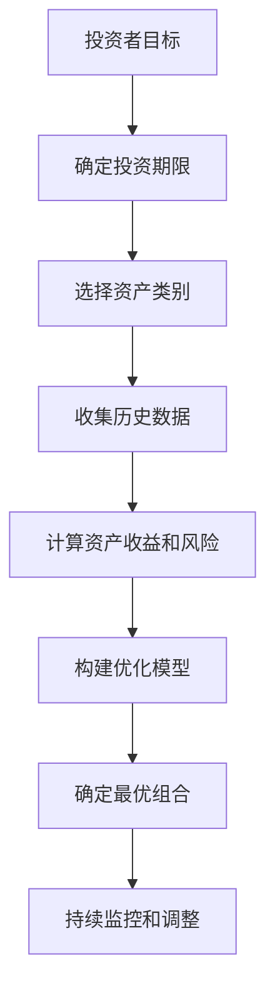
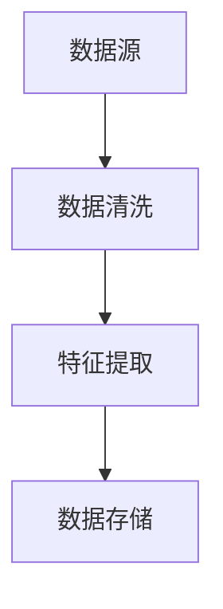
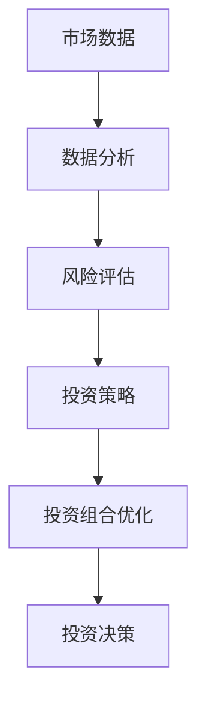
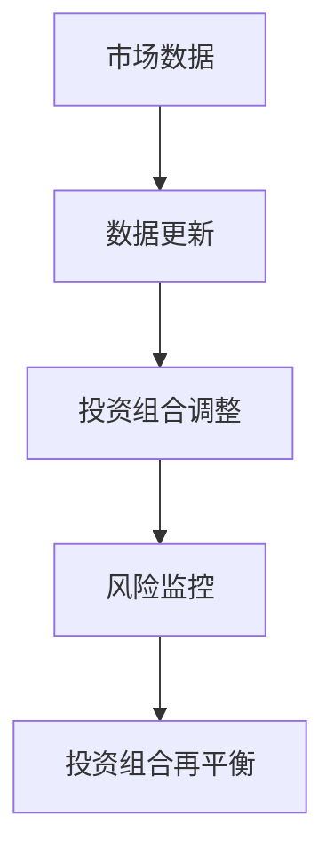
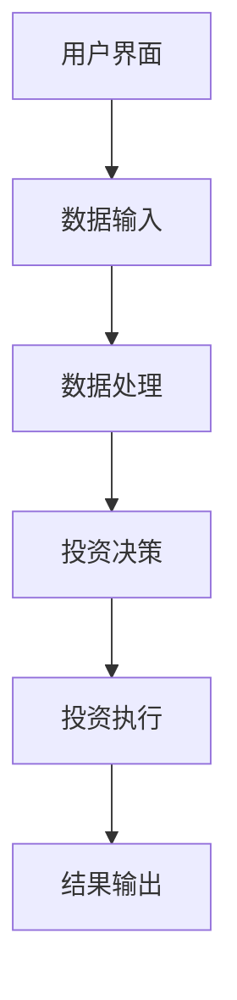

                 


# 巴菲特的指数投资观：大多数投资者的选择

## 关键词：指数投资，巴菲特，风险管理，投资策略，Python代码

## 摘要：  
本文深入探讨了巴菲特的投资理念，尤其是其对指数投资的推崇。通过分析指数投资的核心原理、巴菲特的选股策略以及投资组合优化的数学模型，本文旨在帮助投资者理解如何通过系统化的分析和风险管理来实现长期稳健的投资回报。文章结合了理论与实践，详细讲解了如何使用Python代码进行投资组合优化，并通过实际案例分析展示了巴菲特的投资策略在现实中的应用。无论是对于投资新手还是资深投资者，本文都提供了有价值的见解和实用的指导。

---

接下来，我们将按照目录大纲逐步展开文章内容，详细分析每一部分的核心内容和实现细节。

---

## 第1章：巴菲特投资理念的背景介绍

### 1.1 投资的核心问题与挑战

#### 1.1.1 投资的定义与边界

投资的本质是通过配置资源（如资金）以期获得未来收益的行为。投资不仅仅是简单的资金投入，更是一个涉及信息收集、数据分析、决策制定和风险管理的系统工程。在现代金融体系中，投资的核心问题可以归结为：如何在不确定的市场环境中，以最小的风险获取最大的收益。

#### 1.1.2 投资者面临的普遍问题与误区

大多数投资者在投资过程中容易陷入以下误区：
- **过度自信**：认为自己能够准确预测市场走势。
- **追涨杀跌**：盲目跟随市场情绪，导致投资决策失误。
- **忽视风险管理**：过度关注收益，而忽视潜在风险。
- **信息过载**：面对海量信息，难以有效筛选和利用。

#### 1.1.3 投资行为的结构化分析

为了系统地解决投资问题，我们需要将投资行为结构化。以下是投资行为的关键要素：
- **目标设定**：明确投资目标（如追求稳定收益或资本增值）。
- **信息收集**：获取可靠的投资信息（如财务报表、市场数据）。
- **数据分析**：通过数学模型分析数据，找出投资机会。
- **决策制定**：基于分析结果制定投资策略。
- **风险管理**：评估和控制投资风险。
- **持续监控**：跟踪投资表现并及时调整策略。

---

### 1.2 投资者的决策模型

#### 1.2.1 投资者决策的核心要素与组成

投资者决策模型的核心要素包括：
- **投资者类型**：不同类型的投资者有不同的风险承受能力和收益预期。
- **投资目标**：明确的投资目标是制定策略的基础。
- **市场环境**：包括宏观经济、行业趋势和市场波动等。
- **投资工具**：如股票、债券、基金等。

#### 1.2.2 投资者类型与行为特征对比

以下是几种主要投资者类型的对比：

| 投资者类型 | 风险偏好 | 投资期限 | 投资策略 |
|------------|-----------|-----------|-----------|
| 保守型     | 低        | 长        | 侧重固定收益 |
| 积极型     | 中等      | 中        | 组合投资 |
| 投机型     | 高        | 短        | 炒股为主 |

#### 1.2.3 投资者决策的ER实体关系图

以下是投资者决策的核心要素的ER图：

```mermaid
er
    actor 投资者
    actor 财务顾问
    actor 市场分析师
    entity 投资目标
    entity 投资策略
    entity 风险评估
    entity 市场数据
    entity 投资组合
    entity 投资收益
    relationship -{ 投资者 --> 投资目标 }
    relationship -{ 投资者 --> 投资策略 }
    relationship -{ 投资目标 --> 投资策略 }
    relationship -{ 财务顾问 --> 投资策略 }
    relationship -{ 市场分析师 --> 市场数据 }
    relationship -{ 市场数据 --> 投资策略 }
    relationship -{ 投资策略 --> 投资组合 }
    relationship -{ 投资组合 --> 投资收益 }
    relationship -{ 投资组合 --> 风险评估 }
```

---

## 第2章：指数投资的基本原理

### 2.1 指数投资的定义与特点

#### 2.1.1 指数投资的定义

指数投资是一种被动投资策略，其核心是通过跟踪特定市场指数的表现来实现投资收益。与主动投资不同，指数投资不依赖于基金经理的主动选股能力，而是通过复制指数成分股的表现来获得市场的平均收益。

#### 2.1.2 指数投资的特点

- **分散化**：通过投资多个成分股，降低单一资产的风险。
- **低成本**：指数基金的管理费用通常低于主动管理型基金。
- **简单易行**：无需频繁选股和交易，适合长期投资。

---

### 2.2 指数投资的数学模型与公式

#### 2.2.1 投资组合的收益与风险模型

投资组合的收益可以用以下公式表示：

$$ E(r_p) = \sum_{i=1}^n w_i E(r_i) $$

其中，\( E(r_p) \) 是投资组合的期望收益，\( w_i \) 是第 \( i \) 只股票的权重，\( E(r_i) \) 是第 \( i \) 只股票的期望收益。

投资组合的风险可以用方差来衡量：

$$ \sigma_p^2 = \sum_{i=1}^n \sum_{j=1}^n w_i w_j \sigma_{ij} $$

其中，\( \sigma_{ij} \) 是第 \( i \) 只和第 \( j \) 只股票之间的协方差。

#### 2.2.2 指数投资的跟踪误差公式

跟踪误差（Tracking Error）是衡量指数基金与目标指数表现差异的重要指标，其公式为：

$$ TE = \sqrt{\sum_{i=1}^n (R_p - R_i)^2 / n} $$

其中，\( R_p \) 是指数基金的收益率，\( R_i \) 是目标指数的收益率，\( n \) 是样本数量。

---

### 2.3 指数投资的算法原理

#### 2.3.1 现代投资组合理论（MPT）的 mermaid 流程图

以下是MPT的核心流程图：



#### 2.3.2 投资组合优化的 Python 代码实现

以下是基于MPT的投资组合优化的Python代码示例：

```python
import numpy as np
import pandas as pd

# 假设我们有两只股票的历史收益率数据
returns = pd.DataFrame({
    'Stock A': [0.1, 0.05, 0.08, 0.03, 0.06],
    'Stock B': [0.08, 0.06, 0.04, 0.05, 0.07]
})

# 计算协方差矩阵
cov_matrix = returns.cov()

# 计算资产的期望收益
expected_returns = returns.mean()

# 定义优化目标：最小化风险（方差）同时满足收益目标
# 这里简化为最大化夏普比率
n = len(returns.columns)
weights = np.array([0.5, 0.5])  # 初始权重

# 计算投资组合的收益和风险
portfolio_return = np.dot(expected_returns, weights)
portfolio_variance = np.dot(weights.T, np.dot(cov_matrix, weights))

print(f"投资组合的期望收益：{portfolio_return:.2%}")
print(f"投资组合的方差：{portfolio_variance:.4f}")
```

---

## 第3章：巴菲特的选股策略与投资哲学

### 3.1 巴菲特的价值投资理念

#### 3.1.1 企业基本面分析的核心要素

巴菲特强调长期投资，关注企业的基本面，包括：
- **盈利能力**：ROE（净资产收益率）、净利润增长率。
- **财务健康状况**：资产负债表、现金流。
- **管理团队**：管理层的诚信和能力。

#### 3.1.2 投资企业的长期价值评估

巴菲特的“价值投资”理念强调购买优质企业的一部分，长期持有，等待企业价值的自然增长。他认为，市场短期是投票机，长期是称重机。

#### 3.1.3 巴菲特的选股标准与框架

以下是巴菲特选股的核心标准：

| 标准         | 具体要求                 |
|--------------|--------------------------|
| 企业盈利性   | 高ROE，稳定的净利润增长  |
| 财务健康性   | 低负债，健康的现金流    |
| 管理团队     | 优秀的管理层，良好的治理结构 |
| 行业地位     | 行业龙头，竞争优势明显    |

---

### 3.2 巴菲特投资组合的构建策略

#### 3.2.1 投资组合的分散化原则

巴菲特强调分散化投资，但不同于传统的指数投资，他更倾向于投资少数优质企业。例如，他持有的可口可乐和苹果股票，长期持有，获得稳定的股息和资本增值。

#### 3.2.2 企业权重的分配逻辑

巴菲特在构建投资组合时，通常会根据企业的基本面和市场地位来分配权重。例如，他会优先投资那些具有强大护城河（如品牌优势、技术壁垒）的企业。

#### 3.2.3 投资组合的动态调整策略

巴菲特的投资组合并非一成不变，他会根据企业的基本面变化和市场环境进行调整。例如，当市场出现恐慌时，他会增加对优质企业的投资。

---

## 第4章：指数投资的系统架构与实现

### 4.1 投资信息收集与处理系统

#### 4.1.1 数据收集模块的功能设计

数据收集模块需要从多个来源获取数据，包括：
- 财务报表数据（如收入、利润、现金流）。
- 市场数据（如股价、指数、成交量）。
- 宏观经济数据（如GDP、利率、通胀率）。

#### 4.1.2 数据清洗与特征提取流程

以下是数据清洗和特征提取的流程图：



---

### 4.2 投资决策系统的设计

#### 4.2.1 投资决策模块的逻辑框架

以下是投资决策系统的逻辑框架：



#### 4.2.2 投资组合优化的数学模型

以下是投资组合优化的数学模型：

$$ \text{最大化夏普比率} = \frac{E(r_p) - r_f}{\sigma_p} $$

其中，\( E(r_p) \) 是投资组合的期望收益，\( r_f \) 是无风险利率，\( \sigma_p \) 是投资组合的风险（标准差）。

---

### 4.3 投资执行与监控系统

#### 4.3.1 投资执行模块的功能设计

投资执行模块需要实现：
- 下单交易：根据投资策略执行买卖操作。
- 成交确认：记录交易结果。
- 账户管理：跟踪账户资金和持仓情况。

#### 4.3.2 投资组合的实时监控流程

以下是投资组合实时监控的流程图：



---

## 第5章：指数投资的实战与案例分析

### 5.1 环境搭建与数据准备

#### 5.1.1 投资分析工具的安装与配置

常用的工具包括：
- Python编程环境（如Anaconda）。
- 数据分析库（如Pandas、NumPy）。
- 可视化工具（如Matplotlib、Seaborn）。

#### 5.1.2 数据源的选择与获取

以下是常用的金融数据源：
- **Yahoo Finance**：提供历史股价、财务数据。
- **Alpha Vantage**：提供实时和历史数据。
- **Quandl**：提供结构化的金融数据。

---

### 5.2 投资组合的构建与优化

#### 5.2.1 投资组合优化的 Python 代码实现

以下是基于MPT的投资组合优化的Python代码示例：

```python
import numpy as np
import pandas as pd
import yfinance as yf

# 下载股票数据
data = yf.download(['AAPL', 'GOOGL', 'MSFT'], start='2020-01-01', end='2022-12-31')

# 计算收益率
returns = data['Adj Close'].pct_change().dropna()

# 计算协方差矩阵
cov_matrix = returns.cov()

# 计算资产的期望收益
expected_returns = returns.mean()

# 定义优化目标：最小化风险（方差）同时满足收益目标
n = len(expected_returns)
weights = np.array([1/n]*n)  # 等权重分配

# 计算投资组合的收益和风险
portfolio_return = np.dot(expected_returns, weights)
portfolio_variance = np.dot(weights.T, np.dot(cov_matrix, weights))

print(f"投资组合的期望收益：{portfolio_return:.2%}")
print(f"投资组合的方差：{portfolio_variance:.4f}")
```

#### 5.2.2 投资组合的实时监控与调整

以下是投资组合实时监控的流程：

1. **数据获取**：定期获取投资组合的最新数据。
2. **表现评估**：计算投资组合的收益和风险。
3. **调整策略**：根据市场变化和投资目标调整权重。
4. **记录日志**：保存投资组合的表现和调整记录。

---

## 第6章：指数投资的系统架构与实现

### 6.1 系统架构设计

#### 6.1.1 系统功能设计

以下是系统功能模块图：



---

## 第7章：指数投资的实战与案例分析

### 7.1 环境搭建与数据准备

#### 7.1.1 投资分析工具的安装与配置

安装Python环境，并安装必要的库：

```bash
conda install -n fin-ai -y numpy pandas yfinance matplotlib
```

#### 7.1.2 数据源的选择与获取

使用Yahoo Finance获取数据：

```python
import yfinance as yf
data = yf.download(['AAPL', 'GOOGL', 'MSFT'], start='2020-01-01', end='2022-12-31')
```

---

### 7.2 投资组合的构建与优化

#### 7.2.1 投资组合优化的数学模型

以下是投资组合优化的数学模型：

$$ \text{最大化夏普比率} = \frac{E(r_p) - r_f}{\sigma_p} $$

---

### 7.3 投资组合的实时监控与调整

#### 7.3.1 投资组合的实时监控流程

以下是投资组合实时监控的流程图：


---

## 第8章：总结与展望

### 8.1 总结

通过本文的分析，我们深入探讨了巴菲特的指数投资观，并结合数学模型和Python代码实现，展示了如何系统化地构建和优化投资组合。指数投资作为一种简单有效的策略，特别适合那些希望长期稳健投资的投资者。

### 8.2 投资的注意事项

- **长期视角**：投资需要耐心，避免短期波动的干扰。
- **风险管理**：始终将风险管理放在首位，避免过度集中。
- **持续学习**：市场在不断变化，投资者需要不断学习和调整策略。

### 8.3 未来展望

随着人工智能和大数据技术的发展，指数投资策略将更加智能化和个性化。未来的投资将更加依赖于数据驱动的决策和自动化系统。

---

## 第9章：最佳实践与小结

### 9.1 最佳实践

- **定期复盘**：定期回顾投资组合的表现，发现问题并及时调整。
- **分散投资**：避免过度集中，降低投资风险。
- **坚持纪律**：严格按照投资计划执行，避免情绪化决策。

### 9.2 小结

通过本文的学习，读者不仅掌握了巴菲特的指数投资理念，还学会了如何通过系统化的方法构建和优化投资组合。希望这些知识能够帮助读者在投资道路上走得更稳、更远。

---

以上是文章的完整目录和部分章节内容的详细展开。接下来，您可以根据这个大纲继续撰写完整的文章。

