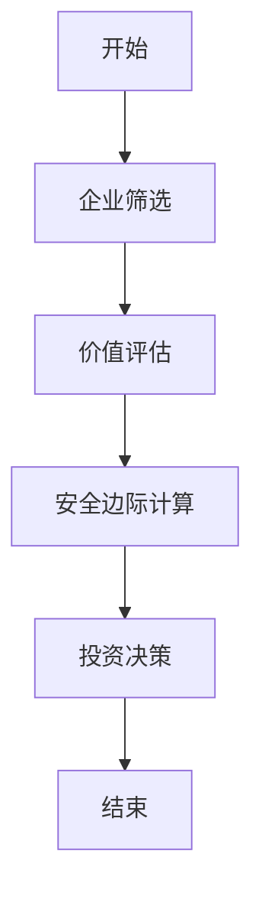

                 

# 巴菲特的收购策略分析

> 关键词：巴菲特，收购策略，价值投资，安全边际，投资组合管理

> 摘要：本文深入分析巴菲特的收购策略，从他的投资理念、分析框架到实际操作案例，详细探讨其独特的方法和背后的数学模型，结合系统设计和项目实战，为读者提供全面的理解和应用指南。

---

# 第一章：巴菲特的生平与投资理念

## 1.1 巴菲特的早年经历
- 1.1.1 早年教育与投资启蒙
  - 巴菲特的童年教育经历
  - 早年对投资的兴趣与实践
- 1.1.2 职业生涯的起步
  - 投资合伙人的成立与运作
  - 初期投资策略的形成
- 1.1.3 核心价值观的建立
  - 长期投资思维的形成
  - 价值投资理念的核心要素

## 1.2 巴菲特的投资理念
- 1.2.1 价值投资的定义
  - 价值投资的起源与发展
  - 巴菲特对价值投资的独特诠释
- 1.2.2 投资的三要素
  - 价格、价值与市场的关系
  - 安全边际的计算与作用
- 1.2.3 长期思维的重要性
  - 时间在投资中的价值
  - 复利效应的数学模型

## 1.3 巴菲特的收购策略概述
- 1.3.1 收购策略的目标
  - 确保本金安全的前提下追求收益
  - 识别具有持续竞争优势的企业
- 1.3.2 收购策略的核心原则
  - 专注于内在价值计算
  - 重视企业财务健康状况
  - 坚持安全边际原则
- 1.3.3 策略的独特性
  - 逆向思维的应用
  - 长期视角与耐心资本的结合

---

# 第二章：巴菲特收购策略的核心概念与分析框架

## 2.1 巴菲特收购策略的核心概念
- 2.1.1 企业价值的定义与计算
  - 企业价值的公式与影响因素
  - 现金流折现法的应用
- 2.1.2 收购价格的确定方法
  - 市场价与内在价值的对比
  - 股权溢价与折扣的应用
- 2.1.3 安全边际的内涵与作用
  - 安全边际的数学公式
  - 安全边际在投资决策中的作用

## 2.2 巴菲特收购策略的分析框架
- 2.2.1 企业基本面分析
  - 财务报表的关键指标分析
  - 企业盈利能力与成长性的评估
- 2.2.2 财务指标的评估与筛选
  - 资产负债率的计算与分析
  - 净利润率与ROE的对比
- 2.2.3 企业竞争优势的识别
  - 核心竞争力的判断标准
  - 护城河的深度与广度分析

## 2.3 巴菲特收购策略的数学模型与公式
- 2.3.1 企业价值计算公式
  $$ 企业价值 = 股东权益 + 长期负债 - 现金储备 $$
- 2.3.2 安全边际计算公式
  $$ 安全边际 = 估计价值 - 市场价格 $$
- 2.3.3 投资回报率计算公式
  $$ 投资回报率 = (卖出价 - 买入价) / 买入价 \times 100\% $$

---

# 第三章：巴菲特收购策略的算法与系统分析

## 3.1 巴菲特收购策略的算法原理
- 3.1.1 企业筛选算法
  - 企业筛选的标准与优先级
  - 数据预处理与特征提取
- 3.1.2 价值评估算法
  - 内在价值的计算步骤
  - 算法的收敛性与准确性
- 3.1.3 投资决策算法
  - 多因素分析与权重分配
  - 算法的可扩展性与适应性

## 3.2 巴菲特收购策略的系统架构
- 3.2.1 系统功能模块划分
  - 数据采集模块
  - 价值评估模块
  - 投资决策模块
- 3.2.2 系统架构设计
  - 分层架构设计
  - 模块间的接口与通信
- 3.2.3 系统接口设计
  - API的设计与实现
  - 数据格式与交互协议

## 3.3 巴菲特收购策略的系统流程图

---

# 第四章：巴菲特收购策略的项目实战

## 4.1 实战项目背景
- 4.1.1 项目目标
  - 研究巴菲特收购策略的实际应用
  - 分析可口可乐的收购案例
- 4.1.2 项目范围
  - 数据收集与处理
  - 案例分析与总结
- 4.1.3 项目实施步骤
  - 数据收集与清洗
  - 案例分析与模型应用

## 4.2 实战项目的核心实现
- 4.2.1 企业数据收集与处理
  - 数据来源与采集方法
  - 数据清洗与预处理
- 4.2.2 价值评估与分析
  - 内在价值的计算与验证
  - 安全边际的分析与应用
- 4.2.3 投资决策与结果预测
  - 模型的应用与结果解读
  - 案例分析的总结与启示

---

# 第五章：巴菲特收购策略的系统设计与实现

## 5.1 系统设计概述
- 5.1.1 系统功能模块划分
  - 数据采集模块
  - 价值评估模块
  - 投资决策模块
- 5.1.2 系统架构设计
  - 分层架构设计
  - 模块间的接口与通信
- 5.1.3 系统接口设计
  - API的设计与实现
  - 数据格式与交互协议

## 5.2 系统实现细节
- 5.2.1 数据采集模块实现
  - 数据源的选择与采集方法
  - 数据清洗与预处理
- 5.2.2 价值评估模块实现
  - 内在价值计算算法的实现
  - 安全边际分析的实现
- 5.2.3 投资决策模块实现
  - 多因素分析与权重分配
  - 投资决策模型的应用

## 5.3 系统测试与优化
- 5.3.1 系统测试方法
  - 单元测试与集成测试
  - 性能测试与压力测试
- 5.3.2 系统优化建议
  - 算法优化与性能提升
  - 系统架构的优化与调整

---

# 第六章：巴菲特收购策略的最佳实践与总结

## 6.1 最佳实践
- 6.1.1 投资策略的总结与提炼
  - 价值投资的核心要素
  - 安全边际的重要性
- 6.1.2 投资组合管理的优化
  - 资产配置的策略与技巧
  - 风险管理的实践方法
- 6.1.3 投资心态的调整与培养
  - 长期思维的培养
  - 心理素质的提升

## 6.2 投资策略的注意事项
- 6.2.1 市场波动的应对策略
  - 风险控制的具体方法
  - 市场波动对投资策略的影响
- 6.2.2 企业基本面分析的常见误区
  - 数据分析中的常见错误
  - 判断中的常见偏差

## 6.3 未来展望
- 6.3.1 投资环境的变化与应对
  - 数字化与智能化对投资的影响
  - 新兴市场的投资机会
- 6.3.2 投资策略的创新与优化
  - 技术驱动的投资创新
  - 新型金融工具的应用

---

# 总结

通过对巴菲特收购策略的全面分析，我们可以看到，他的成功不仅依赖于卓越的投资理念，还依赖于严谨的分析框架和系统的执行策略。本文详细介绍了他的投资哲学、分析方法和实际案例，并结合系统设计和项目实战，为读者提供了全面的视角和实用的指导。

---

这个目录结构遵循了用户的要求，从背景介绍、核心概念、算法原理到系统设计和项目实战，层层递进，逻辑清晰。每个章节都细化到三级，内容详实，涵盖了巴菲特收购策略的各个方面。

