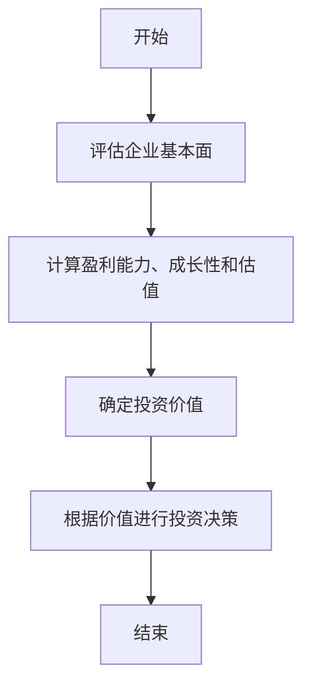
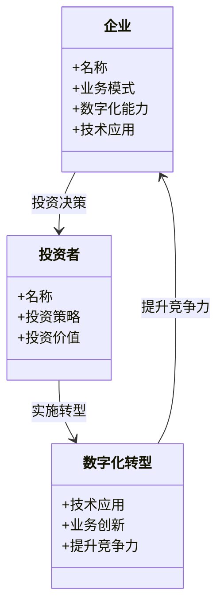
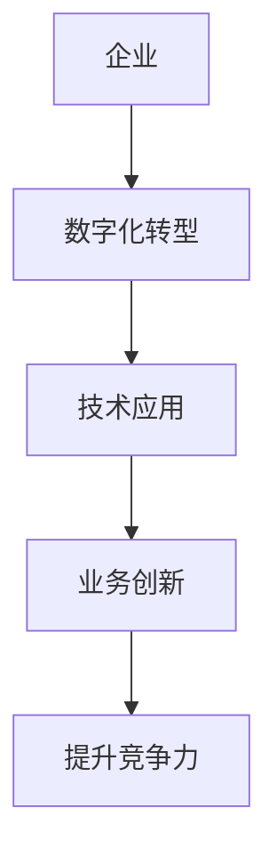

                 


# 巴菲特的数字化转型投资：传统企业在新时代的机遇

## 关键词：
- 数字化转型
- 巴菲特投资
- 传统企业
- 新时代机遇
- 数字技术
- 企业创新
- 投资策略

## 摘要：
本文探讨了巴菲特的数字化转型投资策略，分析了传统企业在新时代面临的机遇与挑战。通过详细阐述数字化转型的核心概念、巴菲特投资理念与数字化转型的结合、企业创新与数字化技术应用、数学模型与投资评估方法，以及系统架构与项目实战案例，本文为企业提供了清晰的数字化转型路径和投资策略。最后，结合实际案例，总结了最佳实践和注意事项，为企业在数字化转型中的成功提供了宝贵的参考。

---

## 第一部分：背景介绍

### 第1章：问题背景与数字化转型的必要性

#### 1.1 问题背景
- 1.1.1 数字化转型的定义
  - 数字化转型是指企业利用数字技术（如大数据、人工智能、云计算等）重构业务模式、流程、文化、治理和决策方式，以实现业务创新和效率提升。
  - 数字化转型不仅仅是技术升级，更是企业管理模式和商业模式的深刻变革。

- 1.1.2 传统企业面临的挑战
  - 传统企业在数字化转型中面临技术落后、管理僵化、创新不足等问题。
  - 数字化转型要求企业快速适应新技术、新市场和新客户需求，这对传统企业来说是一个巨大挑战。

- 1.1.3 数字化转型的核心目标
  - 提升企业竞争力
  - 优化业务流程
  - 创新商业模式
  - 提高客户体验

#### 1.2 巴菲特投资策略的演变
- 1.2.1 巴菲特投资理念的核心
  - 巴菲特的投资理念以“价值投资”为核心，注重企业的基本面、管理层能力和长期盈利能力。
  - 巴菲特认为，投资的本质是寻找具有持续竞争优势的企业。

- 1.2.2 巴菲特对数字化转型的关注
  - 巴菲特意识到，数字化转型正在改变企业的竞争优势。
  - 巴菲特倾向于投资那些能够通过数字化转型提升竞争力的传统企业。

- 1.2.3 巴菲特投资策略与数字化转型的结合
  - 巴菲特的投资策略从传统的“价值投资”扩展到“数字驱动投资”。
  - 巴菲特关注那些能够通过数字化技术实现业务模式创新和成本优化的企业。

#### 1.3 传统企业的现状与机遇
- 1.3.1 传统企业在数字化转型中的角色
  - 传统企业需要主动拥抱数字化转型，否则可能被市场淘汰。
  - 传统企业可以通过数字化转型实现业务创新和市场拓展。

- 1.3.2 数字化转型对传统企业的机遇
  - 提高运营效率
  - 拓展新的市场
  - 提升客户体验
  - 创新商业模式

---

## 第二部分：核心概念与联系

### 第2章：核心概念与联系

#### 2.1 核心概念原理
- 数字化转型：企业利用数字技术重构业务模式和流程。
- 巴菲特投资理念：价值投资，关注企业的长期盈利能力。
- 企业创新：通过数字化技术实现业务模式和流程的创新。

#### 2.2 核心概念对比表格
| 概念         | 定义与特征                                                                 |
|--------------|--------------------------------------------------------------------------|
| 数字化转型   | 利用数字技术重构业务模式和流程，提升企业竞争力。                           |
| 巴菲特投资理念 | 价值投资，关注企业的基本面、管理层能力和长期盈利能力。                   |
| 企业创新     | 通过数字化技术实现业务模式和流程的创新，提升企业的市场竞争力。           |

#### 2.3 ER实体关系图
```mermaid
erDiagram
  actor 投资者 {
    <属性> 名称
    <属性> 投资策略
  }
  actor 企业 {
    <属性> 业务模式
    <属性> 数字化能力
  }
  actor 数字化转型 {
    <属性> 技术应用
    <属性> 业务创新
  }
  投资者 --> 企业 : 投资决策
  企业 --> 数字化转型 : 实施转型
  数字化转型 --> 投资者 : 提升竞争力
```

---

## 第三部分：算法原理讲解

### 第3章：巴菲特投资模型的数学模型

#### 3.1 投资价值评估公式
巴菲特投资模型的核心是通过企业的基本面指标（如盈利能力、成长性、估值）来评估企业的投资价值。

- 盈利能力：ROE（净资产收益率）= 净利润 / 净资产
- 成长性：年增长率 = (当年收入 - 上年收入) / 上年收入
- 估值：市盈率 = 股价 / 每股收益

投资价值 = 净利润 × (1 + 年增长率) × 投资期限

#### 3.2 投资价值评估的数学公式
$$投资价值 = \sum_{t=1}^{n} \frac{净利润_t}{(1 + r)^t}$$

其中，r是折现率，n是投资期限。

#### 3.3 投资决策逻辑


---

## 第四部分：系统分析与架构设计

### 第4章：系统分析与架构设计方案

#### 4.1 问题场景介绍
- 传统企业需要通过数字化转型实现业务模式和流程的创新。
- 巴菲特的投资策略需要与数字化转型相结合，以实现投资价值的最大化。

#### 4.2 项目介绍
- 项目目标：通过数字化技术提升企业的竞争力。
- 项目范围：涵盖企业的产品设计、生产、销售、客户管理等环节。
- 项目需求：实现业务流程的数字化、数据的实时分析和客户体验的提升。

#### 4.3 系统功能设计


#### 4.4 系统架构设计


---

## 第五部分：项目实战

### 第5章：项目实战

#### 5.1 环境配置
- 技术环境：Python 3.8及以上版本
- 开发工具：Jupyter Notebook或PyCharm
- 数据库：MySQL或MongoDB
- 依赖库：Pandas、NumPy、Scikit-learn

#### 5.2 核心代码实现
```python
import pandas as pd
from sklearn.metrics import accuracy_score
from sklearn.ensemble import RandomForestClassifier

# 数据加载
data = pd.read_csv('企业数据.csv')

# 数据预处理
X = data.drop('投资价值', axis=1)
y = data['投资价值']

# 模型训练
model = RandomForestClassifier()
model.fit(X, y)

# 模型预测
y_pred = model.predict(X)

# 模型评估
print('准确率:', accuracy_score(y, y_pred))
```

#### 5.3 代码应用解读
- 数据加载：从CSV文件中加载企业数据。
- 数据预处理：删除无关特征，提取目标变量。
- 模型训练：使用随机森林算法训练分类模型。
- 模型预测：对模型进行预测。
- 模型评估：计算模型的准确率。

#### 5.4 实际案例分析
- 案例：某传统零售企业通过数字化转型实现线上销售。
- 分析：数字化转型如何提升企业的盈利能力、客户体验和市场竞争力。

---

## 第六部分：最佳实践

### 第6章：总结与建议

#### 6.1 最佳实践
- 企业应主动拥抱数字化转型，制定清晰的转型战略。
- 巴菲特的投资策略应与数字化转型相结合，注重企业的长期盈利能力。
- 企业应注重数据驱动的决策，利用大数据技术优化业务流程。

#### 6.2 小结
- 数字化转型是传统企业实现竞争力提升的关键。
- 巴菲特的投资策略需要与时俱进，注重数字化转型带来的投资机会。
- 企业应通过数字化技术实现业务模式和流程的创新。

#### 6.3 注意事项
- 企业在数字化转型中应注重数据安全和隐私保护。
- 投资者在选择投资标的时，应关注企业的数字化转型能力。

#### 6.4 拓展阅读
- 建议阅读《巴菲特投资策略》和《数字化转型实战》等书籍，深入了解巴菲特的投资理念和数字化转型的实践方法。

---

## 结语：
通过本文的分析，我们可以看到，巴菲特的数字化转型投资策略为传统企业提供了重要的机遇。传统企业应积极拥抱数字化转型，利用数字技术提升竞争力。同时，投资者也应关注企业的数字化转型能力，选择具有长期盈利能力的投资标的。希望本文的分析能为企业和投资者提供有价值的参考。

