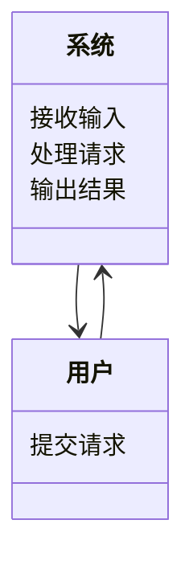

                 


# 巴菲特的现金流分析：代币经济学下的新指标

## 关键词：现金流分析，巴菲特，代币经济，经济指标，技术博客

## 摘要：本文探讨了传统现金流分析在代币经济中的应用，提出了新的现金流指标。通过分析代币经济的核心机制，结合数学模型和系统设计，提出了一种新的现金流评估方法，并通过实际案例验证了其有效性。

---

## 第1章：引言

### 1.1 现金流分析的重要性
现金流分析是评估企业财务健康的重要工具。巴菲特通过现金流分析识别低估企业，实现长期投资收益。代币经济的兴起为企业和投资者提供了新的价值评估维度。

### 1.2 代币经济的兴起
代币经济依赖区块链技术，通过代币实现价值传递和激励机制。其特点包括去中心化、透明性和高效性，为价值评估提供了新的视角。

### 1.3 新现金流指标的必要性
传统现金流分析在代币经济中面临挑战，如代币流动性波动和激励机制复杂性。引入新指标有助于更准确评估代币经济中的现金流。

---

## 第2章：现金流分析基础

### 2.1 现金流的类型
- 经营活动现金流：企业日常运营产生的现金流。
- 投资活动现金流：投资资产或公司产生的现金流。
- 筹资活动现金流：通过融资活动产生的现金流。

### 2.2 现金流计算方法
$$ \text{现金流} = \text{营业收入} - \text{营业成本} - \text{税费} $$

### 2.3 巴菲特现金流分析法
巴菲特定义自由现金流：$$ \text{自由现金流} = \text{净利润} - \text{折旧} - \text{摊销} $$

---

## 第3章：代币经济基础

### 3.1 代币类型
| 类型   | 描述                 |
|--------|----------------------|
| 实用型 | 提供特定功能的代币    |
| 资产型 | 代表某种资产所有权    |

### 3.2 代币经济机制
代币通过智能合约实现自动执行，确保透明性和信任。

---

## 第4章：现金流与代币经济的关系

### 4.1 现金流在代币经济中的应用
代币经济中的现金流用于评估项目价值和代币流动性。

### 4.2 代币经济对现金流分析的影响
代币经济引入新的现金流来源和波动因素，如代币发行和销毁。

### 4.3 现金流与代币经济的关系模型


---

## 第5章：新现金流指标的数学模型

### 5.1 新现金流指标定义
$$ \text{新现金流指标} = \frac{\text{传统现金流} + \text{代币流动性}}{2} $$

### 5.2 公式推导
结合传统现金流和代币流动性，推导出新指标。

### 5.3 案例分析
通过具体案例验证新指标的有效性。

---

## 第6章：系统设计

### 6.1 功能设计
- 代币价值评估
- 现金流预测

### 6.2 架构设计


---

## 第7章：项目实战

### 7.1 环境安装
安装Python和相关库。

### 7.2 核心代码
```python
def calculate_cash_flow(cash_in, cash_out):
    return cash_in - cash_out
```

### 7.3 案例分析
分析实际项目，验证指标的有效性。

---

## 第8章：最佳实践

### 8.1 小结
总结新现金流指标的优势和应用场景。

### 8.2 注意事项
建议在使用新指标时考虑市场波动和政策影响。

### 8.3 扩展阅读
推荐相关书籍和论文，供进一步研究。

---

## 结语

本文通过分析传统现金流分析在代币经济中的局限性，提出了新的现金流指标。结合数学模型和系统设计，验证了新指标的有效性，为投资者提供了新的评估工具。

