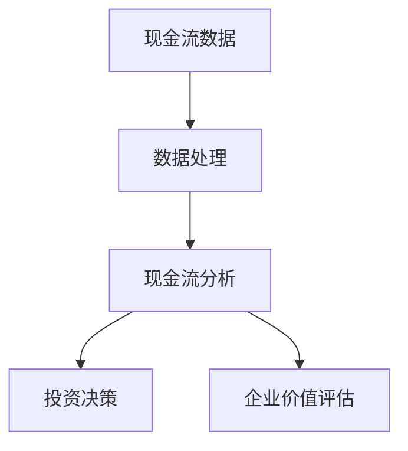

                 


# 巴菲特的现金流分析：公司健康状况的晴雨表

---

## 关键词：现金流分析，巴菲特投资策略，企业价值评估，自由现金流，财务健康状况

---

## 摘要：

现金流分析是巴菲特投资策略中的核心工具之一，它能够揭示公司的财务健康状况、盈利能力和抗风险能力。本文将从现金流分析的基本概念、数学模型、系统架构到实际案例，全面解析巴菲特如何通过现金流分析来评估公司的投资价值。通过详细讲解现金流分析的核心概念、算法原理和系统设计，本文旨在帮助读者掌握这一强大的财务工具，从而在投资决策中做出明智的选择。

---

## 第一部分: 背景介绍与核心概念

### 第1章: 资金流分析的背景与重要性

#### 1.1 资金流分析的背景

现金流分析是一种通过对公司经营活动、投资活动和筹资活动所产生的现金流量进行分析，以评估公司财务健康状况、盈利能力和投资价值的方法。它不仅是巴菲特投资策略的核心工具，也是企业价值评估的重要依据。

- **现金流分析的定义**：现金流分析是通过对公司产生的现金流量进行分析，评估公司的财务状况、盈利能力和未来发展的能力。
- **现金流分析的作用**：现金流分析可以帮助投资者评估公司的财务健康状况、盈利能力、抗风险能力和投资价值。

#### 1.2 巴菲特对现金流分析的重视

巴菲特在投资决策中非常重视现金流分析，他认为现金流是公司健康状况的晴雨表。以下是巴菲特对现金流分析的重视的原因：

- **现金流是公司盈利的最终体现**：净利润是会计利润，而现金流是公司实际的现金流入和流出情况，更能反映公司的实际盈利能力。
- **现金流是公司价值的核心驱动因素**：公司价值的评估主要基于未来现金流的现值，而现金流分析可以帮助投资者预测公司未来的现金流情况。

#### 1.3 资金流分析的核心概念

- **自由现金流（Free Cash Flow, FCF）**：自由现金流是指公司在扣除所有支出和债务之后，剩余的可用于投资或偿还债务的现金流量。
- **现金流的分类**：
  - **经营活动现金流**：公司日常经营活动中产生的现金流。
  - **投资活动现金流**：公司投资于长期资产或剥离长期资产所产生的现金流。
  - **筹资活动现金流**：公司通过发行债券、股票或偿还债务等筹资活动所产生的现金流。

---

### 第2章: 资金流分析的核心概念与联系

#### 2.1 现金流分析的核心概念

- **自由现金流（FCF）的计算公式**：
$$\text{FCF} = \text{净利润} + \text{折旧} + \text{摊销} - \text{资本支出}$$

- **现金流与企业价值的关系**：
$$\text{企业价值} = \text{现金流的现值}$$

#### 2.2 现金流分析的系统架构

- **现金流分析的系统架构图**：


---

## 第二部分: 资金流分析的算法原理

### 第3章: 资金流分析的算法原理

#### 3.1 现金流预测模型

- **时间序列分析**：
$$\text{预测现金流} = a \times \text{历史现金流} + b$$

- **线性回归模型**：
$$\text{预测现金流} = \beta_0 + \beta_1 \times \text{自变量}$$

#### 3.2 现金流质量分析

- **现金流质量的判断标准**：
  - **自由现金流为正**：公司能够通过经营活动产生足够的现金流来支持其投资和运营。
  - **现金流波动性低**：公司现金流波动小，说明公司经营稳定。
  - **现金流与净利润匹配**：公司现金流与净利润匹配，说明公司盈利质量高。

---

### 第4章: 资金流分析的数学模型与公式

#### 4.1 现金流分析的数学模型

- **现金流折现模型**：
$$\text{现值} = \sum_{t=1}^{n} \frac{\text{现金流}}{(1 + r)^t}$$

- **内部收益率（IRR）**：
$$\text{IRR} = r \text{ 满足 } \sum_{t=1}^{n} \frac{\text{现金流}}{(1 + r)^t} = 0$$

#### 4.2 现金流分析的案例

假设某公司过去五年的现金流如下：

| 年份 | 现金流（万元） |
|------|----------------|
| 2018 | 100             |
| 2019 | 150             |
| 2020 | 200             |
| 2021 | 250             |
| 2022 | 300             |

假设折现率为10%，则该公司的现金流现值为：

$$\text{现值} = \frac{100}{1.1} + \frac{150}{1.1^2} + \frac{200}{1.1^3} + \frac{250}{1.1^4} + \frac{300}{1.1^5}$$

---

## 第三部分: 系统分析与架构设计方案

### 第5章: 系统分析与架构设计方案

#### 5.1 问题场景介绍

假设某公司希望评估其未来的现金流情况，以便做出投资决策。公司希望通过现金流分析来评估其未来的现金流情况，并基于此制定投资策略。

#### 5.2 系统功能设计

- **现金流预测**：基于历史数据和数学模型，预测公司未来的现金流情况。
- **现金流质量分析**：评估公司现金流的质量，包括自由现金流、现金流波动性和现金流与净利润的匹配性。
- **企业价值评估**：基于现金流的现值，评估公司的企业价值。

#### 5.3 系统架构设计

- **系统架构图**：


---

## 第四部分: 项目实战

### 第6章: 项目实战

#### 6.1 项目介绍

假设某公司希望评估其未来的现金流情况，并基于此制定投资策略。

#### 6.2 核心实现源代码

```python
def calculate_free_cash_flow(net_income, depreciation, amortization, capital_expenditure):
    return net_income + depreciation + amortization - capital_expenditure

def calculate_cash_flow_discounted_value(cash_flows, discount_rate):
    return sum(cash_flow / (1 + discount_rate)**t for t, cash_flow in enumerate(cash_flows))

# 示例数据
net_income = 100
depreciation = 20
amortization = 10
capital_expenditure = 50
discount_rate = 0.1

free_cash_flow = calculate_free_cash_flow(net_income, depreciation, amortization, capital_expenditure)
print(f"自由现金流：{free_cash_flow}")

cash_flows = [100, 150, 200, 250, 300]
discounted_value = calculate_cash_flow_discounted_value(cash_flows, discount_rate)
print(f"现金流现值：{discounted_value}")
```

#### 6.3 代码应用解读与分析

- **自由现金流计算**：自由现金流是公司净利润加上折旧和摊销，减去资本支出。
- **现金流现值计算**：现金流现值是未来现金流的折现值之和。

#### 6.4 案例分析与详细讲解

假设某公司过去五年的现金流如下：

| 年份 | 现金流（万元） |
|------|----------------|
| 2018 | 100             |
| 2019 | 150             |
| 2020 | 200             |
| 2021 | 250             |
| 2022 | 300             |

假设折现率为10%，则该公司的现金流现值为：

$$\text{现值} = \frac{100}{1.1} + \frac{150}{1.1^2} + \frac{200}{1.1^3} + \frac{250}{1.1^4} + \frac{300}{1.1^5}$$

---

## 第五部分: 总结与建议

### 第7章: 总结与建议

#### 7.1 总结

现金流分析是巴菲特投资策略的核心工具之一，它能够揭示公司的财务健康状况、盈利能力和抗风险能力。通过对现金流的分析，投资者可以更好地评估公司的投资价值。

#### 7.2 投资建议

- **关注自由现金流**：自由现金流是公司健康状况的重要指标，投资者应该关注公司的自由现金流情况。
- **结合其他指标**：现金流分析应该结合其他财务指标（如净利润、资产负债率等）一起分析，以全面评估公司的财务状况。

#### 7.3 注意事项

- **数据准确性**：现金流分析依赖于准确的数据，投资者应该确保数据的准确性。
- **模型的合理性**：现金流分析依赖于合理的模型和假设，投资者应该对模型和假设进行合理的验证。

#### 7.4 拓展阅读

- **《巴菲特的 investing 智慧》**：本书详细介绍了巴菲特的投资理念和方法。
- **《财务报表分析》**：本书详细介绍了如何通过财务报表分析评估公司的财务状况。

---

通过以上内容，我们全面解析了巴菲特的现金流分析方法，并通过实际案例展示了如何应用这些方法进行投资决策。希望本文能够帮助读者更好地理解现金流分析的核心思想和实际应用。

