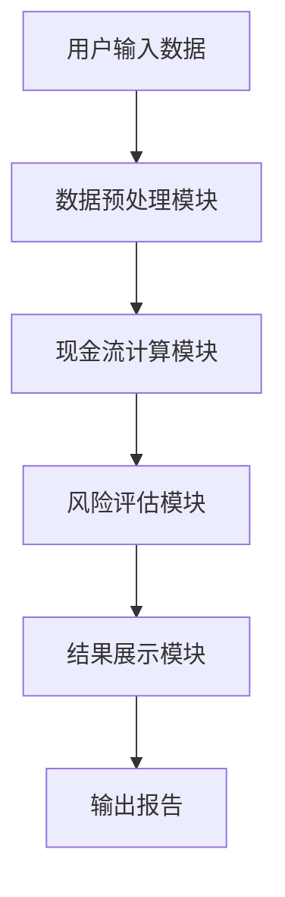
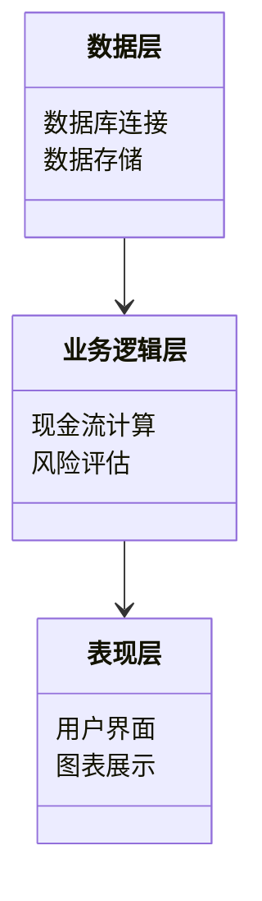
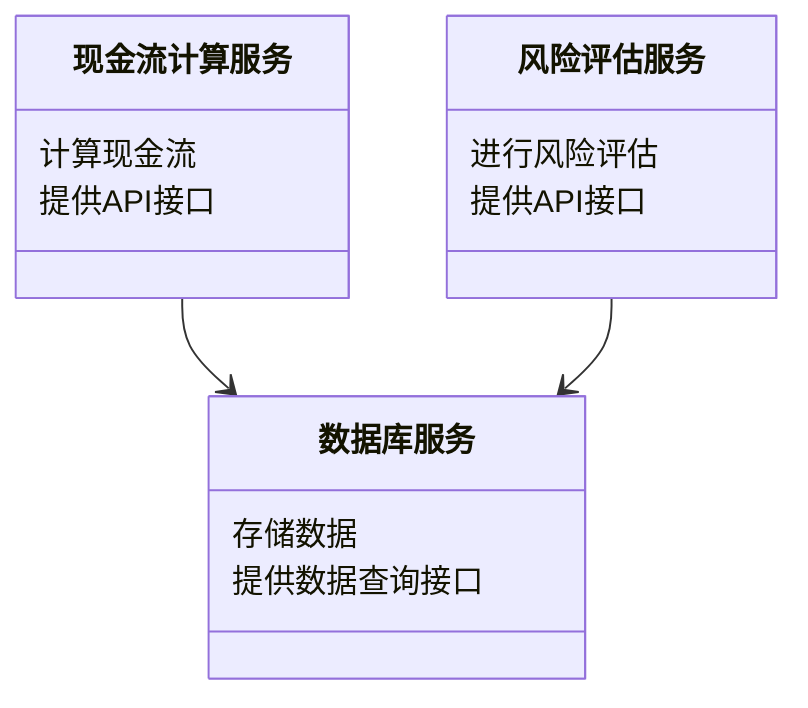
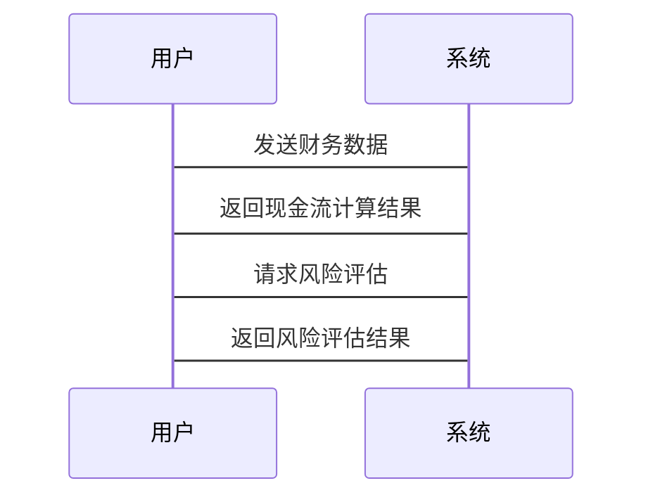

                 


# 巴菲特的现金流分析：量子金融衍生品的风险评估

## 关键词：
- 巴菲特
- 现金流分析
- 量子金融
- 衍生品
- 风险评估

## 摘要：
本文将深入探讨巴菲特的现金流分析方法，并结合量子金融衍生品的独特特性，分析其风险评估的复杂性。通过对现金流分析的数学模型和量子金融衍生品的风险评估模型的详细解读，结合实际案例和系统架构设计，为读者提供一个全面理解巴菲特投资理念与量子金融衍生品风险评估之间关系的视角。

## 第三部分: 系统分析与架构设计

## 第5章: 现金流分析系统的架构设计

### 5.1 系统功能设计

#### 5.1.1 系统模块划分
系统将分为以下几个模块：
- 数据输入模块：接收企业财务数据和市场数据。
- 数据处理模块：进行现金流计算和风险评估。
- 结果展示模块：以图表形式展示分析结果。

#### 5.1.2 系统功能流程图
以下是系统的功能流程图：



#### 5.1.3 系统输入输出设计
- 输入：财务报表数据、市场利率、期权合约参数。
- 输出：现金流分析报告、风险评估结果、可视化图表。

### 5.2 系统架构设计

#### 5.2.1 分层架构设计
系统采用分层架构，分为数据层、业务逻辑层和表现层。



#### 5.2.2 微服务架构设计
采用微服务架构，各服务独立运行，便于扩展和维护。



#### 5.2.3 数据库设计与优化
使用关系型数据库，设计以下表结构：

```mermaid
erd
actor 系统管理员
actor 用户
database 数据库
  table 财务数据表 {
    id: int
    日期: date
    现金流入: float
    现金流出: float
  }
  table 风险评估表 {
    id: int
    评估日期: date
    风险值: float
  }
  table 用户表 {
    id: int
    用户名: string
    密码: string
  }
  系统管理员 --> 数据库
  用户 --> 数据库
```

## 第6章: 系统接口与交互设计

### 6.1 系统接口设计

#### 6.1.1 API接口定义
使用RESTful API，定义以下接口：

- `GET /api/cashflow`：获取现金流数据
- `POST /api/risk_assessment`：提交风险评估请求
- `GET /api/risk_results`：获取风险评估结果

#### 6.1.2 接口协议与数据格式
- 使用JSON格式传递数据。
- 使用HTTPS协议进行通信。

### 6.2 系统交互设计

#### 6.2.1 用户与系统交互流程
以下是用户与系统交互的流程图：



## 第四部分: 项目实战

## 第7章: 现金流分析的Python实现

### 7.1 环境安装
安装所需的Python库：

```bash
pip install numpy pandas matplotlib
```

### 7.2 核心代码实现

#### 7.2.1 现金流计算代码
```python
import numpy as np
import pandas as pd

def calculate_cash_flow(cash_flows, discount_rate):
    npv = np.npv(discount_rate, cash_flows)
    return npv

# 示例数据
cash_flows = [-100, 200, 300, -50]
discount_rate = 0.1

result = calculate_cash_flow(cash_flows, discount_rate)
print(f"净现值: {result}")
```

#### 7.2.2 风险评估代码
```python
import numpy as np
import matplotlib.pyplot as plt

def calculate VaR(cash_flows, num_simulations=10000):
    # 假设市场波动率为20%
    market_volatility = 0.2
    # 生成模拟数据
    simulations = np.random.normal(0, market_volatility, num_simulations)
    # 计算损益
    profits_loss = cash_flows + simulations
    # 排序并计算VaR
    sorted_pl = np.sort(profits_loss)
    VaR = sorted_pl[int(0.05 * num_simulations)]
    return VaR

# 示例数据
cash_flows = [100, 200, 300, 400]
VaR = calculate_VaR(cash_flows)
print(f"风险价值 (VaR): {VaR}")

# 可视化
plt.hist(simulations, bins=50)
plt.xlabel('回报率')
plt.ylabel('频率')
plt.title('回报率分布')
plt.show()
```

### 7.3 项目小结
通过Python实现现金流分析和风险评估，能够快速、准确地进行计算，并通过可视化工具直观展示结果。这对于理解和应用巴菲特的现金流分析方法非常有帮助。

## 第五部分: 最佳实践

## 第8章: 最佳实践与小结

### 8.1 最佳实践

#### 8.1.1 数据质量的重要性
确保输入数据的准确性和完整性，避免因数据错误导致的分析偏差。

#### 8.1.2 模型选择与校准
根据实际情况选择合适的模型，并通过历史数据进行校准，以提高预测的准确性。

#### 8.1.3 定期更新与维护
金融市场环境不断变化，需要定期更新模型和数据，确保分析结果的有效性。

### 8.2 小结
本文通过详细分析巴菲特的现金流分析方法，结合量子金融衍生品的特点，探讨了其风险评估的复杂性和挑战。通过系统设计和项目实战，展示了如何将理论应用于实际操作中。

## 第9章: 注意事项与未来研究方向

### 9.1 注意事项

#### 9.1.1 模型的局限性
现金流分析和风险评估模型在实际应用中存在一定的假设和局限性，需要根据具体情况调整参数。

#### 9.1.2 市场波动的影响
金融市场具有不确定性，模型结果仅供参考，需结合实际情况进行判断。

### 9.2 未来研究方向

#### 9.2.1 量子计算在金融分析中的应用
随着量子计算的发展，未来可以探索其在现金流分析和风险评估中的更广泛应用。

#### 9.2.2 更复杂衍生品的风险评估
研究更复杂和多样化的衍生品，开发更精确的风险评估模型。

## 第六部分: 附录

## 第10章: 附录

### 10.1 术语表
- 现金流：企业在一定时期内的现金流入和流出。
- 净现值（NPV）：投资方案未来现金流按适当折现率计算的现值与初始投资的差额。
- 风险价值（VaR）：在给定置信水平下，可能遭受的最大损失。

### 10.2 工具安装指南
安装Python环境和相关库：

```bash
python --version
pip install numpy pandas matplotlib
```

### 10.3 参考文献
1. 巴菲特股东大会记录
2. 《投资学》——教材
3. 相关学术论文

## 第七部分: 小结

## 结语
通过本文的详细分析，读者可以深入了解巴菲特的现金流分析方法，并将其应用于量子金融衍生品的风险评估中。希望本文能够为读者在投资分析和风险管理领域提供有价值的参考。

---

希望这篇博客文章的内容能够满足您的要求！如果需要进一步调整或补充，请随时告诉我。

