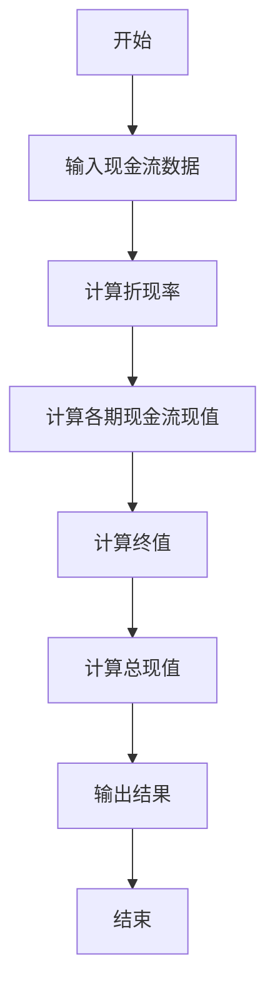
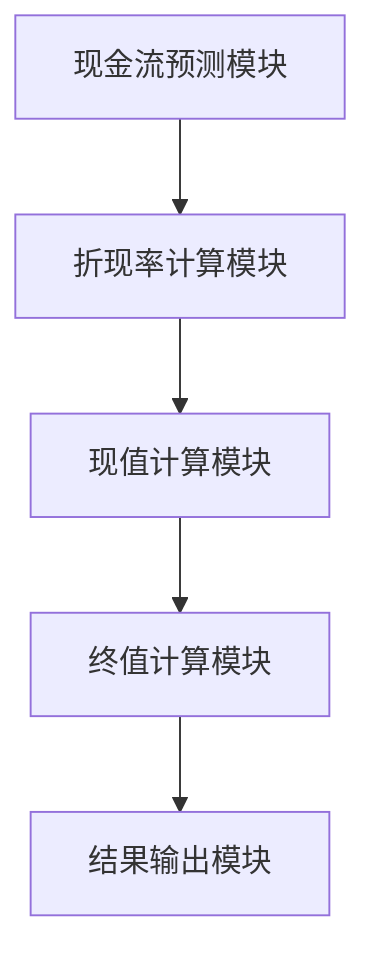

                 


# 巴菲特的现金流折现模型：公司估值的核心方法

## 关键词：
现金流折现模型、巴菲特、公司估值、价值投资、自由现金流、贴现率

## 摘要：
现金流折现模型（DCF模型）是巴菲特评估企业内在价值的核心方法，通过将未来现金流折现到现值来确定企业价值。本文将详细解析现金流折现模型的背景、核心概念、算法原理、系统架构以及项目实战，帮助读者掌握这一经典估值方法。

---

## 第一部分：现金流折现模型概述

### 第1章：现金流折现模型的背景与起源

#### 1.1 现金流折现模型的定义与核心概念
现金流折现模型（Discounted Cash Flow Model，简称DCF模型）是一种用于评估企业内在价值的分析工具。它通过预测企业未来现金流，并将其折现到现值，以确定企业的合理估值。

- **现金流**：企业未来产生的现金流入和流出。
- **折现率**：用于将未来现金流调整为现值的贴现率，通常基于企业的资本成本或市场利率。
- **终值**：企业在预测期末的价值，通常基于永续增长率计算。

#### 1.2 巴菲特的价值投资理念
巴菲特的投资哲学强调长期价值，而非短期市场波动。他主张通过分析企业的基本面，寻找具有持续竞争优势和良好管理的企业，并以合理的价格买入。

- **安全边际**：巴菲特强调以低于内在价值的价格买入股票，以降低投资风险。
- **长期视角**：DCF模型适合长期价值评估，因为它基于对企业未来现金流的预测。

---

### 第2章：现金流折现模型的核心概念与联系

#### 2.1 核心概念对比
以下是现金流折现模型与其他估值方法的核心对比：

| 对比项                | 现金流折现模型（DCF）         | 市盈率（P/E）             | 市净率（P/B）             |
|-----------------------|-----------------------------|---------------------------|---------------------------|
| 适用场景             | 适用于成长型企业             | 适用于成熟企业             | 适用于金融、制造企业       |
| 计量基础             | 未来现金流                 | 当前利润                  | 当前资产                 |
| 优点                 | 考虑了时间价值和资金成本     | 简单易懂，反映市场情绪     | 考虑了资产质量             |
| 缺点                 | 需要精准预测现金流           | 忽略了成长性               | 忽略了企业盈利能力         |

#### 2.2 实体关系图（ER图）
以下是现金流折现模型的核心要素及其关系：

```mermaid
erd
  顾客: 投资者
  组件: 现金流折现模型
  顾客 --> 组件: 提供现金流数据
  组件 --> 投资者: 输出企业估值
  组件 --> 现金流预测模块
  组件 --> 折现率计算模块
  组件 --> 终值计算模块
```

---

## 第二部分：现金流折现模型的算法原理

### 第3章：现金流折现模型的算法实现

#### 3.1 算法流程图（Mermaid）
以下是现金流折现模型的算法流程图：



#### 3.2 算法实现代码
以下是现金流折现模型的Python实现代码：

```python
def discounted_cash_flow(cash_flows, discount_rate):
    """
    计算现金流的现值
    """
    present_value = 0
    for year, cash_flow in enumerate(cash_flows):
        if year == 0:
            continue  # 第一年现值即为终值
        present_value += cash_flow / (1 + discount_rate) ** (year + 1)
    return present_value

# 示例：某公司未来五年的现金流为100万、120万、150万、180万、210万，贴现率为8%
cash_flows = [100, 120, 150, 180, 210]
discount_rate = 0.08

# 计算现值
present_value = discounted_cash_flow(cash_flows, discount_rate)
print(f"现值为：{present_value:.2f}万元")
```

#### 3.3 数学模型与公式
以下是现金流折现模型的核心公式：

- **现值公式**：  
  $$ PV = \sum_{t=1}^{n} \frac{CF_t}{(1 + r)^t} $$  
  其中，$CF_t$ 是第t期的现金流，$r$ 是贴现率，$n$ 是预测期数。

- **终值公式**：  
  $$ FV = \frac{CF_{n+1}}{(1 + r)^{n+1}} $$  
  其中，$CF_{n+1}$ 是永续期的现金流，通常假设为零或固定增长率。

---

## 第三部分：现金流折现模型的系统架构

### 第4章：系统分析与架构设计方案

#### 4.1 问题场景介绍
现金流折现模型的系统主要用于企业估值，适用于投资者、分析师和企业管理层。系统需要处理以下问题：
- 如何输入现金流数据？
- 如何计算折现率？
- 如何输出企业估值结果？

#### 4.2 系统功能设计
以下是系统的功能模块：

- **现金流预测模块**：预测企业未来五年的现金流。
- **折现率计算模块**：基于资本资产定价模型（CAPM）计算折现率。
- **结果输出模块**：输出企业估值结果。

#### 4.3 系统架构设计（Mermaid）
以下是系统的架构图：



---

## 第四部分：项目实战

### 第5章：现金流折现模型的项目实战

#### 5.1 环境安装
需要以下工具和库：
- Python 3.8+
- NumPy、Pandas、Matplotlib库
- Mermaid图床（用于生成流程图）

#### 5.2 核心代码实现
以下是现金流折现模型的完整代码实现：

```python
import numpy as np
import pandas as pd

def calculateDCF(cash_flows, discount_rate, terminal_growth_rate=0):
    """
    计算现金流的现值和终值
    """
    present_value = 0
    for year in range(1, len(cash_flows) + 1):
        present_value += cash_flows[year-1] / (1 + discount_rate) ** year
    terminal_value = cash_flows[-1] * (1 + terminal_growth_rate) / (discount_rate - terminal_growth_rate)
    total_value = present_value + terminal_value / (1 + discount_rate) ** len(cash_flows)
    return total_value

# 示例数据：某公司未来五年的现金流（单位：万元）
cash_flows = [100, 120, 150, 180, 210]
discount_rate = 0.08
terminal_growth_rate = 0.02

# 计算DCF价值
dcf_value = calculateDCF(cash_flows, discount_rate, terminal_growth_rate)
print(f"DCF模型计算的企业价值为：{dcf_value:.2f}万元")
```

#### 5.3 案例分析
以某制造公司为例，假设未来五年的现金流分别为100万、120万、150万、180万、210万，贴现率为8%，永续增长率2%。

- **现值计算**：  
  $$ PV = \frac{100}{(1+0.08)^1} + \frac{120}{(1+0.08)^2} + \frac{150}{(1+0.08)^3} + \frac{180}{(1+0.08)^4} + \frac{210}{(1+0.08)^5} $$  
  计算结果为：现值约为564.25万元。

- **终值计算**：  
  $$ FV = \frac{210 \times (1+0.02)}{0.08-0.02} = 210 \times 1.02 / 0.06 = 3630 \text{万元} $$  
  折现后终值现值为：3630 / (1.08)^5 ≈ 2358.75万元。

- **总价值**：  
  $$ Total\ Value = 564.25 + 2358.75 = 2923 \text{万元} $$

---

## 第五部分：总结与注意事项

### 第6章：注意事项与最佳实践

#### 6.1 注意事项
- **数据质量**：现金流预测需要基于可靠的历史数据和合理的假设。
- **模型局限性**：DCF模型假设现金流可以预测，且贴现率固定，实际中可能存在波动。
- **持续学习**：市场环境和企业战略变化会影响现金流预测，需要持续更新模型。

#### 6.2 最佳实践
- **多场景分析**：尝试不同的贴现率和增长率假设，观察对企业价值的影响。
- **结合其他模型**：将DCF模型与市盈率、市净率等其他估值方法结合使用，以提高估值准确性。

---

## 第六部分：参考文献与拓展阅读

- 巴菲特《投资之道》
- 罗伯特·希勒《金融与效率市场》
- 蘇尼尔·卡普尔《价值投资实战》

---

通过本文的详细讲解，读者可以掌握现金流折现模型的核心原理和实际应用方法，并能够在投资分析中灵活运用这一工具。

