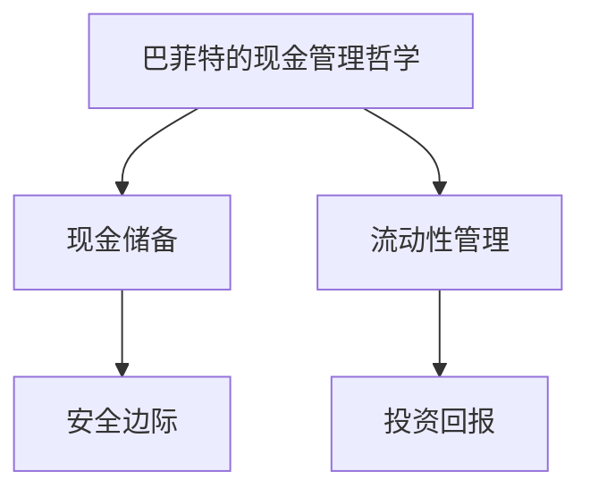
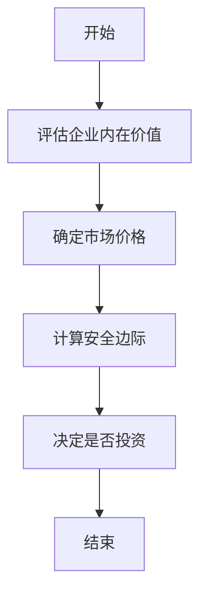
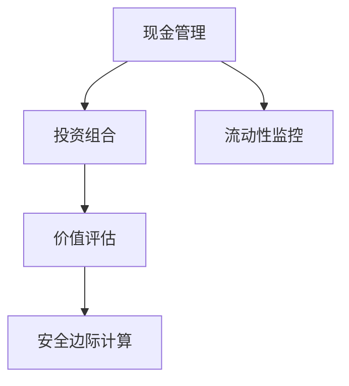

                 


# 巴菲特的现金管理哲学：保持充足的流动性

> 关键词：巴菲特，现金管理，流动性，价值投资，安全边际

> 摘要：本文将深入探讨巴菲特的现金管理哲学，分析其核心概念、策略和方法，结合实际案例，帮助读者理解如何在投资中保持充足的流动性，实现长期稳健的投资回报。

---

# 第一部分：巴菲特的现金管理哲学基础

## 第1章：巴菲特的生平与投资理念

### 1.1 巴菲特的早年经历
- 巴菲特的童年与青少年时期
- 巴菲特早期的商业头脑与投资实践

### 1.2 巴菲特的投资哲学
- 价值投资的核心理念
- 长期投资与复利的力量
- 股市中的“安全边际”概念

### 1.3 巴菲特的现金管理哲学
- 现金储备的重要性
- 保持流动性以应对市场波动
- 现金管理与投资组合的平衡

---

## 第2章：现金管理的核心概念与背景

### 2.1 现金管理的基本概念
- 现金管理的定义与目标
- 流动性与安全性的平衡
- 现金管理的边界与外延

### 2.2 巴菲特现金管理哲学的背景
- 20世纪70年代的经济环境
- 巴菲特哲学的形成背景
- 现金管理在投资中的战略地位

### 2.3 巴菲特现金管理哲学的核心要素
- 现金储备的重要性
- 流动性管理的关键点
- 现金管理与投资组合的关系

---

# 第二部分：巴菲特的流动性管理策略

## 第3章：流动性管理的定义与目标

### 3.1 流动性管理的定义
- 流动性管理的定义与作用
- 流动性管理的目标与原则

### 3.2 巴菲特的流动性管理策略
- 保持充足流动性的原则
- 流动性储备的规模
- 流动性管理的动态调整

### 3.3 实践案例分析
- 巴菲特的经典投资案例
- 流动性管理在危机中的作用
- 巴菲特流动性管理的启示

---

## 第4章：巴菲特现金管理哲学的核心概念与联系

### 4.1 核心概念原理
- 安全边际的数学模型
- 现金储备与投资回报的关系
- 流动性管理的决策逻辑

### 4.2 核心概念属性对比表
- 现金储备与投资组合的对比
- 流动性管理与风险管理的对比
- 巴菲特哲学与其他投资理念的对比

### 4.3 ER实体关系图


---

# 第三部分：巴菲特现金管理哲学的算法原理

## 第5章：算法原理的数学模型

### 5.1 现金储备的计算模型
$$ \text{现金储备} = \text{投资组合价值} \times \text{流动性需求比例} $$

### 5.2 安全边际的计算公式
$$ \text{安全边际} = \text{内在价值} - \text{市场价格} $$

### 5.3 现金管理的决策流程


---

## 第6章：系统分析与架构设计

### 6.1 系统功能设计
- 现金管理系统的功能模块
- 投资组合管理模块
- 流动性监控模块

### 6.2 系统架构设计


---

## 第7章：项目实战与案例分析

### 7.1 项目环境安装
- 数据收集工具：Excel/Python
- 数据分析工具：Pandas
- 可视化工具：Matplotlib

### 7.2 核心实现代码
```python
import pandas as pd

# 示例：计算安全边际
def calculate_margin_of_safety(intrinsic_value, market_price):
    return intrinsic_value - market_price

# 数据加载与分析
data = pd.read_csv('stock_data.csv')
data['安全边际'] = calculate_margin_of_safety(data['内在价值'], data['市场价格'])
print(data.head())
```

### 7.3 案例分析
- 投资标的筛选
- 现金储备的动态调整
- 投资组合的优化配置

---

## 第8章：总结与最佳实践

### 8.1 总结
- 巴菲特现金管理哲学的核心要点
- 投资中的注意事项
- 未来的研究方向

### 8.2 最佳实践 Tips
- 定期评估投资组合的流动性
- 保持充足的安全边际
- 长期投资，避免短期波动干扰

---

通过以上目录结构，我们可以系统地分析巴菲特的现金管理哲学，从基础概念到实践应用，全面理解如何在投资中保持充足的流动性，实现稳健的投资回报。

