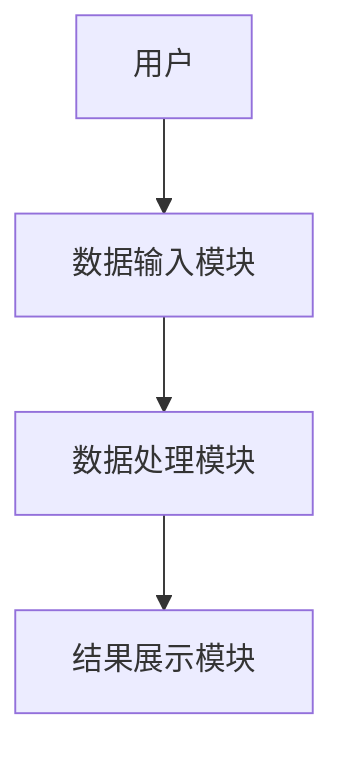
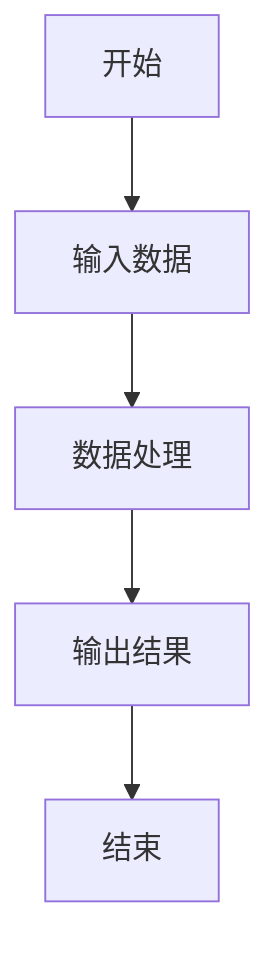

                 


# 巴菲特的现金管理策略

## 关键词
现金管理，巴菲特，投资策略，现金流，风险管理，资产配置

## 摘要
本文详细分析了巴菲特的现金管理策略，从现金流的基本概念到其投资哲学，从现金储备的动态调整到资产配置的优化，结合数学模型和算法原理，深入探讨了巴菲特的现金管理策略及其在现代金融中的应用。通过实际案例分析和系统设计，帮助读者理解并应用这些策略。

---

# 第一部分：现金管理的基本概念与巴菲特的投资哲学

## 第1章：现金管理的核心概念

### 1.1 现金流的基本定义

现金流是企业在一定时期内现金的流入和流出，直接影响企业的财务健康和投资能力。对于个人来说，现金流同样重要，它关系到个人的财务安全和投资回报。现金流可以通过以下公式计算：

$$\text{现金流} = \text{现金流入} - \text{现金流出}$$

### 1.2 现金流在个人财务管理中的作用

现金流在个人财务管理中扮演着重要角色，包括日常开支、债务偿还、投资和应急储备。有效的现金流管理可以帮助个人避免财务危机，抓住投资机会，并实现财务自由。

### 1.3 巴菲特的现金管理理念

巴菲特认为，现金是企业的“血液”，合理的现金储备可以帮助企业在市场波动中保持灵活性，并抓住优质投资机会。他的投资哲学强调长期持有优质资产，避免短期市场的波动干扰。

---

## 第2章：巴菲特的投资哲学

### 2.1 巴菲特的长期投资策略

巴菲特的长期投资策略基于对公司基本面的深入研究和长期价值的判断。他倾向于投资那些具有强大竞争优势和良好管理的公司，并长期持有这些股票。

### 2.2 巴菲特的价值投资理念

价值投资的核心在于寻找那些市场价格低于其内在价值的股票。巴菲特通过分析公司的财务报表、行业地位和管理团队等因素，评估其内在价值。

### 2.3 巴菲特的风控原则

巴菲特强调风险管理的重要性，他通常会保持一定的现金储备，以应对市场波动和投资机会。他避免过度杠杆和高风险投资，以确保财务安全。

---

## 第3章：现金管理的核心方法

### 3.1 现金流的时间价值

现金流的时间价值是指钱的时间价值，即资金随着时间的推移而产生的价值变化。净现值（NPV）是评估投资项目的重要指标，计算公式如下：

$$\text{NPV} = \sum_{t=0}^{n} \frac{\text{CF}_t}{(1 + r)^t}$$

其中，$\text{CF}_t$是第$t$期的现金流，$r$是贴现率。

### 3.2 现金流的预算与分配

合理的预算与分配可以帮助个人和企业有效管理现金流，避免资金浪费和过度支出。预算的制定需要考虑收入、支出、储蓄和投资等多个方面。

### 3.3 现金流的监控与调整

现金流的监控与调整是现金管理的重要环节。通过定期审查和调整预算，可以确保现金流的合理分配，并及时应对市场变化。

---

## 第4章：巴菲特的现金管理策略分析

### 4.1 巴菲特的现金储备策略

#### 4.1.1 现金储备的目的与原则

现金储备的目的是为了应对紧急情况和抓住投资机会。巴菲特通常会保持一定的现金储备，以确保在市场波动时能够灵活应对。

#### 4.1.2 现金储备的动态调整

现金储备的比例需要根据市场环境和个人财务状况进行动态调整。在市场繁荣时，可以适当减少现金储备；在市场低迷时，可以增加现金储备。

### 4.2 巴菲特的资产配置策略

#### 4.2.1 股票投资的核心逻辑

巴菲特的股票投资基于公司的长期价值和竞争优势。他倾向于投资那些具有强大护城河和良好管理的公司，并长期持有这些股票。

#### 4.2.2 债券投资的风险与收益

债券投资的风险较低，收益稳定。巴菲特通常会配置一定比例的债券，以平衡投资组合的风险。

#### 4.2.3 多元化投资的分散风险

多元化投资可以分散风险，避免过度依赖单一资产或行业。巴菲特的资产配置通常包括股票、债券、房地产等多种资产。

---

## 第5章：现金流管理的数学模型与算法原理

### 5.1 现金流的数学模型

#### 5.1.1 净现值计算

净现值（NPV）是评估投资项目的重要指标，其计算公式如下：

$$\text{NPV} = \sum_{t=0}^{n} \frac{\text{CF}_t}{(1 + r)^t}$$

其中，$\text{CF}_t$是第$t$期的现金流，$r$是贴现率。

#### 5.1.2 内部收益率计算

内部收益率（IRR）是投资项目预期的收益率，其计算公式如下：

$$\text{IRR} = r \text{ 满足 } \sum_{t=0}^{n} \frac{\text{CF}_t}{(1 + r)^t} = 0$$

#### 5.1.3 现金流的时间价值

现金流的时间价值可以通过复利公式计算：

$$\text{终值} = \text{现值} \times (1 + r)^n$$

### 5.2 现金流管理的算法原理

#### 5.2.1 现金流的预算分配算法

预算分配算法通常包括以下步骤：
1. 确定总收入和总支出。
2. 按比例分配各项支出。
3. 调整预算以实现收支平衡。

#### 5.2.2 现金流的风险评估模型

风险评估模型可以通过分析历史数据和市场趋势，预测未来的现金流风险。

#### 5.2.3 现金流的资产配置优化

资产配置优化可以通过数学模型，如均值-方差模型，确定最优的资产组合。

---

## 第6章：现金流管理系统的架构与实现

### 6.1 现金管理系统的需求分析

#### 6.1.1 系统功能需求

- 现金流记录与分析
- 投资项目评估
- 资产配置优化
- 风险管理

#### 6.1.2 系统性能需求

- 数据处理速度
- 用户界面友好
- 安全性

### 6.2 现金管理系统的架构设计

#### 6.2.1 系统模块划分

- 数据输入模块
- 数据处理模块
- 结果展示模块

#### 6.2.2 系统数据流图



#### 6.2.3 系统功能流程图



---

## 第7章：现金流管理系统的实战应用

### 7.1 环境搭建与工具安装

#### 7.1.1 开发环境配置

- 安装Python
- 安装Jupyter Notebook

#### 7.1.2 数据库安装与配置

- 安装MySQL
- 创建数据库和表

#### 7.1.3 开发工具安装

- 安装PyCharm或VS Code

### 7.2 系统核心功能实现

#### 7.2.1 现金流计算模块

```python
def calculate_net_present_value(cash_flows, discount_rate):
    npv = 0
    for t, cf in enumerate(cash_flows):
        npv += cf / (1 + discount_rate) ** t
    return npv
```

#### 7.2.2 资产配置优化模块

```python
import numpy as np
from scipy.optimize import minimize

def optimize_asset_allocation(risk_aversion):
    # 定义目标函数
    def objective(weights):
        return np.dot(weights.T, np.dot(cov_matrix, weights)) * risk_aversion

    # 定义约束条件
    constraints = [{'type': 'eq', 'fun': lambda w: sum(w) - 1}]

    # 使用scipy.optimize.minimize进行优化
    result = minimize(objective, np.ones(n_assets) / n_assets, constraints)
    return result.x
```

#### 7.2.3 风险管理模块

```python
import pandas as pd
import matplotlib.pyplot as plt

def plot_cash_flow(data):
    plt.figure(figsize=(10, 6))
    plt.plot(data.index, data['cash_flow'], label='Cash Flow')
    plt.xlabel('Time')
    plt.ylabel('Cash Flow')
    plt.title('Cash Flow Analysis')
    plt.legend()
    plt.show()
```

### 7.3 实际案例分析

通过实际案例分析，展示如何使用现金流管理系统进行投资决策和风险管理。例如，分析某公司的现金流情况，评估其投资项目的可行性和风险。

---

## 第8章：总结与最佳实践

### 8.1 总结

巴菲特的现金管理策略强调长期投资、价值投资和风险管理。通过合理的现金储备和资产配置，可以实现财务安全和长期投资回报。

### 8.2 最佳实践

- 定期审查和调整现金储备
- 分散投资以降低风险
- 避免过度杠杆和高风险投资

### 8.3 小结

现金管理是个人和企业财务管理的重要组成部分。通过学习巴菲特的现金管理策略，我们可以更好地管理和优化自己的现金流，实现财务目标。

### 8.4 注意事项

- 现金管理需要结合实际情况
- 投资决策需要综合考虑市场环境和财务状况
- 风险管理是现金管理的核心

### 8.5 拓展阅读

- 《巴菲特致股东的信》
- 《投资学基础》
- 《风险管理与控制》

---

通过以上步骤，我们可以系统地分析和应用巴菲特的现金管理策略，帮助个人和企业实现财务安全和长期投资回报。

