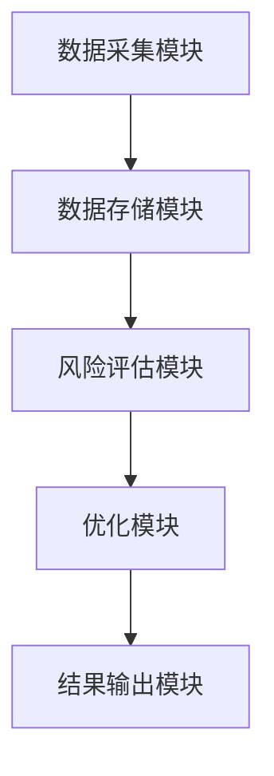

                 

<think>
好的，我需要撰写一篇名为《巴菲特的现金管理策略：加密货币时代的资产配置》的技术博客文章。首先，我需要理解巴菲特的现金管理策略以及加密货币在资产配置中的角色。

### 1. 巴菲特的现金管理策略概述

首先，巴菲特的投资理念以价值投资和长期持有为主，他注重企业的基本面分析。现金管理在他的策略中扮演了重要角色，他倾向于保留足够的现金以应对市场波动，同时寻找低估的投资机会。

然而，随着加密货币的兴起，传统的现金管理策略面临新的挑战和机遇。加密货币市场的高波动性和去中心化特性要求投资者重新思考如何将加密货币纳入资产配置。

### 2. 现金管理策略的核心概念

现金管理的核心在于合理分配资金，降低风险并最大化收益。现代投资组合理论（MPT）为资产配置提供了理论基础，通过分散投资降低风险。

在加密货币时代，投资者需要考虑其高波动性和潜在的高回报。巴菲特的策略强调长期投资，但在加密货币市场中，短期波动可能影响整体投资组合的表现。

### 3. 加密货币时代的资产配置

将加密货币纳入资产配置时，需考虑其在整体投资组合中的比例。根据现代投资组合理论，投资者应根据风险承受能力和收益目标确定比例。

此外，加密货币市场的周期性与巴菲特策略的长期视角存在一定的冲突。投资者需在长期持有与短期波动之间找到平衡点。

### 4. 加密货币资产配置的算法实现

为了实现加密货币的资产配置，可以使用优化算法。假设我们有n种资产，目标是在给定风险偏好下最大化收益。

数学模型如下：

目标函数：最大化收益 \( \sum_{i=1}^{n} w_i r_i \)

约束条件：
1. \( \sum_{i=1}^{n} w_i = 1 \)
2. 风险控制： \( \sum_{i=1}^{n} \sum_{j=1}^{n} w_i w_j \sigma_{ij} \leq \text{风险阈值} \)

其中，\( w_i \) 是资产i的权重，\( r_i \) 是资产i的预期收益，\( \sigma_{ij} \) 是资产i和j的风险相关系数。

### 5. 系统架构设计

设计一个加密货币投资组合管理系统，包括数据采集、风险评估和优化模块。

- 数据采集模块：收集各种加密货币的价格和市场数据。
- 风险评估模块：计算投资组合的风险。
- 优化模块：根据目标优化资产配置。

使用 mermaid 绘制系统架构图：



### 6. 项目实战

编写一个简单的Python程序，实现加密货币资产配置的优化。

```python
import numpy as np
import pandas as pd

# 假设数据已预处理为returns和cov_matrix
def optimize_portfolio(returns, cov_matrix, risk_preference):
    n = len(returns)
    # 初始化权重向量
    w = np.zeros(n)
    # 使用最优化算法求解
    # 这里简化为一个例子，实际应用中需要更复杂的优化方法
    # 这里仅做示例，实际应考虑使用凸优化方法如CVXOPT
    return w

# 示例数据
returns = pd.Series([0.1, 0.15, 0.08], index=['BTC', 'ETH', 'BCH'])
cov_matrix = pd.DataFrame({
    'BTC': [0.2, 0.1, 0.15],
    'ETH': [0.1, 0.3, 0.2],
    'BCH': [0.15, 0.2, 0.25]
})

optimal_weights = optimize_portfolio(returns, cov_matrix, 0.05)
print(optimal_weights)
```

### 7. 最佳实践

- 加密货币投资需谨慎，建议投资者进行充分的研究和风险评估。
- 结合巴菲特的长期投资策略，选择具有长期增长潜力的加密货币项目。
- 定期评估和调整投资组合，以应对市场变化。

通过以上分析，可以看出将巴菲特的现金管理策略应用于加密货币资产配置需要结合现代投资理论和加密货币市场的特点，合理进行风险控制和收益优化。

**下一步行动**
接下来，我需要根据以上分析撰写完整的博客文章，确保每个部分都详细展开，并包含必要的数学公式、代码示例和图表。这将帮助读者更好地理解和应用巴菲特的现金管理策略在加密货币时代中的资产配置。

