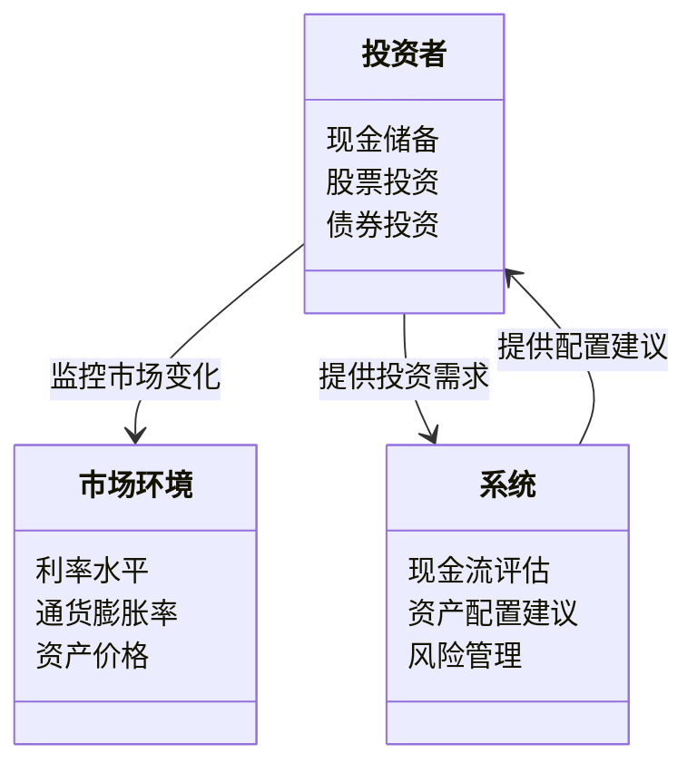
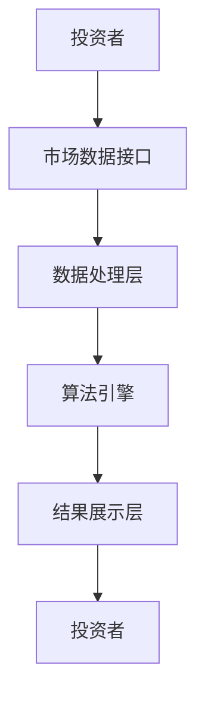
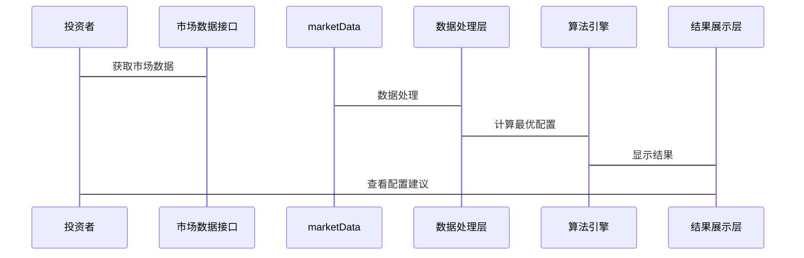

                 


# 巴菲特的现金管理策略：在低利率环境中的资金配置

## 关键词：巴菲特，现金管理，低利率，资金配置，投资策略，资产组合，风险管理

## 摘要：本文深入分析了巴菲特的现金管理策略，特别是在低利率环境下的资金配置方法。通过详细讲解现金储备的配置策略、资产配置的平衡策略、数学模型的构建、系统架构的设计以及项目实战的实现，本文为投资者提供了全面的理论和实践指导，帮助他们在低利率环境下优化资金配置，降低风险，实现长期稳健的投资回报。

---

## 第一部分: 巴菲特的现金管理策略概述

### # 第1章: 巴菲特投资理念与现金管理概述

#### 1.1 巴菲特投资理念的核心要素

##### 1.1.1 巴菲特的价值投资理论
巴菲特的价值投资理论强调以低于内在价值的价格买入优质资产，长期持有，通过复利效应实现财富增长。他注重企业的基本面分析，关注企业的盈利能力、财务健康和竞争优势。

##### 1.1.2 巴菲特的长期投资策略
巴菲特主张长期投资，避免频繁交易。他认为市场的短期波动是噪音，而优质企业的长期价值才是关键。这种策略要求投资者具备耐心和信心，能够在市场波动中保持冷静。

##### 1.1.3 巴菲特对安全边际的重视
安全边际是巴菲特投资策略的重要组成部分。他要求买入价格显著低于企业内在价值，以确保在市场波动或企业暂时困难时仍能获得收益。

---

#### 1.2 现金管理的重要性

##### 1.2.1 现金在投资组合中的角色
现金是投资组合中的重要组成部分，起到流动性保障和风险控制的作用。在市场低迷时，现金储备可以用于抄底优质资产；在市场高涨时，现金储备可以避免过度投资。

##### 1.2.2 现金管理的基本原则
- **流动性优先**：现金储备需要具备较高的流动性，以应对突发事件或市场机会。
- **安全性优先**：现金储备应存放在安全的地方，如银行账户或短期国债。
- **收益性优化**：在保证流动性和安全性的前提下，尽可能提高现金的收益率。

##### 1.2.3 巴菲特对现金储备的策略
巴菲特通常保持一定的现金储备，以应对市场波动和投资机会。他倾向于将现金投资于短期国债，以规避通货膨胀和市场风险。

---

### # 第2章: 低利率环境下的投资挑战

#### 2.1 低利率环境的经济背景

##### 2.1.1 利率周期的定义与影响
利率周期是指利率水平的波动和变化趋势。低利率环境通常出现在经济衰退或复苏初期，此时央行降低利率以刺激经济增长。

##### 2.1.2 当前低利率环境的特点
当前全球许多国家面临低利率甚至负利率的环境。这种环境下，传统固定收益投资的收益率大幅下降，投资者面临“资产荒”问题。

##### 2.1.3 低利率对资产价格的影响
低利率环境下，债券收益率下降，资金流向股票、房地产等风险资产，导致这些资产价格泡沫化。

---

#### 2.2 现金管理的核心问题

##### 2.2.1 现金贬值的风险
低利率环境下，现金的实际购买力可能下降，通货膨胀可能导致现金贬值。

##### 2.2.2 现金收益率的挑战
低利率环境下，现金的收益率可能低于通胀率，导致实际收益为负。

##### 2.2.3 现金资产的流动性管理
在低利率环境下，投资者需要平衡流动性需求和收益率需求，避免因流动性不足而错失投资机会。

---

### # 第3章: 巴菲特现金管理策略的核心概念

#### 3.1 现金储备的配置策略

##### 3.1.1 现金储备的短期投资
巴菲特倾向于将现金投资于短期国债或高评级债券，以确保流动性的同时获得一定的收益。

##### 3.1.2 现金储备的长期配置
在低利率环境下，巴菲特会适当增加长期债券的配置比例，以应对通货膨胀的风险。

##### 3.1.3 现金储备的动态调整
根据市场环境的变化，巴菲特会动态调整现金储备的比例。例如，在市场低迷时增加现金储备，在市场繁荣时减少现金储备。

#### 3.2 资产配置的平衡策略

##### 3.2.1 股票与债券的配置比例
巴菲特通常建议投资者将资产配置在股票和债券之间，以平衡风险和收益。股票提供较高的收益潜力，债券提供稳定的利息收入。

##### 3.2.2 现金与实物资产的平衡
在低利率环境下，实物资产（如房地产、黄金）的配置比例可能增加，以分散风险。

##### 3.2.3 资产配置的周期性调整
根据经济周期的变化，巴菲特会定期调整资产配置比例。例如，在经济衰退时增加债券配置，在经济复苏时增加股票配置。

---

### # 第4章: 巴菲特现金管理策略的数学模型

#### 4.1 现金流的评估模型

##### 4.1.1 现金流的时间价值
现金流的时间价值可以通过现值和终值公式计算。现值公式为：
$$ PV = \frac{CF}{(1 + r)^n} $$
其中，$CF$ 是未来现金流，$r$ 是贴现率，$n$ 是时间周期。

##### 4.1.2 现金流的贴现率计算
贴现率通常基于无风险利率和风险溢价。例如，美国国债收益率加上企业信用评级风险溢价。

##### 4.1.3 现金流的风险评估
现金流的风险可以通过标准差、VaR（Value at Risk）等指标进行评估。

#### 4.2 资产配置的优化模型

##### 4.2.1 资产配置的马科维茨均值-方差模型
马科维茨模型通过优化投资组合的预期收益和风险，找到最优资产配置比例。

##### 4.2.2 巴菲特策略的数学表达
巴菲特策略可以表示为：
$$ w = \arg \min \left( \sigma^2 \right) $$
其中，$\sigma^2$ 是投资组合的方差，$w$ 是最优权重。

##### 4.2.3 现金配置的动态优化
动态优化模型考虑市场变化，定期调整投资组合。

---

### # 第5章: 现金管理策略的系统分析与架构设计

#### 5.1 问题场景介绍
在低利率环境下，投资者需要优化现金配置，平衡风险和收益。系统需要实时监控市场变化，提供动态的配置建议。

#### 5.2 系统功能设计

##### 5.2.1 领域模型


#### 5.3 系统架构设计


#### 5.4 系统接口设计
- **输入接口**：市场数据接口，获取利率、通货膨胀率等数据。
- **输出接口**：结果展示层，提供资产配置建议。

#### 5.5 系统交互


---

### # 第6章: 项目实战

#### 6.1 环境安装
- 安装Python和相关库（如numpy、pandas、matplotlib）。

#### 6.2 核心实现
```python
import numpy as np
import pandas as pd

def calculate_cash_reserve(cash, rate, period):
    return cash * (1 + rate) ** period

# 示例数据
cash = 1000000
rate = 0.02
period = 5

# 计算终值
future_value = calculate_cash_reserve(cash, rate, period)
print(f"未来价值：${future_value:.2f}")
```

#### 6.3 案例分析
假设投资者有100万美元现金，选择投资短期国债，年利率为2%，投资5年。未来价值为：
$$ 1,000,000 \times (1 + 0.02)^5 = 1,121,684 $$

---

### # 第7章: 总结与拓展

#### 7.1 总结
本文通过分析巴菲特的现金管理策略，结合数学模型和系统架构设计，为投资者在低利率环境下优化资金配置提供了理论和实践指导。

#### 7.2 最佳实践
- 定期审视投资组合，根据市场变化调整配置比例。
- 保持一定的现金储备，以应对突发事件和市场机会。
- 选择优质资产，分散投资风险。

#### 7.3 注意事项
- 避免过度杠杆，控制风险敞口。
- 保持长期视角，避免短期波动的干扰。

#### 7.4 拓展阅读
推荐阅读巴菲特的《聪明的投资者》和彼得·林奇的《投资最重要的Simple》。

---

通过本文的系统分析和实战指导，投资者可以在低利率环境下，运用巴菲特的现金管理策略，实现稳健的投资回报。

