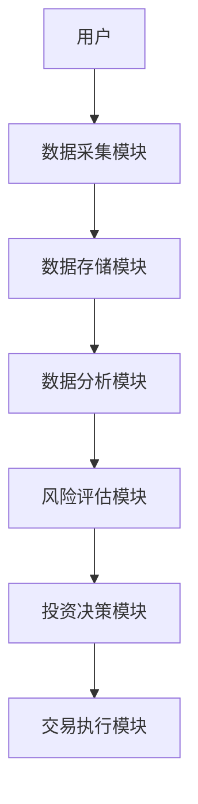

                 


# 巴菲特的现金管理策略：量子加密货币时代的资产配置

> 关键词：巴菲特，现金管理策略，量子加密货币，资产配置，风险管理，量化分析

> 摘要：本文探讨了巴菲特的经典现金管理策略在量子加密货币时代的应用与演变。通过分析量子加密货币的基本特性、风险管理方法及量化分析技术，结合巴菲特的安全边际理念，本文提出了一种在新兴金融环境下实现资产最优配置的策略。文章还通过具体案例和系统设计，展示了如何在实际操作中应用这些策略，为投资者提供了有价值的指导。

---

# 第一部分: 巴菲特的现金管理策略与量子加密货币概述

## 第1章: 巴菲特的现金管理策略概述

### 1.1 巴菲特投资理念的核心思想

#### 1.1.1 价值投资的定义与核心原则

价值投资是一种以基本面分析为基础的投资策略，其核心在于寻找市场价格低于其内在价值的资产。巴菲特是这一理念的忠实践行者，他强调长期投资、安全边际和公司基本面分析。

- **长期投资**：巴菲特认为，投资的目的是通过持有优质资产获得长期收益，而非短期交易。
- **安全边际**：他强调在购买资产时，市场价格应显著低于其内在价值，以降低投资风险。
- **公司基本面分析**：巴菲特注重企业的财务健康状况、盈利能力、管理层素质和行业地位。

#### 1.1.2 巴菲特的安全边际概念

安全边际是巴菲特投资策略的核心要素，它是指市场价格与内在价值之间的差距。通过预留安全边际，投资者可以在市场波动中降低风险。

$$
\text{安全边际} = \text{内在价值} - \text{市场价格}
$$

#### 1.1.3 巴菲特现金管理策略的演变

随着金融市场的变化，巴菲特的现金管理策略也在不断调整。从早期的固定收益投资到后来的股票投资，再到如今的多元化资产配置，巴菲特始终坚持以价值为导向的投资理念。

---

### 1.2 量子加密货币的基本概念

#### 1.2.1 量子计算与加密货币的关系

量子计算是一种基于量子力学原理的计算方式，其强大的计算能力对传统加密算法构成了威胁。量子加密货币则是利用量子技术实现的新型加密货币，具有更高的安全性和效率。

- **量子计算的优势**：量子计算机可以在短时间内破解传统加密算法，如RSA和 ECC。
- **量子加密货币的特性**：基于抗量子算法的加密技术，具备更高的安全性和去中心化特性。

#### 1.2.2 量子加密货币与传统加密货币的区别

| 特性 | 传统加密货币 | 量子加密货币 |
|------|---------------|---------------|
| 加密算法 | SHA-256, RIPMD-160 | 抗量子算法（如 lattice-based） |
| 计算效率 | 依赖经典计算机 | 依赖量子计算机 |
| 安全性 | 易受量子攻击 | 抗量子攻击 |

#### 1.2.3 量子加密货币的特性与优势

量子加密货币的优势在于其抗量子攻击的能力，这使其在未来的金融体系中具有更大的潜力。此外，量子加密货币的去中心化特性和高效交易能力也为投资者提供了新的选择。

---

### 1.3 巴菲特策略在量子加密货币中的应用

#### 1.3.1 巴菲特策略的核心要素

- **价值导向**：寻找被市场低估的量子加密货币项目。
- **安全边际**：确保买入价格低于内在价值。
- **长期持有**：耐心持有优质资产，等待价值回归。

#### 1.3.2 量子加密货币对传统策略的挑战

量子加密货币的高波动性和技术不确定性对巴菲特的策略提出了新的挑战。投资者需要在传统策略的基础上，结合新兴技术的特点进行调整。

#### 1.3.3 策略的适应性分析

为了应对量子加密货币市场的波动性，巴菲特的策略可以适当调整，包括：

- **动态调整**：根据市场变化和项目基本面，定期评估和调整投资组合。
- **分散投资**：通过分散投资降低风险，避免过度集中于单一资产。

---

# 第二部分: 量子加密货币的量化分析与风险管理

## 第2章: 量子加密货币的量化分析方法

### 2.1 量化分析的基本原理

#### 2.1.1 数据收集与处理

- **数据源**：包括市场数据、项目白皮书、技术文档等。
- **数据清洗**：去除噪音数据，确保数据的准确性和完整性。

#### 2.1.2 数据分析工具与技术

- **工具**：Python（Pandas, NumPy）、Matplotlib、Scikit-learn等。
- **技术**：时间序列分析、回归分析、聚类分析等。

#### 2.1.3 数据分析流程

1. 数据清洗与预处理
2. 数据建模与分析
3. 模型验证与优化
4. 结果可视化与解释

---

### 2.2 巴菲特策略的量化实现

#### 2.2.1 现金流分析

现金流分析是巴菲特策略的重要组成部分。通过分析量子加密货币项目的现金流，投资者可以评估其盈利能力和投资价值。

$$
\text{现金流} = \text{收入} - \text{支出}
$$

#### 2.2.2 量化安全边际

通过量化分析，投资者可以计算出量子加密货币的安全边际，从而决定是否买入。

$$
\text{安全边际} = \text{内在价值} - \text{市场价格}
$$

#### 2.2.3 量化资产配置

在量子加密货币时代，巴菲特的资产配置策略需要结合量化分析进行优化。投资者可以根据市场波动性和项目风险，动态调整投资组合。

---

## 第3章: 量子加密货币时代下的风险管理

### 3.1 风险管理的核心原则

#### 3.1.1 风险评估

- **市场风险**：量子加密货币市场的波动性。
- **技术风险**：量子计算技术的不确定性。
- **操作风险**：交易平台的安全性和稳定性。

#### 3.1.2 风险控制

- **分散投资**：避免过度集中于单一资产。
- **止损策略**：设定止损点，防止亏损扩大。

#### 3.1.3 风险对冲

- **对冲工具**：使用衍生品进行风险对冲。
- **对冲策略**：通过多空策略降低整体风险。

---

### 3.2 巴菲特策略中的风险管理

#### 3.2.1 安全边际的应用

通过预留安全边际，投资者可以降低量子加密货币市场的波动性风险。

#### 3.2.2 风险调整后的资产配置

结合风险评估结果，优化投资组合，确保风险在可承受范围内。

---

# 第三部分: 实战案例与系统设计

## 第4章: 实战案例分析

### 4.1 案例背景

假设我们有一个量子加密货币项目，其基本面良好，但市场价格尚未反映其内在价值。通过巴菲特的策略，我们可以在市场低估时买入，并在价值回归时卖出。

---

## 第5章: 系统架构设计

### 5.1 系统功能设计

- **数据采集**：实时采集量子加密货币市场的数据。
- **数据分析**：基于巴菲特策略进行量化分析。
- **风险评估**：评估投资组合的风险。
- **投资决策**：根据分析结果做出投资决策。

### 5.2 系统架构图



---

## 第6章: 代码实现与案例解读

### 6.1 环境安装

- **Python**：安装Python 3.8及以上版本。
- **库**：安装Pandas、NumPy、Matplotlib、Scikit-learn等库。

### 6.2 核心代码实现

```python
import pandas as pd
import numpy as np
from sklearn.linear_model import LinearRegression

# 数据加载
data = pd.read_csv('quantum_currency_data.csv')

# 简单线性回归模型
model = LinearRegression()
model.fit(data[['price', 'volume']], data['market_cap'])

# 预测值
predicted_values = model.predict(data[['price', 'volume']])
```

### 6.3 案例分析

通过上述代码，我们可以对量子加密货币的市场数据进行建模分析，评估其内在价值，并结合巴菲特的安全边际理念进行投资决策。

---

## 第7章: 总结与展望

### 7.1 总结

通过本文的分析，我们可以看到，巴菲特的现金管理策略在量子加密货币时代仍然具有重要的指导意义。通过结合量化分析和风险管理，投资者可以在新兴的金融市场中实现稳健的资产配置。

### 7.2 展望

随着量子计算和人工智能技术的不断发展，金融市场的复杂性也将不断增加。投资者需要不断学习和适应新的技术与策略，以应对未来的挑战。

---

## 附录

### 附录A: 相关工具与资源

- **Python**：https://www.python.org/
- **QuantLib**：https://quantlib.org/
- **书籍推荐**：
  - 《巴菲特传》
  - 《量子计算入门》

---

通过本文的详细分析，读者可以深入了解巴菲特的现金管理策略在量子加密货币时代的应用，并掌握相关的量化分析和风险管理方法。希望本文能够为投资者在新兴的金融市场中提供有价值的指导。

