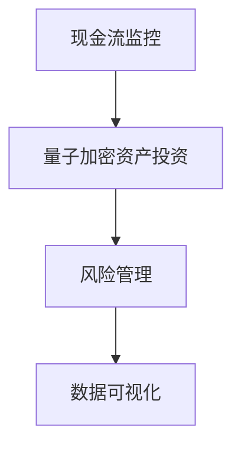

                 


# 巴菲特的现金管理策略：量子加密资产时代的流动性优化

## 关键词：巴菲特，现金管理策略，量子加密资产，流动性优化，技术分析，投资策略

## 摘要：  
本文探讨了巴菲特的现金管理策略在量子加密资产时代的应用，分析了量子加密资产的特性及其对流动性优化的影响，并提出了结合传统与新兴技术的现金流管理方案。文章详细阐述了现金管理的核心概念、量子加密资产的流动性特征，以及如何利用量子技术优化现金流管理。通过实际案例分析和算法实现，本文为投资者提供了在量子加密资产时代优化现金管理的深度见解。

---

# 第1章: 巴菲特的现金管理策略与量子加密资产概述

## 1.1 巴菲特的现金管理策略  
### 1.1.1 巴菲特的现金管理理念  
巴菲特的现金管理策略以保守、长期和价值投资为核心，强调现金流的重要性。他主张在经济不确定性中保持足够的流动性，以应对市场波动和投资机会。

### 1.1.2 巴菲特的现金管理原则  
1. 保持足够的现金储备以应对短期流动性需求。  
2. 将现金投资于具有长期增长潜力的优质资产。  
3. 避免过度杠杆，确保财务稳健性。  

### 1.1.3 巴菲特的现金管理策略在投资中的应用  
通过分散投资、长期持有和价值评估，巴菲特的策略在传统资产配置中表现出色。然而，随着量子加密资产的兴起，传统策略面临新的挑战与机遇。

---

## 1.2 量子加密资产的兴起  
### 1.2.1 量子加密资产的定义  
量子加密资产是指基于量子计算和量子通信技术的加密货币或数字资产，具有极高的安全性和去中心化特性。  

### 1.2.2 量子加密资产的特点  
1. **高安全性**：量子加密技术使资产难以被窃取或篡改。  
2. **去中心化**：通过区块链技术实现资产的分布式管理。  
3. **高波动性**：量子加密资产市场具有强烈的周期性，价格波动剧烈。  

### 1.2.3 量子加密资产与传统加密资产的区别  
| 特性         | 传统加密资产       | 量子加密资产       |  
|--------------|--------------------|--------------------|  
| 技术基础     | 基于经典计算       | 基于量子计算       |  
| 安全性       | 易受量子攻击       | 抗量子攻击         |  
| 市场成熟度   | 较为成熟           | 处于早期发展阶段   |  

---

## 1.3 量子加密资产与现金管理的结合  
### 1.3.1 量子加密资产对现金管理的影响  
量子加密资产的高安全性和去中心化特性为现金管理提供了新的工具，但其高波动性和复杂性也增加了管理难度。  

### 1.3.2 量子加密资产在流动性优化中的作用  
通过量子加密资产，投资者可以实现资金的快速转移和全球配置，提升资金使用效率。  

### 1.3.3 量子加密资产对传统现金管理策略的挑战  
量子加密资产的匿名性和去中心化特性可能削弱传统现金管理的控制能力，同时其技术复杂性也增加了管理难度。  

---

## 1.4 本章小结  
本章介绍了巴菲特的现金管理策略及其在量子加密资产时代的背景。通过分析量子加密资产的特点，我们探讨了其对传统现金管理策略的影响，并为后续的优化策略奠定了基础。

---

# 第2章: 现金流管理的核心概念与原理

## 2.1 现金流管理的基本概念  
### 2.1.1 现金流的定义  
现金流是指企业在一定时期内现金的流入和流出，包括经营活动、投资活动和筹资活动的现金流量。  

### 2.1.2 现金流的分类  
1. **经营活动现金流**：与企业日常运营相关的现金流动。  
2. **投资活动现金流**：与企业投资活动相关的现金流动。  
3. **筹资活动现金流**：与企业筹资活动相关的现金流动。  

### 2.1.3 现金流的管理目标  
1. 确保企业的短期偿债能力。  
2. 优化资金使用效率。  
3. 平衡短期和长期资金需求。  

---

## 2.2 现金流管理的核心原理  
### 2.2.1 现金流管理的动态平衡原理  
现金流管理需要在流动性和收益性之间找到平衡点。  

### 2.2.2 现金流管理的风险控制原理  
通过分散投资、对冲和保险等手段，降低现金流管理中的风险。  

### 2.2.3 现金流管理的效率优化原理  
通过技术手段（如区块链和量子计算）提升资金流转效率。  

---

## 2.3 现金流管理的数学模型  
### 2.3.1 现金流管理的基本公式  
$$ 现金流净额 = 现金流入 - 现金流出 $$  

### 2.3.2 现金流管理的优化模型  
$$ \text{目标函数：最大化净现值} $$  
$$ \text{约束条件：资金平衡、时间价值} $$  

### 2.3.3 现金流管理的动态规划模型  
动态规划模型通过分阶段决策优化现金流管理，适用于复杂的投资环境。

---

## 2.4 本章小结  
本章详细阐述了现金流管理的核心概念与原理，为后续结合量子加密资产的优化策略奠定了理论基础。

---

# 第3章: 量子加密资产的流动性分析

## 3.1 量子加密资产的流动性特点  
### 3.1.1 量子加密资产的高波动性  
量子加密资产的价格受市场情绪和技术发展的影响，波动性远高于传统资产。  

### 3.1.2 量子加密资产的高流动性  
通过区块链技术，量子加密资产可以实现快速、低成本的全球转移。  

### 3.1.3 量子加密资产的流动性风险  
由于市场的不确定性和技术的复杂性，量子加密资产存在较高的流动性风险。  

---

## 3.2 量子加密资产流动性的影响因素  
### 3.2.1 市场供需关系  
市场参与者的需求和供给直接影响量子加密资产的流动性。  

### 3.2.2 技术发展水平  
量子计算和区块链技术的进步决定了量子加密资产的流动性。  

### 3.2.3 政策法规环境  
监管政策的不确定性对量子加密资产的流动性有重要影响。  

---

## 3.3 量子加密资产流动性优化策略  
### 3.3.1 量子加密资产的持有策略  
1. **短期持有**：利用高波动性获利。  
2. **长期持有**：投资于具有长期增长潜力的量子加密资产。  

### 3.3.2 量子加密资产的交易策略  
1. **套利策略**：利用价格差异进行 arbitrage。  
2. **对冲策略**：通过衍生品降低风险。  

### 3.3.3 量子加密资产的风险对冲策略  
1. **保险机制**：利用量子加密资产的高安全性特性。  
2. **分散投资**：通过投资多种量子加密资产降低风险。  

---

## 3.4 本章小结  
本章分析了量子加密资产的流动性特点及其影响因素，并提出了优化流动性管理的策略。

---

# 第4章: 巴菲特现金管理策略的量子加密资产优化

## 4.1 巴菲特现金管理策略的传统应用  
### 4.1.1 巴菲特的保守投资理念  
巴菲特主张投资于具有持续盈利能力的企业，强调现金流的重要性。  

### 4.1.2 巴菲特的长期投资策略  
通过长期持有优质资产，巴菲特实现了稳定的收益。  

### 4.1.3 巴菲特的资产配置原则  
将资金分配到股票、债券和其他资产中，以分散风险。  

---

## 4.2 量子加密资产对巴菲特策略的影响  
### 4.2.1 量子加密资产对传统现金管理策略的挑战  
量子加密资产的高波动性和去中心化特性可能削弱传统策略的稳定性。  

### 4.2.2 量子加密资产对巴菲特策略的优化机会  
通过量子加密资产的高流动性，巴菲特可以更快地调整投资组合，抓住市场机会。  

### 4.2.3 巴菲特策略在量子加密资产时代的适用性  
尽管量子加密资产具有挑战性，但巴菲特的核心理念（如长期投资和现金流管理）仍然适用。  

---

## 4.3 巴菲特策略的量子优化方案  
### 4.3.1 现金流管理的量子化模型  
通过量子计算技术，构建更高效的现金流管理模型。  

### 4.3.2 量子加密资产在巴菲特策略中的应用  
将量子加密资产纳入资产配置，提升流动性和灵活性。  

### 4.3.3 巴菲特策略的量子优化步骤  
1. **风险评估**：分析量子加密资产的风险和收益。  
2. **资产配置**：将量子加密资产纳入投资组合。  
3. **动态调整**：根据市场变化实时优化投资组合。  

---

## 4.4 本章小结  
本章探讨了量子加密资产对巴菲特现金管理策略的影响，并提出了优化方案，为投资者提供了新的思路。

---

# 第5章: 量子加密资产时代现金流管理的优化实践

## 5.1 项目背景与目标  
通过量子加密资产优化现金流管理，提升资金使用效率和流动性。  

## 5.2 系统架构设计  
### 5.2.1 系统功能设计  
- 现金流监控与分析模块  
- 量子加密资产投资模块  
- 风险管理模块  

### 5.2.2 系统架构图  


---

## 5.3 算法实现  
### 5.3.1 现金流优化算法  
```python
def optimize_cash_flow(cash_flow_data):
    # 输入：现金流数据
    # 输出：优化后的现金流方案
    # 算法步骤：
    # 1. 数据预处理
    # 2. 建立优化模型
    # 3. 求解并返回结果
    pass
```

---

## 5.4 实际案例分析  
### 5.4.1 案例背景  
假设某企业计划将部分资金投资于量子加密资产，以优化现金流管理。  

### 5.4.2 案例分析  
1. **资金分配**：将10%的资金投资于量子加密资产。  
2. **风险管理**：通过套期保值对冲价格波动风险。  

### 5.4.3 优化效果  
通过量子加密资产的投资，企业实现了更高的资金回报率和更好的流动性管理。  

---

## 5.5 本章小结  
本章通过实际案例分析，验证了量子加密资产在现金流管理优化中的有效性，并为投资者提供了实践指导。

---

# 第6章: 总结与展望

## 6.1 总结  
本文探讨了巴菲特的现金管理策略在量子加密资产时代的应用，提出了结合传统与新兴技术的优化方案。通过理论分析和实际案例，我们验证了量子加密资产在流动性优化中的潜力。

## 6.2 展望  
未来，随着量子技术的进一步发展，量子加密资产将在现金管理中发挥更重要的作用。投资者需要密切关注技术进步和市场变化，以抓住新的投资机会。

---

# 附录: 进一步阅读与学习

## 1. 经典书籍  
1. 《巴菲特投资哲学》  
2. 《量子计算与区块链》  

## 2. 推荐论文  
1. "Quantum Computing and Cryptography"  
2. "Blockchain Technology and Cash Flow Management"  

---

感谢您的阅读！如需进一步探讨，欢迎留言交流。

