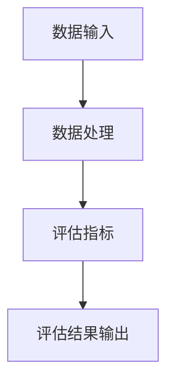

                 


# 巴菲特的管理层评估更新：远程办公时代的领导力

## 关键词
领导力，远程办公，管理层评估，组织行为学，系统架构，项目实战

## 摘要
随着远程办公成为现代工作方式的重要组成部分，领导力的评估和管理面临新的挑战。本文结合巴菲特的管理理念，探讨远程办公时代领导力的核心要素，分析传统管理层评估的不足，并提出构建适应远程环境的领导力评估体系的方法。通过系统架构设计和项目实战，展示如何在实际中应用这些评估方法，帮助领导者和组织应对远程办公带来的挑战。

---

## 第一部分：背景介绍

### 第1章：领导力的基本概念

#### 1.1 领导力的核心要素
领导力是通过影响他人实现目标的能力，其核心要素包括：
- **愿景设定**：明确目标和方向
- **决策能力**：在复杂情况下做出合理决策
- **沟通技巧**：有效传递信息和思想
- **团队管理**：协调团队成员的工作

#### 1.2 管理层评估的重要性
管理层评估是识别和提升领导者能力的关键工具，通过评估可以：
- **识别高潜力领导者**
- **优化团队结构**
- **提升组织绩效**

#### 1.3 远程办公的挑战
远程办公环境下，领导力面临以下挑战：
- **沟通障碍**：缺乏面对面交流，信息可能失真
- **团队凝聚力**：虚拟团队的协作效率可能下降
- **信任建立**：远程环境下难以建立信任关系

---

## 第二部分：领导力的关键要素与评估标准

### 第2章：领导力的关键要素

#### 2.1 沟通能力
- **定义**：通过语言和非语言方式传递信息的能力
- **远程办公中的重要性**：依赖于视频会议和即时通讯工具
- **提升方法**：定期进行沟通训练，使用协作工具优化交流

#### 2.2 决策能力
- **定义**：在复杂情况下做出合理决策的能力
- **远程环境中的挑战**：信息不全、决策时间紧迫
- **提升方法**：培养数据驱动的决策习惯，加强情景模拟训练

#### 2.3 团队管理能力
- **定义**：协调和指导团队完成目标的能力
- **远程环境中的应用**：通过虚拟项目管理工具进行团队协作
- **提升方法**：建立清晰的职责分工，定期进行团队绩效评估

### 第3章：领导力评估的核心标准

#### 3.1 评估标准的制定
- **目标导向**：评估标准应与组织目标一致
- **可操作性**：标准应具体、可衡量
- **动态调整**：根据环境变化及时更新评估标准

#### 3.2 远程环境下的评估标准
- **沟通频率**：评估领导者与团队的沟通情况
- **任务完成度**：关注目标达成情况
- **团队协作度**：评估团队成员的协作效率

#### 3.3 评估工具的选择
- **工具类型**：包括问卷调查、访谈、观察等
- **工具选择依据**：工具的适用性、成本效益、数据准确性

---

## 第三部分：系统分析与架构设计

### 第4章：领导力评估系统的架构设计

#### 4.1 系统架构设计


#### 4.2 功能模块设计
- **数据采集模块**：收集领导者的行为数据
- **评估指标模块**：设定评估标准和权重
- **结果输出模块**：生成评估报告和改进建议

#### 4.3 系统接口设计
- **API接口**：与其他系统（如CRM、HRM）对接
- **用户界面**：提供友好的操作界面

#### 4.4 系统交互设计
```mermaid
sequenceDiagram
   参与者：用户
    角色：系统
    用户->系统：提交评估数据
    系统->用户：生成评估报告
```

---

## 第四部分：项目实战与应用

### 第5章：项目实战

#### 5.1 环境配置
- **工具安装**：安装Python、Pandas、Matplotlib等库
- **数据准备**：收集领导者的行为数据

#### 5.2 核心代码实现
```python
import pandas as pd
import matplotlib.pyplot as plt

# 示例数据
data = {
    '领导者': ['A', 'B', 'C'],
    '沟通能力': [85, 70, 90],
    '决策能力': [75, 85, 65],
    '团队管理': [80, 80, 70]
}
df = pd.DataFrame(data)

# 可视化图表
plt.figure(figsize=(10, 6))
df.plot.barh(stacked=True)
plt.title('领导力评估结果')
plt.xlabel('领导者')
plt.ylabel('能力评分')
plt.show()
```

#### 5.3 实际案例分析
- **案例背景**：某科技公司远程团队的领导力评估
- **评估结果**：领导者A在沟通能力方面表现优异，但决策能力有待提升
- **改进建议**：针对领导者B的沟通技巧进行培训，领导者C需加强团队管理能力

---

## 第五部分：总结与展望

### 第6章：总结与展望

#### 6.1 总结
本文结合巴菲特的管理理念，分析了远程办公时代领导力评估的关键要素和方法，提出了构建适应远程环境的评估体系。通过系统架构设计和项目实战，展示了如何在实际中应用这些方法。

#### 6.2 展望
未来，领导力评估将更加依赖数据和技术，AI和大数据分析将在评估中发挥重要作用。领导者需要不断提升自身能力，适应远程办公环境的变化。

---

通过以上分析，我们详细探讨了远程办公时代领导力评估的各个方面，从理论到实践，为领导者和组织提供了实用的指导和建议。

